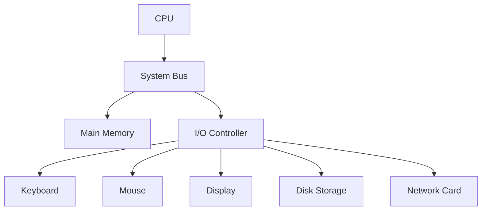
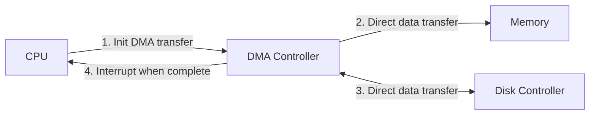

# I/O Hardware

## Introduction

Input/Output (I/O) hardware forms the bridge between a computer system and the outside world. Every piece of data that enters or leaves your computer must pass through some form of I/O hardware. Whether you're typing on a keyboard, moving a mouse, saving a file to disk, or sending data over a network, you're interacting with I/O hardware.

In this guide, we'll explore the fundamental components of I/O hardware, how they connect to the CPU, and the mechanisms that allow data to flow between your programs and external devices.

## I/O Devices: The Computer's Senses

I/O devices are the computer's equivalent of human senses - they allow the computer to perceive and interact with the external world. These devices fall into three main categories:

1. **Input devices** - Transfer data from the outside world into the computer (keyboards, mice, scanners)
2. **Output devices** - Transfer data from the computer to the outside world (monitors, printers, speakers)
3. **Storage devices** - Both input and output data (hard drives, SSDs, USB drives)

## Common I/O Hardware Components

### Input Devices

- **Keyboard**: Converts keystrokes into digital signals
- **Mouse/Trackpad**: Translates physical movement into cursor movement
- **Scanner**: Converts physical documents into digital images
- **Microphone**: Converts sound waves into digital audio signals
- **Webcam**: Captures video and converts it to digital format

### Output Devices

- **Monitor**: Displays visual output from the computer
- **Printer**: Creates physical copies of digital documents
- **Speakers/Headphones**: Convert digital signals into audible sound

### Storage Devices

- **Hard Disk Drive (HDD)**: Mechanical storage using magnetic platters
- **Solid State Drive (SSD)**: Flash memory-based storage with no moving parts
- **USB Flash Drives**: Portable storage devices
- **Optical Drives**: Read/write CDs, DVDs, Blu-ray discs

### Communication Devices

- **Network Interface Card (NIC)**: Connects computers to networks
- **Modem**: Converts digital signals to analog (and vice versa) for transmission
- **Bluetooth Adapter**: Enables wireless communication with compatible devices

## I/O Hardware Architecture

At a hardware level, the connection between the CPU and I/O devices follows a specific architecture:



### Key Components

1. **CPU**: The brain of the computer, which needs to communicate with I/O devices
2. **Memory**: Temporary storage for data being processed
3. **System Bus**: The communication pathway between components
4. **I/O Controllers**: Specialized hardware that manages specific I/O devices
5. **I/O Devices**: The actual hardware peripherals

## How Data Transfers Work

Data transfer between the CPU and I/O devices happens through one of three main methods:

### 1. Programmed I/O (PIO)

In programmed I/O, the CPU directly controls the data transfer by executing instructions that read from or write to I/O ports.

```javascript
// Pseudocode example of programmed I/O
function readKeyboard() {
  let data;
  while (!keyboardReady()) {
    // CPU actively waits (busy-waiting)
  }
  data = readFromKeyboardPort();
  return data;
}
```

**Advantages**:
- Simple to implement
- Direct control

**Disadvantages**:
- CPU wastes time waiting for slow I/O devices
- Inefficient for large data transfers

### 2. Interrupt-Driven I/O

In interrupt-driven I/O, the CPU initiates an I/O operation and then continues with other tasks. When the I/O operation completes, the device sends an interrupt signal to the CPU.

```javascript
// Pseudocode example of interrupt-driven I/O
function startReadingKeyboard() {
  // Tell keyboard controller to begin reading
  initiateKeyboardRead();
  // Continue with other work
  doOtherTasks();
  // Later, an interrupt handler will process the keyboard input
}

function keyboardInterruptHandler() {
  // Called when keyboard has data ready
  let data = readFromKeyboardPort();
  processKeyboardInput(data);
}
```

**Advantages**:
- CPU can perform other tasks while waiting
- Better efficiency than programmed I/O

**Disadvantages**:
- More complex to implement
- Interrupt handling adds overhead

### 3. Direct Memory Access (DMA)

DMA allows certain I/O devices to transfer data directly to and from memory without CPU intervention.



**Advantages**:
- CPU is completely free during transfer
- Very efficient for large data transfers
- Ideal for high-speed devices like disks and networks

**Disadvantages**:
- Most complex to implement
- Requires specialized hardware (DMA controller)

## I/O Interfaces and Ports

Physical I/O ports are the connectors that allow you to plug devices into your computer. Modern computers include several standard interfaces:

### Common Physical Interfaces

- **USB (Universal Serial Bus)**: Versatile interface for many devices
- **HDMI/DisplayPort**: For connecting monitors and TVs
- **Ethernet**: For wired network connections
- **Audio jacks**: For microphones and speakers
- **SD Card slots**: For memory cards
- **Thunderbolt/USB-C**: High-speed interfaces for various devices

## Device Controllers and Drivers

### Device Controllers

Device controllers are specialized hardware components that serve as intermediaries between the CPU and I/O devices. They:

1. Translate between the CPU's digital signals and the device's specific signals
2. Buffer data to account for speed differences
3. Handle error detection and correction
4. Manage the timing of data transfers

### Device Drivers

Device drivers are software components that allow the operating system to communicate with hardware devices. They:

1. Provide a standardized interface for the OS
2. Hide hardware-specific details from applications
3. Translate OS commands into hardware-specific instructions

```javascript
// Simplified pseudocode example showing how code interacts with drivers
function saveFile(data, filename) {
  // Application code calls OS function
  operatingSystem.writeFile(filename, data);
}

// Inside the OS
function writeFile(filename, data) {
  // OS calls the appropriate driver
  const diskDriver = loadDriver("disk");
  diskDriver.write(calculateDiskLocation(filename), data);
}

// Inside the driver
function write(location, data) {
  // Driver code converts to hardware-specific commands
  const diskController = getHardwarePort(DISK_CONTROLLER_ADDRESS);
  diskController.sendCommand(WRITE_COMMAND, location, data);
}
```

## Real-World Application: Building a Simple Data Logger

Let's explore how I/O hardware concepts come together in a practical application. 

Imagine building a simple data logger that:
1. Reads temperature from a sensor (input)
2. Saves readings to a file (storage I/O)
3. Displays current values on a screen (output)

### Hardware Components

- Temperature sensor connected via USB
- Computer running the logging software
- Display for visualizing data

### Simplified Code Example

```javascript
// Simple data logger pseudocode
class TemperatureLogger {
  constructor() {
    this.sensor = new UsbSensor("/dev/usb0");  // Input device
    this.logFile = new File("temp_log.txt");   // Storage I/O
    this.display = new Display();              // Output device
  }
  
  start() {
    // Set up interrupt-driven I/O for the sensor
    this.sensor.onTemperatureReading((temp) => {
      // Process new reading
      this.processReading(temp);
    });
    
    // Start reading - will return immediately
    this.sensor.startReading();
    console.log("Logger started");
  }
  
  processReading(temperature) {
    // Save to file (storage I/O)
    this.logFile.append(`${Date.now()}, ${temperature}
`);
    
    // Update display (output)
    this.display.updateTemperature(temperature);
    
    // Check for critical temperatures
    if (temperature > 100) {
      // Alert user (output)
      this.display.showAlert("Temperature critical!");
    }
  }
}

// Usage
const logger = new TemperatureLogger();
logger.start();
```

This example demonstrates:
- Input handling (temperature sensor readings)
- Output generation (display updates)
- Storage I/O (saving to log file)
- Interrupt-driven I/O (sensor.onTemperatureReading callback)

## Performance Considerations

When working with I/O hardware, be aware of these performance factors:

1. **Latency**: The time delay between initiating an I/O operation and receiving the first data
2. **Bandwidth**: The amount of data that can be transferred per unit of time
3. **CPU Overhead**: How much CPU time is consumed by I/O operations
4. **Buffering**: Using memory to temporarily store data during transfers to handle speed differences

## Summary

I/O hardware forms the crucial link between your computer's processing capabilities and the outside world. Understanding how these systems work helps you:

- Design more efficient applications that interact with hardware
- Troubleshoot problems when devices aren't working correctly
- Make informed decisions about hardware for specific applications

The key concepts to remember are:

1. I/O devices serve as the computer's interface to the external world
2. Data transfers between the CPU and devices use programmed I/O, interrupt-driven I/O, or DMA
3. Device controllers (hardware) and drivers (software) manage the complexities of device communication
4. Different applications have different I/O performance requirements

## Exercises

1. **Device Analysis**: Identify all the I/O devices connected to your computer and categorize them as input, output, or storage devices.

2. **Performance Comparison**: Write a simple program that copies a large file using different buffer sizes (1KB, 10KB, 100KB). Measure and compare the time taken for each buffer size.

3. **Driver Investigation**: Research what happens when you plug in a new USB device to your computer. Trace the sequence of events from physical connection to the device becoming available to applications.

4. **DIY Input Device**: Using a microcontroller like Arduino, create a simple input device that sends data to your computer. Write code to receive and process this data.

## Additional Resources

- **Operating Systems Concepts** by Silberschatz, Galvin, and Gagne - Chapters on I/O Systems
- **Computer Organization and Design** by Patterson and Hennessy - Sections on I/O
- Your operating system's documentation on device drivers and I/O interfaces