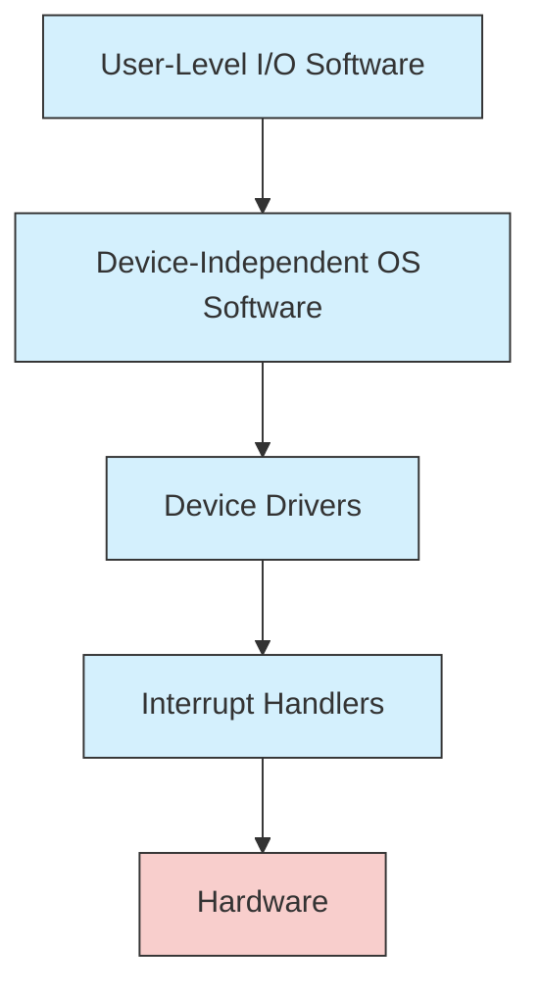
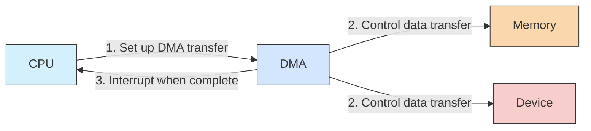

# I/O Software

## Introduction

Input/Output (I/O) software forms a critical layer in computer systems that manages communication between the CPU and peripheral devices. Think of I/O software as the translator between your computer's brain (the CPU) and its various sensory organs (keyboards, mice, displays, disks, network adapters, etc.). Without properly functioning I/O software, even the most powerful hardware would be essentially useless, unable to interact with the outside world.

This guide explores how I/O software works, the different layers of the I/O software stack, and practical applications that demonstrate its importance in everyday computing.

## The I/O Software Stack

I/O software is organized into several layers, each handling different aspects of the communication between the operating system and hardware devices.



Let's examine each layer in detail:

### 1. User-Level I/O Software

This is the highest level of I/O software, consisting of libraries and applications that users directly interact with.

**Key components include:**

- **Library procedures**: Functions that perform I/O operations like `printf()`, `scanf()`, `fopen()`, etc.
- **Spooling systems**: Software that manages shared devices (e.g., printer spooling)
- **User interfaces**: GUI elements for device configuration and management

**Example: File Operations in C**

```c
#include <stdio.h>

int main() {
    FILE *file;
    char data[100];
    
    // Open file for writing
    file = fopen("example.txt", "w");
    
    if (file == NULL) {
        printf("Error opening file
");
        return 1;
    }
    
    // Write to file
    fprintf(file, "Hello, I/O World!
");
    
    // Close file
    fclose(file);
    
    // Open file for reading
    file = fopen("example.txt", "r");
    
    // Read from file
    fgets(data, 100, file);
    printf("Read from file: %s", data);
    
    // Close file
    fclose(file);
    
    return 0;
}
```

Output:
```
Read from file: Hello, I/O World!
```

### 2. Device-Independent OS Software

This layer provides uniform interfaces for different device types, handling common I/O functions that apply across various devices.

**Key responsibilities:**

- **Uniform interfacing**: Providing consistent functions for different devices
- **Buffering**: Managing data buffers to handle speed differences between devices
- **Error reporting**: Standardizing how errors are reported and handled
- **Device allocation/deallocation**: Managing which processes can use which devices

**Example: Buffering in Action**

```c
#include <stdio.h>

int main() {
    // Unbuffered I/O
    fprintf(stderr, "This is unbuffered output
");
    
    // Line-buffered I/O
    printf("This line won't appear until there's a newline
");
    
    // Fully buffered I/O
    FILE *file = fopen("buffer.txt", "w");
    fprintf(file, "This won't be written until buffer fills or fclose() is called");
    fclose(file); // Force the buffer to flush
    
    return 0;
}
```

### 3. Device Drivers

Device drivers are specialized programs that understand the specifics of particular hardware devices. They translate the generic commands from the operating system into the specific commands that the hardware device understands.

**Functions of device drivers:**

- **Initialization**: Setting up the device when the system boots
- **Command interpretation**: Translating high-level requests into device-specific operations
- **Scheduling**: Managing access to the device among multiple processes
- **Error handling**: Detecting and possibly correcting device errors

**Example: Simple Pseudo-code for a Disk Driver**

```c
// Simplified pseudo-code for a disk driver
void disk_driver_write(int block_number, char *data, int size) {
    // Check if parameters are valid
    if (block_number < 0 || block_number >= MAX_BLOCKS) {
        return ERROR_INVALID_BLOCK;
    }
    
    // Translate logical block number to physical location
    int track = block_number / BLOCKS_PER_TRACK;
    int sector = block_number % BLOCKS_PER_TRACK;
    
    // Position the disk head
    position_head(track);
    
    // Wait for the sector to rotate under the head
    wait_for_sector(sector);
    
    // Write the data to the disk
    write_to_controller(data, size);
    
    // Check for any errors
    if (controller_status() != STATUS_OK) {
        return ERROR_WRITE_FAILED;
    }
    
    return STATUS_OK;
}
```

### 4. Interrupt Handlers

Interrupt handlers respond to signals from hardware devices that need immediate attention. When a device completes an operation or needs service, it generates an interrupt signal to the CPU.

**Responsibilities of interrupt handlers:**

- **Saving processor state**: Preserving the context of the interrupted process
- **Processing the interrupt**: Handling the specific event that caused the interrupt
- **Restoring state**: Returning control to the interrupted process (or another one)

**Example: Simplified Keyboard Interrupt Handler**

```c
void keyboard_interrupt_handler() {
    // Save the current CPU state
    save_cpu_state();
    
    // Read the keystroke from the keyboard controller
    unsigned char scancode = read_keyboard_port();
    
    // Convert scancode to character
    char character = scancode_to_char(scancode);
    
    // Add character to keyboard buffer
    if (keyboard_buffer_not_full()) {
        add_to_keyboard_buffer(character);
    }
    
    // Send End-Of-Interrupt signal to allow more interrupts
    send_EOI();
    
    // Restore the CPU state
    restore_cpu_state();
    
    // Return from interrupt
    return;
}
```

## I/O Methods and Techniques

There are several fundamental methods for performing I/O operations, each with advantages in different situations.

### Programmed I/O

In programmed I/O, the CPU actively polls the device to check if it's ready for data transfer.

```c
// Example of programmed I/O (polling)
void write_byte_to_device(unsigned char data) {
    // Wait until device is ready
    while ((read_status_register() & DEVICE_READY) == 0) {
        // Keep polling...
    }
    
    // Device is ready, write the data
    write_data_register(data);
}
```

**Pros and Cons:**
- ✅ Simple to implement
- ✅ No interrupt overhead
- ❌ CPU wastes time waiting
- ❌ Inefficient for slow devices

### Interrupt-Driven I/O

Interrupt-driven I/O allows the CPU to work on other tasks while waiting for I/O completion. The device signals the CPU when it needs attention.

```c
// Example of interrupt-driven I/O
void start_device_operation() {
    // Set up the operation
    configure_device(OPERATION_WRITE);
    
    // Provide data to device
    write_data_register(data_to_write);
    
    // Start the operation and return immediately
    // The device will generate an interrupt when done
    start_device();
    
    // CPU is now free to do other work
    return;
}

// This function will be called when the device generates an interrupt
void device_interrupt_handler() {
    // Check if operation completed successfully
    if (read_status_register() & OPERATION_SUCCESS) {
        // Process successful completion
        mark_operation_complete();
    } else {
        // Handle error
        handle_device_error();
    }
    
    // Acknowledge the interrupt
    send_EOI();
}
```

**Pros and Cons:**
- ✅ More efficient use of CPU time
- ✅ Good for most general-purpose I/O
- ❌ Interrupt overhead
- ❌ More complex to program

### Direct Memory Access (DMA)

DMA allows devices to transfer data directly to/from memory without CPU involvement for each byte.



**Example: Setting up a DMA Transfer**

```c
void setup_dma_transfer(void *buffer, size_t length, int device_id) {
    // Program the DMA controller
    write_dma_source_address(buffer);
    write_dma_length(length);
    write_dma_device(device_id);
    
    // Start the DMA transfer
    start_dma_transfer();
    
    // CPU is now free until DMA completes and generates an interrupt
    return;
}
```

**Pros and Cons:**
- ✅ Very efficient for large data transfers
- ✅ Minimal CPU involvement
- ✅ Ideal for high-speed devices
- ❌ More complex hardware required
- ❌ Setup overhead (not efficient for small transfers)

## Practical I/O Software Examples

### Example 1: Writing a Simple Device Driver

Let's look at a simplified example of a character device driver in Linux:

```c
#include <linux/init.h>
#include <linux/module.h>
#include <linux/fs.h>
#include <linux/uaccess.h>

#define DEVICE_NAME "simple_char_dev"
#define BUFFER_SIZE 1024

static int device_open_count = 0;
static char device_buffer[BUFFER_SIZE];
static int buffer_pointer = 0;

// Function prototypes
static int device_open(struct inode *, struct file *);
static int device_release(struct inode *, struct file *);
static ssize_t device_read(struct file *, char *, size_t, loff_t *);
static ssize_t device_write(struct file *, const char *, size_t, loff_t *);

static struct file_operations fops = {
    .read = device_read,
    .write = device_write,
    .open = device_open,
    .release = device_release
};

// Called when the module is loaded
static int __init simple_init(void) {
    int major_num = register_chrdev(0, DEVICE_NAME, &fops);
    
    if (major_num < 0) {
        printk(KERN_ALERT "Failed to register character device
");
        return major_num;
    }
    
    printk(KERN_INFO "Simple char device registered with major number %d
", major_num);
    return 0;
}

// Called when the module is unloaded
static void __exit simple_exit(void) {
    unregister_chrdev(major_num, DEVICE_NAME);
    printk(KERN_INFO "Simple char device unregistered
");
}

// Called when a process opens our device
static int device_open(struct inode *inode, struct file *file) {
    if (device_open_count > 0) {
        return -EBUSY; // Already open
    }
    
    device_open_count++;
    try_module_get(THIS_MODULE);
    return 0;
}

// Called when a process closes our device
static int device_release(struct inode *inode, struct file *file) {
    device_open_count--;
    module_put(THIS_MODULE);
    return 0;
}

// Called when a process reads from our device
static ssize_t device_read(struct file *filp, char *buffer, size_t length, loff_t *offset) {
    int bytes_read = 0;
    
    // If we're at the end of the buffer, return 0 (EOF)
    if (buffer_pointer >= BUFFER_SIZE) {
        buffer_pointer = 0;
        return 0;
    }
    
    // Copy data from the device buffer to the user buffer
    while (length && (buffer_pointer < BUFFER_SIZE)) {
        // Put_user copies data from kernel space to user space
        if (put_user(device_buffer[buffer_pointer], buffer++)) {
            return -EFAULT;
        }
        
        buffer_pointer++;
        length--;
        bytes_read++;
    }
    
    return bytes_read;
}

// Called when a process writes to our device
static ssize_t device_write(struct file *filp, const char *buffer, size_t length, loff_t *offset) {
    int bytes_written = 0;
    
    // Reset buffer if we're at the beginning of a new write
    if (*offset == 0) {
        buffer_pointer = 0;
    }
    
    // Copy data from the user buffer to the device buffer
    while (length && (buffer_pointer < BUFFER_SIZE)) {
        // Get_user copies data from user space to kernel space
        if (get_user(device_buffer[buffer_pointer], buffer++)) {
            return -EFAULT;
        }
        
        buffer_pointer++;
        length--;
        bytes_written++;
    }
    
    return bytes_written;
}

module_init(simple_init);
module_exit(simple_exit);

MODULE_LICENSE("GPL");
MODULE_AUTHOR("Your Name");
MODULE_DESCRIPTION("A simple character device driver");
```

This example demonstrates the basic structure of a Linux character device driver, showing the main entry points and how it interfaces with the kernel I/O subsystem.

### Example 2: Working with Buffered I/O

Here's an example showing how to efficiently read a large file using buffered I/O:

```c
#include <stdio.h>
#include <stdlib.h>
#include <time.h>

#define BUFFER_SIZE 8192  // 8KB buffer

int main() {
    FILE *file;
    char buffer[BUFFER_SIZE];
    size_t bytes_read;
    long total_bytes = 0;
    clock_t start, end;
    double cpu_time_used;
    
    // Open a file for reading
    file = fopen("large_file.dat", "rb");
    if (file == NULL) {
        perror("Error opening file");
        return 1;
    }
    
    // Start timing
    start = clock();
    
    // Read file in chunks using our buffer
    while ((bytes_read = fread(buffer, 1, BUFFER_SIZE, file)) > 0) {
        total_bytes += bytes_read;
        
        // Process the data in the buffer here...
        // (Just counting bytes in this example)
    }
    
    // End timing
    end = clock();
    
    // Calculate elapsed time
    cpu_time_used = ((double) (end - start)) / CLOCKS_PER_SEC;
    
    printf("Read %ld bytes in %.2f seconds
", total_bytes, cpu_time_used);
    printf("Throughput: %.2f MB/s
", (total_bytes / (1024.0 * 1024.0)) / cpu_time_used);
    
    fclose(file);
    return 0;
}
```

This example demonstrates the use of buffered I/O to efficiently read a large file, which is much more efficient than reading one byte at a time.

### Example 3: Asynchronous I/O in Node.js

Modern programming environments often use asynchronous I/O to improve efficiency. Here's an example using Node.js:

```javascript
const fs = require('fs');

console.log('Starting file operations...');

// Asynchronous file read
fs.readFile('input.txt', 'utf8', (err, data) => {
    if (err) {
        console.error('Error reading file:', err);
        return;
    }
    
    console.log('File read complete. Processing data...');
    
    // Process the data
    const processedData = data.toUpperCase();
    
    // Asynchronous file write
    fs.writeFile('output.txt', processedData, 'utf8', (err) => {
        if (err) {
            console.error('Error writing file:', err);
            return;
        }
        
        console.log('File write complete.');
    });
    
    console.log('Write operation initiated.');
});

console.log('File operations initiated. Continuing with other tasks...');
```

Output (approximate):
```
Starting file operations...
File operations initiated. Continuing with other tasks...
File read complete. Processing data...
Write operation initiated.
File write complete.
```

This example illustrates how asynchronous I/O allows the program to continue execution while I/O operations are pending, which is especially useful for applications that need to remain responsive during lengthy I/O operations.

## Common I/O Software Problems and Solutions

### Problem 1: I/O Bottlenecks

I/O operations are often much slower than processor operations, creating performance bottlenecks.

**Solutions:**
- Implement caching and buffering
- Use asynchronous I/O
- Employ I/O scheduling algorithms
- Utilize direct memory access (DMA) for large transfers

### Problem 2: Error Handling

I/O operations have many potential points of failure.

**Solutions:**
- Implement robust error checking and reporting
- Use retry mechanisms for transient errors
- Implement data validation and checksums
- Design for graceful degradation when devices fail

### Problem 3: Device Independence

Software needs to work with a variety of devices with different characteristics.

**Solutions:**
- Abstract device-specific details behind common interfaces
- Use device drivers to handle hardware specifics
- Implement layered I/O software architecture
- Use standardized protocols and APIs

## Summary

I/O software forms the crucial bridge between hardware devices and user programs. It consists of multiple layers, each with specific responsibilities:

1. **User-level I/O software** provides library functions and interfaces for applications
2. **Device-independent OS software** handles buffering, error reporting, and common operations
3. **Device drivers** manage the specifics of individual hardware devices
4. **Interrupt handlers** respond to hardware signals requiring immediate attention

I/O methods include programmed I/O (polling), interrupt-driven I/O, and direct memory access (DMA), each with its own advantages and use cases.

Effective I/O software must balance numerous requirements including performance, reliability, security, and device independence, all while hiding the complexity of hardware operations from higher-level software.

## Additional Resources and Exercises

### Resources for Further Learning

1. "Operating System Concepts" by Silberschatz, Galvin, and Gagne
2. "The Linux Programming Interface" by Michael Kerrisk
3. "Linux Device Drivers" by Jonathan Corbet, Alessandro Rubini, and Greg Kroah-Hartman
4. The [Linux Kernel Documentation](https://www.kernel.org/doc/html/latest/)

### Exercises

1. **Basic File I/O**: Write a program that copies a file using different buffer sizes (1 byte, 100 bytes, 1000 bytes, etc.) and compare the performance.

2. **Device Driver Exploration**: Examine the source code of a simple Linux device driver (like the keyboard driver) and identify the key components discussed in this article.

3. **I/O Performance Analysis**: Write a benchmark program that compares the performance of different I/O methods (e.g., C's stdio vs. low-level file descriptors).

4. **Interrupt Handling**: Create a small program that registers a signal handler (similar to an interrupt handler) to respond to user-generated signals (like SIGINT with Ctrl+C).

5. **Asynchronous I/O**: Implement a simple program using an asynchronous I/O library to perform multiple file operations concurrently.