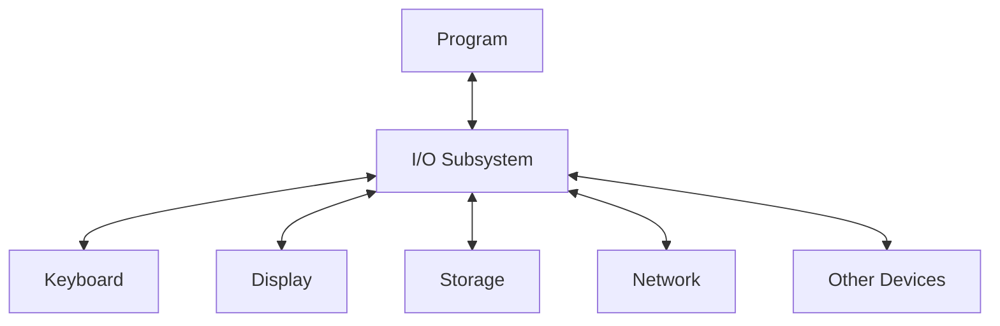
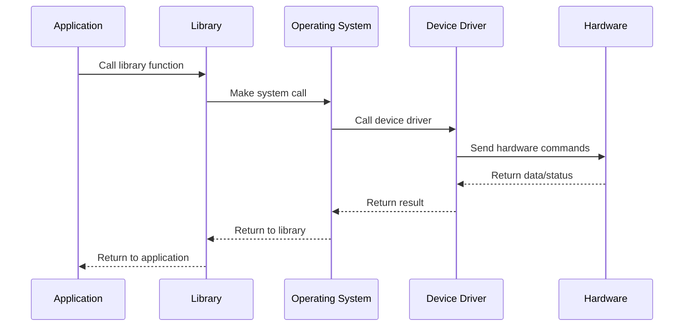

# I/O Subsystem

## Introduction

The Input/Output (I/O) subsystem is one of the most fundamental components of any computing system. It serves as the bridge between your program and the external world, managing all data transfers between the CPU and peripheral devices such as keyboards, displays, file systems, network adapters, and other hardware. 

For beginner programmers, understanding the I/O subsystem is crucial because almost every useful program needs to interact with the outside world in some way—whether it's reading user input, displaying information, or saving and retrieving data.

## What Is the I/O Subsystem?

The I/O subsystem is a collection of software and hardware components that manage communication between a computer program and external devices or systems. It handles tasks such as:

- Reading input from devices (keyboard, mouse, sensors)
- Writing output to displays and other output devices
- Reading and writing files on storage devices
- Network communication
- Printer control
- And other device interactions



## The Layers of I/O

The I/O subsystem typically consists of several layers, each handling different aspects of communication:

1. **User-level libraries**: High-level functions that programs use (like `printf()` in C or `System.out.println()` in Java)
2. **Operating system I/O interface**: System calls that provide standard services
3. **Device drivers**: Software that understands how to communicate with specific hardware
4. **Hardware controllers**: Physical components that connect to devices

Let's look at a typical I/O operation flow:



## Basic I/O Concepts

### Buffering

Buffering is a technique where data is temporarily stored in memory (a buffer) during transfer. This improves efficiency by:

- Reducing the number of system calls
- Matching different data transfer rates
- Allowing for data manipulation before final I/O

Here's a simple example of buffered output in C:

```c
#include <stdio.h>

int main() {
    // This output is buffered
    printf("This text is stored in a buffer ");
    printf("before being sent to the console.
");
    
    // Force buffer to flush
    fflush(stdout);
    
    return 0;
}
```

### Blocking vs. Non-Blocking I/O

- **Blocking I/O**: The program pauses (blocks) until the I/O operation completes
- **Non-Blocking I/O**: The program continues execution without waiting for the I/O to complete

Here's a simple comparison of blocking and non-blocking file reading in Python:

```python
# Blocking I/O
def read_file_blocking():
    with open('large_file.txt', 'r') as file:
        # This will block until the entire file is read
        content = file.read()
        return content

# Non-blocking I/O using asyncio
import asyncio
import aiofiles

async def read_file_non_blocking():
    async with aiofiles.open('large_file.txt', 'r') as file:
        # This won't block the entire program
        content = await file.read()
        return content
```

### Synchronous vs. Asynchronous I/O

- **Synchronous I/O**: Operations happen in a defined sequence
- **Asynchronous I/O**: Operations can overlap and complete independently

Here's an example of asynchronous file reading in JavaScript:

```javascript
// Synchronous file reading
const fs = require('fs');
try {
  const data = fs.readFileSync('example.txt', 'utf8');
  console.log(data);
} catch (err) {
  console.error('Error:', err);
}

// Asynchronous file reading
fs.readFile('example.txt', 'utf8', (err, data) => {
  if (err) {
    console.error('Error:', err);
    return;
  }
  console.log(data);
});
console.log('This will print before the file is read in async mode!');
```

## Standard I/O Streams

Most programming languages provide standard streams for basic I/O:

1. **Standard Input (stdin)**: Default input stream (usually keyboard)
2. **Standard Output (stdout)**: Default output stream (usually display)
3. **Standard Error (stderr)**: Stream for error messages

Let's see how these are used in different languages:

### C Example

```c
#include <stdio.h>

int main() {
    int number;
    
    printf("Enter a number: "); // Writes to stdout
    scanf("%d", &number);       // Reads from stdin
    
    if (number < 0) {
        fprintf(stderr, "Error: Negative numbers not allowed!
"); // Writes to stderr
        return 1;
    }
    
    printf("You entered: %d
", number);
    return 0;
}
```

**Input/Output:**
```
Enter a number: 5
You entered: 5
```

Or with an error:
```
Enter a number: -3
Error: Negative numbers not allowed!
```

### Python Example

```python
try:
    # Read from stdin
    user_input = input("Enter a number: ")
    number = int(user_input)
    
    # Write to stdout
    print(f"You entered: {number}")
    
    if number < 0:
        # Write to stderr
        import sys
        print("Error: Negative numbers not allowed!", file=sys.stderr)
        sys.exit(1)
except ValueError:
    # Write to stderr
    import sys
    print("Error: Invalid input! Please enter a number.", file=sys.stderr)
    sys.exit(1)
```

## File I/O Operations

File operations are one of the most common I/O tasks. Here are the basic operations:

### Opening and Closing Files

Before working with a file, you need to open it and specify the mode (read, write, append, etc.):

```java
// Java example
import java.io.File;
import java.io.FileReader;
import java.io.FileWriter;
import java.io.IOException;

public class FileIOExample {
    public static void main(String[] args) {
        // Opening a file for writing
        try (FileWriter writer = new FileWriter("output.txt")) {
            writer.write("Hello, World!");
            // File is automatically closed when the try block exits
        } catch (IOException e) {
            System.err.println("Error writing to file: " + e.getMessage());
        }
        
        // Opening a file for reading
        try (FileReader reader = new FileReader("output.txt")) {
            char[] buffer = new char[1024];
            int charRead = reader.read(buffer);
            String content = new String(buffer, 0, charRead);
            System.out.println("File content: " + content);
            // File is automatically closed when the try block exits
        } catch (IOException e) {
            System.err.println("Error reading from file: " + e.getMessage());
        }
    }
}
```

### Reading from Files

Different languages offer various methods to read files:

```python
# Python example
# Reading an entire file at once
with open('example.txt', 'r') as file:
    content = file.read()
    print(content)

# Reading line by line
with open('example.txt', 'r') as file:
    for line in file:
        print(line.strip())
        
# Reading specific number of bytes
with open('example.txt', 'r') as file:
    chunk = file.read(10)  # Read first 10 bytes
    print(chunk)
```

### Writing to Files

Similarly, there are several ways to write to files:

```python
# Python example
# Writing a string
with open('output.txt', 'w') as file:
    file.write('Hello, World!')
    
# Writing multiple lines
with open('output.txt', 'w') as file:
    lines = ['First line
', 'Second line
', 'Third line
']
    file.writelines(lines)
    
# Appending to a file
with open('output.txt', 'a') as file:
    file.write('
This line is appended.')
```

## Practical Example: Building a Simple Log System

Let's put these concepts together by building a simple logging system that demonstrates various I/O concepts:

```python
import os
import time
from datetime import datetime

class SimpleLogger:
    def __init__(self, log_file, buffer_size=5):
        self.log_file = log_file
        self.buffer = []
        self.buffer_size = buffer_size
        
    def log(self, message, level="INFO"):
        """Add a log message to the buffer."""
        timestamp = datetime.now().strftime("%Y-%m-%d %H:%M:%S")
        log_entry = f"[{timestamp}] {level}: {message}
"
        
        # Add to buffer
        self.buffer.append(log_entry)
        
        # Print to console (stdout)
        print(log_entry, end='')
        
        # If buffer is full, flush to file
        if len(self.buffer) >= self.buffer_size:
            self.flush()
    
    def flush(self):
        """Write all buffered logs to the file."""
        if not self.buffer:
            return
            
        # Open in append mode
        with open(self.log_file, 'a') as file:
            file.writelines(self.buffer)
        
        # Clear buffer after writing
        self.buffer.clear()
        
    def close(self):
        """Ensure all logs are written before closing."""
        self.flush()

# Usage example
if __name__ == "__main__":
    logger = SimpleLogger("application.log")
    
    try:
        logger.log("Application started")
        
        # Simulate some application events
        for i in range(3):
            logger.log(f"Processing item {i}")
            time.sleep(1)  # Simulate work
            
        # Simulate an error
        x = 10 / 0
    except Exception as e:
        logger.log(f"Error occurred: {str(e)}", level="ERROR")
    finally:
        logger.log("Application shutting down")
        logger.close()
        
    # Show the log file contents
    print("
Log file contents:")
    with open("application.log", 'r') as file:
        print(file.read())
```

**Output:**
```
[2023-09-15 10:24:31] INFO: Application started
[2023-09-15 10:24:31] INFO: Processing item 0
[2023-09-15 10:24:32] INFO: Processing item 1
[2023-09-15 10:24:33] INFO: Processing item 2
[2023-09-15 10:24:33] ERROR: Error occurred: division by zero
[2023-09-15 10:24:33] INFO: Application shutting down

Log file contents:
[2023-09-15 10:24:31] INFO: Application started
[2023-09-15 10:24:31] INFO: Processing item 0
[2023-09-15 10:24:32] INFO: Processing item 1
[2023-09-15 10:24:33] INFO: Processing item 2
[2023-09-15 10:24:33] ERROR: Error occurred: division by zero
[2023-09-15 10:24:33] INFO: Application shutting down
```

This example demonstrates:
- Buffered I/O
- File opening, writing, and closing
- Error handling
- Standard output
- Formatted data writing

## Advanced I/O Concepts

### Memory-Mapped I/O

Memory-mapped I/O is a technique where a file is mapped directly into memory, allowing programs to access file data as if it were in an array in memory. This can be more efficient for certain operations.

```java
// Java example of memory-mapped I/O
import java.io.RandomAccessFile;
import java.nio.MappedByteBuffer;
import java.nio.channels.FileChannel;
import java.nio.channels.FileChannel.MapMode;

public class MemoryMappedIOExample {
    public static void main(String[] args) {
        try (RandomAccessFile file = new RandomAccessFile("data.bin", "rw")) {
            // Get the file channel
            FileChannel channel = file.getChannel();
            
            // Map the file into memory
            MappedByteBuffer buffer = channel.map(MapMode.READ_WRITE, 0, 4096);
            
            // Write data to the memory-mapped file
            buffer.putInt(0, 42);  // Write an integer at position 0
            buffer.putFloat(4, 3.14f);  // Write a float at position 4
            
            // Read data from the memory-mapped file
            buffer.position(0);
            int intValue = buffer.getInt();
            float floatValue = buffer.getFloat();
            
            System.out.println("Read values: " + intValue + ", " + floatValue);
        } catch (Exception e) {
            System.err.println("Error: " + e.getMessage());
        }
    }
}
```

### I/O Multiplexing

I/O multiplexing allows a single process to monitor multiple I/O channels simultaneously, responding to whichever one becomes ready first. This is especially useful for network servers.

```python
# Python example using select for I/O multiplexing
import select
import socket
import sys

# Create a TCP/IP socket
server = socket.socket(socket.AF_INET, socket.SOCK_STREAM)
server.setblocking(0)

# Bind the socket to the port
server_address = ('localhost', 10000)
server.bind(server_address)

# Listen for incoming connections
server.listen(5)

# Sockets from which we expect to read
inputs = [server]

# Sockets to which we expect to write
outputs = []

# Main event loop
while inputs:
    # Wait for at least one of the sockets to be ready for processing
    readable, writable, exceptional = select.select(inputs, outputs, inputs)
    
    # Handle inputs
    for s in readable:
        if s is server:
            # A "readable" server socket is ready to accept a connection
            connection, client_address = s.accept()
            connection.setblocking(0)
            inputs.append(connection)
            print(f"New connection from {client_address}")
        else:
            data = s.recv(1024)
            if data:
                # A readable client socket has data
                print(f"Received {data} from {s.getpeername()}")
                if s not in outputs:
                    outputs.append(s)
            else:
                # Interpret empty result as closed connection
                print(f"Closing {s.getpeername()}")
                if s in outputs:
                    outputs.remove(s)
                inputs.remove(s)
                s.close()
```

### Asynchronous I/O with Callbacks

Asynchronous I/O with callbacks is a pattern where you provide functions to be called when an I/O operation completes, allowing your program to continue doing other work in the meantime.

```javascript
// Node.js example with asynchronous I/O using callbacks
const fs = require('fs');

console.log('Starting file operations...');

// Asynchronous file reading with a callback
fs.readFile('input.txt', 'utf8', (err, data) => {
    if (err) {
        console.error('Error reading file:', err);
        return;
    }
    
    console.log('File read complete. Processing data...');
    
    // Process the data
    const processedData = data.toUpperCase();
    
    // Asynchronous file writing with a callback
    fs.writeFile('output.txt', processedData, (err) => {
        if (err) {
            console.error('Error writing file:', err);
            return;
        }
        console.log('File write complete.');
    });
});

console.log('Started file operations. Continuing with other tasks...');
```

**Output:**
```
Starting file operations...
Started file operations. Continuing with other tasks...
File read complete. Processing data...
File write complete.
```

Notice how the output shows that the program continues execution while file operations are in progress.

## I/O Performance Considerations

When working with I/O operations, you need to consider performance implications:

1. **Minimize system calls**: Each call to the operating system has overhead
2. **Use appropriate buffer sizes**: Too small buffers cause too many operations; too large buffers waste memory
3. **Consider I/O patterns**: Sequential vs. random access
4. **Choose appropriate I/O models**: Blocking, non-blocking, asynchronous based on application needs
5. **Batch operations when possible**: Combine multiple small operations into larger ones

## Summary

The I/O subsystem is the vital bridge between your program and the external world. In this tutorial, we've covered:

- The layers and components of the I/O subsystem
- Basic I/O concepts like buffering, blocking vs. non-blocking, and synchronous vs. asynchronous operations
- Standard I/O streams (stdin, stdout, stderr)
- File I/O operations and patterns
- A practical example of building a simple logging system
- Advanced concepts like memory-mapped I/O, I/O multiplexing, and asynchronous I/O
- Performance considerations

Understanding the I/O subsystem is crucial for writing efficient, responsive programs that interact effectively with users and external systems.

## Exercises

1. Modify the SimpleLogger class to include different log levels (DEBUG, INFO, WARNING, ERROR) and add the ability to filter logs by level.
2. Write a program that counts the frequency of each word in a text file, using buffered I/O for efficiency.
3. Create a simple file copy utility that demonstrates both synchronous and asynchronous approaches, then compare their performance on large files.
4. Implement a basic "tail -f" functionality that continuously monitors and displays new content added to a log file.
5. Build a simple client-server application using socket I/O where multiple clients can connect and exchange messages.

## Additional Resources

- [Operating System Concepts](https://www.os-book.com/OS10/) by Silberschatz, Galvin, and Gagne
- [Advanced Programming in the UNIX Environment](https://www.amazon.com/Advanced-Programming-UNIX-Environment-3rd/dp/0321637739) by W. Richard Stevens
- Documentation for your programming language's I/O libraries:
  - Python: [io module](https://docs.python.org/3/library/io.html) and [asyncio](https://docs.python.org/3/library/asyncio.html)
  - Java: [java.io](https://docs.oracle.com/javase/8/docs/api/java/io/package-summary.html) and [java.nio](https://docs.oracle.com/javase/8/docs/api/java/nio/package-summary.html)
  - JavaScript: [Node.js File System](https://nodejs.org/api/fs.html)