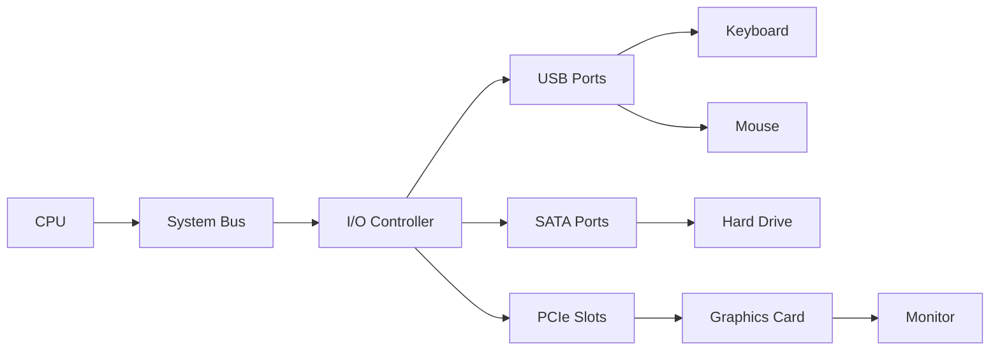

# I/O Devices

## Introduction

Input/Output (I/O) devices are hardware components that allow a computer to communicate with the outside world. They serve as the bridge between the computer's internal processing units and external entities, including humans and other systems. I/O devices are essential because a computer without them would be a closed system with no way to receive instructions or share results.

In programming, understanding I/O devices is crucial because they impact how we write code to interact with external hardware, receive input, and display output. Whether you're creating a simple console application or a complex system that interfaces with specialized hardware, knowing how I/O devices work will help you write more effective code.

## Types of I/O Devices

I/O devices can be broadly categorized into three types:

1. **Input devices** - Feed data and commands into the computer
2. **Output devices** - Present data from the computer to users or other systems
3. **Storage devices** - Store and retrieve data (functioning as both input and output)

Let's explore each category in more detail.

### Input Devices

Input devices allow users to enter data, commands, or control signals into a computer. Common examples include:

- **Keyboard** - Converts keystrokes into electrical signals
- **Mouse** - Provides positional data and button clicks
- **Scanner** - Captures physical images and converts them to digital format
- **Microphone** - Converts sound into electrical signals
- **Touchscreen** - Combines input and output in one interface
- **Sensors** - Provide environmental data (temperature, light, motion, etc.)

### Output Devices

Output devices present information from the computer to the user or external systems:

- **Monitor** - Displays visual information
- **Printer** - Creates physical copies of digital data
- **Speakers** - Convert electrical signals to audible sound
- **LED indicators** - Provide simple status information

### Storage Devices

Storage devices serve dual roles, accepting data for storage (output) and retrieving data when needed (input):

- **Hard Disk Drives (HDD)** - Magnetic storage
- **Solid State Drives (SSD)** - Flash memory-based storage
- **USB Flash Drives** - Portable storage
- **Optical Drives** - Read/write CD, DVD, or Blu-ray discs

## How I/O Devices Connect to the Computer

I/O devices connect to computers through various interfaces and buses:



Common connection methods include:

- **USB (Universal Serial Bus)** - Versatile connection for many devices
- **HDMI/DisplayPort** - Digital connections for video and audio
- **Bluetooth** - Wireless connections for peripherals
- **Wi-Fi** - Wireless networking
- **SATA** - Connection for storage devices
- **PCIe** - High-speed expansion bus

## Programming with I/O Devices

As programmers, we rarely interact directly with I/O hardware. Instead, we work through several layers of abstraction:

1. **Operating System** - Provides device drivers and I/O services
2. **Programming Language** - Offers I/O libraries and functions
3. **Application Frameworks** - May provide additional abstractions

### Basic Input/Output in Programming

Let's look at some simple examples of I/O operations in different programming languages:

#### Python Example

```python
# Basic input and output
name = input("Enter your name: ")  # Input from keyboard
print(f"Hello, {name}!")  # Output to console

# File I/O
with open("data.txt", "w") as file:  # Output to file
    file.write("Hello, world!")

with open("data.txt", "r") as file:  # Input from file
    content = file.read()
    print(content)
```

#### Java Example

```java
import java.util.Scanner;
import java.io.FileWriter;
import java.io.FileReader;
import java.io.BufferedReader;

public class IOExample {
    public static void main(String[] args) {
        try {
            // Console I/O
            Scanner scanner = new Scanner(System.in);
            System.out.print("Enter your name: ");
            String name = scanner.nextLine();  // Input from keyboard
            System.out.println("Hello, " + name + "!");  // Output to console
            
            // File I/O
            FileWriter writer = new FileWriter("data.txt");
            writer.write("Hello, world!");  // Output to file
            writer.close();
            
            BufferedReader reader = new BufferedReader(new FileReader("data.txt"));
            String content = reader.readLine();  // Input from file
            System.out.println(content);
            reader.close();
            
        } catch (Exception e) {
            e.printStackTrace();
        }
    }
}
```

### Working with Special I/O Devices

Modern programming often involves specialized I/O devices. Here are a few examples:

#### Accessing a Webcam with JavaScript

```javascript
async function startCamera() {
    try {
        const stream = await navigator.mediaDevices.getUserMedia({ video: true });
        const videoElement = document.getElementById('webcam');
        videoElement.srcObject = stream;
    } catch (error) {
        console.error('Error accessing webcam:', error);
    }
}

// HTML component
// <video id="webcam" autoplay></video>
// <button onclick="startCamera()">Start Camera</button>
```

#### Reading from a Temperature Sensor with Python (using Raspberry Pi)

```python
import Adafruit_DHT

# Specify sensor type and GPIO pin
sensor = Adafruit_DHT.DHT22
pin = 4

# Read temperature and humidity
humidity, temperature = Adafruit_DHT.read_retry(sensor, pin)

if humidity is not None and temperature is not None:
    print(f"Temperature: {temperature:.1f}°C")
    print(f"Humidity: {humidity:.1f}%")
else:
    print("Failed to read from sensor")
```

## I/O Performance Considerations

I/O operations are typically much slower than CPU operations. This performance gap has important implications for programming:

1. **I/O Bottlenecks** - Programs often spend more time waiting for I/O than on computation
2. **Buffering** - Data is collected into buffers to reduce the number of I/O operations
3. **Asynchronous I/O** - Allows programs to continue executing while waiting for I/O
4. **Caching** - Frequently used data is kept in memory to avoid repeated I/O

### Asynchronous I/O Example (JavaScript)

```javascript
// Synchronous (blocking) file read
try {
    const fs = require('fs');
    const data = fs.readFileSync('largefile.txt', 'utf8');
    console.log('File read complete');
    processData(data);
} catch (err) {
    console.error('Error reading file:', err);
}

// Asynchronous (non-blocking) file read
const fs = require('fs');
fs.readFile('largefile.txt', 'utf8', (err, data) => {
    if (err) {
        console.error('Error reading file:', err);
        return;
    }
    console.log('File read complete');
    processData(data);
});
console.log('This line runs before file reading is complete!');
```

## Real-World Applications

Understanding I/O devices is crucial for various programming scenarios:

### Web Development

Modern web applications interact with numerous I/O devices:
- Cameras for video conferencing
- Microphones for voice input
- File systems for uploading/downloading files
- Network interfaces for API calls

### Game Development

Games require efficient I/O handling for:
- Controllers and input devices
- Graphics rendering
- Sound output
- Loading game assets

### Internet of Things (IoT)

IoT applications heavily depend on I/O:
- Sensor data collection
- Actuator control
- Network communication
- Data storage

### Example: A Simple Weather Station

Here's how a simple IoT weather station might handle I/O:

```python
import time
import Adafruit_DHT
import requests

# Sensor setup
sensor = Adafruit_DHT.DHT22
pin = 4

# Server configuration
API_URL = "https://example.com/api/weather"
DEVICE_ID = "weather_station_1"

def read_sensor():
    humidity, temperature = Adafruit_DHT.read_retry(sensor, pin)
    return humidity, temperature

def send_data(humidity, temperature):
    payload = {
        "device_id": DEVICE_ID,
        "temperature": temperature,
        "humidity": humidity,
        "timestamp": time.time()
    }
    
    try:
        response = requests.post(API_URL, json=payload)
        return response.status_code == 200
    except Exception as e:
        print(f"Error sending data: {e}")
        return False

# Main loop
while True:
    humidity, temperature = read_sensor()
    
    if humidity is not None and temperature is not None:
        print(f"Temperature: {temperature:.1f}°C, Humidity: {humidity:.1f}%")
        success = send_data(humidity, temperature)
        print(f"Data transmission: {'Successful' if success else 'Failed'}")
    else:
        print("Sensor reading failed")
    
    # Wait before next reading
    time.sleep(300)  # 5 minutes
```

## Summary

I/O devices are fundamental components that connect computers to the outside world. As a programmer, you'll interact with these devices through various abstractions provided by your programming language and operating system.

Key takeaways:
- I/O devices include input, output, and storage devices
- Most programming languages provide libraries for standard I/O operations
- I/O operations are typically much slower than CPU operations
- Modern applications often interact with specialized I/O devices
- Asynchronous I/O can improve application performance

## Exercises

1. Write a program that counts the number of keystrokes a user makes in 10 seconds.
2. Create a simple file backup utility that copies files from one folder to another.
3. Implement a program that detects when a USB device is connected (research operating system-specific libraries for this).
4. Develop a simple data logger that records temperature data (or simulated data if you don't have sensors).
5. Create a program that captures an image from a webcam and applies a simple filter to it.

## Additional Resources

- **Books**:
  - "Operating Systems: Three Easy Pieces" - Chapters on I/O devices and file systems
  - "Computer Systems: A Programmer's Perspective" - For deeper understanding of I/O systems

- **Online Courses**:
  - Computer Architecture courses on major learning platforms
  - Operating Systems courses with sections on I/O subsystems

- **Documentation**:
  - Your programming language's standard library documentation for I/O functions
  - Operating system documentation for device access APIs