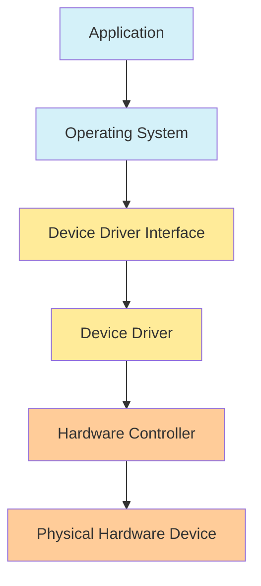
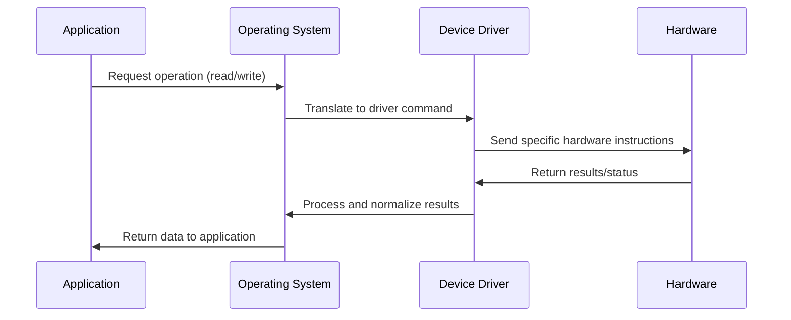

# Device Drivers

## Introduction

Device drivers are specialized software components that act as intermediaries between the operating system and hardware devices. They translate the operating system's generic commands into specific instructions that hardware devices can understand and execute. Without device drivers, your computer wouldn't be able to communicate with its hardware components like printers, graphics cards, or even keyboards.

Think of device drivers as translators between two entities that speak different languages - the operating system and the hardware device. The operating system issues high-level commands like "print this document," and the device driver translates that into the specific sequence of low-level commands that a particular printer model needs to receive.

## Why Device Drivers Are Important

Device drivers serve several critical functions in computing systems:

1. **Hardware Abstraction**: They hide the complexities of hardware operations from the operating system.
2. **Standardization**: They provide a consistent interface for the operating system to communicate with various devices.
3. **Optimization**: They often include optimizations for specific hardware to improve performance.
4. **Error Handling**: They manage hardware-specific errors and attempt recovery when possible.

## Types of Device Drivers

Device drivers generally fall into these categories:

### 1. Character Drivers

These handle devices that process data as character streams (one byte at a time), such as:
- Keyboards
- Mice
- Serial ports
- Some types of sensors

### 2. Block Drivers

These manage devices that transfer data in blocks (multiple bytes at once), such as:
- Hard disk drives
- SSDs
- CD/DVD drives

### 3. Network Drivers

These control network interface cards (NICs) and facilitate network communication.

### 4. Printer Drivers

These translate documents into formats that specific printer models can understand.

### 5. Graphics Drivers

These optimize performance for graphics processing units (GPUs) and enable advanced rendering features.

## Device Driver Architecture

Most device drivers have a layered architecture:



The layered approach allows for:
- **Modularity**: Components can be updated independently
- **Abstraction**: Each layer only needs to know how to communicate with adjacent layers
- **Security**: Controlled access to hardware resources

## How Device Drivers Work

Let's explore how device drivers function within an operating system:

### 1. Driver Loading

When a device is connected or the system starts up, the operating system:
- Detects the hardware
- Identifies the appropriate driver
- Loads the driver into memory
- Initializes the driver

### 2. Communication Flow



### 3. Processing I/O Requests

When an application needs to interact with hardware:
1. It calls standard OS functions
2. The OS routes the request to the appropriate driver
3. The driver translates the request into hardware-specific commands
4. The hardware executes the commands
5. Results travel back up the chain to the application

## Writing a Simple Device Driver

While professional device drivers are complex, we can understand the basics by creating a simple character device driver for Linux. This example creates a virtual device that stores and returns a simple message.

**Note**: This is for educational purposes. Real driver development requires extensive knowledge of kernel programming.

### Basic Linux Character Driver Example

```c
#include <linux/init.h>
#include <linux/module.h>
#include <linux/kernel.h>
#include <linux/fs.h>
#include <linux/uaccess.h>

MODULE_LICENSE("GPL");
MODULE_AUTHOR("Your Name");
MODULE_DESCRIPTION("A simple character device driver");
MODULE_VERSION("0.1");

#define DEVICE_NAME "simple_char_dev"
#define EXAMPLE_MSG "Hello from kernel space!
"
#define MSG_BUFFER_LEN 35

static int major_number;
static char message[MSG_BUFFER_LEN] = EXAMPLE_MSG;
static short size_of_message;
static int counter = 0;

// Prototype functions
static int dev_open(struct inode *, struct file *);
static int dev_release(struct inode *, struct file *);
static ssize_t dev_read(struct file *, char *, size_t, loff_t *);
static ssize_t dev_write(struct file *, const char *, size_t, loff_t *);

static struct file_operations fops = {
    .open = dev_open,
    .read = dev_read,
    .write = dev_write,
    .release = dev_release,
};

// Initialization function
static int __init simple_init(void) {
    major_number = register_chrdev(0, DEVICE_NAME, &fops);
    
    if (major_number < 0) {
        printk(KERN_ALERT "Failed to register a major number
");
        return major_number;
    }
    
    printk(KERN_INFO "Registered correctly with major number %d
", major_number);
    printk(KERN_INFO "Create a device file with: 'mknod /dev/%s c %d 0'
", DEVICE_NAME, major_number);
    
    return 0;
}

// Cleanup function
static void __exit simple_exit(void) {
    unregister_chrdev(major_number, DEVICE_NAME);
    printk(KERN_INFO "Device unregistered, goodbye!
");
}

// Open device function
static int dev_open(struct inode *inodep, struct file *filep) {
    counter++;
    printk(KERN_INFO "Device has been opened %d time(s)
", counter);
    return 0;
}

// Read from device function
static ssize_t dev_read(struct file *filep, char *buffer, size_t len, loff_t *offset) {
    int error_count = 0;
    
    // Copy data from kernel space to user space
    error_count = copy_to_user(buffer, message, size_of_message);
    
    if (error_count == 0) {
        printk(KERN_INFO "Sent %d characters to the user
", size_of_message);
        return (size_of_message = 0); // Clear the position to the start
    } else {
        printk(KERN_INFO "Failed to send %d characters to the user
", error_count);
        return -EFAULT;
    }
}

// Write to device function
static ssize_t dev_write(struct file *filep, const char *buffer, size_t len, loff_t *offset) {
    sprintf(message, "%s(%zu letters)", buffer, len);
    size_of_message = strlen(message);
    printk(KERN_INFO "Received %zu characters from the user
", len);
    return len;
}

// Close device function
static int dev_release(struct inode *inodep, struct file *filep) {
    printk(KERN_INFO "Device successfully closed
");
    return 0;
}

module_init(simple_init);
module_exit(simple_exit);
```

### Compiling and Loading the Driver

To compile this driver, you would need a Makefile like:

```makefile
obj-m += simple_char_driver.o

all:
	make -C /lib/modules/$(shell uname -r)/build M=$(PWD) modules

clean:
	make -C /lib/modules/$(shell uname -r)/build M=$(PWD) clean
```

Then compile and load with:

```bash
# Compile the driver
make

# Load the driver
sudo insmod simple_char_driver.ko

# Check if it loaded properly
dmesg | tail

# Create the device file (replace X with the major number shown in dmesg)
sudo mknod /dev/simple_char_dev c X 0

# Set permissions
sudo chmod 666 /dev/simple_char_dev
```

### Testing the Driver

Now you can interact with your device:

```bash
# Write to the device
echo "Testing driver" > /dev/simple_char_dev

# Read from the device
cat /dev/simple_char_dev

# When finished, unload the driver
sudo rmmod simple_char_driver
```

## Device Driver APIs

Different operating systems provide various APIs for driver development:

### Windows Driver Development

Windows provides the Windows Driver Kit (WDK) with several frameworks:

- **Windows Driver Model (WDM)**: The traditional approach
- **Windows Driver Frameworks (WDF)**: A more modern approach with:
  - Kernel-Mode Driver Framework (KMDF)
  - User-Mode Driver Framework (UMDF)

Example of a minimal KMDF driver entry point:

```c
DRIVER_INITIALIZE DriverEntry;
EVT_WDF_DRIVER_DEVICE_ADD KmdfHelloWorldEvtDeviceAdd;

NTSTATUS DriverEntry(
    _In_ PDRIVER_OBJECT     DriverObject,
    _In_ PUNICODE_STRING    RegistryPath
)
{
    NTSTATUS status;
    WDF_DRIVER_CONFIG config;
    
    KdPrintEx((DPFLTR_IHVDRIVER_ID, DPFLTR_INFO_LEVEL, "KmdfHelloWorld: DriverEntry
"));
    
    WDF_DRIVER_CONFIG_INIT(&config, KmdfHelloWorldEvtDeviceAdd);
    
    status = WdfDriverCreate(
        DriverObject,
        RegistryPath,
        WDF_NO_OBJECT_ATTRIBUTES,
        &config,
        WDF_NO_HANDLE
    );
    
    return status;
}
```

### Linux Driver Development

Linux drivers are developed as kernel modules using kernel APIs:

- **Kernel Module API**: For loading/unloading drivers
- **Character Device API**: For character devices
- **Block Device API**: For block devices
- **Network Device API**: For network interfaces

### macOS Driver Development

macOS uses the I/O Kit framework, which is object-oriented and based on C++:

```cpp
#include <IOKit/IOService.h>

class SimpleDriver : public IOService {
    OSDeclareDefaultStructors(SimpleDriver)
    
public:
    virtual bool init(OSDictionary *dictionary = NULL) override;
    virtual void free(void) override;
    virtual IOService *probe(IOService *provider, SInt32 *score) override;
    virtual bool start(IOService *provider) override;
    virtual void stop(IOService *provider) override;
};
```

## Device Driver Challenges

Developing device drivers comes with unique challenges:

### 1. Kernel-Mode Operation

Drivers typically run in kernel mode, meaning:
- Errors can crash the entire system
- Memory must be carefully managed
- Debugging is more difficult

### 2. Hardware Variations

Drivers must account for:
- Different hardware revisions
- Timing constraints
- Power management states

### 3. Compatibility

Drivers need to work across:
- Different OS versions
- Various hardware configurations
- Potential firmware updates

### 4. Security Concerns

As drivers have privileged access, they must:
- Validate all input
- Protect against buffer overflows
- Prevent unauthorized access

## Best Practices for Device Driver Development

When developing device drivers:

1. **Start Small**: Begin with the simplest functional driver
2. **Use Existing Frameworks**: Leverage OS-provided driver development kits
3. **Test Thoroughly**: Use both software simulation and real hardware
4. **Handle Error Cases**: Prepare for all possible error conditions
5. **Document Everything**: Keep detailed notes about hardware specifications
6. **Follow Security Guidelines**: Adhere to OS-specific security practices
7. **Use Version Control**: Track changes methodically
8. **Consider Portability**: Design for cross-platform compatibility when possible

## Debugging Device Drivers

Debugging drivers requires specialized approaches:

### 1. Kernel Logging

Use logging facilities to track driver operation:

```c
// In Linux
printk(KERN_INFO "Driver initialized successfully
");

// In Windows
KdPrintEx((DPFLTR_IHVDRIVER_ID, DPFLTR_INFO_LEVEL, "Driver initialized
"));
```

### 2. Debug Builds

Create special debug builds with additional checking:

```c
#ifdef DEBUG
    printk(KERN_DEBUG "Variable x = %d
", x);
#endif
```

### 3. Hardware Analyzers

For complex issues, use specialized hardware:
- Logic analyzers
- Bus analyzers
- In-circuit emulators

## Real-World Applications

Device drivers are essential in numerous scenarios:

### 1. Custom Hardware Support

When creating specialized hardware, custom drivers enable:
- Precise control of hardware features
- Integration with existing software
- Optimization for specific use cases

### 2. Legacy Hardware Support

Drivers allow modern systems to use older hardware through:
- Translation of modern APIs to legacy protocols
- Emulation of obsolete interfaces
- Backward compatibility layers

### 3. Virtual Devices

Drivers can create virtual hardware for:
- Testing and simulation
- Security isolation
- Resource sharing

### 4. Performance Optimization

Specialized drivers can improve performance by:
- Reducing overhead
- Implementing hardware-specific optimizations
- Enabling advanced features

## Summary

Device drivers are crucial software components that enable communication between operating systems and hardware devices. They provide abstraction, standardization, and hardware-specific optimizations while handling the complexities of direct hardware interaction.

Key points to remember:
- Drivers translate between the operating system and hardware
- Different types of drivers handle different kinds of devices
- Driver development requires careful attention to kernel programming principles
- Drivers operate in privileged mode with direct hardware access
- Best practices include thorough testing and security considerations

## Exercises

1. **Research Exercise**: Identify and list three different device drivers on your computer. For each, describe what hardware they support and what functionality they provide.

2. **Conceptual Exercise**: Draw a diagram showing the data flow from an application through the operating system and driver to a hardware device of your choice.

3. **Programming Exercise**: Modify the simple character driver example to add a new feature, such as counting the total number of bytes written to the device.

4. **Analysis Exercise**: Choose an open-source device driver and review its error handling mechanisms. How does it recover from or report different types of failures?

5. **Design Exercise**: Design (but don't implement) a device driver for a hypothetical USB device that measures temperature and humidity. What interfaces would your driver provide to user applications?

## Additional Resources

- [Linux Device Drivers, 3rd Edition](https://lwn.net/Kernel/LDD3/) - A comprehensive guide to Linux driver development
- [Windows Driver Development](https://docs.microsoft.com/en-us/windows-hardware/drivers/) - Official Microsoft documentation
- [FreeBSD Device Drivers](https://www.freebsd.org/doc/en/books/developers-handbook/driverbasics.html) - Guide to device drivers in FreeBSD
- [The Linux Kernel Module Programming Guide](https://sysprog21.github.io/lkmpg/) - A guide to writing Linux kernel modules
- [OSR Online](https://www.osronline.com/) - Community resources for Windows driver development