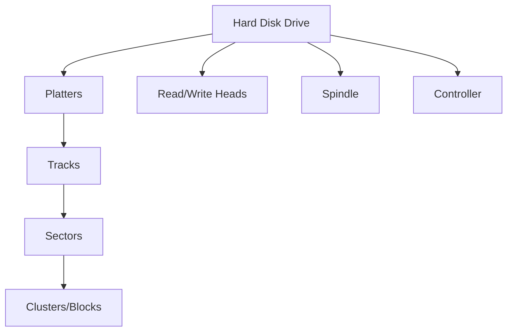
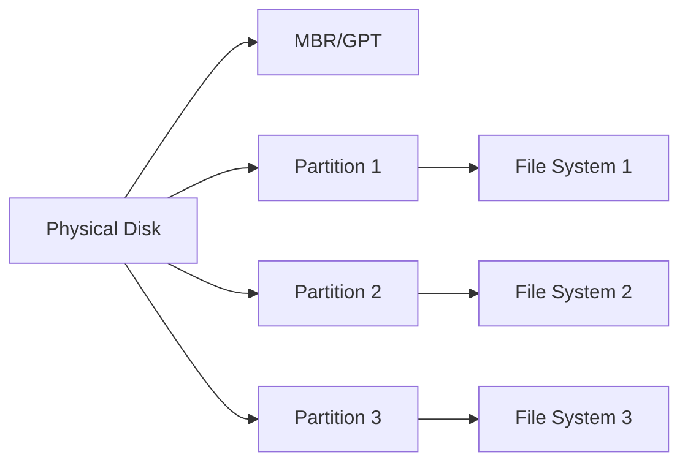
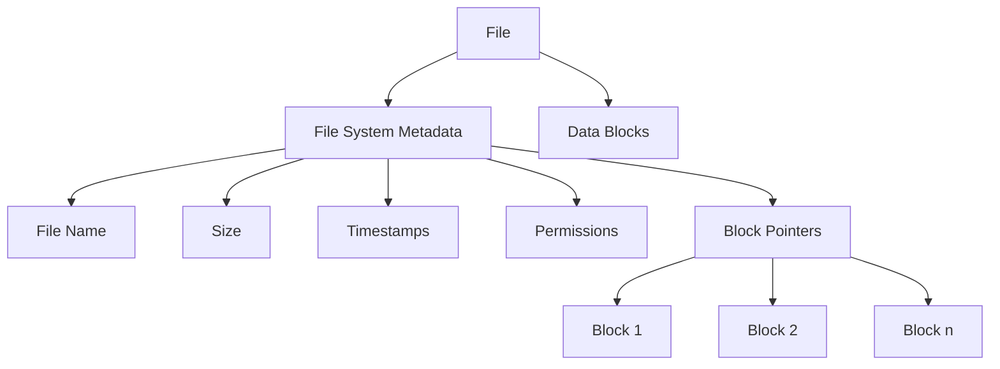

# Disk Structure

## Introduction

When you save a file on your computer, where does it actually go? How does your operating system find it again when you need it? Understanding disk structure—the physical and logical organization of storage devices—is fundamental to comprehending how computers store and retrieve data.

In this guide, we'll explore how disks are organized, from the physical components to the logical structures that make efficient data access possible. Whether you're curious about how your files are stored or aiming to deepen your programming knowledge, understanding disk structure will give you valuable insights into the foundation of computer storage systems.

## Physical Disk Structure

### Basic Components

Modern storage devices like hard disk drives (HDDs) and solid-state drives (SSDs) have different physical implementations but share similar logical concepts. Let's first look at the traditional HDD structure:



#### Hard Disk Drives (HDDs)

A traditional hard disk consists of several key physical components:

- **Platters**: Circular disks coated with magnetic material where data is stored
- **Tracks**: Concentric circles on each platter
- **Sectors**: Pie-shaped divisions of tracks, forming the basic unit of storage
- **Cylinders**: The same track position across all platters
- **Read/Write Heads**: Components that read and write data to the platters

Let's examine how data is addressed on a disk:

```
Track 0, Sector 1 → Track 0, Sector 2 → ... → Track 0, Sector n
Track 1, Sector 1 → Track 1, Sector 2 → ... → Track 1, Sector n
...
Track m, Sector 1 → Track m, Sector 2 → ... → Track m, Sector n
```

#### Solid-State Drives (SSDs)

Unlike HDDs, SSDs have no moving parts and use flash memory for storage:

- **NAND Flash Memory Cells**: Organized in pages, blocks, and planes
- **Pages**: Smallest unit that can be written (typically 4-16 KB)
- **Blocks**: Group of pages (typically 128-256 pages per block)
- **Controller**: Manages data distribution, wear leveling, and garbage collection

## Logical Disk Structure

While the physical structure deals with the hardware components, the logical structure is about how data is organized for the operating system.

### Sectors and Blocks

The smallest addressable unit on a disk is a **sector**, typically 512 bytes or 4 KB in modern drives. 

Operating systems typically work with **blocks** (also called clusters in some systems), which are groups of sectors treated as a single unit. A common block size is 4 KB (8 sectors at 512 bytes each).

Here's an example of how we might read sector information in C:

```c
#include <stdio.h>
#include <stdlib.h>
#include <fcntl.h>
#include <unistd.h>

#define SECTOR_SIZE 512

int main() {
    int disk_fd = open("/dev/sda", O_RDONLY);  // Open disk device
    if (disk_fd < 0) {
        perror("Failed to open disk");
        exit(1);
    }
    
    char buffer[SECTOR_SIZE];
    lseek(disk_fd, SECTOR_SIZE * 10, SEEK_SET);  // Move to sector 10
    read(disk_fd, buffer, SECTOR_SIZE);  // Read sector into buffer
    
    printf("First 16 bytes of sector 10:
");
    for (int i = 0; i < 16; i++) {
        printf("%02X ", (unsigned char)buffer[i]);
    }
    printf("
");
    
    close(disk_fd);
    return 0;
}
```

Output:
```
First 16 bytes of sector 10:
EB 52 90 4E 54 46 53 20 20 20 20 00 02 08 00 00
```

> Note: This example requires administrative privileges and direct disk access, which most operating systems restrict for safety reasons.

### Partitions

A physical disk can be divided into **partitions**, which are treated as separate logical disks. Each partition can contain a different file system.

The partition table, stored at the beginning of the disk, contains information about the start and end of each partition.



#### Master Boot Record (MBR)

The traditional partitioning scheme includes:
- Bootstrap code in the first 446 bytes
- Four partition entries of 16 bytes each
- A 2-byte signature (0x55AA)

#### GUID Partition Table (GPT)

The modern partitioning scheme includes:
- A protective MBR for backward compatibility
- A primary GPT header
- Partition entries (typically 128)
- A backup GPT at the end of the disk

## File Systems

File systems are logical structures that organize data on disk partitions. They provide a way to:
- Store files
- Name files
- Organize files in directories
- Track available space
- Track which blocks belong to which files

Common file systems include:
- **Windows**: FAT32, NTFS, exFAT
- **macOS**: HFS+, APFS
- **Linux**: ext2/3/4, XFS, Btrfs
- **Cross-platform**: FAT32, exFAT

### How Files Are Stored

Files are stored as blocks distributed across the disk. The file system keeps track of which blocks belong to which files using various data structures:



#### File Allocation Methods

Different file systems use different approaches to track which blocks belong to a file:

1. **Contiguous Allocation**: Blocks are stored consecutively (simple but leads to fragmentation)
2. **Linked Allocation**: Each block points to the next block (inefficient for random access)
3. **Indexed Allocation**: An index block contains pointers to all data blocks (efficient but has overhead)
4. **Extent-Based Allocation**: Stores ranges of contiguous blocks (balances efficiency and overhead)

Let's look at a simple implementation of reading a file using indexed allocation:

```c
#include <stdio.h>
#include <stdlib.h>

typedef struct {
    int file_size;
    int index_block;
} file_metadata;

typedef struct {
    int block_pointers[10]; // Points to actual data blocks
} index_block;

// Simulated disk blocks
char disk_blocks[50][512];

// Read a file using indexed allocation
void read_file(file_metadata *file) {
    printf("Reading file of size %d bytes
", file->file_size);
    
    // Read the index block
    index_block *idx = (index_block*)disk_blocks[file->index_block];
    
    // Read data blocks
    int blocks_needed = (file->file_size + 511) / 512; // Round up
    for (int i = 0; i < blocks_needed; i++) {
        int block_num = idx->block_pointers[i];
        printf("Reading block %d
", block_num);
        // Process data in disk_blocks[block_num]
    }
}

int main() {
    // Example file metadata
    file_metadata file = {1500, 5}; // 1500 bytes, index block at block 5
    
    // Example index block (normally would be on disk)
    index_block idx = {{10, 11, 12, 0, 0, 0, 0, 0, 0, 0}};
    // Store in our simulated disk
    *((index_block*)disk_blocks[5]) = idx;
    
    // Read the file
    read_file(&file);
    
    return 0;
}
```

Output:
```
Reading file of size 1500 bytes
Reading block 10
Reading block 11
Reading block 12
```

## Practical Examples

### Example 1: Disk Usage Analysis

Understanding disk structure helps when analyzing disk usage. Here's how you might use the `du` command on Unix-like systems to analyze disk usage:

```bash
# Show disk usage for directories in human-readable format
du -h /home/user

# Find the top 5 largest directories
du -h /home/user | sort -hr | head -n 5
```

### Example 2: Defragmentation

Over time, files can become fragmented across non-contiguous blocks, especially with frequent writes and deletes. Defragmentation rearranges files to be stored in contiguous blocks, improving access times.

In Windows, you can use the built-in Disk Defragmenter:

```powershell
# Check fragmentation status
Optimize-Volume -DriveLetter C -Analyze

# Defragment the drive
Optimize-Volume -DriveLetter C -Defrag
```

### Example 3: Creating and Managing Partitions

The `fdisk` utility in Linux allows you to manage disk partitions:

```bash
# List all partitions
sudo fdisk -l

# Create a new partition on a disk
sudo fdisk /dev/sdb
```

## Performance Considerations

Several factors affect disk performance:

1. **Seek Time**: Time to position the read/write head (HDDs only)
2. **Rotational Latency**: Time waiting for the disk to rotate (HDDs only)
3. **Transfer Rate**: Speed of data transfer between disk and memory
4. **Access Patterns**: Sequential access is faster than random access
5. **File Fragmentation**: Fragmented files require more seek operations
6. **Caching**: Disk caches improve performance by storing frequently accessed data

### I/O Scheduling

Operating systems use various scheduling algorithms to optimize disk operations:

- **First Come, First Served (FCFS)**: Simple but doesn't optimize seek time
- **Shortest Seek Time First (SSTF)**: Minimizes head movement
- **SCAN (Elevator)**: Moves head in one direction until no more requests, then reverses
- **C-SCAN**: Similar to SCAN but only services requests in one direction

## Summary

In this guide, we've explored the fundamental concepts of disk structure:

- **Physical Structure**: The hardware components that make up storage devices
- **Logical Structure**: How operating systems organize and address data
- **File Systems**: The methods used to track, store, and retrieve files
- **Performance Considerations**: Factors that affect storage speed and efficiency

Understanding disk structure is essential for:
- Efficient file management
- Performance optimization
- Data recovery
- Developing software that interacts with storage systems

## Exercises

1. Calculate how many sectors are needed to store a 10 MB file on a disk with 512-byte sectors.
2. Write a program that calculates disk space usage for a directory tree.
3. Research and compare the differences between ext4 and NTFS file systems.
4. Design a simple file system that uses indexed allocation with direct, single indirect, and double indirect blocks.
5. Investigate how SSDs handle wear leveling and garbage collection, and explain why these processes are necessary.

## Additional Resources

- Operating Systems: Three Easy Pieces - Chapter on Storage Devices
- Modern Operating Systems by Andrew S. Tanenbaum
- Linux Documentation Project: Filesystems HOWTO
- The Linux Programming Interface by Michael Kerrisk (Chapters on File Systems)