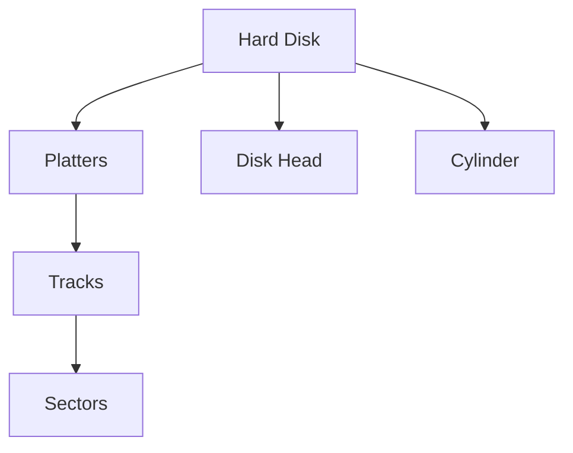
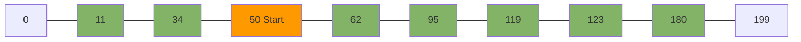

# Disk Scheduling

## Introduction

Disk scheduling is a critical aspect of operating system design that determines the order in which disk I/O requests are serviced. When multiple processes request disk access simultaneously, the operating system must decide which request to handle first. This decision significantly impacts system performance, as disk operations are among the slowest components in a computer system.

Think of disk scheduling like an elevator in a busy building. The elevator (disk head) needs to move between different floors (disk tracks) to pick up passengers (read/write data). A good elevator algorithm makes the system more efficient by minimizing travel time and maximizing throughput.

## Why Disk Scheduling Matters

Hard disk drives have mechanical components that physically move to access data:
- The **disk head** must move across the disk surface to the correct track
- The disk must rotate to bring the correct sector under the head

These physical movements are slow compared to CPU operations:
- CPU operations: nanoseconds
- Disk operations: milliseconds (millions of times slower!)

Efficient disk scheduling can:
- Reduce average waiting time for disk requests
- Minimize disk head movement
- Maximize disk throughput
- Prevent starvation of requests

## Disk Structure Basics

Before diving into scheduling algorithms, let's understand the basic structure of a disk:



- **Platter**: The circular disk where data is stored
- **Track**: Concentric circles on the platter
- **Sector**: Divisions of tracks (the smallest addressable unit)
- **Cylinder**: The same track across all platters
- **Disk Head**: The component that reads/writes data

## Common Disk Scheduling Algorithms

### 1. First-Come, First-Served (FCFS)

This is the simplest algorithm - requests are serviced in the order they arrive.

#### How it works:
1. Maintain a queue of disk requests
2. Process requests in the exact order they arrive

#### Example:

Let's say the disk head is currently at track 50, and we have requests for tracks: 95, 180, 34, 119, 11, 123, 62.

```javascript
Head position: 50
Request queue: [95, 180, 34, 119, 11, 123, 62]

Total head movement:
|50-95| + |95-180| + |180-34| + |34-119| + |119-11| + |11-123| + |123-62|
= 45 + 85 + 146 + 85 + 108 + 112 + 61
= 642 tracks
```

#### Pros and Cons:

✅ Simple to implement and understand  
✅ Fair (no starvation)  
❌ Does not optimize for head movement  
❌ Poor performance with many scattered requests  

### 2. Shortest Seek Time First (SSTF)

This algorithm selects the request that requires the least head movement from the current position.

#### How it works:
1. Select the request that is closest to the current head position
2. Move to that position and service the request
3. Repeat for the next closest request

#### Example:

Using the same scenario (head at 50, requests for 95, 180, 34, 119, 11, 123, 62):

```javascript
Head position: 50
Request queue: [95, 180, 34, 119, 11, 123, 62]

Nearest request: 62 (|50-62| = 12)
New head position: 62
Remaining requests: [95, 180, 34, 119, 11, 123]

Nearest request: 95 (|62-95| = 33)
New head position: 95
Remaining requests: [180, 34, 119, 11, 123]

// Continue with the algorithm...
```

The complete path would be: 50 → 62 → 95 → 119 → 123 → 180 → 34 → 11

Total head movement: 12 + 33 + 24 + 4 + 57 + 146 + 23 = 299 tracks

#### Pros and Cons:

✅ Better performance than FCFS  
✅ Minimizes seek time  
❌ Can cause starvation of requests for distant tracks  
❌ More complex to implement  

### 3. SCAN Algorithm (Elevator Algorithm)

The SCAN algorithm moves the disk head in one direction, servicing all requests in that path, until it reaches the end of the disk. Then it reverses direction and repeats.

#### How it works:
1. Move the head in one direction (e.g., towards higher track numbers)
2. Service all requests in that path
3. When reaching the end of the disk, reverse direction
4. Service all requests in the return path

#### Example:

Head position: 50, moving towards higher track numbers
Request queue: [95, 180, 34, 119, 11, 123, 62]
Disk size: 200 tracks (0-199)

The head services requests in this order: 62 → 95 → 119 → 123 → 180 → (199, end of disk) → 34 → 11

Total head movement: 12 + 33 + 24 + 4 + 57 + 19 + 165 + 23 = 337 tracks



#### Pros and Cons:

✅ Better performance than FCFS  
✅ No starvation (every request will eventually be serviced)  
✅ Good for systems with high disk utilization  
❌ Longer average waiting time for recently submitted requests  

### 4. C-SCAN (Circular SCAN)

C-SCAN is a variant of SCAN that only services requests when moving in one direction. After reaching the end of the disk, it quickly returns to the beginning without servicing any requests.

#### How it works:
1. Move the head in one direction, servicing requests
2. When reaching the end, return to the beginning (without servicing requests during the return)
3. Continue servicing requests as the head moves in the same direction

#### Example:

Head position: 50, servicing requests when moving towards higher track numbers
Request queue: [95, 180, 34, 119, 11, 123, 62]
Disk size: 200 tracks (0-199)

The head services requests in this order: 62 → 95 → 119 → 123 → 180 → (return to 0) → 11 → 34

Total head movement: (199 - 50) + 199 + 34 = 382 tracks

#### Pros and Cons:

✅ More uniform waiting time than SCAN  
✅ Better for systems with more uniform distribution of requests  
❌ Slightly more head movement than SCAN  

### 5. LOOK and C-LOOK

These are optimized versions of SCAN and C-SCAN that don't go all the way to the end of the disk - they only go as far as the last request in that direction.

#### Example (C-LOOK):

Head position: 50, moving towards higher track numbers
Request queue: [95, 180, 34, 119, 11, 123, 62]

The head services requests in this order: 62 → 95 → 119 → 123 → 180 → (return to lowest request) → 11 → 34

Total head movement: (180 - 50) + (180 - 11) + (34 - 11) = 130 + 169 + 23 = 322 tracks

## Implementing a Disk Scheduler

Let's implement a simple disk scheduler in JavaScript that can simulate different scheduling algorithms:

```javascript
class DiskScheduler {
  constructor() {
    this.requestQueue = [];
    this.currentPosition = 0;
    this.totalMovement = 0;
  }

  addRequest(trackPosition) {
    this.requestQueue.push(trackPosition);
  }

  setHeadPosition(position) {
    this.currentPosition = position;
  }

  // First-Come, First-Served scheduler
  fcfs() {
    this.totalMovement = 0;
    const sequence = [this.currentPosition];
    
    let currentPos = this.currentPosition;
    
    for (const request of this.requestQueue) {
      this.totalMovement += Math.abs(currentPos - request);
      currentPos = request;
      sequence.push(currentPos);
    }
    
    return {
      sequence,
      totalMovement: this.totalMovement
    };
  }
  
  // Shortest Seek Time First scheduler
  sstf() {
    this.totalMovement = 0;
    const sequence = [this.currentPosition];
    const remaining = [...this.requestQueue];
    
    let currentPos = this.currentPosition;
    
    while (remaining.length > 0) {
      // Find closest request
      let minDistance = Infinity;
      let closestIndex = -1;
      
      for (let i = 0; i < remaining.length; i++) {
        const distance = Math.abs(currentPos - remaining[i]);
        if (distance < minDistance) {
          minDistance = distance;
          closestIndex = i;
        }
      }
      
      const nextPosition = remaining[closestIndex];
      remaining.splice(closestIndex, 1);
      
      this.totalMovement += minDistance;
      currentPos = nextPosition;
      sequence.push(currentPos);
    }
    
    return {
      sequence,
      totalMovement: this.totalMovement
    };
  }
  
  // More algorithms could be implemented...
}

// Example usage:
const scheduler = new DiskScheduler();
scheduler.setHeadPosition(50);
scheduler.addRequest(95);
scheduler.addRequest(180);
scheduler.addRequest(34);
scheduler.addRequest(119);
scheduler.addRequest(11);
scheduler.addRequest(123);
scheduler.addRequest(62);

console.log("FCFS Results:", scheduler.fcfs());
console.log("SSTF Results:", scheduler.sstf());
```

## Real-World Applications

### 1. Operating Systems

Different operating systems use different disk scheduling algorithms:

- **Windows**: Uses a variant of C-LOOK for its disk scheduling
- **Linux**: Uses a deadline-based algorithm called Completely Fair Queuing (CFQ) by default
- **macOS**: Uses a hybrid approach with priorities

### 2. Database Management Systems

Database systems often implement custom disk scheduling to optimize read/write operations:
- Sequential reads for full table scans
- Random access for index lookups
- Priority-based scheduling for transaction commits

### 3. Video Streaming Services

Media servers use specialized scheduling to ensure smooth playback:
- Prioritize reads to avoid buffer underruns
- Batch similar requests to reduce seek time
- Use deadline-based scheduling to ensure frames are delivered on time

## Performance Comparisons

Different algorithms perform better in different scenarios:

| Algorithm | Best For | Worst For |
|-----------|----------|-----------|
| FCFS | Fairness, light loads | Heavy, random workloads |
| SSTF | General purpose, mixed workloads | Requests far from current position |
| SCAN | Heavy workloads, uniform distribution | Frequently changing directions |
| C-SCAN | Even response times, high loads | Small number of clustered requests |
| LOOK/C-LOOK | Most real-world situations | Very specific access patterns |

## Modern Considerations

### Solid State Drives (SSDs)

Traditional disk scheduling is less relevant for SSDs since they:
- Have no moving parts
- Can access any block with equal speed
- Don't benefit from minimizing "head movement"

However, SSDs benefit from different optimizations:
- Wear leveling (distributing writes)
- Read/write grouping (to minimize cell erasures)
- Command queuing (NCQ, TCQ)

### Virtualized Environments

In virtual machines and cloud environments:
- Multiple virtual disks compete for physical disk access
- Hypervisors implement their own scheduling on top of guest OS scheduling
- Quality of Service (QoS) considerations become important

## Exercises

1. Implement the SCAN and C-SCAN algorithms in your preferred programming language.
2. Simulate different disk scheduling algorithms with the following request queue:
   - Head starts at position 53
   - Requests for tracks: 98, 183, 37, 122, 14, 124, 65, 67
   - Compare the total head movement for each algorithm
3. Design a hybrid algorithm that combines the benefits of SSTF and SCAN.

## Summary

Disk scheduling is a fundamental concept in operating systems that significantly impacts I/O performance. We've explored several algorithms:

- **FCFS**: Simple but inefficient
- **SSTF**: Minimizes head movement but may cause starvation
- **SCAN/C-SCAN**: Provides fairness and good performance for high loads
- **LOOK/C-LOOK**: Practical optimizations of SCAN algorithms

Understanding these algorithms helps you:
1. Make better choices when configuring systems
2. Optimize application I/O patterns
3. Diagnose performance issues

While modern storage technologies like SSDs change the nature of the problem, the fundamental principles of scheduling and resource allocation remain relevant in computing systems.