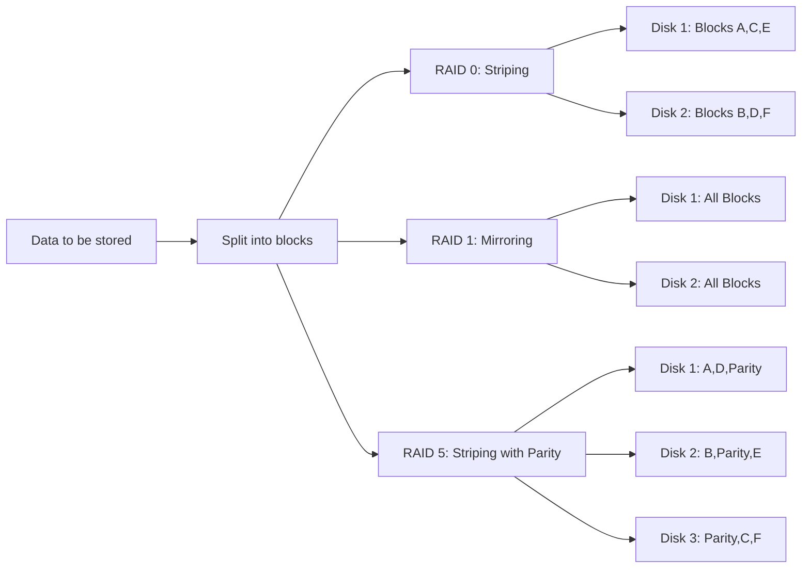
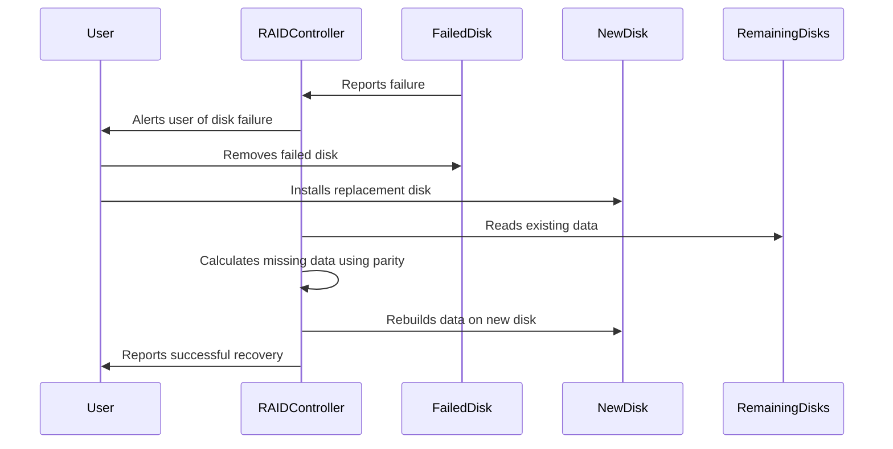

# Understanding RAID: Redundant Array of Independent Disks

## Introduction

RAID (Redundant Array of Independent Disks) is a storage technology that combines multiple physical disk drives into a single logical unit for data redundancy, improved performance, or both. RAID was introduced in the 1980s as a solution to the growing gap between CPU performance and disk storage performance, as well as to provide fault tolerance in storage systems.

In this tutorial, we'll explore how RAID works, the different RAID levels, their advantages and disadvantages, and when to use each level in real-world applications.

## What is RAID?

RAID allows you to use multiple disks as if they were one, offering benefits such as:

- **Data redundancy**: Protection against disk failures
- **Improved performance**: Faster read/write operations
- **Increased storage capacity**: Efficient use of multiple disks

The "redundant" in RAID means that data is stored redundantly across the drives in a way that protects against hardware failures.

## How RAID Works

RAID uses techniques like **striping**, **mirroring**, and **parity** to achieve its goals:

- **Striping**: Divides data across multiple disks to improve performance
- **Mirroring**: Duplicates data across disks to provide redundancy
- **Parity**: Stores error-correction information to rebuild data in case of disk failure

Let's visualize how data gets distributed in different RAID configurations:



## Common RAID Levels

### RAID 0 (Striping)

RAID 0 distributes data across multiple disks without redundancy, focusing solely on performance improvement.

**How it works**:
- Data is split into blocks and written across all disks
- No redundancy or fault tolerance
- Requires at least 2 disks

**Advantages**:
- Highest performance (read/write)
- 100% of disk space is usable
- Simple implementation

**Disadvantages**:
- No fault tolerance
- If one disk fails, all data is lost

**Example implementation in Python**:

```python
# Simplified RAID 0 striping concept
def write_to_raid0(data, num_disks):
    # Split data into blocks
    block_size = len(data) // num_disks
    if len(data) % num_disks != 0:
        block_size += 1
    
    # Create virtual disks
    disks = [[] for _ in range(num_disks)]
    
    # Distribute data across disks
    for i, byte in enumerate(data):
        disk_num = i % num_disks
        disks[disk_num].append(byte)
    
    return disks

# Example usage
data = bytearray(b"This is example data for RAID 0 striping demonstration")
raid0_disks = write_to_raid0(data, 2)

print("Disk 1:", bytes(raid0_disks[0]))
print("Disk 2:", bytes(raid0_disks[1]))
```

**Output**:
```
Disk 1: b'Ti seapedtfr AD0srpn eostaio'
Disk 2: b'hsi xml aao AIDI tipgdmntain'
```

### RAID 1 (Mirroring)

RAID 1 creates an exact copy (mirror) of data on two or more disks, providing simple redundancy.

**How it works**:
- Data is duplicated across all disks
- Requires at least 2 disks

**Advantages**:
- Excellent redundancy
- Fast read performance
- Simple recovery

**Disadvantages**:
- Only 50% of total disk space is usable
- Write performance similar to single disk
- Higher cost per usable GB

**Example implementation in Python**:

```python
# Simplified RAID 1 mirroring concept
def write_to_raid1(data, num_disks):
    # Create virtual disks
    disks = [bytearray(data) for _ in range(num_disks)]
    return disks

# Example usage
data = bytearray(b"This is example data for RAID 1 mirroring demonstration")
raid1_disks = write_to_raid1(data, 2)

print("Disk 1:", bytes(raid1_disks[0]))
print("Disk 2:", bytes(raid1_disks[1]))
```

**Output**:
```
Disk 1: b'This is example data for RAID 1 mirroring demonstration'
Disk 2: b'This is example data for RAID 1 mirroring demonstration'
```

### RAID 5 (Striping with Parity)

RAID 5 stripes data and parity information across all disks, providing a good balance of performance and redundancy.

**How it works**:
- Data blocks are striped across disks
- Parity information distributed across all disks
- Requires at least 3 disks
- Can survive one disk failure

**Advantages**:
- Good balance of performance and redundancy
- Efficient use of storage (N-1 disks of usable space)
- Can recover from a single disk failure

**Disadvantages**:
- Write performance penalty due to parity calculations
- Recovery is slow and stresses remaining disks

**Example implementation in Python**:

```python
# Simplified RAID 5 concept (XOR-based parity)
def write_to_raid5(data, num_disks):
    # Validate input
    if num_disks < 3:
        raise ValueError("RAID 5 requires at least 3 disks")
    
    # Split data into blocks (simplifying for demonstration)
    block_size = 1  # Using 1 byte blocks for simplicity
    total_blocks = len(data)
    
    # Create virtual disks
    disks = [bytearray() for _ in range(num_disks)]
    
    # Distribute data and parity across disks
    for i in range(0, total_blocks, num_disks - 1):
        # For each stripe
        stripe_data = data[i:i + num_disks - 1]
        
        # Calculate parity (XOR of all data blocks)
        if stripe_data:
            parity = 0
            for byte in stripe_data:
                parity ^= byte
            
            # Determine which disk gets parity for this stripe
            parity_disk = (i // (num_disks - 1)) % num_disks
            
            # Distribute data and parity
            data_idx = 0
            for disk_idx in range(num_disks):
                if disk_idx == parity_disk:
                    disks[disk_idx].append(parity)
                else:
                    if data_idx < len(stripe_data):
                        disks[disk_idx].append(stripe_data[data_idx])
                        data_idx += 1
    
    return disks

# Example usage
data = bytearray(b"RAID5 example")
raid5_disks = write_to_raid5(data, 3)

for i, disk in enumerate(raid5_disks):
    print(f"Disk {i+1}:", bytes(disk))
```

**Output**:
```
Disk 1: b'R\x03I'
Disk 2: b'A\x14 '
Disk 3: b'\x13D5'
```

### Other RAID Levels

#### RAID 6
Similar to RAID 5, but with dual parity, allowing recovery from two simultaneous disk failures.

#### RAID 10 (1+0)
A nested RAID that combines mirroring (RAID 1) and striping (RAID 0), offering both performance and redundancy.

#### RAID 50 (5+0)
Combines RAID 5 arrays with RAID 0 striping for improved performance while maintaining redundancy.

## RAID Implementation Methods

RAID can be implemented in several ways:

### Hardware RAID

Hardware RAID uses dedicated RAID controllers with:
- Specialized processors for RAID calculations
- Battery-backed cache to protect data during power loss
- Hot-swappable drive support

**Advantages**:
- Better performance
- OS-independent
- Battery backup protection
- No CPU overhead for the host system

**Disadvantages**:
- More expensive
- Controller failures can be catastrophic
- May be vendor-specific

### Software RAID

Software RAID is implemented at the operating system level:

**Advantages**:
- Lower cost
- More flexible configuration
- Not dependent on hardware controllers
- Often easier to recover from errors

**Disadvantages**:
- Uses host CPU resources
- Generally slower than hardware RAID
- OS-dependent

### OS-specific RAID Implementation Examples

**Linux mdadm**:

```bash
# Create a RAID 5 array with 3 devices
mdadm --create --verbose /dev/md0 --level=5 --raid-devices=3 /dev/sdb /dev/sdc /dev/sdd

# Check RAID status
mdadm --detail /dev/md0
```

**Windows Storage Spaces**:

```powershell
# Create a storage pool
New-StoragePool -FriendlyName "DataPool" -StorageSubSystemFriendlyName "Storage Spaces*" -PhysicalDisks (Get-PhysicalDisk -CanPool $True)

# Create a virtual disk with mirroring (RAID 1)
New-VirtualDisk -StoragePoolFriendlyName "DataPool" -FriendlyName "MirroredVDisk" -ResiliencySettingName Mirror -Size 1TB
```

## Real-World Applications

### Use Case 1: Database Servers
- **Recommendation**: RAID 10 for database servers
- **Why**: Combines the performance benefits of striping with the redundancy of mirroring
- **Example**: MySQL or PostgreSQL database servers handling frequent read/write operations

### Use Case 2: File Servers
- **Recommendation**: RAID 5 or RAID 6 for file servers
- **Why**: Good balance of storage efficiency and redundancy
- **Example**: Network-attached storage (NAS) for document sharing in an office environment

### Use Case 3: Video Editing Workstation
- **Recommendation**: RAID 0 for scratch disk, RAID 1 for project files
- **Why**: RAID 0 for performance when editing, RAID 1 for protecting final projects
- **Example**: Adobe Premiere Pro workstation with separate arrays for different purposes

## Common RAID Misconceptions

### "RAID is a backup solution"
RAID is **not** a backup solution. It protects against disk failure but not against:
- Accidental file deletion
- Ransomware or viruses
- Software corruption
- Natural disasters affecting the entire system

Always maintain proper backups separate from your RAID array.

### "Higher RAID levels are always better"
The "best" RAID level depends on your specific needs:
- Performance requirements
- Redundancy needs
- Budget constraints
- Number of available disks

## Performance Considerations

Different RAID levels have different performance characteristics:

| RAID Level | Read Performance | Write Performance | Capacity Efficiency | Min. Disks |
|------------|------------------|-------------------|---------------------|------------|
| RAID 0     | Excellent        | Excellent         | 100%                | 2          |
| RAID 1     | Good             | Medium            | 50%                 | 2          |
| RAID 5     | Good             | Medium            | (n-1)/n             | 3          |
| RAID 6     | Good             | Below Average     | (n-2)/n             | 4          |
| RAID 10    | Excellent        | Good              | 50%                 | 4          |

## RAID Recovery Process

When a disk fails in a redundant RAID array, the recovery process typically involves:

1. **Identifying the failed disk**
2. **Replacing the failed hardware**
3. **Rebuilding the array**

Let's look at a simplified RAID 5 recovery process:



## Best Practices for RAID Implementation

1. **Match drive specifications** (same model, size, and speed)
2. **Implement proper UPS** (uninterruptible power supply)
3. **Regular monitoring** of RAID status
4. **Periodic RAID validation** to check data integrity
5. **Keep spare drives** available for quick replacement
6. **Document your RAID configuration**
7. **Have a backup strategy** independent of RAID

## Summary

RAID technology provides a way to improve disk storage performance, capacity, and/or reliability by combining multiple physical disks into a single logical unit. We've covered:

- Different RAID levels and their characteristics
- Implementation methods (hardware vs. software)
- Real-world applications and use cases
- Best practices for RAID implementation

Remember that while RAID provides protection against certain types of hardware failures, it is not a substitute for a proper backup strategy. The choice of RAID level should be based on your specific requirements for performance, redundancy, and cost.

## Additional Resources

- Try implementing a simple software RAID setup on a virtual machine
- Research RAID monitoring tools for your operating system
- Compare the performance difference between different RAID levels

## Exercise: RAID Level Selection

For each scenario below, determine the most appropriate RAID level and justify your choice:

1. A video rendering workstation that needs maximum disk performance
2. A small business file server with 4 available disks, requiring both performance and redundancy
3. A mission-critical database server that cannot afford any downtime
4. A home media server with limited budget but valuable personal data

## Further Learning

To deepen your understanding of I/O systems and storage technologies, consider exploring:
- Storage Area Networks (SAN)
- Network Attached Storage (NAS)
- Software-defined storage
- Modern file systems and their features