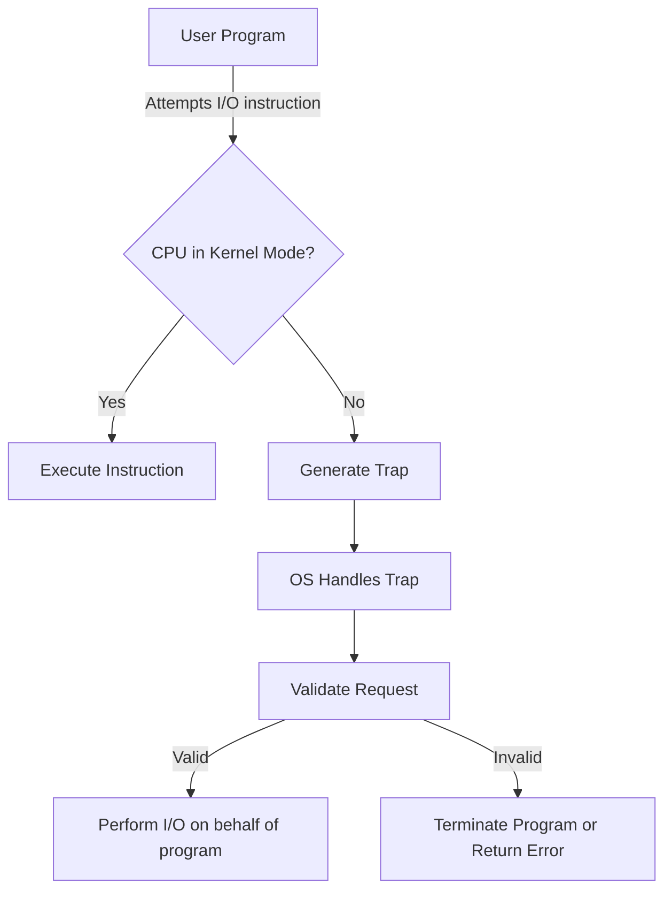
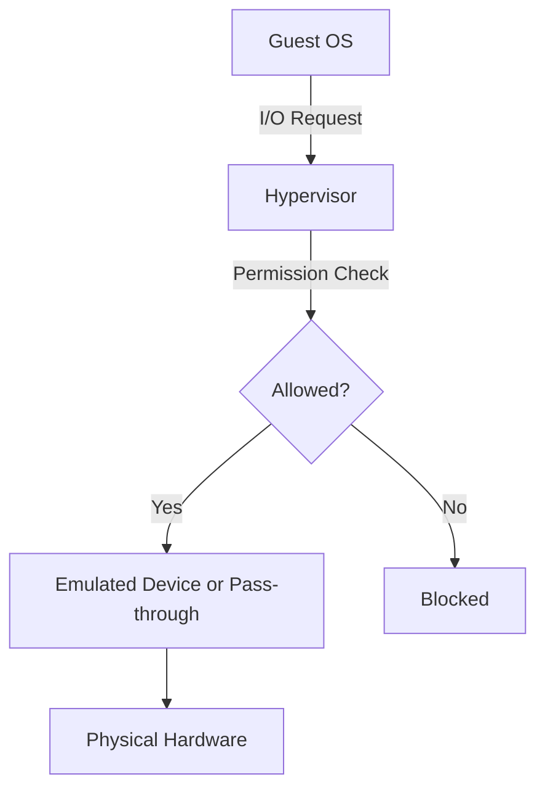

# I/O Protection

## Introduction

When multiple programs run concurrently on a computer system, the operating system must ensure they don't interfere with each other, especially when accessing input/output (I/O) devices. I/O protection refers to the mechanisms that operating systems implement to control and regulate access to I/O devices, preventing unauthorized or potentially harmful operations.

These protection mechanisms are essential because unrestricted access to I/O devices can lead to system crashes, data corruption, or security vulnerabilities. In this article, we'll explore how I/O protection works, why it matters, and how it's implemented in modern operating systems.

## Why I/O Protection Matters

Imagine what might happen if any program could directly access your hard drive, network card, or graphics adapter without restrictions:

- A buggy application could overwrite critical system files on your hard drive
- Malicious software could capture keystrokes from your keyboard
- Programs could interfere with each other's network communications
- An application crash could leave hardware in an inconsistent state

To prevent these scenarios, operating systems implement I/O protection as part of their broader protection architecture.

## Core I/O Protection Mechanisms

### Privileged Instructions

Modern CPUs operate in at least two modes:

1. **User mode**: For running regular applications with limited privileges
2. **Kernel mode** (also called supervisor mode): For executing operating system code with full access to hardware

I/O operations are typically implemented as privileged instructions that can only be executed in kernel mode. When a user program attempts to execute a privileged instruction, a trap occurs, transferring control to the operating system.



### Memory-Mapped I/O Protection

Many systems use memory-mapped I/O, where device registers appear as memory addresses. The operating system uses memory protection mechanisms to prevent user programs from directly accessing these memory regions:

```c
// This direct access would be blocked by the OS
volatile uint32_t* device_register = (uint32_t*)0xFFFF0000;
*device_register = 0x1; // Attempt to write to device register
```

Instead, applications must use system calls:

```c
// Proper way to access I/O through system calls
int fd = open("/dev/device", O_WRONLY);
if (fd != -1) {
    uint32_t value = 0x1;
    write(fd, &value, sizeof(value));
    close(fd);
}
```

### System Call Interface

Operating systems provide a system call interface that applications use to request I/O operations. This allows the OS to:

1. Validate the request
2. Check permissions
3. Perform the operation safely
4. Return results or error codes

Here's a simplified example of how system calls work for I/O operations:

```c
#include <stdio.h>
#include <fcntl.h>
#include <unistd.h>

int main() {
    // Open a file using system call interface
    int fd = open("example.txt", O_RDONLY);
    
    if (fd == -1) {
        perror("Failed to open file");
        return 1;
    }
    
    // Read data using system call
    char buffer[100];
    ssize_t bytes_read = read(fd, buffer, sizeof(buffer) - 1);
    
    if (bytes_read > 0) {
        buffer[bytes_read] = '\0';
        printf("Read %ld bytes: %s
", bytes_read, buffer);
    }
    
    // Close file using system call
    close(fd);
    
    return 0;
}
```

### I/O Permission Levels

Operating systems implement permission models to control which users and processes can access specific I/O devices:

1. **File permissions**: For file I/O
2. **Device permissions**: For hardware devices represented as files (in Unix-like systems)
3. **Capability-based systems**: Where specific I/O permissions are granted to processes

In Unix-like systems, devices are represented as special files in the `/dev` directory, with permissions controlling who can access them:

```bash
$ ls -l /dev/sda
brw-rw---- 1 root disk 8, 0 Jan 1 00:00 /dev/sda
```

This shows that the disk device `/dev/sda` can only be accessed by the root user and members of the disk group.

## I/O Protection in Practice

### Example: Protected File Operations

When an application wants to read from a file, the operating system performs several checks:

1. Does the file exist?
2. Does the user have permission to read the file?
3. Is the file currently available for reading?

Only if all these checks pass will the operating system perform the read operation:

```c
#include <stdio.h>
#include <errno.h>
#include <string.h>

int main() {
    // Try to open a file that might be protected
    FILE* file = fopen("/etc/shadow", "r");
    
    if (file == NULL) {
        printf("Error opening file: %s
", strerror(errno));
        return 1;
    }
    
    // If we get here, the file opened successfully
    char buffer[100];
    if (fgets(buffer, sizeof(buffer), file)) {
        printf("First line: %s
", buffer);
    }
    
    fclose(file);
    return 0;
}
```

Output (when run as a non-root user):
```
Error opening file: Permission denied
```

### Example: Device Access Control

In this example, we'll see what happens when a user program tries to directly access a network device:

```c
#include <stdio.h>
#include <fcntl.h>
#include <unistd.h>
#include <errno.h>
#include <string.h>

int main() {
    // Try to open a network device directly
    int fd = open("/dev/eth0", O_RDWR);
    
    if (fd == -1) {
        printf("Error opening device: %s
", strerror(errno));
        return 1;
    }
    
    printf("Successfully opened device
");
    close(fd);
    
    return 0;
}
```

Output (when run as a non-root user):
```
Error opening device: Permission denied
```

## I/O Protection in Windows vs. Unix-based Systems

Different operating systems implement I/O protection in slightly different ways:

### Windows I/O Protection

Windows uses a layered architecture for I/O protection:

1. **User Applications**: Call Win32 API functions
2. **Win32 Subsystem**: Translates API calls to system services
3. **Windows Executive**: Performs permission checks and manages device access
4. **Hardware Abstraction Layer (HAL)**: Interacts with physical hardware

Windows uses Access Control Lists (ACLs) to manage permissions for devices and other system resources.

### Unix/Linux I/O Protection

Unix-like systems use:

1. **File-based device representation**: Devices appear as special files in `/dev`
2. **Permission bits**: Control read/write/execute permissions for user/group/others
3. **Capability system**: In modern Linux, provides fine-grained control

## Advanced Topics in I/O Protection

### Device Driver Isolation

Modern operating systems use various techniques to isolate device drivers and prevent them from crashing the entire system:

1. **Microkernels**: Run device drivers in user space
2. **Driver sandboxing**: Limit the damage a faulty driver can cause
3. **I/O Memory Management Units (IOMMUs)**: Restrict device DMA access

### Virtualization and I/O

In virtualized environments, I/O protection becomes more complex:



Virtualization adds another layer of I/O protection, where the hypervisor mediates access between guest operating systems and physical hardware.

## Common I/O Protection Vulnerabilities

Despite protection mechanisms, vulnerabilities can still occur:

1. **Privilege escalation**: Exploiting bugs in device drivers to gain higher privileges
2. **DMA attacks**: Using direct memory access to bypass protection
3. **Side-channel attacks**: Inferring protected information through timing or other observable behavior

## Summary

I/O protection is a critical aspect of operating system security that:

1. Prevents unauthorized access to hardware resources
2. Isolates processes from each other
3. Protects the system from crashes and data corruption
4. Provides a secure interface for applications to use system resources

Modern operating systems implement I/O protection through a combination of hardware features (like privilege levels) and software mechanisms (like system calls and permission checks). Understanding these protection mechanisms helps programmers write more secure and reliable applications.

## Exercises

1. Write a program that attempts to open a system device file and analyze the results.
2. Compare the different permission models for devices in Windows and Linux.
3. Research a recent I/O-related security vulnerability and explain how it bypassed protection mechanisms.
4. Implement a simple program that uses system calls for file I/O and analyze how the operating system mediates these operations.

## Additional Resources

- Operating Systems: Three Easy Pieces (Chapter on I/O)
- Linux Device Drivers (O'Reilly)
- Windows Internals (Microsoft Press)
- The FreeBSD Documentation Project (I/O System)