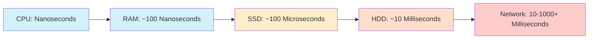

# I/O Performance

## Introduction

Input/Output (I/O) operations are often the slowest part of a program. When your code reads from a file, sends data over a network, or writes to a database, it's performing I/O operations that involve hardware components significantly slower than your CPU and memory. Understanding I/O performance is crucial for writing efficient programs.

In this guide, we'll explore what makes I/O operations slow, how to measure I/O performance, and techniques to optimize your code for better I/O efficiency.

## Why I/O Operations Are Slow

To understand I/O performance, let's first look at the speed differences between various components in a computer system:



As you can see, there's a massive difference between CPU processing speed and I/O operations. The CPU can execute billions of instructions per second, but might have to wait millions of CPU cycles for data from disk or network.

## Key I/O Performance Metrics

When discussing I/O performance, these are the primary metrics to consider:

1. **Latency**: The time delay between initiating an I/O request and receiving the first byte of data
2. **Throughput**: The amount of data transferred per unit of time (e.g., MB/s)
3. **IOPS**: Input/Output Operations Per Second, measuring how many discrete I/O operations can be performed

## Measuring I/O Performance

Let's create a simple Python program to measure file I/O performance:

```python
import time
import os

def measure_write_performance(filename, size_mb, block_size_kb=64):
    """Measure write performance to a file."""
    block_size = block_size_kb * 1024  # Convert KB to bytes
    total_bytes = size_mb * 1024 * 1024  # Convert MB to bytes
    
    # Create a data block to write
    data = b'0' * block_size
    
    # Record start time
    start_time = time.time()
    
    with open(filename, 'wb') as f:
        bytes_written = 0
        while bytes_written < total_bytes:
            f.write(data)
            bytes_written += block_size
    
    # Calculate elapsed time and performance
    elapsed_time = time.time() - start_time
    throughput = size_mb / elapsed_time
    
    return {
        'elapsed_time': elapsed_time,
        'throughput_mbs': throughput
    }

def measure_read_performance(filename, block_size_kb=64):
    """Measure read performance from a file."""
    block_size = block_size_kb * 1024  # Convert KB to bytes
    
    # Get file size
    file_size = os.path.getsize(filename)
    size_mb = file_size / (1024 * 1024)
    
    # Record start time
    start_time = time.time()
    
    with open(filename, 'rb') as f:
        while True:
            data = f.read(block_size)
            if not data:
                break
    
    # Calculate elapsed time and performance
    elapsed_time = time.time() - start_time
    throughput = size_mb / elapsed_time
    
    return {
        'elapsed_time': elapsed_time,
        'throughput_mbs': throughput
    }

# Test write performance
write_results = measure_write_performance('test_file.dat', 100)  # Write 100MB file
print(f"Write test completed in {write_results['elapsed_time']:.2f} seconds")
print(f"Write throughput: {write_results['throughput_mbs']:.2f} MB/s")

# Test read performance
read_results = measure_read_performance('test_file.dat')
print(f"Read test completed in {read_results['elapsed_time']:.2f} seconds")
print(f"Read throughput: {read_results['throughput_mbs']:.2f} MB/s")

# Clean up
os.remove('test_file.dat')
```

**Example Output:**

```
Write test completed in 0.35 seconds
Write throughput: 285.71 MB/s
Read test completed in 0.18 seconds
Read throughput: 555.56 MB/s
```

This output will vary depending on your hardware, particularly your storage device type (HDD vs SSD).

## Common I/O Bottlenecks

I/O performance bottlenecks typically fall into these categories:

1. **Hardware limitations**: Disk speed, network bandwidth, etc.
2. **Inefficient access patterns**: Random vs. sequential access
3. **Small I/O operations**: Too many small reads/writes
4. **Synchronous operations**: Blocking on I/O completion
5. **Lack of caching**: Repeatedly accessing the same data

## I/O Optimization Techniques

### 1. Buffering

Buffering combines small I/O operations into larger ones, reducing the overhead of system calls.

```python
# Inefficient: Many small writes
for i in range(1000):
    with open('data.txt', 'a') as f:
        f.write(f"{i}
")

# Improved: Using a buffer
buffer = []
for i in range(1000):
    buffer.append(f"{i}
")

with open('data.txt', 'w') as f:
    f.write(''.join(buffer))
```

### 2. Sequential vs. Random Access

Sequential access is much faster than random access, especially on HDDs:

```python
import random

# Create a large file for testing
with open('random_data.bin', 'wb') as f:
    f.write(os.urandom(10 * 1024 * 1024))  # 10MB of random data

# Test sequential read
def sequential_read(filename):
    start_time = time.time()
    with open(filename, 'rb') as f:
        data = f.read()
    return time.time() - start_time

# Test random read (1000 random 1KB blocks)
def random_read(filename):
    start_time = time.time()
    file_size = os.path.getsize(filename)
    with open(filename, 'rb') as f:
        for _ in range(1000):
            position = random.randint(0, file_size - 1024)
            f.seek(position)
            data = f.read(1024)
    return time.time() - start_time

seq_time = sequential_read('random_data.bin')
rand_time = random_read('random_data.bin')

print(f"Sequential read time: {seq_time:.4f} seconds")
print(f"Random read time: {rand_time:.4f} seconds")
print(f"Random access is {rand_time/seq_time:.1f}x slower")

# Clean up
os.remove('random_data.bin')
```

**Example Output (on an HDD):**

```
Sequential read time: 0.0530 seconds
Random read time: 3.2150 seconds
Random access is 60.7x slower
```

### 3. Memory-Mapped Files

For large files, memory-mapped I/O can improve performance by letting the OS handle caching and paging:

```python
import mmap

# Create a test file
with open('mmap_test.bin', 'wb') as f:
    f.write(b'\x00' * 100 * 1024 * 1024)  # 100MB file

# Regular file access
def regular_update():
    start_time = time.time()
    with open('mmap_test.bin', 'r+b') as f:
        for i in range(1000):
            pos = i * 1024
            f.seek(pos)
            f.write(b'X' * 10)
    return time.time() - start_time

# Memory-mapped access
def mmap_update():
    start_time = time.time()
    with open('mmap_test.bin', 'r+b') as f:
        mm = mmap.mmap(f.fileno(), 0)
        for i in range(1000):
            pos = i * 1024
            mm[pos:pos+10] = b'X' * 10
        mm.close()
    return time.time() - start_time

regular_time = regular_update()
mmap_time = mmap_update()

print(f"Regular file access: {regular_time:.4f} seconds")
print(f"Memory-mapped access: {mmap_time:.4f} seconds")
print(f"Memory-mapping is {regular_time/mmap_time:.1f}x faster")

# Clean up
os.remove('mmap_test.bin')
```

### 4. Asynchronous I/O

Asynchronous I/O allows your program to continue execution while I/O operations happen in the background:

```python
import asyncio
import aiofiles

async def async_read_write():
    # Write file asynchronously
    start_time = time.time()
    
    async with aiofiles.open('async_test.txt', 'w') as f:
        for i in range(1000):
            await f.write(f"Line {i}
")
    
    # Read file asynchronously
    async with aiofiles.open('async_test.txt', 'r') as f:
        content = await f.read()
    
    elapsed = time.time() - start_time
    print(f"Async I/O completed in {elapsed:.4f} seconds")
    return elapsed

# Run the async function
async_time = asyncio.run(async_read_write())

# Clean up
os.remove('async_test.txt')
```

### 5. Using Appropriate Block Sizes

The block size can significantly impact I/O performance. Let's test different block sizes:

```python
def test_block_sizes(filename, total_mb):
    block_sizes = [1, 4, 16, 64, 256, 1024]  # KB
    results = []
    
    for bs in block_sizes:
        # Create a fresh file each time
        if os.path.exists(filename):
            os.remove(filename)
            
        result = measure_write_performance(filename, total_mb, block_size_kb=bs)
        results.append((bs, result['throughput_mbs']))
    
    # Clean up
    if os.path.exists(filename):
        os.remove(filename)
        
    return results

# Test different block sizes
block_test_results = test_block_sizes('block_test.dat', 100)

print("Block Size (KB) | Throughput (MB/s)")
print("--------------- | ----------------")
for bs, throughput in block_test_results:
    print(f"{bs:14} | {throughput:.2f}")
```

**Example Output:**

```
Block Size (KB) | Throughput (MB/s)
--------------- | ----------------
1              | 95.24
4              | 205.13
16             | 308.64
64             | 333.33
256            | 344.83
1024           | 322.58
```

This demonstrates that very small and very large block sizes can both be suboptimal.

## Real-World Application: Database Operations

Let's look at a real-world example using SQLite, comparing different approaches to inserting data:

```python
import sqlite3
import time

# Create a test database
def setup_db():
    conn = sqlite3.connect('performance_test.db')
    cursor = conn.cursor()
    cursor.execute('DROP TABLE IF EXISTS users')
    cursor.execute('''
    CREATE TABLE users (
        id INTEGER PRIMARY KEY,
        name TEXT,
        email TEXT
    )
    ''')
    conn.commit()
    return conn

# Method 1: Individual inserts
def individual_inserts(conn, n_records):
    start_time = time.time()
    cursor = conn.cursor()
    
    for i in range(n_records):
        cursor.execute(
            'INSERT INTO users (name, email) VALUES (?, ?)',
            (f'User {i}', f'user{i}@example.com')
        )
        conn.commit()  # Commit after each insert
    
    return time.time() - start_time

# Method 2: Batch inserts with a single transaction
def batch_transaction(conn, n_records):
    start_time = time.time()
    cursor = conn.cursor()
    
    conn.execute('BEGIN TRANSACTION')
    for i in range(n_records):
        cursor.execute(
            'INSERT INTO users (name, email) VALUES (?, ?)',
            (f'User {i}', f'user{i}@example.com')
        )
    conn.commit()  # Single commit at the end
    
    return time.time() - start_time

# Method 3: Executemany
def executemany_insert(conn, n_records):
    start_time = time.time()
    cursor = conn.cursor()
    
    data = [(f'User {i}', f'user{i}@example.com') for i in range(n_records)]
    cursor.executemany('INSERT INTO users (name, email) VALUES (?, ?)', data)
    conn.commit()
    
    return time.time() - start_time

# Test the methods
n_records = 10000
conn = setup_db()

# Reset and test individual inserts
conn.execute('DELETE FROM users')
conn.commit()
individual_time = individual_inserts(conn, n_records)
print(f"Individual inserts: {individual_time:.2f} seconds")

# Reset and test batch transaction
conn.execute('DELETE FROM users')
conn.commit()
batch_time = batch_transaction(conn, n_records)
print(f"Batch transaction: {batch_time:.2f} seconds")

# Reset and test executemany
conn.execute('DELETE FROM users')
conn.commit()
executemany_time = executemany_insert(conn, n_records)
print(f"Executemany: {executemany_time:.2f} seconds")

# Clean up
conn.close()
os.remove('performance_test.db')
```

**Example Output:**

```
Individual inserts: 15.83 seconds
Batch transaction: 0.15 seconds
Executemany: 0.08 seconds
```

The performance difference is dramatic! This shows how important transaction management is for database I/O performance.

## Summary

In this guide, we've explored I/O performance principles and techniques:

1. I/O operations are often the bottleneck in application performance
2. Key metrics: latency, throughput, and IOPS
3. Optimization techniques:
   - Buffering
   - Sequential access patterns
   - Memory-mapped files
   - Asynchronous I/O
   - Appropriate block sizes
   - Batch operations

By applying these techniques, you can significantly improve your application's performance when dealing with files, databases, or network operations.

## Exercises

1. Modify the block size testing program to also measure read performance with different block sizes.
2. Write a program that compares the performance of text file parsing line-by-line versus reading the whole file at once.
3. Create a simple web server benchmark that measures the impact of different I/O strategies on response time.
4. Implement a file copy utility that optimizes for maximum throughput on your system.
5. Experiment with database indexing and measure its impact on query performance.

## Additional Resources

- **Operating System Documentation**: Check your OS documentation for specific I/O optimization tips
- **Python Performance**: The official Python documentation on performance optimization
- **Database Specific Guides**: Each database system has its own I/O optimization best practices
- **Tools for I/O Benchmarking**: fio, ioping, and dd on Linux systems
- **I/O Schedulers**: Learn about different I/O schedulers in your operating system