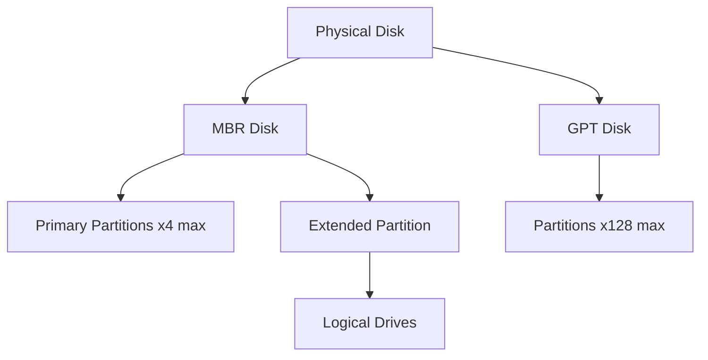
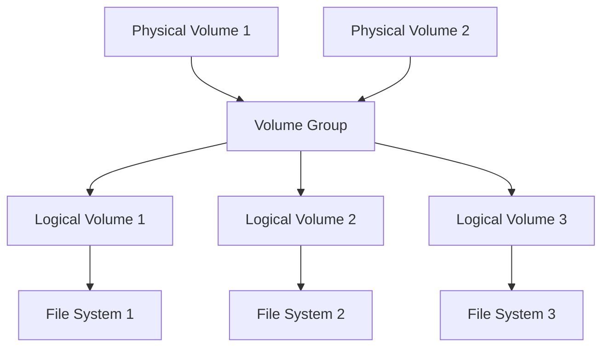

# Disk Management

## Introduction

Disk management is a fundamental aspect of computer systems that deals with organizing, partitioning, and maintaining storage devices. As part of secondary storage management, it ensures efficient data storage, retrieval, and organization. Whether you're setting up a new computer, optimizing performance, or recovering data, understanding disk management concepts is essential for programmers and system administrators alike.

Secondary storage devices like hard disk drives (HDDs), solid-state drives (SSDs), and external storage media require proper management to function efficiently. This guide will walk you through the key concepts, tools, and best practices for effective disk management.

## Basic Disk Concepts

Before diving into management techniques, let's understand some fundamental concepts:

### Types of Storage Devices

1. **Hard Disk Drives (HDDs)** - Mechanical drives with rotating platters and moving read/write heads
2. **Solid State Drives (SSDs)** - Flash memory-based storage with no moving parts
3. **Hybrid Drives** - Combination of HDD and SSD technologies
4. **External Storage** - USB drives, external HDDs/SSDs, network-attached storage

### Storage Capacity Measurements

Storage capacity is typically measured in bytes and their multiples:

| Unit | Size | Equivalent |
|------|------|------------|
| Kilobyte (KB) | 1,024 bytes | 2^10 bytes |
| Megabyte (MB) | 1,048,576 bytes | 2^20 bytes |
| Gigabyte (GB) | 1,073,741,824 bytes | 2^30 bytes |
| Terabyte (TB) | 1,099,511,627,776 bytes | 2^40 bytes |

## Disk Partitioning

Partitioning is the process of dividing a physical storage device into logical sections called partitions. Each partition functions as a separate disk volume.

### Why Partition a Disk?

- Organize different types of data
- Install multiple operating systems
- Separate system files from user data for easier backups
- Improve performance and security

### Partition Types

1. **Primary Partition** - Can be bootable and used to start an operating system
2. **Extended Partition** - Contains logical drives
3. **Logical Partition** - Created within an extended partition

### Partition Tables

Two main partition table formats are used:

1. **MBR (Master Boot Record)**
   - Traditional format, limited to 2TB disk size
   - Supports up to 4 primary partitions or 3 primary and 1 extended partition

2. **GPT (GUID Partition Table)**
   - Modern format supporting disks larger than 2TB
   - Supports up to 128 partitions on Windows systems
   - Includes redundant partition tables for improved reliability

Here's a visualization of the disk partitioning structure:



## File Systems

After partitioning, each partition must be formatted with a file system before it can store data. The file system determines how data is stored, organized, and accessed.

### Common File Systems

1. **NTFS (New Technology File System)**
   - Windows default file system
   - Features: file permissions, encryption, journaling, large file/partition support

2. **FAT32 (File Allocation Table)**
   - Older Windows file system
   - Widely compatible but limited to 4GB file size and 32GB partition size
   
3. **exFAT (Extended File Allocation Table)**
   - Designed for flash drives
   - Compatible with both Windows and macOS

4. **ext4 (Fourth Extended Filesystem)**
   - Common Linux file system
   - Supports large files and volumes with journaling

5. **APFS (Apple File System)**
   - Modern file system for macOS and iOS
   - Optimized for SSDs with strong encryption

## Disk Management Tasks

### Viewing Disk Information

Most operating systems provide tools to view disk information. In Windows, you can use the Disk Management utility.

In code, you can use programming languages to access disk information:

```python
# Python example to get disk information using psutil
import psutil

# Get disk partitions
partitions = psutil.disk_partitions()
for partition in partitions:
    print(f"Device: {partition.device}")
    print(f"Mountpoint: {partition.mountpoint}")
    print(f"File system type: {partition.fstype}")
    
    # Get usage statistics
    usage = psutil.disk_usage(partition.mountpoint)
    print(f"Total size: {usage.total / (1024**3):.2f} GB")
    print(f"Used: {usage.used / (1024**3):.2f} GB")
    print(f"Free: {usage.free / (1024**3):.2f} GB")
    print(f"Percentage used: {usage.percent}%")
    print()
```

Output:
```
Device: C:\
Mountpoint: C:\
File system type: NTFS
Total size: 237.86 GB
Used: 189.54 GB
Free: 48.32 GB
Percentage used: 79.7%

Device: D:\
Mountpoint: D:\
File system type: NTFS
Total size: 476.54 GB
Used: 325.12 GB
Free: 151.42 GB
Percentage used: 68.2%
```

### Creating and Formatting Partitions

Here's how to create and format a partition using PowerShell in Windows:

```powershell
# Create a new partition on disk 1 with maximum available size
New-Partition -DiskNumber 1 -UseMaximumSize -AssignDriveLetter

# Format the new partition as NTFS with a label "Data"
Format-Volume -DriveLetter E -FileSystem NTFS -NewFileSystemLabel "Data" -Confirm:$false
```

### Mounting and Unmounting Drives

In Linux, you can mount and unmount drives using the following commands:

```bash
# Mount a drive
sudo mount /dev/sdb1 /mnt/usb

# Unmount a drive
sudo umount /mnt/usb
```

## Logical Volume Management (LVM)

LVM is a flexible disk management system that allows for dynamic resizing of storage volumes. It's commonly used in Linux environments.

### Key LVM Concepts

1. **Physical Volumes (PV)** - The actual physical disks or partitions
2. **Volume Groups (VG)** - Combine multiple physical volumes into a storage pool
3. **Logical Volumes (LV)** - Virtual partitions created from volume groups

Here's a diagram showing the LVM structure:



### LVM Commands in Linux

```bash
# Create a physical volume
pvcreate /dev/sdb1

# Create a volume group named 'vg_data' using the physical volume
vgcreate vg_data /dev/sdb1

# Create a logical volume named 'lv_data' with 10GB size
lvcreate -L 10G -n lv_data vg_data

# Format the logical volume with ext4 file system
mkfs.ext4 /dev/vg_data/lv_data

# Mount the logical volume
mount /dev/vg_data/lv_data /mnt/data
```

## Disk Management in Different Operating Systems

### Windows Disk Management

Windows provides a graphical Disk Management utility and PowerShell cmdlets for disk operations.

Common PowerShell commands:

```powershell
# List all disks
Get-Disk

# Initialize a new disk
Initialize-Disk -Number 1 -PartitionStyle GPT

# Get partition information
Get-Partition -DiskNumber 1

# Resize a partition
Resize-Partition -DiskNumber 1 -PartitionNumber 2 -Size 10GB
```

### Linux Disk Management

Linux offers powerful command-line tools for disk management:

1. **fdisk** - Partition management tool
2. **parted** - More advanced partition tool
3. **gparted** - Graphical partition editor
4. **df** - Show free disk space
5. **mount/umount** - Mount/unmount file systems

Example commands:

```bash
# View disk information
fdisk -l

# View disk space usage
df -h

# Check disk health (for SSDs)
smartctl -a /dev/sda
```

### macOS Disk Management

macOS provides Disk Utility for GUI-based disk management and `diskutil` for command-line operations:

```bash
# List all disks
diskutil list

# Erase and format a disk
diskutil eraseDisk APFS "MyDisk" /dev/disk2

# Verify a disk
diskutil verifyDisk /dev/disk2
```

## Best Practices for Disk Management

1. **Regular Maintenance**:
   - Defragment HDDs periodically (not needed for SSDs)
   - Check for and repair errors
   - Monitor disk health

2. **Backup Strategy**:
   - Implement regular backups of important data
   - Use the 3-2-1 backup rule: 3 copies, 2 different media types, 1 offsite copy

3. **Performance Optimization**:
   - Separate OS and data partitions
   - Use appropriate file systems for your needs
   - Allocate sufficient swap/page file space

4. **Security Considerations**:
   - Implement disk encryption for sensitive data
   - Securely wipe disks before disposal or repurposing

## Programming Interface for Disk Operations

Most programming languages provide libraries to interact with disks. Here's a simple example in Python to monitor disk space and alert when it's running low:

```python
import psutil
import smtplib
from email.message import EmailMessage

def check_disk_usage(disk, threshold=80):
    """Check if disk usage exceeds threshold percent."""
    usage = psutil.disk_usage(disk)
    return usage.percent > threshold

def send_alert(disk, usage_percent):
    """Send email alert for low disk space."""
    msg = EmailMessage()
    msg.set_content(f"Warning: Disk {disk} is at {usage_percent}% capacity!")
    msg['Subject'] = 'Disk Space Alert'
    msg['From'] = 'monitor@example.com'
    msg['To'] = 'admin@example.com'
    
    # Connect to SMTP server and send the message
    server = smtplib.SMTP('smtp.example.com', 587)
    server.starttls()
    server.login('username', 'password')
    server.send_message(msg)
    server.quit()

def monitor_disks(disks=['/'], threshold=80, alert=True):
    """Monitor disk usage and optionally send alerts."""
    for disk in disks:
        usage = psutil.disk_usage(disk)
        print(f"Disk {disk}: {usage.percent}% used")
        
        if usage.percent > threshold and alert:
            send_alert(disk, usage.percent)
            print(f"Alert sent for disk {disk}")

# Usage example
if __name__ == "__main__":
    monitor_disks(disks=['C:', 'D:'], threshold=85)
```

## Summary

Disk management is a critical skill for anyone working with computer systems. It involves partitioning, formatting, and organizing storage devices to ensure efficient data handling. Key concepts include:

- Understanding different storage devices and their characteristics
- Partitioning disks using MBR or GPT partition tables
- Choosing appropriate file systems based on needs
- Performing basic disk operations like creating, formatting, and mounting partitions
- Implementing best practices for disk maintenance and security

By mastering these concepts, you'll be better equipped to manage storage resources effectively and avoid common issues like data loss, fragmentation, and performance degradation.

## Additional Resources

For further learning, consider exploring:

1. Operating system-specific documentation
2. Advanced concepts like RAID (Redundant Array of Independent Disks)
3. Cloud storage integration
4. Automated backup and recovery solutions

## Exercises

1. **Basic Partition Exercise**: Create a partition scheme for a 1TB drive that includes separate partitions for an operating system, applications, and user data.

2. **Command Practice**: List the commands you would use to:
   - Create a new partition in Linux
   - Format it with ext4
   - Mount it automatically at startup

3. **Programming Challenge**: Write a script in your preferred language that:
   - Lists all storage devices
   - Reports their capacity and free space
   - Identifies potential issues (e.g., drives nearly full)

4. **Research Task**: Compare the performance characteristics of different file systems for specific use cases (e.g., large file storage, many small files, database storage).