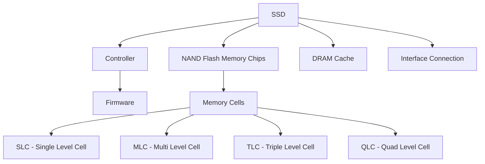

# SSD Technology

## Introduction

Solid State Drives (SSDs) have revolutionized computer storage technology in the past decade, dramatically improving system performance and reliability. Unlike their mechanical predecessors (Hard Disk Drives or HDDs), SSDs have no moving parts and instead rely on flash memory to store data persistently.

In this guide, we'll explore how SSDs work, their advantages and limitations, and why they've become the preferred storage solution for everything from smartphones to enterprise servers.

## What is an SSD?

An SSD (Solid State Drive) is a storage device that uses integrated circuit assemblies to store data persistently. Unlike traditional Hard Disk Drives (HDDs) that use spinning disks and movable read/write heads, SSDs use flash memory chips (typically NAND flash) to store data.



## How SSDs Work

### NAND Flash Memory

The core of an SSD is its NAND flash memory. NAND flash stores data in cells, which can hold electrical charges. These charges represent binary data (0s and 1s).

### Types of Memory Cells

SSDs use different types of memory cells, each with different characteristics:

1. **SLC (Single-Level Cell)**: Stores 1 bit per cell
   - Highest performance and endurance
   - Most expensive
   - Used in enterprise/high-performance applications

2. **MLC (Multi-Level Cell)**: Stores 2 bits per cell
   - Good balance of performance and cost
   - Medium endurance

3. **TLC (Triple-Level Cell)**: Stores 3 bits per cell
   - Lower cost
   - Reduced write endurance
   - Used in mainstream consumer SSDs

4. **QLC (Quad-Level Cell)**: Stores 4 bits per cell
   - Lowest cost per GB
   - Lowest write endurance
   - Used in budget SSDs for bulk storage

### Basic Operations

SSDs perform three basic operations:

1. **Read**: Checking the voltage level of cells to determine their value
2. **Write**: Programming cells with new data (requires an empty block)
3. **Erase**: Clearing data from cells to prepare them for new data

## SSD Components

### Controller

The controller is the "brain" of an SSD. It:
- Manages read/write operations
- Handles wear leveling
- Implements garbage collection
- Manages the flash translation layer (FTL)
- Implements error correction

### DRAM Cache

Many SSDs include DRAM cache to:
- Store the mapping table
- Buffer write operations
- Improve random read/write performance

### Interface

SSDs connect to computers through various interfaces:

1. **SATA**: Common in older systems, limited to ~550MB/s
2. **NVMe**: Modern high-speed interface that connects directly to PCIe, reaching speeds of 3,500MB/s or more
3. **M.2**: A form factor that can use either SATA or NVMe protocols

## Key SSD Concepts

### Wear Leveling

Flash memory cells have limited write endurance. Wear leveling distributes writes evenly across all memory cells to prevent any single block from failing prematurely.

```javascript
// Simplified pseudocode for wear leveling
function writeData(data, logicalAddress) {
  // Find the physical block with lowest write count
  const physicalBlock = findLeastUsedBlock();
  
  // Update the mapping table
  updateMapping(logicalAddress, physicalBlock.address);
  
  // Write data to the physical block
  writeToBlock(physicalBlock, data);
  
  // Increment the write counter for this block
  physicalBlock.writeCount++;
}
```

### Garbage Collection

When data is modified, SSDs write the new data to empty pages and mark the old pages as invalid. Garbage collection reclaims these invalid pages:

```javascript
// Simplified pseudocode for garbage collection
function garbageCollection() {
  // Find blocks with many invalid pages
  const candidateBlocks = findBlocksWithInvalidPages();
  
  for (const block of candidateBlocks) {
    // Copy still-valid pages to a new block
    const validPages = getValidPages(block);
    const newBlock = allocateNewBlock();
    
    for (const page of validPages) {
      copyPage(page, newBlock);
      updateMapping(page.logicalAddress, newBlock.address);
    }
    
    // Erase the old block for future use
    eraseBlock(block);
  }
}
```

### TRIM Command

The TRIM command allows the operating system to inform the SSD which blocks of data are no longer needed:

```javascript
// How TRIM works (OS perspective)
function deleteFile(filePath) {
  // Get the file's blocks
  const fileBlocks = getFileBlocks(filePath);
  
  // Delete file entry from file system
  removeFromFileSystem(filePath);
  
  // Send TRIM command for each block
  for (const block of fileBlocks) {
    sendTrimCommand(block.address, block.size);
  }
}
```

### Over-provisioning

SSDs reserve a portion of their capacity for background operations like wear leveling and garbage collection. This improves performance and extends the drive's lifespan.

## SSD vs HDD: A Comparison

| Feature | SSD | HDD |
|---------|-----|-----|
| Speed | Fast (500-7000 MB/s) | Slow (80-160 MB/s) |
| Latency | Very low (0.1ms) | Higher (5-10ms) |
| Noise | Silent | Audible |
| Power Usage | Lower | Higher |
| Durability | More resistant to drops | More fragile |
| Lifespan | Limited write cycles | Mechanical wear |
| Cost per GB | Higher | Lower |
| Form Factors | 2.5", M.2, etc. | 3.5", 2.5" |

## Practical Applications

### Improving System Performance

One of the most significant performance upgrades for any computer is replacing a traditional HDD with an SSD:

```javascript
// Example of disk I/O speed difference in a real application

// HDD performance for reading a 1GB file
function readLargeFileHDD() {
  // Time: ~10 seconds
  // Average speed: ~100 MB/s
  const data = readFile("large_dataset.bin");
  return processData(data);
}

// SSD performance for the same operation
function readLargeFileSSD() {
  // Time: ~2 seconds
  // Average speed: ~500 MB/s for SATA SSD
  const data = readFile("large_dataset.bin");
  return processData(data);
}

// NVMe SSD performance
function readLargeFileNVMe() {
  // Time: ~0.3 seconds
  // Average speed: ~3,500 MB/s
  const data = readFile("large_dataset.bin");
  return processData(data);
}
```

### Database Applications

SSDs dramatically improve database performance, especially for random read operations:

```javascript
// Example of database query performance
async function queryDatabase(userId) {
  // On HDD: ~50ms per random read
  // On SSD: ~0.1ms per random read
  
  // For a query requiring 10 random reads:
  // HDD: ~500ms
  // SSD: ~1ms
  
  const userData = await db.query(`
    SELECT * FROM users 
    WHERE user_id = ${userId}
  `);
  
  return userData;
}
```

### Gaming Performance

SSDs reduce game loading times and can improve in-game performance when streaming assets:

```javascript
// Example of game asset loading
function loadGameLevel(levelName) {
  console.log("Loading level...");
  
  // HDD: Loading time ~30 seconds
  // SSD: Loading time ~8 seconds
  // NVMe SSD: Loading time ~3 seconds
  
  const levelData = loadLevelAssets(levelName);
  initializeLevel(levelData);
  
  console.log("Level loaded successfully!");
}
```

## Choosing the Right SSD

When selecting an SSD, consider:

1. **Capacity**: How much storage do you need?
2. **Interface**: SATA vs. NVMe (consider your motherboard's support)
3. **Endurance (TBW - Terabytes Written)**: Higher is better for intensive workloads
4. **Performance**: Sequential and random read/write speeds
5. **DRAM Cache**: DRAM-less SSDs are cheaper but slower for some workloads
6. **Form Factor**: 2.5" SATA, M.2, or add-in card

## Best Practices for SSD Usage

1. **Keep free space**: Maintain at least 10-20% free space for optimal performance
2. **Enable TRIM**: Ensure your OS supports and has enabled TRIM
3. **Avoid defragmentation**: Unlike HDDs, SSDs don't benefit from defragmentation
4. **Update firmware**: Keep your SSD's firmware updated for best performance and reliability
5. **Monitor health**: Use manufacturer tools to monitor your SSD's health

## Programming Considerations for SSDs

When developing applications that will run on systems with SSDs, consider:

1. **Batch small writes**: Combine small writes into larger ones when possible
2. **Align writes**: Align writes to page boundaries for optimal performance
3. **Avoid unnecessary writes**: Minimize write amplification
4. **Use async I/O**: Take advantage of SSDs' ability to handle parallel operations

```javascript
// Example of optimized SSD writes
async function saveUserData(users) {
  // Bad practice: Many small writes
  /*
  for (const user of users) {
    await fs.writeFile(`users/${user.id}.json`, JSON.stringify(user));
  }
  */
  
  // Good practice: Batch writes
  const operations = users.map(user => {
    return fs.promises.writeFile(
      `users/${user.id}.json`, 
      JSON.stringify(user)
    );
  });
  
  // Execute all writes in parallel
  await Promise.all(operations);
}
```

## Future of SSD Technology

The SSD landscape continues to evolve with:

1. **QLC and PLC (Penta-Level Cell)**: Increasing density at the cost of endurance
2. **3D NAND**: Stacking cells vertically to increase density
3. **Storage-class memory (SCM)**: Bridging the gap between RAM and SSDs
4. **Zoned Namespaces (ZNS)**: Improved write efficiency and endurance

## Summary

Solid State Drives have transformed computing by eliminating the mechanical limitations of traditional storage. They offer:

- Superior speed and responsiveness
- Lower latency
- Better reliability and shock resistance
- Silent operation
- Lower power consumption

While they come at a higher cost per gigabyte than HDDs, their advantages make them the preferred choice for operating systems, applications that require frequent access to data, and environments where reliability is critical.

## Exercises

1. Compare the boot time of your computer with an HDD vs. an SSD. If you don't have both, research typical boot times for similar systems.

2. Write a program that benchmarks sequential and random read/write operations on your storage device.

3. Research and compare the specifications of three different SSD models (budget, mainstream, and premium).

4. Describe a use case where an HDD might still be preferred over an SSD.

5. Calculate the Total Bytes Written (TBW) needed for your use case and determine what endurance rating you should look for in an SSD.

## Additional Resources

- SSD manufacturers' websites for detailed specifications and tools
- Operating system documentation on storage optimization
- Programming guides for optimizing I/O operations
- Technical forums and communities focused on computer hardware