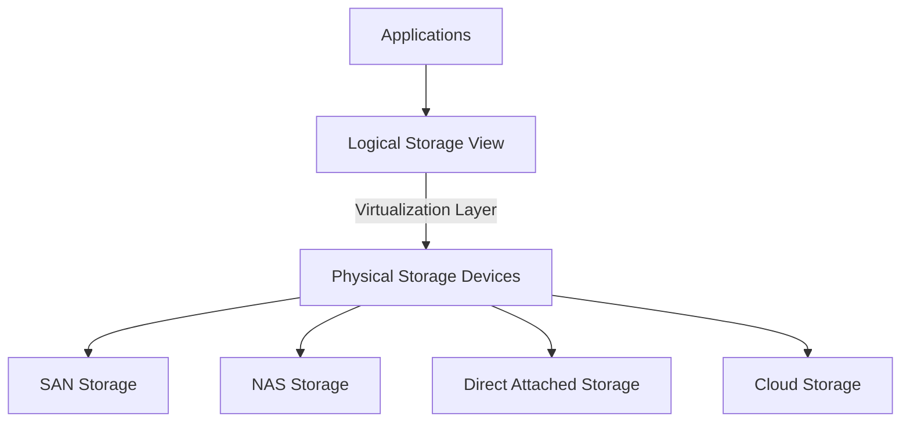
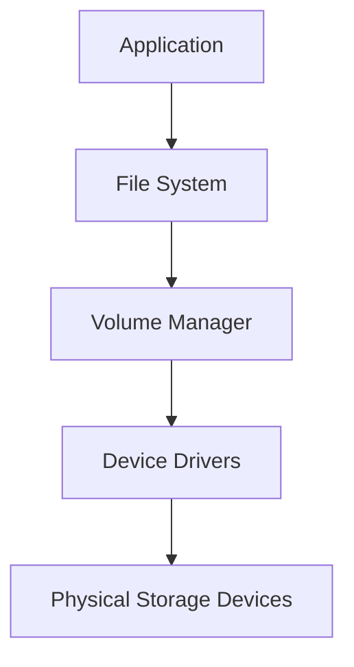
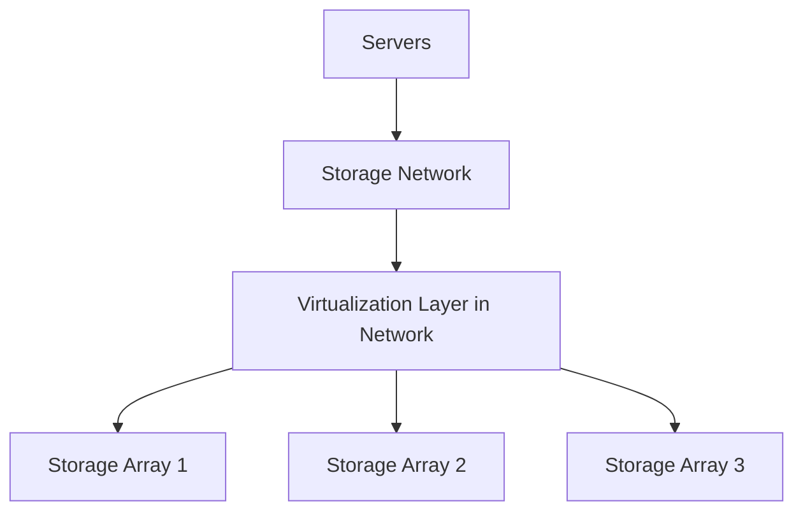
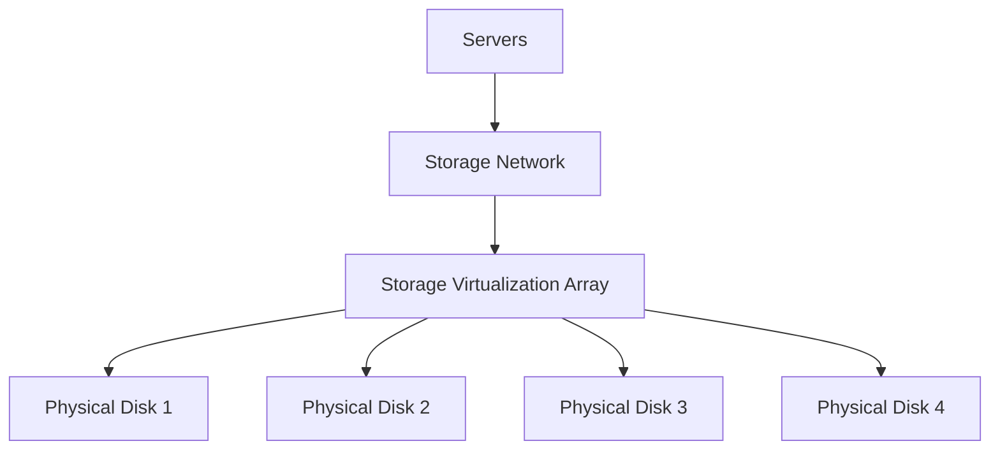

# Storage Virtualization

## Introduction

Storage virtualization is a powerful concept in modern computing that transforms how we interact with physical storage devices. At its core, storage virtualization creates an abstraction layer that separates the logical view of storage from its physical implementation. This means applications and users can interact with storage resources without needing to understand or manage the underlying hardware complexities.

For beginners in programming, understanding storage virtualization provides valuable insights into how modern systems efficiently manage data storage resources. This knowledge becomes increasingly important as applications scale and storage needs grow more complex.

## What is Storage Virtualization?

Storage virtualization is the process of presenting a logical view of physical storage resources, regardless of their location or actual physical structure. It allows multiple physical storage devices to appear as a single storage unit, creating a more flexible and manageable storage environment.



The key benefits of storage virtualization include:

- **Simplified management**: Administrators manage storage as a unified resource rather than individual devices
- **Improved utilization**: Storage can be allocated more efficiently across physical devices
- **Enhanced flexibility**: Storage can be expanded, migrated, or reconfigured without disrupting applications
- **Increased availability**: Data can be replicated across multiple physical devices transparently

## Types of Storage Virtualization

Storage virtualization can be implemented in different ways, each with its own advantages and use cases:

### 1. Block-Level Virtualization

Block-level virtualization abstracts the physical storage at the block level (the raw storage units that file systems are built upon). This approach is common in Storage Area Networks (SANs).

Example implementation using a simple JavaScript model:

```javascript
// Simplified model of block-level storage virtualization
class BlockVirtualization {
  constructor() {
    this.physicalBlocks = new Map(); // Maps physical blocks to storage devices
    this.virtualBlocks = new Map();  // Maps virtual blocks to physical blocks
    this.nextVirtualBlockId = 0;
  }

  // Allocate a new virtual block
  allocateVirtualBlock(sizeBytes) {
    const virtualBlockId = this.nextVirtualBlockId++;
    
    // Find available physical block (simplified)
    const physicalBlockId = this.findAvailablePhysicalBlock(sizeBytes);
    
    // Map virtual to physical
    this.virtualBlocks.set(virtualBlockId, {
      physicalBlockId,
      sizeBytes
    });
    
    return virtualBlockId;
  }
  
  // Read data from a virtual block
  readFromVirtualBlock(virtualBlockId, offset, length) {
    const physicalMapping = this.virtualBlocks.get(virtualBlockId);
    if (!physicalMapping) {
      throw new Error("Virtual block not found");
    }
    
    // Translate to physical read operation
    return this.readFromPhysicalBlock(
      physicalMapping.physicalBlockId, 
      offset, 
      length
    );
  }
  
  // Simplified method stubs
  findAvailablePhysicalBlock(sizeBytes) { /* Implementation */ }
  readFromPhysicalBlock(physicalBlockId, offset, length) { /* Implementation */ }
}
```

### 2. File-Level Virtualization

File-level virtualization works at a higher level, presenting a unified file system view over different physical storage systems. Network-Attached Storage (NAS) often uses this approach.

```javascript
// Simplified model of file-level storage virtualization
class FileVirtualization {
  constructor() {
    this.fileSystems = []; // List of physical file systems
    this.virtualFileMap = new Map(); // Maps virtual paths to physical locations
  }
  
  // Add a physical file system
  addFileSystem(fileSystemId, mountPoint) {
    this.fileSystems.push({
      id: fileSystemId,
      mountPoint,
      available: true
    });
  }
  
  // Create a virtual file
  createFile(virtualPath, content) {
    // Choose a file system for storage (simplified logic)
    const targetFs = this.selectTargetFileSystem();
    
    // Create physical file and store mapping
    const physicalPath = this.createPhysicalFile(targetFs.id, content);
    this.virtualFileMap.set(virtualPath, {
      fileSystemId: targetFs.id,
      physicalPath
    });
    
    return virtualPath;
  }
  
  // Read a virtual file
  readFile(virtualPath) {
    const physicalLocation = this.virtualFileMap.get(virtualPath);
    if (!physicalLocation) {
      throw new Error("File not found");
    }
    
    // Read from the actual physical location
    return this.readPhysicalFile(
      physicalLocation.fileSystemId,
      physicalLocation.physicalPath
    );
  }
  
  // Simplified method stubs
  selectTargetFileSystem() { /* Implementation */ }
  createPhysicalFile(fileSystemId, content) { /* Implementation */ }
  readPhysicalFile(fileSystemId, physicalPath) { /* Implementation */ }
}
```

### 3. Object-Based Virtualization

Object storage virtualization adds metadata to stored objects (files) and provides a unified interface to access objects across different storage systems. This approach is common in cloud storage solutions.

```javascript
// Simplified model of object storage virtualization
class ObjectVirtualization {
  constructor() {
    this.storageProviders = []; // Different storage providers (AWS S3, Azure Blob, etc.)
    this.objectMap = new Map(); // Maps object IDs to their actual locations
  }
  
  // Store an object
  storeObject(objectData, metadata) {
    // Generate a unique object ID
    const objectId = this.generateObjectId();
    
    // Select storage provider (could be based on policy, object size, etc.)
    const provider = this.selectStorageProvider(objectData, metadata);
    
    // Store the object in the selected provider
    const providerLocation = this.storeInProvider(provider.id, objectData, metadata);
    
    // Save the mapping
    this.objectMap.set(objectId, {
      providerId: provider.id,
      locationInfo: providerLocation,
      metadata: { ...metadata, createdAt: new Date() }
    });
    
    return objectId;
  }
  
  // Retrieve an object
  getObject(objectId) {
    const locationInfo = this.objectMap.get(objectId);
    if (!locationInfo) {
      throw new Error("Object not found");
    }
    
    // Retrieve from the specific provider
    return {
      data: this.retrieveFromProvider(
        locationInfo.providerId,
        locationInfo.locationInfo
      ),
      metadata: locationInfo.metadata
    };
  }
  
  // Simplified method stubs
  generateObjectId() { /* Implementation */ }
  selectStorageProvider(objectData, metadata) { /* Implementation */ }
  storeInProvider(providerId, objectData, metadata) { /* Implementation */ }
  retrieveFromProvider(providerId, locationInfo) { /* Implementation */ }
}
```

## Storage Virtualization Techniques

Several technical approaches are used to implement storage virtualization:

### 1. Host-Based Virtualization

In this approach, virtualization occurs at the server level, typically through volume managers or specialized software.



**Benefits:**
- Simple to implement
- Works with existing hardware

**Limitations:**
- Limited scalability
- Server-specific configuration

### 2. Network-Based Virtualization

Here, virtualization happens in the storage network, typically via intelligent switches or dedicated appliances.



**Benefits:**
- Centralized management
- Vendor-neutral approach

**Limitations:**
- Potential network bottlenecks
- More complex to implement

### 3. Storage Array-Based Virtualization

This approach implements virtualization within the storage arrays themselves.



**Benefits:**
- High performance
- Vendor-specific optimizations

**Limitations:**
- Often tied to specific hardware vendors
- Potential interoperability challenges

## Practical Implementation Example

Let's look at a simplified example of implementing a basic storage virtualization layer using Node.js for a beginner's understanding:

```javascript
// Basic storage virtualization layer
const fs = require('fs');
const path = require('path');

class StorageVirtualizer {
  constructor() {
    this.storageConfig = {
      pools: [],
      virtualVolumes: new Map()
    };
  }
  
  // Add a storage pool (a directory in this simple example)
  addStoragePool(name, directoryPath) {
    // Make sure directory exists
    if (!fs.existsSync(directoryPath)) {
      fs.mkdirSync(directoryPath, { recursive: true });
    }
    
    this.storageConfig.pools.push({
      id: name,
      path: directoryPath,
      totalSpaceBytes: 1024 * 1024 * 1024, // 1GB (simplified)
      usedSpaceBytes: 0
    });
    
    console.log(`Added storage pool "${name}" at ${directoryPath}`);
  }
  
  // Create a virtual volume spanning multiple pools
  createVirtualVolume(name, sizeBytes) {
    // Find pools with available space
    const availablePools = this.storageConfig.pools.filter(pool => 
      (pool.totalSpaceBytes - pool.usedSpaceBytes) > 0
    );
    
    if (availablePools.length === 0) {
      throw new Error("No storage pools with available space");
    }
    
    // Create volume definition (simplified allocation strategy)
    const volumeSegments = this.allocateSpace(availablePools, sizeBytes);
    
    // Create volume info
    const volumeInfo = {
      id: name,
      sizeBytes,
      segments: volumeSegments,
      createdAt: new Date()
    };
    
    // Store the volume info
    this.storageConfig.virtualVolumes.set(name, volumeInfo);
    
    console.log(`Created virtual volume "${name}" of size ${sizeBytes} bytes`);
    return name;
  }
  
  // Write data to a virtual volume
  writeToVolume(volumeName, data, offset = 0) {
    const volume = this.storageConfig.virtualVolumes.get(volumeName);
    if (!volume) {
      throw new Error(`Virtual volume "${volumeName}" not found`);
    }
    
    // Find which segment contains the offset
    let currentOffset = 0;
    let targetSegment = null;
    let segmentInternalOffset = 0;
    
    for (const segment of volume.segments) {
      if (offset >= currentOffset && offset < currentOffset + segment.sizeBytes) {
        targetSegment = segment;
        segmentInternalOffset = offset - currentOffset;
        break;
      }
      currentOffset += segment.sizeBytes;
    }
    
    if (!targetSegment) {
      throw new Error(`Offset ${offset} is beyond volume size`);
    }
    
    // Write to the physical location
    const pool = this.storageConfig.pools.find(p => p.id === targetSegment.poolId);
    const filePath = path.join(pool.path, `${volumeName}_segment_${targetSegment.id}`);
    
    // Ensure the file exists
    if (!fs.existsSync(filePath)) {
      fs.writeFileSync(filePath, Buffer.alloc(targetSegment.sizeBytes));
    }
    
    // Write data
    const fd = fs.openSync(filePath, 'r+');
    fs.writeSync(fd, data, 0, data.length, segmentInternalOffset);
    fs.closeSync(fd);
    
    console.log(`Wrote ${data.length} bytes to volume "${volumeName}" at offset ${offset}`);
  }
  
  // Read data from a virtual volume
  readFromVolume(volumeName, length, offset = 0) {
    const volume = this.storageConfig.virtualVolumes.get(volumeName);
    if (!volume) {
      throw new Error(`Virtual volume "${volumeName}" not found`);
    }
    
    // Simplified: Assume reading from a single segment
    // A full implementation would handle reading across segment boundaries
    
    // Find which segment contains the offset
    let currentOffset = 0;
    let targetSegment = null;
    let segmentInternalOffset = 0;
    
    for (const segment of volume.segments) {
      if (offset >= currentOffset && offset < currentOffset + segment.sizeBytes) {
        targetSegment = segment;
        segmentInternalOffset = offset - currentOffset;
        break;
      }
      currentOffset += segment.sizeBytes;
    }
    
    if (!targetSegment) {
      throw new Error(`Offset ${offset} is beyond volume size`);
    }
    
    // Read from the physical location
    const pool = this.storageConfig.pools.find(p => p.id === targetSegment.poolId);
    const filePath = path.join(pool.path, `${volumeName}_segment_${targetSegment.id}`);
    
    if (!fs.existsSync(filePath)) {
      throw new Error(`Physical segment file not found`);
    }
    
    // Read data
    const buffer = Buffer.alloc(length);
    const fd = fs.openSync(filePath, 'r');
    fs.readSync(fd, buffer, 0, length, segmentInternalOffset);
    fs.closeSync(fd);
    
    console.log(`Read ${length} bytes from volume "${volumeName}" at offset ${offset}`);
    return buffer;
  }
  
  // Helper method to allocate space across available pools
  allocateSpace(availablePools, totalSize) {
    const segments = [];
    let remainingSize = totalSize;
    let segmentId = 0;
    
    for (const pool of availablePools) {
      if (remainingSize <= 0) break;
      
      const availableInPool = pool.totalSpaceBytes - pool.usedSpaceBytes;
      const allocationSize = Math.min(availableInPool, remainingSize);
      
      if (allocationSize > 0) {
        segments.push({
          id: segmentId++,
          poolId: pool.id,
          sizeBytes: allocationSize
        });
        
        // Update pool usage
        pool.usedSpaceBytes += allocationSize;
        remainingSize -= allocationSize;
      }
    }
    
    if (remainingSize > 0) {
      throw new Error(`Could not allocate all requested space. ${remainingSize} bytes unallocated.`);
    }
    
    return segments;
  }
}

// Usage example
const virtualizer = new StorageVirtualizer();

// Add storage pools
virtualizer.addStoragePool('pool1', './storage_pool_1');
virtualizer.addStoragePool('pool2', './storage_pool_2');

// Create a virtual volume
const volumeName = virtualizer.createVirtualVolume('my_volume', 1024 * 500); // 500KB

// Write data to the virtual volume
const data = Buffer.from('Hello, Storage Virtualization!');
virtualizer.writeToVolume(volumeName, data, 0);

// Read data back
const readData = virtualizer.readFromVolume(volumeName, data.length, 0);
console.log('Read data:', readData.toString());

/*
Expected output:
Added storage pool "pool1" at ./storage_pool_1
Added storage pool "pool2" at ./storage_pool_2
Created virtual volume "my_volume" of size 512000 bytes
Wrote 30 bytes to volume "my_volume" at offset 0
Read 30 bytes from volume "my_volume" at offset 0
Read data: Hello, Storage Virtualization!
*/
```

This example demonstrates several key concepts:

1. **Storage pools**: Physical storage locations managed by the virtualization layer
2. **Virtual volumes**: Logical storage units that can span multiple physical locations
3. **Space allocation**: Distributing storage across available physical resources
4. **Data operations**: Reading and writing data through the abstraction layer

## Real-World Applications

Storage virtualization is used extensively in modern computing environments:

### 1. Enterprise Storage Management

Large organizations use storage virtualization to manage petabytes of data across heterogeneous storage systems. This allows them to:

- Migrate data without application downtime
- Implement tiered storage (faster storage for critical applications)
- Centralize storage management
- Improve disaster recovery capabilities

### 2. Cloud Storage Services

Cloud providers like AWS, Google Cloud, and Azure heavily utilize storage virtualization to:

- Present seemingly unlimited storage to customers
- Manage actual storage across distributed data centers
- Provide different storage classes (standard, infrequent access, archival)
- Ensure data redundancy and availability

### 3. Containerized Applications

Modern container platforms use storage virtualization to:

- Provide persistent storage for stateful applications
- Decouple application lifecycle from storage lifecycle
- Enable storage sharing across container instances
- Implement storage orchestration

## Challenges and Considerations

While storage virtualization offers many benefits, it comes with challenges:

1. **Performance overhead**: The abstraction layer can introduce latency
2. **Complexity**: Additional software and hardware components
3. **Vendor lock-in**: Some solutions tie you to specific vendors
4. **Troubleshooting**: Issues can be harder to diagnose due to abstraction

## Implementation Tips for Beginners

If you're new to storage virtualization, consider these tips:

1. **Start small**: Experiment with software-defined storage on a limited scale
2. **Use existing tools**: Leverage established virtualization platforms like Docker volumes, OpenStack Cinder, or VMware vSAN
3. **Document thoroughly**: Keep detailed records of your virtualization architecture
4. **Plan for growth**: Design your storage virtualization with future expansion in mind
5. **Test failure scenarios**: Understand how your system behaves when components fail

## Summary

Storage virtualization transforms how we manage and interact with storage resources by creating an abstraction layer between logical and physical storage. This approach offers significant benefits in terms of flexibility, efficiency, and manageability.

Key takeaways:
- Storage virtualization separates the logical view from physical implementation
- It can be implemented at block, file, or object levels
- Various techniques exist, including host-based, network-based, and array-based approaches
- Real-world applications include enterprise storage, cloud services, and containerized environments
- While powerful, virtualization introduces complexity and potential performance considerations

## Additional Resources

For further learning about storage virtualization:

1. **Projects to try**:
   - Set up a software-defined storage system using Ceph or GlusterFS
   - Experiment with Docker volumes for container storage virtualization
   - Create a simple RAID system to understand basic storage pooling

2. **Topics to explore next**:
   - Software-defined storage (SDS)
   - Hyperconverged infrastructure
   - Storage orchestration in Kubernetes
   - Cloud storage integration

3. **Practice exercises**:
   - Modify the example code to handle reads that span multiple segments
   - Add data redundancy features to the storage virtualization layer
   - Implement a simple policy engine for storage tier selection
   - Create a command-line interface for the storage virtualization system

By understanding storage virtualization, you've taken an important step in mastering modern data storage architectures, which is essential for building scalable and resilient applications.