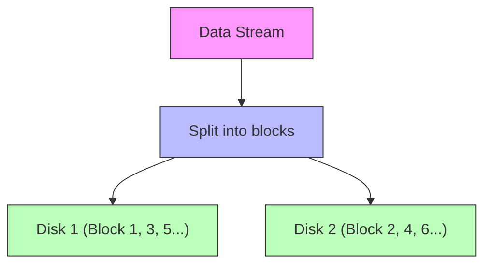
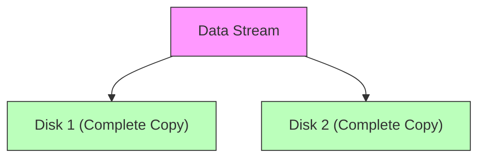
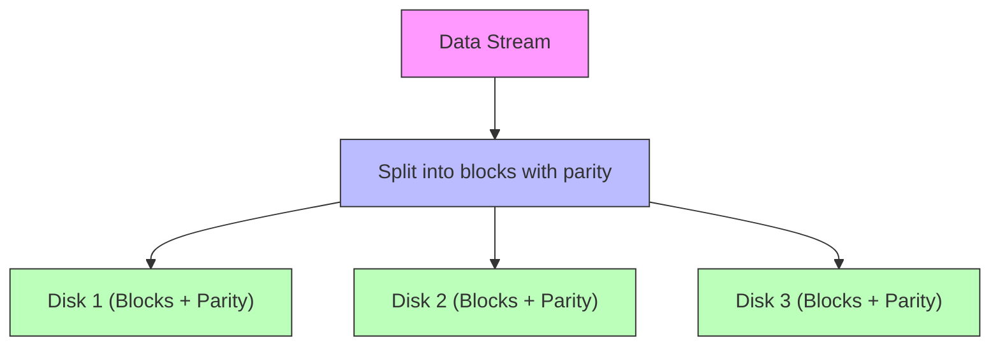
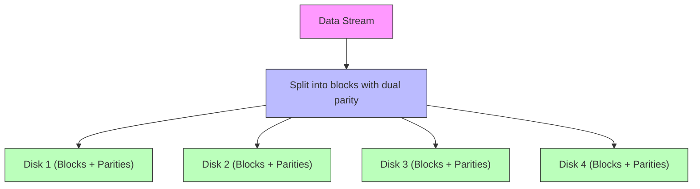
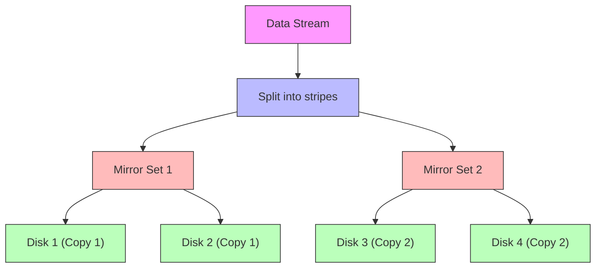

# RAID Levels

## Introduction

RAID (Redundant Array of Independent Disks) is a technology that combines multiple physical disk drives into a single logical unit to improve performance, increase storage capacity, and provide data redundancy. Initially developed in the 1980s at the University of California, Berkeley, RAID has become a fundamental component of modern storage systems in both consumer and enterprise environments.

The primary goals of RAID are:

- **Data Redundancy**: Protecting data from drive failures
- **Performance Improvement**: Increasing read/write speeds
- **Storage Capacity**: Efficiently utilizing disk space

In this article, we'll explore various RAID levels, how they function, and their practical applications. Understanding RAID is essential for anyone working with large data storage systems or looking to protect critical data.

## RAID Levels Overview

RAID is implemented in different "levels," each with its own approach to balancing the trade-offs between performance, data protection, and storage efficiency. Let's explore the most common RAID levels:

### RAID 0 (Striping)

RAID 0 focuses purely on performance by distributing data across multiple disks using a technique called "striping."

#### How It Works

Data is divided into blocks and written across multiple disks simultaneously. Instead of writing a file to a single disk, parts of the file are written to different disks in the array.



#### Advantages

- **Improved Performance**: Read and write operations can be performed in parallel across multiple disks
- **Full Storage Capacity**: Uses 100% of available disk space (no overhead)

#### Disadvantages

- **No Redundancy**: Failure of any single disk in the array results in complete data loss
- **Increased Risk**: The more disks in the array, the higher the chance of failure

#### Real-World Application

RAID 0 is suitable for:
- Non-critical data that requires high-speed access (e.g., video editing workspace)
- Temporary data processing where backups exist elsewhere
- Gaming PCs where load times are prioritized over data safety

### RAID 1 (Mirroring)

RAID 1 focuses on data protection through mirroring, where identical data is written to two or more disks simultaneously.

#### How It Works

Every write operation is performed on all disks in the array, creating exact copies (mirrors) of data across multiple drives.



#### Advantages

- **High Data Protection**: If one disk fails, the other contains an exact copy of the data
- **Improved Read Performance**: Multiple disks can serve read requests simultaneously

#### Disadvantages

- **Reduced Storage Efficiency**: Only 50% of total disk space is available for data storage
- **Limited Write Performance Improvement**: Write operations must be performed on all disks

#### Real-World Application

RAID 1 is suitable for:
- Critical system drives containing operating systems
- Financial data and records
- Small business servers where data loss cannot be tolerated

### RAID 5 (Striping with Parity)

RAID 5 provides a balance between performance, storage efficiency, and data protection by striping data across disks and adding parity information.

#### How It Works

Data is striped across multiple disks (like RAID 0), but parity information is also distributed across all disks. This parity data allows for the reconstruction of any single failed disk.



#### Parity Calculation Example

Parity is calculated using a bitwise XOR operation. For example:

```
Data Block 1: 10101010
Data Block 2: 11001100
Parity Block:  01100110 (XOR result)
```

If Block 2 fails, it can be reconstructed:
```
Data Block 1: 10101010
Parity Block:  01100110
Reconstructed: 11001100 (XOR result = original Block 2)
```

#### Advantages

- **Balance of Performance and Protection**: Good read performance with fault tolerance
- **Storage Efficiency**: Only one disk's worth of space is used for parity
- **Failure Tolerance**: Can survive a single disk failure

#### Disadvantages

- **Write Penalty**: Each write requires parity calculations
- **Recovery Impact**: Performance is severely degraded during disk reconstruction
- **Limited Fault Tolerance**: Cannot survive multiple simultaneous disk failures

#### Real-World Application

RAID 5 is suitable for:
- General-purpose servers
- File and application servers with moderate write activity
- NAS (Network Attached Storage) devices for small businesses

### RAID 6 (Striping with Double Parity)

RAID 6 extends RAID 5 by adding a second parity block, allowing the array to survive the failure of two disks simultaneously.

#### How It Works

Similar to RAID 5, but with two independent parity calculations distributed across all disks in the array.



#### Advantages

- **Enhanced Data Protection**: Can survive two simultaneous disk failures
- **Rebuild Safety**: Provides protection during the vulnerable rebuild process
- **Storage Efficiency**: Better than mirroring for large arrays

#### Disadvantages

- **Higher Write Penalty**: Dual parity calculations impact write performance
- **Increased Complexity**: More complex parity calculations
- **Space Overhead**: Two disks' worth of space used for parity

#### Real-World Application

RAID 6 is suitable for:
- Large-capacity storage arrays (where rebuild times are long)
- Critical data storage with high availability requirements
- Archival systems and backup targets

### RAID 10 (1+0: Mirroring and Striping)

RAID 10 combines the mirroring of RAID 1 with the striping of RAID 0 to provide both performance and redundancy.

#### How It Works

Data is first mirrored and then striped across the mirrored pairs. It requires a minimum of four disks.



#### Advantages

- **High Performance**: Fast read and write operations
- **Strong Data Protection**: Can survive multiple disk failures (if they occur in different mirror sets)
- **Fast Rebuild Times**: Only affected mirror set needs rebuilding

#### Disadvantages

- **Storage Efficiency**: Only 50% of total disk space is available for data storage
- **Cost**: Requires at least 4 disks, making it more expensive

#### Real-World Application

RAID 10 is suitable for:
- Database servers with high transaction rates
- Critical applications requiring both performance and reliability
- Email and messaging servers with constant read/write activity

## RAID Implementation Methods

RAID can be implemented in several ways:

### Hardware RAID

Hardware RAID uses a dedicated RAID controller card with its own processor to manage the RAID operations.

**Advantages:**
- Offloads RAID processing from the main CPU
- Generally better performance
- Battery backup options for write caching

**Example:**
A server with a dedicated RAID controller card managing 6 physical drives configured as RAID 6.

### Software RAID

Software RAID uses the operating system and CPU resources to manage RAID operations.

**Advantages:**
- Lower cost (no specialized hardware required)
- Flexibility in configuration
- Can be used across different storage types

**Implementation Example (Linux):**

To create a RAID 5 array in Linux using the `mdadm` utility:

```bash
# Create a RAID 5 array with 3 disks and 1 spare
sudo mdadm --create --verbose /dev/md0 --level=5 --raid-devices=3 /dev/sdb /dev/sdc /dev/sdd --spare-devices=1 /dev/sde

# Format the array with a filesystem
sudo mkfs.ext4 /dev/md0

# Mount the array
sudo mount /dev/md0 /mnt/raid5
```

## Choosing the Right RAID Level

Selecting the appropriate RAID level depends on your specific requirements. Consider these factors:

1. **Data Importance**: How critical is your data?
2. **Performance Needs**: Read vs. write performance priorities
3. **Storage Efficiency**: How much usable space do you need?
4. **Budget Constraints**: Cost of drives and controllers
5. **Recovery Time**: How quickly can you afford to rebuild after a failure?

### Decision Guide

| RAID Level | Data Protection | Performance | Storage Efficiency | Minimum Disks |
|------------|----------------|-------------|-------------------|---------------|
| RAID 0     | None           | Excellent   | 100%              | 2             |
| RAID 1     | Good           | Good Read   | 50%               | 2             |
| RAID 5     | Fair           | Good        | (n-1)/n           | 3             |
| RAID 6     | Excellent      | Good Read   | (n-2)/n           | 4             |
| RAID 10    | Very Good      | Excellent   | 50%               | 4             |

## Practical RAID Implementation

Let's look at a practical example of implementing a RAID system for a small business server:

### Scenario: Small Business File Server

**Requirements:**
- Store critical business documents
- Support 20 simultaneous users
- Balance performance and data protection
- Budget for 6 drives

**Solution: RAID 6 Implementation**

With 6 drives in RAID 6:
- Total raw capacity: 6 × 4TB = 24TB
- Usable capacity: 4 × 4TB = 16TB (2 drives used for parity)
- Protection: Can survive failure of any 2 drives
- Performance: Good read performance, acceptable write performance

**Monitoring and Maintenance:**

Regular maintenance is crucial for any RAID system:

```bash
# Check RAID status in Linux
sudo mdadm --detail /dev/md0

# Check RAID status in Windows Server (using PowerShell)
Get-VirtualDisk | Get-StorageReliabilityCounter | Format-Table DeviceId, ReadErrorsTotal, WriteErrorsTotal
```

## Common RAID Misconceptions

1. **"RAID is a backup"**: RAID provides redundancy against disk failure, not protection against accidental deletion, ransomware, or other data loss scenarios.

2. **"Higher RAID numbers are better"**: The RAID level number doesn't indicate quality or superiority—each serves different purposes.

3. **"RAID rebuilds are quick and safe"**: Rebuilding large modern drives can take days, during which the array is vulnerable to additional failures.

## Summary

RAID technology offers various approaches to balancing performance, data protection, and storage efficiency. Understanding the different RAID levels helps you make informed decisions about your storage infrastructure:

- **RAID 0**: Maximum performance, no data protection
- **RAID 1**: Simple data protection through mirroring
- **RAID 5**: Balance of performance, protection, and efficiency
- **RAID 6**: Enhanced protection with dual parity
- **RAID 10**: High performance with strong protection

Remember that while RAID provides protection against disk failures, it is not a substitute for proper backup strategies. A comprehensive data protection plan should include both RAID for hardware failure protection and regular backups for protection against other types of data loss.

## Practice Exercises

1. Calculate the usable storage capacity for the following RAID configurations using 6TB drives:
   - 4 drives in RAID 0
   - 4 drives in RAID 5
   - 6 drives in RAID 6
   - 8 drives in RAID 10

2. For a database server that performs many random read and write operations, which RAID level would you recommend and why?

3. Design a storage solution for a video editing workstation that needs both performance and some level of data protection.

## Additional Resources

- [Storage Networking Industry Association (SNIA)](https://www.snia.org/)
- [RAID Performance Calculator](https://wintelguy.com/raidperf.pl)
- Books:
  - "Storage Systems: Organization, Performance, Coding, Reliability and Their Data Processing" by Ningfang Mi
  - "Information Storage and Management" by EMC Education Services