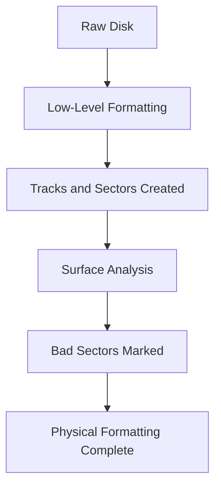
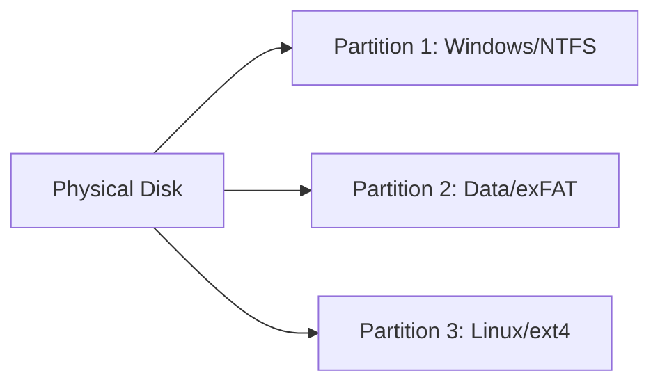

# Disk Formatting

## Introduction

Disk formatting is a fundamental process that prepares storage media (like hard drives, SSDs, or USB drives) for data storage. Think of it as preparing a blank canvas before you start painting. Without proper formatting, a storage device cannot efficiently store or retrieve data. This process establishes the underlying structure that your operating system uses to organize files.

Whether you're setting up a new computer, reinstalling an operating system, or simply preparing a storage device for use, understanding disk formatting is essential knowledge for any aspiring programmer or computer user.

## What is Disk Formatting?

Disk formatting is the process of preparing a data storage device such as a hard disk drive, solid-state drive, or USB flash drive for initial use. This process involves several key operations:

1. **Creating a file system**: Establishes how data will be organized, stored, and retrieved
2. **Setting up partitions**: Divides the storage space into logical sections
3. **Marking bad sectors**: Identifies and marks damaged areas of the disk to prevent data corruption
4. **Creating root directories**: Establishes the initial folder structure

## Types of Formatting

There are two main types of formatting operations:

### Low-Level Formatting

Low-level formatting (also called physical formatting) is the most basic form of disk preparation. It:

- Divides the disk into basic physical storage units called sectors
- Creates the sector headers and trailers used to identify the beginning and end of each sector
- Sets up track boundaries and sector addressing
- Performs surface analysis to mark bad sectors

In modern systems, low-level formatting is typically performed by manufacturers and is rarely needed or available to end users.



### High-Level Formatting

High-level formatting (also called logical formatting) is what most users think of as "formatting." It:

- Creates a file system (FAT32, NTFS, exFAT, ext4, etc.)
- Sets up the root directory and file allocation tables
- Creates partition tables if needed
- Prepares the disk for actual data storage

This is the formatting type most users perform through their operating system.

## Common File Systems

When formatting a disk, you'll need to choose a file system. Popular file systems include:

| File System | Primarily Used By | Max File Size | Max Volume Size | Features |
|-------------|-------------------|---------------|-----------------|----------|
| FAT32 | Windows, cross-platform | 4GB | 32TB | Simple, widely compatible |
| NTFS | Windows | 16TB | 256TB | Permissions, journaling, encryption |
| exFAT | Cross-platform | 16EB | 128PB | Large file support, simpler than NTFS |
| ext4 | Linux | 16TB | 1EB | Journaling, efficient for small files |
| APFS | macOS | 8EB | 8EB | Optimized for SSDs, snapshots |
| HFS+ | Older macOS | 8EB | 8EB | Journaling, older Apple standard |

## Formatting Process in Different Operating Systems

### Windows

In Windows, you can format a disk using the Disk Management tool or through Command Prompt.

Using Disk Management:
1. Right-click on "This PC" and select "Manage"
2. Go to "Disk Management"
3. Right-click on the partition you want to format
4. Select "Format" and choose your file system (typically NTFS)

Using Command Prompt:

```bash
format E: /fs:ntfs /q
```

This command formats drive E: with the NTFS file system using quick format (`/q`).

For more advanced formatting and partitioning, you can use the `diskpart` utility:

```bash
diskpart
list disk
select disk 1
clean
create partition primary
format fs=ntfs quick
assign letter=E
```

### Linux

In Linux, you can use command-line tools like `fdisk`, `parted`, or `mkfs`:

To create partitions:

```bash
sudo fdisk /dev/sdb
```

To format the partition with a file system:

```bash
sudo mkfs.ext4 /dev/sdb1
```

For a graphical interface, tools like GParted provide similar functionality.

### macOS

In macOS, you can use the Disk Utility application:

1. Open Disk Utility from Applications > Utilities
2. Select the disk or volume
3. Click "Erase"
4. Choose a format (typically APFS for newer systems or Mac OS Extended for older ones)
5. Click "Erase" to format

Via Terminal, you can use the `diskutil` command:

```bash
diskutil eraseDisk APFS "MyDisk" /dev/disk2
```

## Quick Format vs. Full Format

When formatting, you'll often have the option to perform a quick format or a full format:

- **Quick Format**: Only creates a new file system but doesn't scan for bad sectors. The data remains on the disk but is marked as deleted (and thus recoverable with special tools).
- **Full Format**: Creates a new file system and scans the entire disk for bad sectors, which can take hours for large drives. It may also overwrite all data with zeros, making recovery more difficult.

## Partitioning Before Formatting

Before formatting, you may want to partition your disk. Partitioning divides a physical disk into logical sections, allowing you to:

- Install multiple operating systems
- Separate system files from user data
- Use different file systems on the same physical disk



## Practical Example: Creating a Bootable USB Drive

Let's walk through a practical example of formatting a USB drive to make it bootable:

### In Windows (using Command Prompt):

```bash
diskpart
list disk
select disk 2  # Replace 2 with your USB drive number
clean
create partition primary
select partition 1
active
format fs=fat32 quick
assign
exit
```

After formatting, you can use tools like Rufus or the Windows Media Creation Tool to make the drive bootable with an operating system installer.

## Common Formatting Errors and Solutions

| Error | Possible Cause | Solution |
|-------|----------------|----------|
| "The disk is write-protected" | Physical write protection switch | Toggle the physical switch on the drive if present |
| "The format did not complete successfully" | Bad sectors or disk damage | Try a different USB port or use disk checking tools |
| "Windows cannot format this drive" | Incorrect file system choice or disk errors | Try a different format tool or check disk for errors |
| "Format operation taking too long" | Large disk size or many bad sectors | Consider using quick format or disk checking utilities first |

## Data Recovery After Formatting

It's important to note that formatting a disk doesn't completely erase the data. When you format a disk:

1. A new file system is created
2. The old file allocation tables are removed
3. The space is marked as available for new data

Until new data is written over the old data, specialized recovery software can often retrieve files. If you've accidentally formatted a disk, immediately stop using it and consider using data recovery tools or professional services.

## Security Considerations When Formatting

If you're disposing of or repurposing a disk that contained sensitive information, formatting alone is not enough. Consider:

- **Secure Erase**: For SSDs, using the manufacturer's secure erase tool
- **Multiple Overwrites**: For HDDs, using tools that write random data multiple times
- **Physical Destruction**: For ultimate security, physically destroying the storage media

## Summary

Disk formatting is a fundamental process that prepares storage media for use by creating the necessary structures for filing systems to operate. We've explored:

- The difference between low-level and high-level formatting
- Common file systems and their properties
- How to format disks in different operating systems
- Partitioning concepts and their relationship to formatting
- Practical applications and common troubleshooting tips

Understanding disk formatting gives you important insights into how computers organize and store data, which is essential knowledge for any programmer or IT professional.

## Practice Exercises

1. **Experiment**: Format a USB drive with different file systems (FAT32, NTFS, exFAT) and compare performance when copying large files vs. many small files.

2. **Research**: Investigate the differences between modern file systems like APFS, ext4, and NTFS. What advantages does each provide?

3. **Project**: Create a multi-boot USB drive with partitions for different operating systems.

4. **Challenge**: Write a simple script (in your preferred language) to detect and report the file system type of connected drives.

## Further Reading

- File system internals and design principles
- Advanced partitioning schemes like GPT vs. MBR
- RAID configurations and their impact on formatting
- Modern storage technologies and their specialized formatting requirements