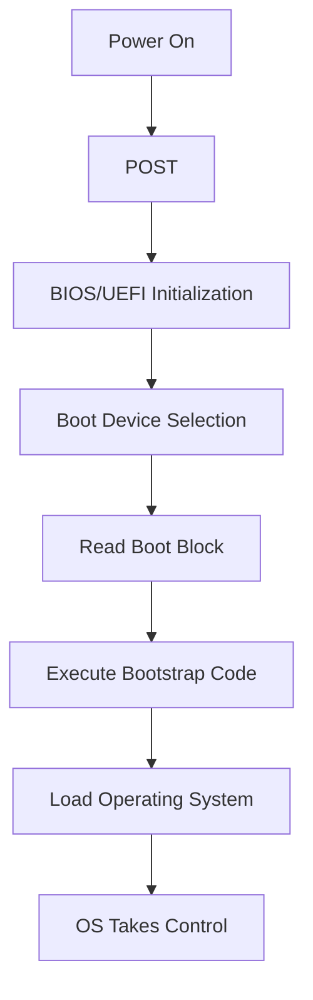

# Boot Block

## Introduction

When you press the power button on your computer, a fascinating sequence of events begins before you see your operating system's familiar interface. One crucial component in this process is the **boot block** - a special area of secondary storage that helps your computer "wake up" and load the operating system. This article explores what boot blocks are, how they work, and why they're essential to your computer's startup sequence.

## What is a Boot Block?

A **boot block** is a small, specific section of a storage device (like a hard drive or SSD) that contains the initial code needed to bootstrap (start up) a computer system. It's the first area of the storage device that gets read when a computer starts.

Think of the boot block as a startup manual that tells your computer where to find and how to load the operating system. Without it, your computer wouldn't know how to proceed after the initial power-on.

## The Boot Process: Step by Step

Let's break down what happens during the boot process:

1. **Power-On Self-Test (POST)**: When you turn on your computer, it first performs a basic hardware check.
2. **BIOS/UEFI Initialization**: The BIOS (Basic Input/Output System) or UEFI (Unified Extensible Firmware Interface) initializes.
3. **Boot Device Selection**: The system determines which storage device to boot from.
4. **Boot Block Reading**: The system reads the boot block from the selected device.
5. **Bootstrap Code Execution**: The code in the boot block executes to load the operating system.



## Types of Boot Blocks

### Master Boot Record (MBR)

The **Master Boot Record (MBR)** is a traditional boot block format used in many systems. It's located at the very first sector of a disk.

Key characteristics of MBR:
- Located at the first sector (sector 0) of the disk
- Size of 512 bytes
- Contains:
  - Bootstrap code (446 bytes)
  - Partition table (64 bytes)
  - Boot signature (2 bytes)

Here's what an MBR structure looks like:

```
+-------------------+
| Bootstrap Code    |
| (446 bytes)       |
+-------------------+
| Partition Table   |
| (64 bytes)        |
+-------------------+
| Boot Signature    |
| (2 bytes)         |
+-------------------+
```

### GUID Partition Table (GPT)

Modern systems often use the **GUID Partition Table (GPT)** format, which is part of the UEFI specification. It provides improvements over the MBR format.

Key characteristics of GPT:
- Supports disks larger than 2TB
- Allows more than 4 primary partitions
- Contains redundant copies for better reliability

## How to View and Work with Boot Blocks

While you shouldn't directly modify boot blocks unless you really know what you're doing, you can view and work with them using specialized tools.

### Viewing MBR Data (Linux Example)

On a Linux system, you can use the `dd` command to read the MBR:

```bash
sudo dd if=/dev/sda bs=512 count=1 | hexdump -C
```

This command reads the first 512 bytes (the MBR) from the disk `/dev/sda` and displays it in hexadecimal format.

### Creating a Backup of Your MBR

It's a good practice to back up your MBR before making any system changes:

```bash
sudo dd if=/dev/sda of=mbr_backup.bin bs=512 count=1
```

This creates a file called `mbr_backup.bin` containing your MBR data.

## Boot Block in Different Operating Systems

### Windows

In Windows systems, the boot block starts a chain of loaders:
1. The MBR or GPT boot code loads the Volume Boot Record (VBR)
2. The VBR loads the Windows Boot Manager
3. The Windows Boot Manager loads the Windows operating system

### Linux

Linux systems follow a similar process:
1. The MBR or GPT boot code loads the bootloader (typically GRUB)
2. GRUB loads the Linux kernel
3. The kernel initializes the rest of the operating system

### macOS

Apple's macOS uses:
1. Boot.efi (the boot loader)
2. The boot loader finds and loads the kernel
3. The kernel initializes the system

## Common Issues with Boot Blocks

When boot blocks become corrupted or damaged, you might encounter these common problems:

1. **"Operating System Not Found" errors**
2. **"Missing Boot Manager" messages**
3. **"Invalid Partition Table" warnings**

These issues often require repair tools or, in worst cases, recovery from backups.

## Practical Example: Repairing a Corrupted MBR in Windows

If your Windows system has a corrupted MBR, you can repair it using the Windows Recovery Environment:

1. Boot from Windows installation media
2. Select "Repair your computer"
3. Choose "Troubleshoot" → "Command Prompt"
4. Run the following commands:

```cmd
bootrec /fixmbr
bootrec /fixboot
bootrec /rebuildbcd
```

These commands will repair the Master Boot Record, write a new boot sector, and rebuild the Boot Configuration Data.

## The Evolution of Boot Processes

Boot processes have evolved significantly over time:

- **Early Systems**: Simple boot blocks that directly loaded the OS
- **BIOS + MBR**: The standard for decades
- **UEFI + GPT**: Modern approach with more features and security
- **Secure Boot**: Added protection against bootkit malware

Each evolution has brought improvements in reliability, speed, and security.

## Security Considerations

Boot blocks are critical security points in your system:

- **Bootkit malware** specifically targets boot blocks to gain control before the OS loads
- **Secure Boot** in UEFI systems verifies the boot process is not tampered with
- **Disk encryption** often uses secure boot mechanisms to protect encryption keys

## Summary

The boot block is a fundamental component in the computer startup process. It's the critical first step that bridges hardware initialization and operating system loading. Understanding boot blocks helps you:

- Troubleshoot startup problems
- Recover from boot failures
- Improve system security
- Understand the foundations of operating system design

While most users never need to directly interact with boot blocks, the concepts are vital for anyone wanting to understand how computers work at a fundamental level.

## Additional Resources and Exercises

### Further Learning

- Research the differences between BIOS and UEFI boot processes
- Learn about multi-boot configurations
- Explore tools like GRUB, Rufus, or EasyBCD

### Practice Exercises

1. **Easy**: Create a bootable USB drive using a tool like Rufus
2. **Intermediate**: Set up a dual-boot system with two operating systems
3. **Advanced**: Use virtualization software to explore different boot configurations safely

### Challenge Questions

1. What happens if the boot block becomes corrupted?
2. How does the boot process differ between a traditional hard drive and a solid-state drive?
3. Why might a system with UEFI boot faster than one with legacy BIOS?

Remember that while exploring boot processes can be educational, always make backups before modifying any boot-related components on production systems!