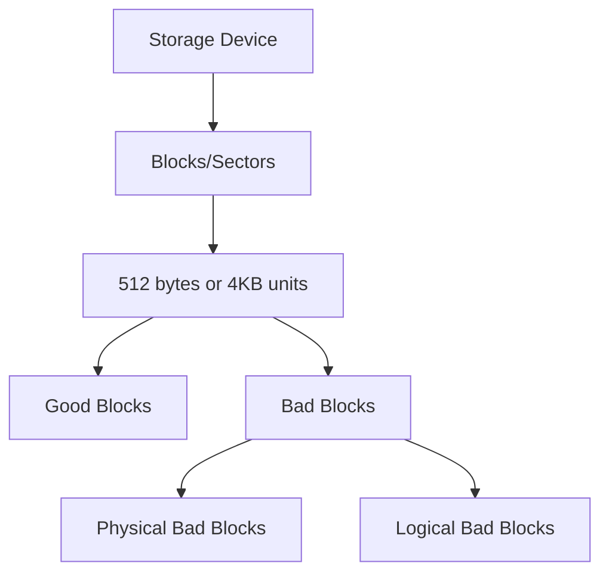

# Bad Blocks

## Introduction

When working with computers, you may occasionally encounter terms like "bad sectors" or "bad blocks." These terms refer to portions of storage media that have become damaged or unreliable. Understanding what bad blocks are, how they occur, and how to manage them is crucial knowledge for anyone working with computer systems.

In this tutorial, we'll explore the concept of bad blocks in secondary storage devices (like hard drives and solid-state drives), their causes, detection methods, and management techniques.

## What Are Bad Blocks?

Bad blocks are small units of storage on a secondary storage device that can no longer be reliably used to store data. They can occur on various types of storage media, including:

- Hard Disk Drives (HDDs)
- Solid-State Drives (SSDs)
- USB flash drives
- Memory cards
- Optical media (CDs, DVDs, Blu-ray discs)

Storage devices are divided into blocks (sometimes called sectors in HDDs), which are the smallest addressable units of storage. A typical block size is 512 bytes or 4 kilobytes, depending on the device.



## Types of Bad Blocks

Bad blocks generally fall into two categories:

### 1. Physical Bad Blocks

Physical bad blocks result from actual physical damage to the storage media. This damage is permanent and cannot be repaired.

Causes include:
- Manufacturing defects
- Wear and tear over time
- Physical damage to the drive (drops, impacts)
- Exposure to extreme temperatures
- Power surges or improper shutdowns
- Age-related deterioration of the storage media

### 2. Logical Bad Blocks

Logical bad blocks are not physically damaged but have become unreliable due to software-related issues. These can sometimes be repaired.

Causes include:
- File system corruption
- Improper shutdown of the system
- Software errors during read/write operations
- Malware or virus attacks
- Driver or firmware issues

## How Bad Blocks Affect Your System

When a bad block develops, several problems can arise:

- **Data Loss**: Information stored in bad blocks may become corrupted or completely inaccessible.
- **Performance Degradation**: Your system may slow down as it attempts to read data from bad blocks.
- **System Instability**: If system files are affected, your operating system might crash or fail to boot.
- **Application Errors**: Programs might crash when trying to access files stored in bad blocks.

## Bad Block Detection

Modern storage devices include mechanisms to detect and manage bad blocks. Here are some common methods:

### S.M.A.R.T. Monitoring

S.M.A.R.T. (Self-Monitoring, Analysis, and Reporting Technology) is a monitoring system included in most modern storage devices. It tracks various parameters to determine the health of the drive.

```jsx
// Example code to check S.M.A.R.T. status in Node.js using 'node-disk-manager'
const diskManager = require('node-disk-manager');

async function checkDriveHealth() {
  try {
    const drives = await diskManager.listDrives();
    const myDrive = drives[0]; // First drive in the system
    
    const smartData = await diskManager.getSmartData(myDrive.device);
    
    console.log('Drive Health Status:', smartData.health);
    console.log('Reallocated Sectors Count:', 
      smartData.attributes.find(attr => attr.name === 'Reallocated_Sector_Ct').value);
    
  } catch (error) {
    console.error('Error checking drive health:', error);
  }
}

checkDriveHealth();
```

Output:
```
Drive Health Status: PASSED
Reallocated Sectors Count: 0
```

### Bad Block Scanning Tools

Various tools can scan your drives for bad blocks. Here's an example using the Linux `badblocks` command:

```bash
# Read-only test (safe but not comprehensive)
sudo badblocks -v /dev/sda

# Destructive read-write test (will destroy data!)
sudo badblocks -wsv /dev/sda
```

Output:
```
Checking blocks 0 to 1953525167
Checking for bad blocks (read-only test): done
Pass completed, 0 bad blocks found. (0/0/0 errors)
```

### Windows Check Disk Utility

On Windows, you can use the built-in CHKDSK utility:

```powershell
# Basic scan
chkdsk D:

# Scan with attempt to recover bad sectors
chkdsk D: /r
```

Output:
```
The type of the file system is NTFS.

Stage 1: Examining basic file system structure...
Stage 2: Examining file name linkage...
Stage 3: Examining security descriptors...
Cleaning up 104 unused index entries from index $SII of file 0x9.
Cleaning up 104 unused index entries from index $SDH of file 0x9.
Cleaning up 104 unused security descriptors.
CHKDSK discovered free space marked as allocated in the
master file table (MFT) bitmap.
CHKDSK discovered free space marked as allocated in the volume bitmap.
Windows has made corrections to the file system.
No further action is required.

 976,760,831 KB total disk space.
  31,803,344 KB in 113,303 files.
     130,596 KB in 30,105 indexes.
          0 KB in bad sectors.
     428,548 KB in use by the system.
     262,144 KB occupied by the log file.
 944,398,343 KB available on disk.

      4,096 bytes in each allocation unit.
 244,190,207 total allocation units on disk.
 236,099,585 allocation units available on disk.
```

## Bad Block Management

Storage devices employ several strategies to manage bad blocks:

### 1. Block Remapping

Modern storage devices include spare blocks that can replace bad ones. When a bad block is detected:

1. The data is read from the failing block (if possible)
2. The data is written to a spare block
3. The bad block is marked as unusable
4. Future read/write operations are redirected to the new block


### 2. Error Correction Codes (ECC)

Storage devices use ECC to detect and correct minor errors. When data is written, additional error-correction bits are stored. When data is read back, these bits can be used to detect and sometimes correct errors.

```jsx
// Simplified demonstration of ECC concept
function simulateECC() {
  // Original data
  const originalData = '10101010';
  
  // Calculate parity bits (very simplified ECC)
  let parityBit = 0;
  for (let i = 0; i < originalData.length; i++) {
    parityBit ^= parseInt(originalData[i]);
  }
  
  // Store data with ECC
  const storedData = originalData + parityBit;
  console.log('Stored data with ECC:', storedData);
  
  // Simulate reading data with a single-bit error
  let retrievedData = storedData.split('');
  retrievedData[3] = retrievedData[3] === '0' ? '1' : '0'; // Flip a bit
  retrievedData = retrievedData.join('');
  console.log('Retrieved data with error:', retrievedData);
  
  // Check if error detected
  let calculatedParity = 0;
  for (let i = 0; i < retrievedData.length - 1; i++) {
    calculatedParity ^= parseInt(retrievedData[i]);
  }
  
  const errorDetected = (calculatedParity !== parseInt(retrievedData[retrievedData.length - 1]));
  console.log('Error detected:', errorDetected);
}

simulateECC();
```

Output:
```
Stored data with ECC: 101010100
Retrieved data with error: 101110100
Error detected: true
```

### 3. Bad Block Table

Storage devices maintain a bad block table (BBT) that records the locations of known bad blocks. This table is consulted during read/write operations to avoid using these blocks.

## Practical Example: Handling Bad Blocks in a File Backup System

Here's a simplified example of how you might handle bad blocks when implementing a file backup system:

```jsx
const fs = require('fs');
const path = require('path');

function backupFileWithBadBlockHandling(sourcePath, destinationPath) {
  return new Promise((resolve, reject) => {
    const readStream = fs.createReadStream(sourcePath);
    const writeStream = fs.createWriteStream(destinationPath);
    
    let totalBytes = 0;
    let errorCount = 0;
    
    readStream.on('data', (chunk) => {
      totalBytes += chunk.length;
      console.log(`Read ${chunk.length} bytes. Total: ${totalBytes} bytes`);
    });
    
    readStream.on('error', (error) => {
      console.error(`Read error at position ${totalBytes}: ${error.message}`);
      
      // Log the error but continue if possible
      errorCount++;
      
      // If the error is fatal, stop the process
      if (errorCount > 10) {
        readStream.destroy();
        writeStream.destroy();
        reject(new Error('Too many read errors, likely bad blocks encountered'));
      }
    });
    
    writeStream.on('error', (error) => {
      console.error(`Write error: ${error.message}`);
      readStream.destroy();
      reject(error);
    });
    
    writeStream.on('finish', () => {
      console.log(`Backup completed. Total bytes: ${totalBytes}, Errors: ${errorCount}`);
      
      if (errorCount > 0) {
        console.warn('Backup completed with errors. Some data may be corrupted.');
        resolve({ success: true, withErrors: true, bytesTransferred: totalBytes });
      } else {
        resolve({ success: true, withErrors: false, bytesTransferred: totalBytes });
      }
    });
    
    // Pipe the streams, but handle errors
    readStream.pipe(writeStream);
  });
}

// Usage example
async function main() {
  try {
    const result = await backupFileWithBadBlockHandling(
      'importantData.db',
      'backup/importantData_backup.db'
    );
    
    console.log('Backup result:', result);
    
    if (result.withErrors) {
      console.log('Running verification to check for data integrity issues...');
      // Implement verification logic here
    }
  } catch (error) {
    console.error('Backup failed:', error.message);
  }
}

main();
```

Output (successful scenario):
```
Read 65536 bytes. Total: 65536 bytes
Read 65536 bytes. Total: 131072 bytes
Read 65536 bytes. Total: 196608 bytes
Read 45123 bytes. Total: 241731 bytes
Backup completed. Total bytes: 241731, Errors: 0
Backup result: { success: true, withErrors: false, bytesTransferred: 241731 }
```

Output (with errors):
```
Read 65536 bytes. Total: 65536 bytes
Read 65536 bytes. Total: 131072 bytes
Read error at position 131072: Input/output error
Read 65536 bytes. Total: 196608 bytes
Read 45123 bytes. Total: 241731 bytes
Backup completed. Total bytes: 241731, Errors: 1
Backup result: { success: true, withErrors: true, bytesTransferred: 241731 }
Running verification to check for data integrity issues...
```

## Preventing Bad Blocks

While some bad blocks are inevitable over time, you can take steps to minimize their occurrence:

1. **Handle your storage devices carefully** to avoid physical damage
2. **Properly shut down your computer** rather than abruptly cutting power
3. **Use surge protectors** to prevent power-related damage
4. **Keep storage devices at appropriate temperatures**
5. **Regularly check the health** of your storage devices
6. **Create backups** of important data regularly
7. **Consider using RAID systems** for important data

## Real-World Impact: Bad Blocks in Critical Systems

Bad blocks can have serious consequences in critical systems. Consider this real-world scenario:

An e-commerce website deployed on a server with an aging storage system started experiencing intermittent outages. Customer transactions would occasionally fail, and database queries would time out. The operations team discovered that the storage system had developed numerous bad blocks in areas where the transaction log files were stored.

The solution involved:
1. Implementing real-time storage monitoring
2. Setting up a RAID array for redundancy
3. Establishing a more frequent backup schedule
4. Creating a disaster recovery plan
5. Eventually migrating to newer storage hardware

This example demonstrates the importance of proactive bad block management in production environments.

## Summary

Bad blocks are damaged or unreliable units of storage that can occur in any storage media. They can be caused by physical damage or logical errors, and they can lead to data loss, performance issues, and system instability.

Modern storage devices employ various strategies to detect and manage bad blocks, including S.M.A.R.T. monitoring, block remapping, and error correction codes. While some bad blocks are inevitable over time, proper handling and maintenance of storage devices can minimize their occurrence.

As a programmer, understanding bad blocks helps you design more robust applications that can gracefully handle storage-related failures and protect user data.

## Exercises

1. Write a simple program that creates a file and fills it with test data, then reads it back to verify integrity.
2. Research and compare different tools for bad block detection on your operating system.
3. Design a file system that includes redundancy to protect against data loss from bad blocks.
4. Implement a simple backup strategy that includes verification to detect corrupt backups caused by bad blocks.

## Additional Resources

- [Linux badblocks command documentation](https://man7.org/linux/man-pages/man8/badblocks.8.html)
- [Understanding S.M.A.R.T. attributes](https://en.wikipedia.org/wiki/S.M.A.R.T.)
- [Error detection and correction techniques](https://en.wikipedia.org/wiki/Error_detection_and_correction)