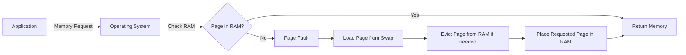

# Swap Space Management

## Introduction

When your computer runs out of physical memory (RAM), the operating system needs a backup plan. This is where **swap space** comes in. Swap space is a designated area on your computer's secondary storage (like your hard drive or SSD) that acts as an extension of your physical memory. It allows the operating system to temporarily move inactive data from RAM to disk, freeing up valuable physical memory for active processes.

Think of it like having an overflow desk when your main desk gets too cluttered. You don't access items on the overflow desk as quickly, but it prevents your main workspace from becoming unusable.

## What is Swap Space?

Swap space is a crucial component of virtual memory systems in modern operating systems. It enables computers to run more applications than would fit in physical RAM alone.

### Key Concepts

- **Virtual Memory**: The combination of physical RAM and swap space that appears as a single, contiguous memory space to applications
- **Page**: A fixed-size block of memory (typically 4KB)
- **Paging**: The process of moving pages between RAM and swap space
- **Page Fault**: Occurs when a program tries to access a page that is not currently in RAM

### How Swap Space Works



1. When an application requests memory, the operating system checks if the required data is in RAM
2. If found in RAM, the data is accessed directly (fast)
3. If not found in RAM (page fault):
   - The OS locates the data in swap space
   - If RAM is full, the OS selects a page to evict (using algorithms like LRU - Least Recently Used)
   - The OS writes the evicted page to swap if it has been modified
   - The OS reads the requested page from swap into RAM
   - The application can now access the data (but with added latency)

## Configuring Swap Space

Different operating systems handle swap space configuration differently. Let's look at common approaches:

### Linux Swap Configuration

In Linux, you can create and manage swap space using the command line. Here's how to check your current swap usage:

```bash
free -h
```

Example output:

```
              total        used        free      shared  buff/cache   available
Mem:          7.7Gi       4.2Gi       1.2Gi       625Mi       2.3Gi       2.6Gi
Swap:         2.0Gi       312Mi       1.7Gi
```

To create a new swap file:

```bash
# Create a 2GB swap file
sudo fallocate -l 2G /swapfile

# Set proper permissions
sudo chmod 600 /swapfile

# Format as swap
sudo mkswap /swapfile

# Enable the swap file
sudo swapon /swapfile

# Make it permanent by adding to /etc/fstab
echo '/swapfile none swap sw 0 0' | sudo tee -a /etc/fstab
```

### Windows Virtual Memory

In Windows, swap space is called "virtual memory" or "page file." To configure it:

1. Right-click on "This PC" or "My Computer" and select "Properties"
2. Click on "Advanced system settings"
3. Under the "Advanced" tab, click "Settings" in the "Performance" section
4. Go to the "Advanced" tab and click "Change" under "Virtual memory"
5. Configure the paging file size or let Windows manage it automatically

## Swap Space Performance Considerations

### Swap Space Size

How much swap space should you allocate? It depends on your system's workload and available RAM:

- **Traditional rule**: 2x your physical RAM (outdated for systems with large RAM)
- **Modern systems**: 
  - Systems with plenty of RAM (16GB+): 1-2GB swap space
  - Systems with limited RAM: 1x to 1.5x RAM
  - Hibernation support: At least 1x RAM to store memory state

### Swap Space Placement

For optimal performance:

- Place swap on a different physical disk than your operating system files
- SSDs provide faster swap performance than HDDs but can wear out faster
- Consider using multiple swap partitions spread across different disks for improved throughput

## Monitoring Swap Usage

Monitoring swap space usage helps identify memory issues before they affect performance.

### Linux Monitoring Tools

```bash
# Check swap usage
swapon --show

# Monitor swap activity
vmstat 1

# See which processes use swap
for file in /proc/*/status ; do awk '/VmSwap|Name/{printf $2 " " $3}END{ print ""}' $file; done | sort -k 2 -n -r | head -10
```

### Windows Monitoring

- Open Task Manager
- Go to the "Performance" tab
- Select "Memory" to see page file usage

## When Swapping Becomes a Problem

Excessive swapping can severely degrade system performance, a condition known as "thrashing." This occurs when the system spends more time swapping pages than executing applications.

Signs of swap-related performance issues:

- System becomes sluggish
- Disk activity remains high
- Applications take a long time to respond

Solutions:

1. **Add more RAM**: The most effective solution
2. **Close unused applications**: Free up physical memory
3. **Optimize application memory usage**: Fix memory leaks or excessive allocation
4. **Adjust swappiness** (Linux only): Control how aggressively the system uses swap

Example of adjusting swappiness in Linux:

```bash
# Check current swappiness (default is usually 60)
cat /proc/sys/vm/swappiness

# Set to a lower value (less swapping)
sudo sysctl vm.swappiness=10

# Make it permanent
echo 'vm.swappiness=10' | sudo tee -a /etc/sysctl.conf
```

## Practical Example: Memory-Intensive Application

Let's consider a practical example of a Python program that processes a large dataset:

```python
import numpy as np
import psutil
import os

# Function to print memory usage
def print_memory_usage():
    process = psutil.Process(os.getpid())
    memory_info = process.memory_info()
    print(f"Memory used: {memory_info.rss / 1024 / 1024:.2f} MB")

# Initial memory usage
print("Initial state:")
print_memory_usage()

# Create a large array (1GB)
print("
Allocating 1GB array...")
large_array = np.zeros((1024 * 1024 * 256), dtype=np.float32)  # ~1GB
print_memory_usage()

# Process the array
print("
Processing array...")
for i in range(0, len(large_array), 1024):
    large_array[i] = i
print_memory_usage()

# Free memory
print("
Freeing memory...")
del large_array
print_memory_usage()
```

Example output:

```
Initial state:
Memory used: 28.45 MB

Allocating 1GB array...
Memory used: 1053.67 MB

Processing array...
Memory used: 1053.68 MB

Freeing memory...
Memory used: 28.92 MB
```

When running this program on a system with limited RAM, the operating system might need to use swap space to accommodate the large array. This would result in slower performance compared to a system where the entire array fits in RAM.

## Best Practices for Swap Management

1. **Ensure adequate swap space**: Have enough swap to handle peak loads
2. **Monitor swap usage**: Regular monitoring helps identify issues early
3. **Avoid overcommitting memory**: Be realistic about your system's capabilities
4. **Optimize applications**: Fix memory leaks and optimize memory usage
5. **Use appropriate placement**: Put swap on fast storage separate from system files
6. **Consider disabling swap for specific workloads**: Some database systems perform better without swap

## Summary

Swap space is a critical component of virtual memory systems that allows computers to run more applications than would fit in physical RAM. It works by temporarily moving inactive memory pages to disk, freeing up RAM for active processes.

While swap space provides flexibility, it comes with a performance cost since disk access is much slower than RAM. Proper configuration, monitoring, and management of swap space are essential for maintaining system performance and stability.

## Additional Exercises

1. Measure and compare the performance of a memory-intensive application with different swap space configurations.
2. Write a script to monitor swap usage and alert when it exceeds a threshold.
3. Research and compare how different operating systems implement swap space.
4. Experiment with different swap space sizes and locations to find the optimal configuration for your system.
5. Implement a simple page replacement algorithm simulator to understand how the OS decides which pages to swap.