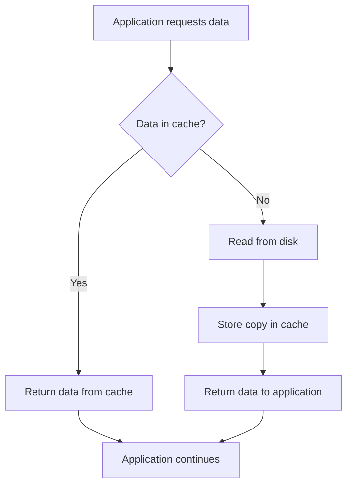
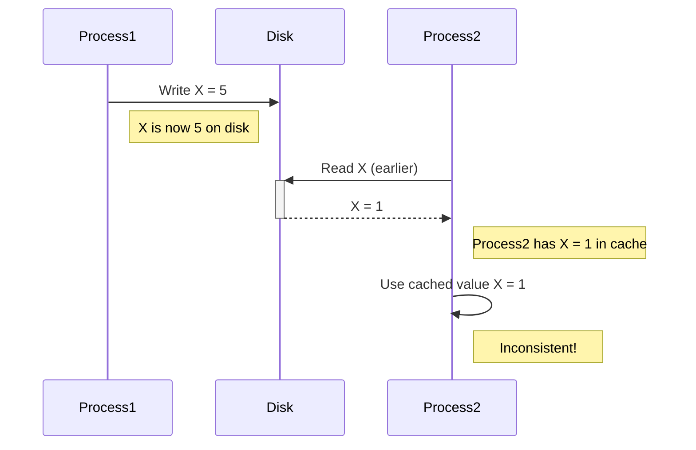
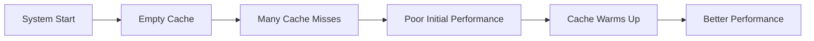

# Disk Caching

## Introduction

Have you ever wondered why your computer seems to run faster after you've used certain programs or files a few times? One of the key mechanisms behind this apparent "speed-up" is **disk caching**. Disk caching is a technique that temporarily stores frequently or recently accessed data from your hard drive in a faster memory location (usually RAM), reducing the need to repeatedly read from or write to the slower physical disk.

In this guide, we'll explore how disk caching works, why it's crucial for system performance, and how it's implemented in modern computing systems.

## What is Disk Caching?

Disk caching is a performance optimization technique that bridges the speed gap between fast system memory (RAM) and slower secondary storage devices (like HDDs and SSDs).

### The Memory-Storage Speed Gap

To understand why caching is important, let's look at typical access speeds:

| Storage Type | Approximate Access Time |
|--------------|-------------------------|
| CPU Cache    | 0.5-15 nanoseconds      |
| RAM          | 50-100 nanoseconds      |
| SSD          | 10-100 microseconds     |
| HDD          | 5-10 milliseconds       |

As you can see, reading from an HDD can be 100,000 times slower than reading from RAM! This enormous difference creates a bottleneck in system performance.

## How Disk Caching Works

Disk caching operates on a simple principle: **keep frequently accessed data in fast memory**.



The process works as follows:

1. When data is first requested, it must be read from the disk
2. This data is then stored in the cache (in RAM)
3. Future requests for the same data can be served directly from the cache
4. The system appears faster because it avoids slow disk operations

## Types of Disk Caching

There are several types of disk caching mechanisms:

### Read Caching

Read caching focuses on speeding up data retrieval operations:

```javascript
// Pseudocode for read caching
function readData(address) {
  if (cache.contains(address)) {
    // Cache hit - fast path
    return cache.get(address);
  } else {
    // Cache miss - slow path
    data = disk.read(address);
    cache.store(address, data);
    return data;
  }
}
```

### Write Caching

Write caching improves write operations in two main ways:

1. **Write-Through Cache**: Data is written to both the cache and disk simultaneously.
2. **Write-Back Cache**: Data is initially written only to the cache and later "flushed" to disk.

```javascript
// Pseudocode for write-back caching
function writeData(address, data) {
  cache.store(address, data);
  cache.markDirty(address);
  
  // Later, a background process flushes dirty data
  function flushCache() {
    for (entry of cache.getDirtyEntries()) {
      disk.write(entry.address, entry.data);
      cache.clearDirty(entry.address);
    }
  }
}
```

### Cache Eviction Policies

When the cache becomes full, the system must decide which data to keep and which to discard. Common policies include:

- **Least Recently Used (LRU)**: Discards the least recently accessed items first
- **First In, First Out (FIFO)**: Discards the oldest items first
- **Least Frequently Used (LFU)**: Discards the least used items first

## Cache Coherence

A critical issue in caching is maintaining consistency between the cache and the actual disk. This becomes particularly important in systems with multiple caches (like multi-core processors or distributed systems).

For example, if one process writes data to the disk but another process has the old version cached, we have a coherence problem.



Modern operating systems use various mechanisms to maintain cache coherence, including:

- Cache invalidation signals
- Write-through policies for shared data
- Controlled cache flushes

## Practical Implementation in Operating Systems

Let's look at how disk caching is implemented in major operating systems:

### Linux Page Cache

Linux uses a unified page cache to cache disk data:

```bash
# Check the current page cache usage
$ free -m
              total        used        free      shared  buff/cache   available
Mem:          15879        5204        1134         619        9541       10055

# Clear page cache (requires root)
$ sudo sh -c "echo 3 > /proc/sys/vm/drop_caches"
```

The "buff/cache" column shows how much memory is being used for disk caching.

### Windows Disk Caching

Windows implements several layers of caching:

```powershell
# View memory usage including cache in Windows
> Get-CimInstance -ClassName Win32_OperatingSystem | Select-Object TotalVisibleMemorySize, FreePhysicalMemory
```

You can also adjust caching behavior for specific drives:

1. Open Disk properties
2. Navigate to Hardware tab
3. Select Properties > Policies
4. Choose between "Better performance" (more caching) and "Quick removal" (less caching)

## Optimizing Applications for Caching

As a programmer, you can optimize your applications to work better with disk caching:

### Sequential Access

Reading or writing data sequentially improves cache efficiency because the system can predict which blocks will be needed next:

```c
// Efficient sequential access
int sum = 0;
for (int i = 0; i < array_size; i++) {
    sum += array[i];  // Reading array elements in order
}
```

### Minimize Random Access

Random access patterns can defeat caching mechanisms:

```c
// Inefficient random access
int sum = 0;
for (int i = 0; i < iterations; i++) {
    int random_index = rand() % array_size;
    sum += array[random_index];  // Unpredictable access pattern
}
```

### File I/O Buffering

Many programming languages provide buffered I/O to work efficiently with the disk cache:

```python
# Unbuffered - inefficient
with open("large_file.txt", "r") as f:
    for i in range(1000000):
        f.seek(i)
        char = f.read(1)
        # Process one byte at a time

# Buffered - efficient
with open("large_file.txt", "r") as f:
    content = f.read()  # Read entire file at once
    for char in content:
        # Process characters
```

## Real-World Applications

### Database Management Systems

Database systems rely heavily on caching to provide acceptable performance:

```sql
-- MySQL buffer pool configuration
SET GLOBAL innodb_buffer_pool_size = 4294967296; -- 4GB cache
```

### Web Browsers

Browsers cache web resources (HTML, images, CSS) on disk to speed up subsequent visits to the same website:

```javascript
// Using the Cache API in modern browsers
async function cacheResource(url) {
  const cache = await caches.open('my-cache');
  const response = await fetch(url);
  await cache.put(url, response);
}

async function getResource(url) {
  const cache = await caches.open('my-cache');
  const response = await cache.match(url);
  if (response) {
    return response; // Served from cache
  }
  return fetch(url); // Fetch from network
}
```

### Content Delivery Networks (CDNs)

CDNs cache web content across data centers worldwide, serving users from the nearest cache:

```html
<!-- Using a CDN to serve a JavaScript library -->
<script src="https://cdn.example.com/library.js"></script>
```

## Case Study: Monitoring Disk Cache Performance

Let's look at a simple case study of monitoring cache performance on a Linux system:

```bash
# Install tools (Ubuntu/Debian)
$ sudo apt-get install sysstat

# Monitor caching for 10 seconds
$ iostat -d -x 1 10

# Sample output:
Device            r/s     rkB/s   rrqm/s  %rrqm   w/s     wkB/s   wrqm/s  %wrqm   util
sda               0.00    0.00    0.00    0.00    27.00   108.00  0.00    0.00    2.40

# Cache hits/misses can be inferred from the ratio of logical to physical reads
```

In this output:
- `r/s` shows physical reads per second (cache misses)
- `w/s` shows physical writes per second

A well-functioning cache will show fewer physical reads as the cache warms up.

## Common Challenges with Disk Caching

### The Cold Cache Problem

When a system first starts up, the cache is empty (cold), resulting in poor initial performance:



### Cache Thrashing

When the working set of data is larger than the cache, the system may experience "thrashing" where it constantly evicts needed data:

```javascript
// Example of code that might cause cache thrashing
function processLargeArray() {
  const hugeArray = new Array(1000000000).fill(0); // Much larger than cache
  
  // Random access pattern
  for (let i = 0; i < 1000000; i++) {
    const idx1 = Math.floor(Math.random() * hugeArray.length);
    const idx2 = Math.floor(Math.random() * hugeArray.length);
    hugeArray[idx1] += hugeArray[idx2];
  }
}
```

## Summary

Disk caching is a fundamental technique that helps bridge the performance gap between fast memory and slower storage devices. By keeping frequently accessed data in faster memory, caching significantly improves system performance for most workloads.

Key points to remember:
- Disk caching stores frequently accessed data in RAM to avoid slow disk operations
- Different caching strategies (read caching, write-through, write-back) serve different needs
- Cache coherence ensures data consistency across the system
- Applications can be designed to work optimally with caching mechanisms
- Monitoring cache performance can help identify bottlenecks

## Exercises

1. Write a simple program to measure the performance difference between reading a file with and without system caching.
2. Research how to configure the disk cache size on your operating system and experiment with different settings.
3. Implement a simple LRU (Least Recently Used) cache in your preferred programming language.
4. Compare the performance of sequential vs. random access patterns on a large file.
5. Analyze the caching behavior of a database system by monitoring its performance with different cache sizes.

## Additional Resources

- Operating system documentation for disk caching configuration
- Computer architecture texts that cover memory hierarchy design
- Database management system documentation for buffer pool optimization
- Research papers on advanced caching algorithms