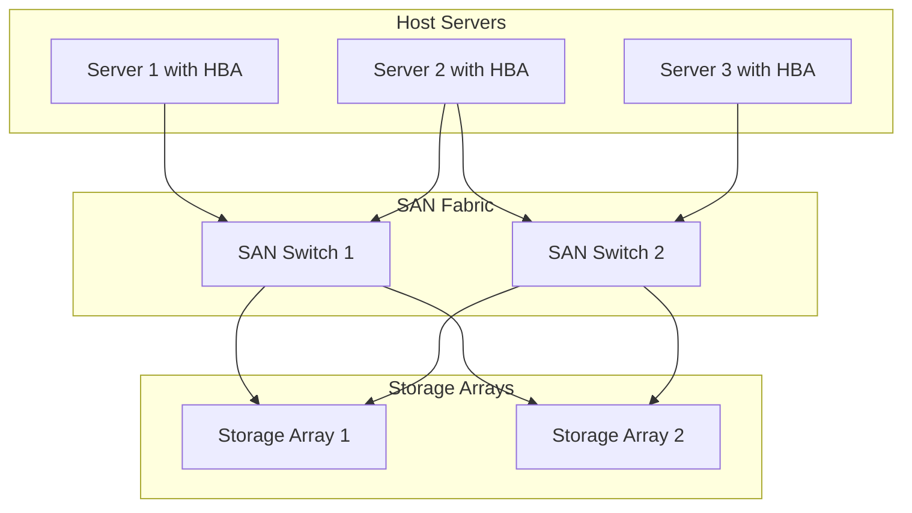
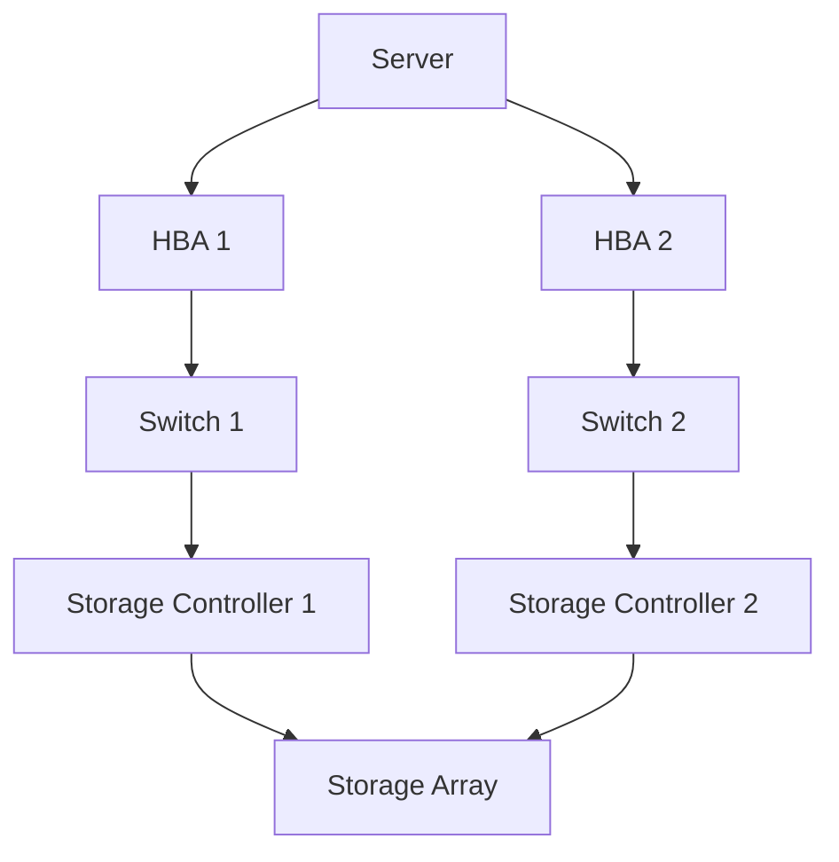

# Storage Area Networks

## Introduction

A Storage Area Network (SAN) is a specialized, high-speed network that provides block-level access to storage devices. Unlike traditional storage solutions where drives are directly attached to servers, SANs create a dedicated network infrastructure specifically for storage, allowing multiple servers to access a shared pool of storage resources. This approach revolutionizes how organizations manage their data storage needs by providing improved scalability, flexibility, and performance.

SANs represent a critical component in modern enterprise storage architecture, particularly in environments with high data availability requirements, such as data centers, large-scale applications, and cloud computing infrastructures.

## Understanding SAN Architecture

### Basic Components

A typical SAN consists of these essential components:

1. **Host Servers** - The computers that need access to storage
2. **Storage Devices** - Arrays of disks or solid-state drives
3. **SAN Fabric** - The dedicated network connecting servers to storage
4. **Host Bus Adapters (HBAs)** - Interface cards in servers for connecting to the SAN
5. **Storage Controllers** - Manage the storage arrays
6. **Switches** - Direct data traffic in the SAN fabric

Let's visualize a basic SAN architecture:



### SAN Protocols

SANs use specialized protocols designed for high-speed, low-latency data transfer:

1. **Fibre Channel (FC)** - The traditional and most common SAN protocol
2. **iSCSI** - Enables SAN over standard IP networks
3. **Fibre Channel over Ethernet (FCoE)** - Combines FC and Ethernet
4. **Non-Volatile Memory Express over Fabrics (NVMe-oF)** - Next-generation high-performance protocol

Each protocol has different characteristics:

| Protocol | Speed | Advantages | Disadvantages |
|----------|-------|------------|--------------|
| Fibre Channel | 8/16/32/64/128 Gbps | High performance, low latency | Expensive, specialized hardware |
| iSCSI | 1/10/25/40/100 Gbps | Uses standard IP networks, lower cost | Higher latency than FC |
| FCoE | 10/25/40/100 Gbps | Converged infrastructure | Complex implementation |
| NVMe-oF | 25/40/50/100/200 Gbps | Extremely low latency | Newer technology, less mature |

## How SAN Works

Unlike Network Attached Storage (NAS) which provides file-level access, SANs provide block-level access to storage. This means:

1. Storage appears to servers as if locally attached
2. Operating systems can format SAN storage with their native file systems
3. Applications can directly interact with the storage blocks

The process works as follows:

1. A server needs to read/write data
2. The request is sent through the Host Bus Adapter (HBA)
3. The SAN fabric routes the request to the appropriate storage device
4. The storage controller processes the request
5. Data is transferred back through the same path

## SAN vs. Other Storage Technologies

Let's compare SAN with other common storage technologies:

| Feature | Direct Attached Storage (DAS) | Network Attached Storage (NAS) | Storage Area Network (SAN) |
|---------|-------------------------------|-------------------------------|----------------------------|
| Access Level | Block-level | File-level | Block-level |
| Connection | Direct to server | Network via TCP/IP | Dedicated storage network |
| Distance | Limited by cable length | Network range | Extended network range |
| Scalability | Limited | Good | Excellent |
| Sharing | Limited/None | Multiple clients | Multiple servers |
| Performance | High for single server | Moderate | High across multiple servers |
| Use Cases | Individual servers | File sharing | Database, virtualization |

## SAN Implementation Example

Let's look at a practical example of setting up a simple iSCSI SAN connection in Linux:

1. Install the necessary iSCSI initiator software:

```bash
# For Ubuntu/Debian
sudo apt-get install open-iscsi

# For CentOS/RHEL
sudo yum install iscsi-initiator-utils
```

2. Configure the initiator name in `/etc/iscsi/initiatorname.iscsi`:

```
InitiatorName=iqn.2023-01.com.example:server1
```

3. Discover available iSCSI targets:

```bash
sudo iscsiadm -m discovery -t sendtargets -p 192.168.1.100
```

4. Log in to the discovered target:

```bash
sudo iscsiadm -m node -T iqn.2023-01.com.example:storage1 -p 192.168.1.100 -l
```

5. The new storage device will appear, which you can format and mount:

```bash
sudo fdisk -l
sudo mkfs.ext4 /dev/sdb
sudo mkdir /mnt/san-storage
sudo mount /dev/sdb /mnt/san-storage
```

6. Add to `/etc/fstab` for automatic mounting on reboot:

```
/dev/sdb /mnt/san-storage ext4 _netdev 0 0
```

## Real-World Applications

SANs are widely used in various enterprise scenarios:

### 1. Virtualization Environments

In virtualization platforms like VMware vSphere or Microsoft Hyper-V, SANs provide:
- Shared storage for multiple hosts
- Features like live migration (vMotion, Live Migration)
- Centralized storage management

### 2. Database Systems

For database applications like Oracle, SQL Server, or MySQL:
- High-performance block access
- Advanced features like snapshots and replication
- Better disaster recovery options

### 3. High-Availability Clusters

For mission-critical applications:
- Shared storage between cluster nodes
- Failover capabilities
- Data consistency across multiple servers

### 4. Large-Scale Data Management

In enterprise data centers:
- Consolidated storage management
- Efficient resource utilization
- Simplified backup and recovery processes

## SAN Management and Best Practices

### Zoning and LUN Masking

Two critical security concepts in SAN management:

- **Zoning**: Controls which devices can communicate with each other in the SAN fabric
- **LUN Masking**: Controls which servers can access specific Logical Unit Numbers (LUNs)

Example of zoning configuration in a Fibre Channel switch:

```bash
# Connect to the switch
ssh admin@fc-switch

# Create a new zone
zonecreate "Server1_Storage1", "10:00:00:00:c9:29:d2:e6;50:06:0e:80:05:25:cf:11"

# Add the zone to a zoneset
zoneset add "Production", "Server1_Storage1"

# Activate the zoneset
cfgenable "Production"
```

### Multipathing

To ensure redundancy and performance, SANs typically implement multipathing:



In Linux, multipath configurations are defined in `/etc/multipath.conf`:

```
multipaths {
    multipath {
        wwid 3600508e000000000b0ca469c0ee3a817
        alias oracle_data
        path_grouping_policy group_by_prio
        failback immediate
        path_checker tur
    }
}
```

### Performance Monitoring

Monitoring SAN performance is crucial for troubleshooting and capacity planning:

```bash
# Using Linux tools to check I/O performance on SAN volumes
sudo iostat -xm 5 /dev/sdb

# Example output:
# Device:         rrqm/s   wrqm/s   r/s   w/s    rMB/s    wMB/s avgrq-sz avgqu-sz   await r_await w_await  svctm  %util
# sdb               0.00     0.00  45.80 157.80   0.72     9.86   125.87     0.31    1.53    1.26    1.59   0.23   4.71
```

## Advanced SAN Concepts

### Storage Virtualization

Storage virtualization adds an abstraction layer that separates the physical storage from how it appears to servers. This enables:

- Simpler storage management
- Heterogeneous storage pooling
- Non-disruptive data migration

### Thin Provisioning

Thin provisioning allocates storage space on demand, rather than pre-allocating all the requested space:

```
# Example: Creating a thin-provisioned LUN in Linux with LVM
sudo lvcreate -n thin_volume -T storage_pool/thin_pool -V 1T
```

This allows for over-provisioning and more efficient use of storage resources.

### Snapshots and Clones

SANs often provide capabilities to create:

- **Snapshots**: Point-in-time copies that are space-efficient
- **Clones**: Full copies of volumes

These are useful for backup, testing, and development environments.

## Summary

Storage Area Networks represent a sophisticated approach to managing enterprise storage resources. They provide block-level access to shared storage across a dedicated high-speed network, enabling organizations to:

- Centralize storage management
- Improve resource utilization
- Enhance performance and availability
- Support advanced features like virtualization, snapshots, and replication

While SANs require specialized knowledge to implement and manage, they offer significant advantages for environments with demanding storage requirements.

## Additional Resources and Exercises

### Learning Resources

- The SNIA (Storage Networking Industry Association) website
- Vendor documentation (Dell EMC, NetApp, HPE, IBM)
- "Storage Networks Explained" by Ulf Troppens et al.

### Exercises

1. **Conceptual Exercise**: Draw a diagram of a SAN implementation with redundant paths from servers to storage.

2. **Hands-on Exercise**: Set up a virtual iSCSI SAN using free software like OpenMediaVault or FreeNAS.

3. **Research Exercise**: Compare the total cost of ownership (TCO) between a traditional DAS solution and a SAN for a hypothetical company with 10 servers.

4. **Advanced Exercise**: Design a disaster recovery solution using SAN replication between two data centers.