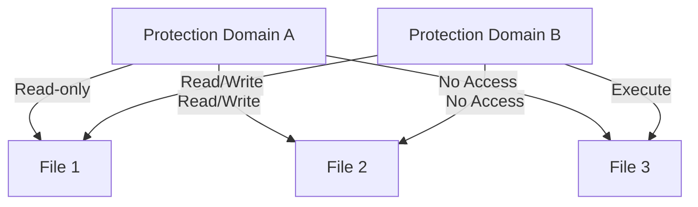
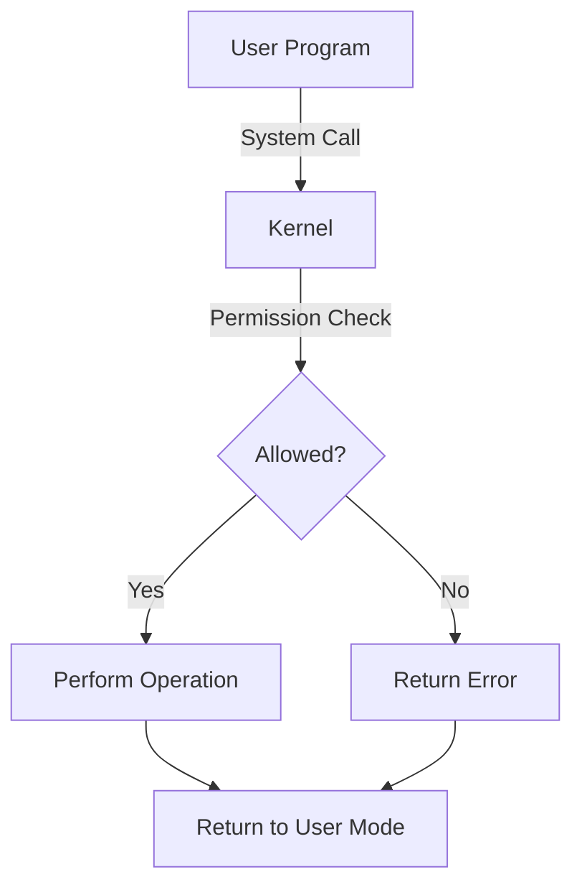
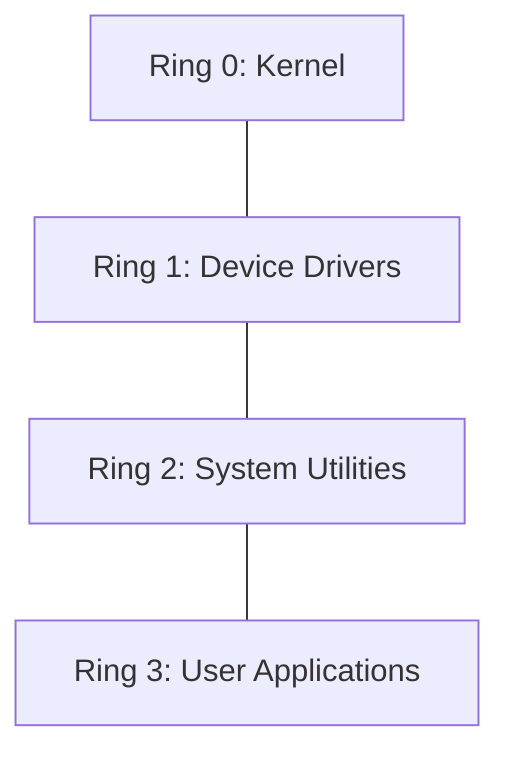

# Protection Mechanisms

## Introduction

In computing, **protection mechanisms** are the safeguards implemented in both hardware and software to control access to system resources, prevent unauthorized use, and ensure the integrity and privacy of data. As a programmer, understanding these mechanisms is crucial because they form the foundation of secure application development.

Protection mechanisms operate at various levels of a computer system, from the CPU hardware all the way up to application software. They serve as barriers that regulate what different users and processes can do, protecting the system and its data from accidental misuse or malicious attacks.

## Core Protection Concepts

### Protection Domains

A protection domain is a set of resources (objects) that a process can access, along with the access rights (permissions) for each object. 



Every process operates within a specific protection domain, which defines what resources it can access and what operations it can perform on those resources.

### Access Rights

Access rights (or permissions) specify what operations can be performed on a resource. Common types include:

- **Read**: Allow viewing or retrieving content
- **Write**: Allow modifying content
- **Execute**: Allow running or executing
- **Delete**: Allow removing or deleting
- **Create**: Allow creating new resources
- **Owner**: Special rights for resource owners

### Access Control Matrix

An access control matrix provides a conceptual model that specifies the rights that each process has for each object.

Example of an access control matrix:

| Process | File A | File B | Printer |
|---------|--------|--------|---------|
| User 1  | R, W   | R      | Print   |
| User 2  | -      | R, W   | Print   |
| Admin   | R, W   | R, W   | Manage  |

## Hardware Protection Mechanisms

### Memory Protection

Memory protection prevents a process from accessing memory that has not been allocated to it. This helps maintain system stability by ensuring that processes cannot interfere with each other's memory space.

#### Base and Limit Registers

A simple hardware mechanism for memory protection uses base and limit registers:

```
Process Memory Access Request
      |
      v
Check: Address >= Base Register &&
       Address <= Base Register + Limit Register
      |
      v
 Allow/Deny Access
```

```javascript
// Pseudocode for memory access validation
function validateMemoryAccess(requestedAddress) {
  if (requestedAddress >= baseRegister && 
      requestedAddress <= baseRegister + limitRegister) {
    // Access is valid
    return ALLOW_ACCESS;
  } else {
    // Access is invalid - generate protection fault
    generateProtectionFault();
    return DENY_ACCESS;
  }
}
```

#### Memory Protection Units (MPUs) and Memory Management Units (MMUs)

More advanced systems use MMUs that support virtual memory addressing, providing stronger isolation between processes.

### Privileged Mode Operations

Modern CPUs support at least two modes of operation:

1. **User Mode (Unprivileged)**: Limited access to system resources
2. **Kernel Mode (Privileged)**: Full access to all hardware resources

Critical operations like I/O access or system configuration changes can only be performed in kernel mode.



## Operating System Protection Mechanisms

### Process Isolation

The operating system ensures that each process runs in its own memory space, preventing one process from directly accessing another's resources.

```javascript
// Example of process creation with isolation
function createProcessWithIsolation(programPath) {
  // Allocate separate memory space
  const memorySpace = allocateVirtualMemory();
  
  // Create access control list
  const accessRights = createDefaultAccessRights();
  
  // Load program into isolated memory
  loadProgram(programPath, memorySpace);
  
  // Start process with proper isolation
  return startProcess(memorySpace, accessRights);
}
```

### File Access Control

Operating systems manage file permissions to control which users and processes can access particular files and what operations they can perform.

#### Unix-Style Permissions

In Unix-based systems, file permissions are defined for three categories: owner, group, and others.

```bash
# Command to set file permissions in Unix
chmod 755 myfile.txt

# Results in:
# Owner: Read, Write, Execute
# Group: Read, Execute
# Others: Read, Execute
```

#### Access Control Lists (ACLs)

Modern systems often use more granular ACLs that can specify permissions for multiple users and groups.

```bash
# Example ACL setup (Linux)
setfacl -m u:alice:rwx,u:bob:r--,g:developers:rw- myfile.txt
```

### User Authentication

Authentication verifies user identity, typically through:

- Passwords
- Biometric data (fingerprints, facial recognition)
- Security tokens or smart cards
- Multi-factor authentication (combining multiple methods)

```javascript
// Simple authentication pseudocode
function authenticateUser(username, password) {
  const storedPasswordHash = database.getUserPasswordHash(username);
  const providedPasswordHash = hashFunction(password);
  
  if (storedPasswordHash === providedPasswordHash) {
    return createSessionToken(username);
  } else {
    logFailedLoginAttempt(username);
    return null;
  }
}
```

## Protection Rings Architecture

Many systems implement protection using a hierarchical ring structure, where the innermost ring (Ring 0) has the most privileges, and outer rings have progressively fewer privileges.



- **Ring 0**: OS kernel with full hardware access
- **Ring 1**: Device drivers and system services
- **Ring 2**: Privileged user utilities
- **Ring 3**: Regular user applications

In practice, most modern operating systems primarily use Ring 0 (kernel mode) and Ring 3 (user mode).

## Protection in Modern Programming

### Capability-Based Security

Modern systems are increasingly using capability-based approaches, where access rights are represented as unforgeable tokens (capabilities) that authorize specific actions.

```javascript
// Capability-based file access example
function openFileWithCapability(fileCapability, requestedMode) {
  if (fileCapability.allowsMode(requestedMode)) {
    return openFileDescriptor(fileCapability.getReference(), requestedMode);
  } else {
    throw new PermissionError("Insufficient rights to access file");
  }
}
```

### Sandboxing

Sandboxing is a technique to run programs in a restricted environment where they have limited access to system resources.

```javascript
// Example of JavaScript sandboxing in a browser
function runInSandbox(userCode) {
  // Create a secure iframe
  const sandbox = document.createElement('iframe');
  sandbox.sandbox = 'allow-scripts'; // Only allow script execution
  document.body.appendChild(sandbox);
  
  try {
    // Execute code in restricted context
    sandbox.contentWindow.eval(userCode);
  } finally {
    // Always clean up
    document.body.removeChild(sandbox);
  }
}
```

### Role-Based Access Control (RBAC)

RBAC assigns permissions to roles rather than directly to users, making access management more scalable and manageable.

```javascript
// RBAC implementation pseudocode
function checkAccess(user, resource, operation) {
  const userRoles = getUserRoles(user);
  
  for (const role of userRoles) {
    if (roleHasPermission(role, resource, operation)) {
      return true;
    }
  }
  
  return false;
}
```

## Practical Example: Building a Simple Access Control System

Let's create a simple protection system that manages access to resources:

```javascript
class ProtectionSystem {
  constructor() {
    this.resources = new Map();
    this.users = new Map();
  }

  // Register a new resource
  registerResource(resourceId, owner) {
    this.resources.set(resourceId, {
      owner: owner,
      accessControl: new Map([
        [owner, ['read', 'write', 'execute', 'grant']]
      ])
    });
    console.log(`Resource ${resourceId} registered with owner ${owner}`);
  }

  // Grant access to a resource
  grantAccess(user, resourceId, permissions, grantingUser) {
    const resource = this.resources.get(resourceId);
    
    // Check if resource exists
    if (!resource) {
      console.log(`Error: Resource ${resourceId} does not exist`);
      return false;
    }
    
    // Check if granting user has grant permission
    const grantingUserPermissions = resource.accessControl.get(grantingUser) || [];
    if (!grantingUserPermissions.includes('grant')) {
      console.log(`Error: User ${grantingUser} does not have grant permission`);
      return false;
    }
    
    // Set permissions
    resource.accessControl.set(user, permissions);
    console.log(`User ${user} granted ${permissions.join(', ')} access to ${resourceId}`);
    return true;
  }

  // Check if a user has access to a resource
  checkAccess(user, resourceId, requestedPermission) {
    const resource = this.resources.get(resourceId);
    
    // Check if resource exists
    if (!resource) {
      return false;
    }
    
    // Get user's permissions for this resource
    const permissions = resource.accessControl.get(user) || [];
    
    // Check if user has the requested permission
    return permissions.includes(requestedPermission);
  }
}

// Example usage:
const protectionSystem = new ProtectionSystem();

// Register a resource
protectionSystem.registerResource('confidential-file', 'admin');

// Admin grants read access to user1
protectionSystem.grantAccess('user1', 'confidential-file', ['read'], 'admin');

// Check access
console.log(protectionSystem.checkAccess('user1', 'confidential-file', 'read')); // true
console.log(protectionSystem.checkAccess('user1', 'confidential-file', 'write')); // false

// User1 tries to grant access to user2 (should fail)
protectionSystem.grantAccess('user2', 'confidential-file', ['read'], 'user1');

// Admin grants additional permissions to user1
protectionSystem.grantAccess('user1', 'confidential-file', ['read', 'grant'], 'admin');

// Now user1 can grant access to user2
protectionSystem.grantAccess('user2', 'confidential-file', ['read'], 'user1');
```

Output:
```
Resource confidential-file registered with owner admin
User user1 granted read access to confidential-file
true
false
Error: User user1 does not have grant permission
User user1 granted read, grant access to confidential-file
User user2 granted read access to confidential-file
```

## Common Protection Vulnerabilities

Despite these mechanisms, security vulnerabilities can still occur:

1. **Buffer Overflows**: When more data is written to a buffer than it can hold, potentially overwriting adjacent memory
2. **Privilege Escalation**: When a user or process gains higher privileges than intended
3. **Race Conditions**: When timing issues in code execution create security gaps
4. **Side-Channel Attacks**: When physical information (timing, power usage) reveals protected data

## Best Practices for Developers

1. **Principle of Least Privilege**: Grant only the minimum permissions necessary
2. **Defense in Depth**: Implement multiple layers of protection
3. **Input Validation**: Always validate and sanitize user inputs
4. **Regular Updates**: Keep systems and libraries up-to-date
5. **Secure by Default**: Design systems to be secure in their default configuration

## Summary

Protection mechanisms form the foundation of computer security by controlling access to resources, enforcing isolation between processes, and maintaining system integrity. They operate at various levels:

- **Hardware level**: Memory protection, privileged instructions
- **Operating system level**: Process isolation, file permissions, user authentication
- **Application level**: Sandboxing, capability-based security, role-based access control

Understanding these protection mechanisms is essential for developing secure software that properly utilizes the security features provided by modern computing systems.

## Exercises

1. Design a simple access control matrix for a system with three users (Admin, User1, User2) and four resources (FileA, FileB, Printer, Network).

2. Implement a basic file permission system in your preferred programming language that supports read, write, and execute permissions for different user types.

3. Research and compare how memory protection is implemented in different operating systems (Windows, Linux, macOS).

4. Create a role-based access control system for a hypothetical web application with at least three different user roles.

## Additional Resources

- **Operating Systems: Three Easy Pieces** - Remzi H. Arpaci-Dusseau and Andrea C. Arpaci-Dusseau (Chapter on Protection)
- **Computer Security: Principles and Practice** - William Stallings and Lawrie Brown
- **The Art of Computer Programming, Volume 1** - Donald Knuth (Sections on Protection and Security)