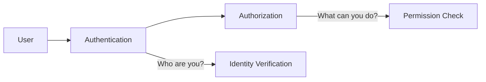

# Access Control

## Introduction

Access control is a fundamental security concept that governs who or what can view, use, or modify computing resources, data, or applications. It's like having a security guard at your building who checks IDs and only allows authorized personnel to enter specific areas. In software systems, access control mechanisms ensure that users can only access the resources they're permitted to use and perform only the operations they're authorized to execute.

As applications grow in complexity and handle more sensitive data, implementing proper access control becomes crucial to protect against unauthorized access and potential security breaches.

## Core Access Control Concepts

### Authentication vs. Authorization

Before diving deeper, let's clarify two related but distinct security concepts:



- **Authentication**: The process of verifying the identity of a user, system, or entity. It answers the question, "Who are you?"
  
- **Authorization**: Determines what resources an authenticated user can access and what actions they can perform. It answers the question, "What are you allowed to do?"

### Key Access Control Models

There are several models for implementing access control:

1. **Discretionary Access Control (DAC)**
   - Resource owners determine who can access their resources
   - Example: File permissions in operating systems

2. **Mandatory Access Control (MAC)**
   - System-enforced policies determine access based on security levels
   - Example: Military or government systems with classified information

3. **Role-Based Access Control (RBAC)**
   - Access permissions are assigned to roles, and users are assigned to roles
   - Example: Admin, Editor, Viewer roles in a content management system

4. **Attribute-Based Access Control (ABAC)**
   - Access decisions based on attributes of the user, resource, and environment
   - Example: Allow access only during business hours from corporate IP addresses

## Implementing Access Control in Code

Let's look at some practical examples of implementing access control in different programming contexts.

### Example 1: Role-Based Access Control in Express.js

Here's a simple implementation of RBAC in a Node.js Express application:

```javascript
const express = require('express');
const app = express();

// Mock user database
const users = {
  user123: { id: 'user123', username: 'alice', role: 'admin' },
  user456: { id: 'user456', username: 'bob', role: 'editor' },
  user789: { id: 'user789', username: 'carol', role: 'viewer' }
};

// Mock authentication middleware (in a real app, this would verify tokens)
const authenticate = (req, res, next) => {
  const userId = req.header('User-ID');
  const user = users[userId];
  
  if (!user) {
    return res.status(401).json({ error: 'Unauthorized: User not found' });
  }
  
  req.user = user;
  next();
};

// Role-based authorization middleware
const authorize = (...allowedRoles) => {
  return (req, res, next) => {
    if (!req.user) {
      return res.status(401).json({ error: 'Unauthorized: User not authenticated' });
    }
    
    if (allowedRoles.includes(req.user.role)) {
      next();
    } else {
      return res.status(403).json({ error: 'Forbidden: Insufficient permissions' });
    }
  };
};

// Routes with access control
app.get('/api/content', authenticate, (req, res) => {
  res.json({ message: 'Public content accessible to all authenticated users' });
});

app.get('/api/admin-dashboard', authenticate, authorize('admin'), (req, res) => {
  res.json({ message: 'Admin dashboard accessible only to admins' });
});

app.put('/api/content/:id', authenticate, authorize('admin', 'editor'), (req, res) => {
  res.json({ message: 'Content updated successfully' });
});

app.get('/api/reports', authenticate, authorize('admin', 'viewer'), (req, res) => {
  res.json({ message: 'Reports data accessible to admins and viewers' });
});

app.listen(3000, () => {
  console.log('Server running on port 3000');
});
```

In this example:
- The `authenticate` middleware verifies user identity
- The `authorize` middleware checks if the user has the required role
- Different API endpoints have different access requirements

### Example 2: File Permission System in Python

Here's a simplified implementation of a file permission system in Python:

```python
class File:
    def __init__(self, name, owner):
        self.name = name
        self.owner = owner
        self.permissions = {
            'owner': {'read': True, 'write': True, 'execute': False},
            'group': {'read': True, 'write': False, 'execute': False},
            'others': {'read': False, 'write': False, 'execute': False}
        }
        self.group_members = []
    
    def add_to_group(self, user):
        self.group_members.append(user)
    
    def set_permission(self, user_type, permission, value):
        if user_type in self.permissions and permission in self.permissions[user_type]:
            self.permissions[user_type][permission] = value
    
    def check_access(self, user, access_type):
        # Owner permissions
        if user == self.owner:
            return self.permissions['owner'][access_type]
        
        # Group permissions
        if user in self.group_members:
            return self.permissions['group'][access_type]
        
        # Others permissions
        return self.permissions['others'][access_type]

# Usage example
document = File('confidential.txt', 'alice')
document.add_to_group('bob')
document.add_to_group('dave')

# Set permissions
document.set_permission('group', 'read', True)
document.set_permission('others', 'read', False)

# Check access
print(f"Can alice read? {document.check_access('alice', 'read')}")  # True (owner)
print(f"Can alice write? {document.check_access('alice', 'write')}") # True (owner)
print(f"Can bob read? {document.check_access('bob', 'read')}")  # True (in group)
print(f"Can bob write? {document.check_access('bob', 'write')}") # False (in group)
print(f"Can eve read? {document.check_access('eve', 'read')}") # False (others)
```

Output:
```
Can alice read? True
Can alice write? True
Can bob read? True
Can bob write? False
Can eve read? False
```

This example implements a simple discretionary access control system similar to Unix file permissions with owner, group, and others having different access rights.

### Example 3: Access Control List (ACL) in Java

Here's how you might implement an Access Control List in Java:

```java
import java.util.*;

// Permission types
enum Permission {
    READ, WRITE, DELETE, ADMIN
}

// ACL implementation
class AccessControlList {
    private Map<String, Set<Permission>> userPermissions = new HashMap<>();
    
    // Grant permission to a user
    public void grantPermission(String userId, Permission permission) {
        userPermissions.computeIfAbsent(userId, k -> new HashSet<>()).add(permission);
    }
    
    // Revoke permission from a user
    public void revokePermission(String userId, Permission permission) {
        if (userPermissions.containsKey(userId)) {
            userPermissions.get(userId).remove(permission);
        }
    }
    
    // Check if a user has a specific permission
    public boolean hasPermission(String userId, Permission permission) {
        // Admin permission implies all other permissions
        if (userPermissions.containsKey(userId)) {
            if (userPermissions.get(userId).contains(Permission.ADMIN)) {
                return true;
            }
            return userPermissions.get(userId).contains(permission);
        }
        return false;
    }
}

// Resource protected by the ACL
class SecureResource {
    private String resourceId;
    private String content;
    private AccessControlList acl;
    
    public SecureResource(String resourceId, String content) {
        this.resourceId = resourceId;
        this.content = content;
        this.acl = new AccessControlList();
    }
    
    public AccessControlList getAcl() {
        return acl;
    }
    
    public String read(String userId) {
        if (acl.hasPermission(userId, Permission.READ)) {
            return content;
        }
        throw new SecurityException("Access denied: No read permission");
    }
    
    public void write(String userId, String newContent) {
        if (acl.hasPermission(userId, Permission.WRITE)) {
            this.content = newContent;
        } else {
            throw new SecurityException("Access denied: No write permission");
        }
    }
    
    public void delete(String userId) {
        if (acl.hasPermission(userId, Permission.DELETE)) {
            this.content = null;
            System.out.println("Resource deleted");
        } else {
            throw new SecurityException("Access denied: No delete permission");
        }
    }
}

// Example usage
public class AccessControlExample {
    public static void main(String[] args) {
        SecureResource document = new SecureResource("doc1", "Confidential information");
        
        // Set up permissions
        document.getAcl().grantPermission("user1", Permission.READ);
        document.getAcl().grantPermission("user1", Permission.WRITE);
        document.getAcl().grantPermission("user2", Permission.READ);
        document.getAcl().grantPermission("admin", Permission.ADMIN);
        
        // Test permissions
        try {
            System.out.println(document.read("user1")); // Should work
            document.write("user1", "Updated content"); // Should work
            System.out.println(document.read("user2")); // Should work
            // document.write("user2", "Unauthorized update"); // Should throw exception
            document.delete("admin"); // Should work
        } catch (SecurityException e) {
            System.out.println(e.getMessage());
        }
    }
}
```

Output:
```
Confidential information
Updated content
Resource deleted
```

This example demonstrates an ACL-based access control system where:
- Different users have different permissions
- The system checks permissions before allowing operations
- The admin role has implicit access to all operations

## Best Practices for Access Control

1. **Principle of Least Privilege (PoLP)**
   - Grant users the minimum permissions necessary to perform their tasks
   - Regularly review and adjust permissions as roles change

2. **Defense in Depth**
   - Implement multiple layers of access controls
   - Don't rely on a single security mechanism

3. **Default Deny**
   - By default, deny access to all resources
   - Explicitly grant permissions as needed

4. **Separation of Duties**
   - Distribute tasks and privileges among multiple users
   - Prevents a single compromised account from causing severe damage

5. **Audit and Logging**
   - Keep detailed logs of access attempts and permission changes
   - Regularly review logs for suspicious activity

6. **Regular Reviews and Updates**
   - Conduct periodic access control reviews
   - Remove permissions when no longer needed

## Real-World Applications

### Banking Application

A banking application might implement multiple layers of access control:
- Authentication via password, 2FA, and biometrics
- Authorization rules that only allow account owners to transfer funds
- Time-based restrictions on large transactions
- Location-based access control for suspicious login locations

### Healthcare Systems

Healthcare applications use strict access control to comply with regulations:
- Role-based access for doctors, nurses, and administrators
- Purpose-based access requiring justification for viewing patient records
- Automatic access revocation after patient discharge
- Comprehensive audit trails for all record access

### Content Management Systems

A CMS typically uses RBAC with roles like:
- Administrator: Full system access
- Editor: Can create and modify content
- Author: Can create content but can't publish
- Subscriber: Can only view content

## Common Vulnerabilities and Mitigation

### Insecure Direct Object References (IDOR)

**Vulnerability**: Users can access resources by manipulating identifiers.

**Example**: Changing a URL from `/profile/123` to `/profile/124` to access another user's profile.

**Mitigation**: 
- Validate user permissions for each resource access
- Use indirect references that map to actual database IDs

```javascript
// Vulnerable code
app.get('/api/documents/:id', (req, res) => {
  const doc = db.getDocument(req.params.id);
  res.json(doc);
});

// Secure code
app.get('/api/documents/:id', authenticate, (req, res) => {
  const doc = db.getDocument(req.params.id);
  if (doc.ownerId !== req.user.id && !req.user.isAdmin) {
    return res.status(403).json({ error: 'Access denied' });
  }
  res.json(doc);
});
```

### Missing Function Level Access Control

**Vulnerability**: Access controls are only enforced at the UI level, not at the server.

**Mitigation**: 
- Implement server-side access controls for all functions
- Don't rely on hiding UI elements as a security measure

### Broken Authentication

**Vulnerability**: Flaws in authentication mechanisms allow unauthorized access.

**Mitigation**:
- Implement strong password policies
- Use multi-factor authentication
- Apply proper session management
- Enforce account lockouts after failed attempts

## Summary

Access control is a critical aspect of application security that ensures users can only access what they're permitted to access. By implementing the right access control model for your application and following security best practices, you can significantly reduce the risk of unauthorized access and potential data breaches.

Remember these key points:
- Authentication verifies identity, authorization grants permissions
- Choose the appropriate access control model (DAC, MAC, RBAC, ABAC) for your needs
- Always apply the principle of least privilege
- Implement access controls at the server level, not just the UI
- Regularly audit and review access permissions

## Exercises

1. Implement a simple RBAC system in your preferred programming language with roles for 'admin', 'user', and 'guest'.

2. Create a function that validates whether a user has permission to perform a specific action on a resource.

3. Design an access control system for a blog platform with authors, editors, and readers.

4. Modify the Express.js example to add time-based access control (e.g., certain roles can only access resources during business hours).

5. Research and implement a JWT (JSON Web Token) based authentication and authorization system.

## Additional Resources

- [OWASP Access Control Cheat Sheet](https://cheatsheetseries.owasp.org/cheatsheets/Access_Control_Cheat_Sheet.html)
- [The Open Web Application Security Project (OWASP)](https://owasp.org/)
- [NIST Guidelines on Access Control](https://csrc.nist.gov/publications/detail/sp/800-192/draft)