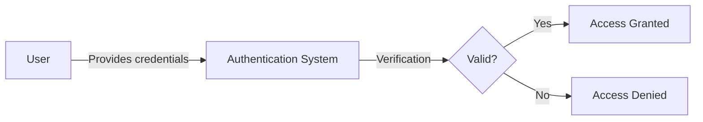
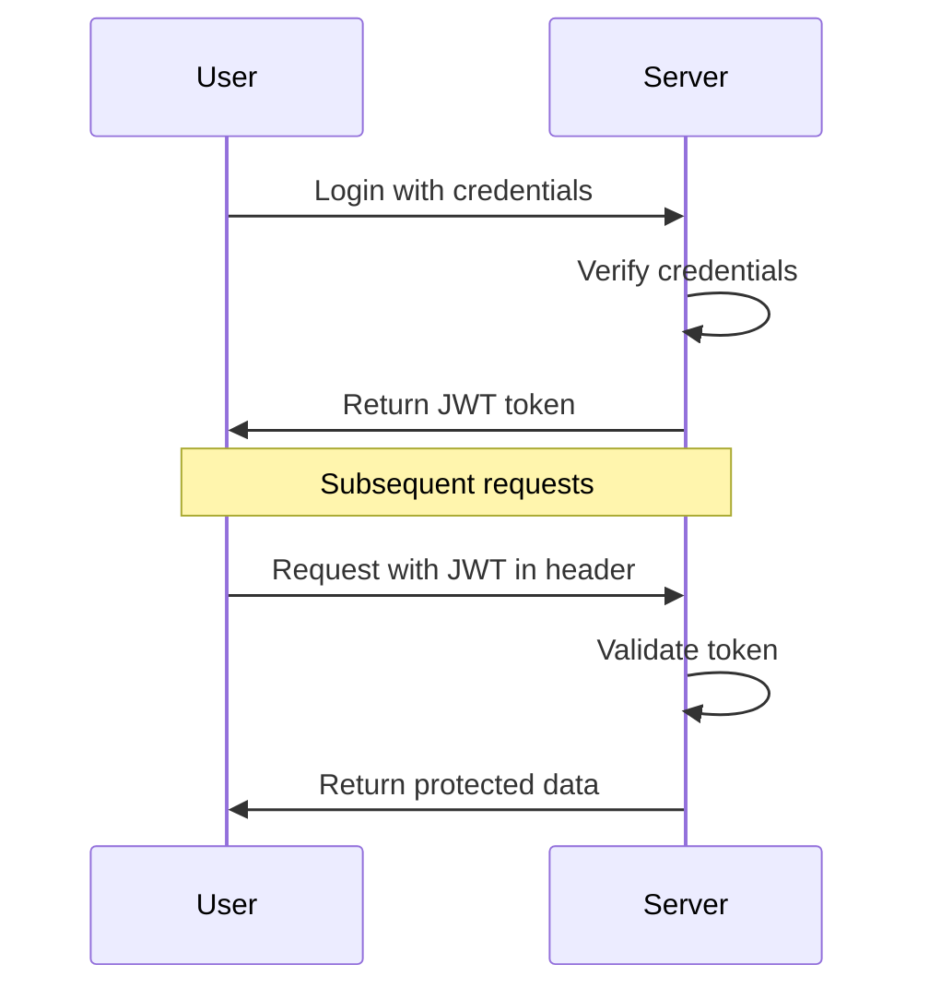
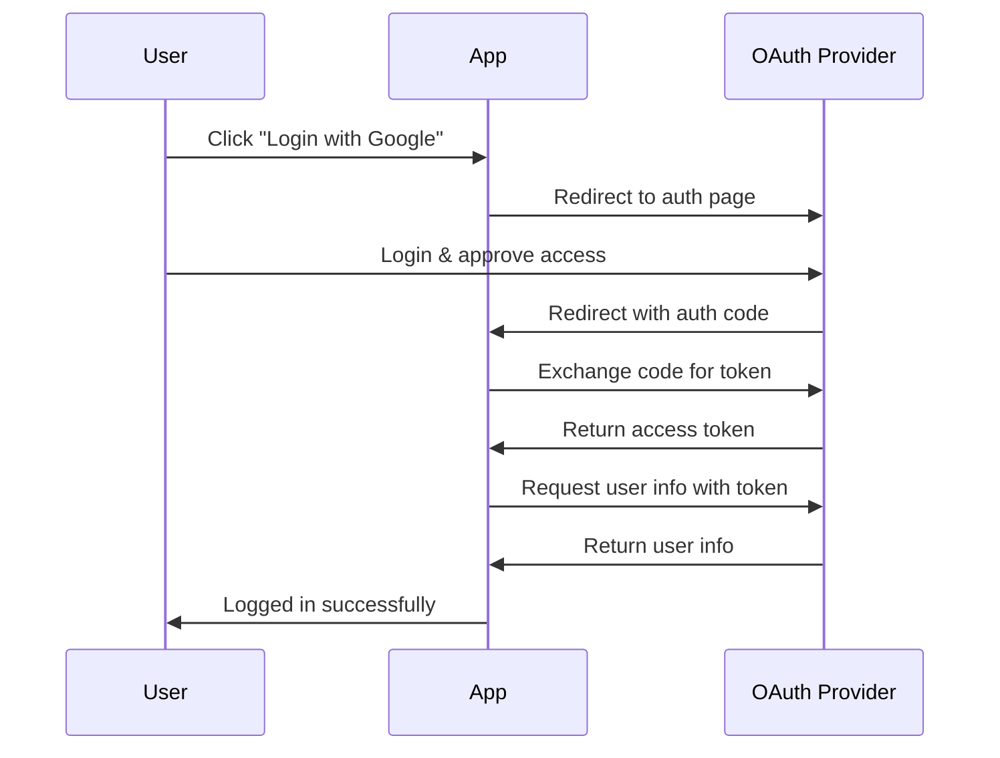

# Authentication

## Introduction

Authentication is a fundamental security concept in software development that verifies the identity of users or systems attempting to access resources. Think of it as the digital equivalent of checking someone's ID card before letting them enter a restricted area. While it's often confused with authorization (which determines what a verified user can do), authentication specifically focuses on confirming that users are who they claim to be.

In today's digital landscape, implementing robust authentication is critical for protecting user data and preventing unauthorized access to systems. This guide will explore the core concepts of authentication, various authentication methods, and how to implement them in your applications.

## What is Authentication?

Authentication is the process of verifying the identity of a user, system, or entity. When a user attempts to access a protected resource, the authentication system challenges them to provide credentials that prove their identity.



### Authentication vs. Authorization

Before diving deeper, let's clarify the difference between these two related but distinct concepts:

| Authentication | Authorization |
|----------------|---------------|
| Verifies **who** you are | Determines **what** you can access |
| Happens before authorization | Happens after authentication |
| Involves credentials like passwords | Involves permissions and access rules |
| Example: Logging into an account | Example: Checking if a user can edit a file |

## Common Authentication Methods

### 1. Password-Based Authentication

This is the most familiar method where users provide a username/email and password combination.

#### Example implementation (Node.js/Express):

```javascript
const express = require('express');
const bcrypt = require('bcrypt');
const app = express();

app.use(express.json());

// Mock database
const users = [];

// Register a new user
app.post('/register', async (req, res) => {
  try {
    const { username, password } = req.body;
    
    // Check if user already exists
    if (users.find(user => user.username === username)) {
      return res.status(400).json({ message: 'User already exists' });
    }
    
    // Hash the password
    const salt = await bcrypt.genSalt(10);
    const hashedPassword = await bcrypt.hash(password, salt);
    
    // Store the user
    const newUser = { username, password: hashedPassword };
    users.push(newUser);
    
    res.status(201).json({ message: 'User created successfully' });
  } catch (error) {
    res.status(500).json({ message: 'Server error' });
  }
});

// Login route
app.post('/login', async (req, res) => {
  try {
    const { username, password } = req.body;
    
    // Find the user
    const user = users.find(user => user.username === username);
    if (!user) {
      return res.status(400).json({ message: 'Invalid credentials' });
    }
    
    // Compare passwords
    const isMatch = await bcrypt.compare(password, user.password);
    if (!isMatch) {
      return res.status(400).json({ message: 'Invalid credentials' });
    }
    
    res.json({ message: 'Login successful' });
  } catch (error) {
    res.status(500).json({ message: 'Server error' });
  }
});
```

#### Best Practices for Password Authentication:

1. **Always hash passwords** - Never store passwords as plain text
2. **Use strong hashing algorithms** - Like bcrypt, Argon2, or PBKDF2
3. **Implement password policies** - Enforce minimum length and complexity
4. **Add salt to passwords** - To prevent rainbow table attacks
5. **Rate limit login attempts** - To prevent brute force attacks

### 2. Token-Based Authentication

Token-based authentication issues a token (like JWT - JSON Web Token) after successful login, which is then used for subsequent requests.



#### Example JWT implementation (Node.js):

```javascript
const express = require('express');
const jwt = require('jsonwebtoken');
const bcrypt = require('bcrypt');
const app = express();

app.use(express.json());

// Secret key for JWT
const JWT_SECRET = 'your-secret-key'; // In production, use environment variables

// Mock database
const users = [];

// Register route (similar to previous example)
// ...

// Login and generate token
app.post('/login', async (req, res) => {
  try {
    const { username, password } = req.body;
    
    // Find the user
    const user = users.find(user => user.username === username);
    if (!user) {
      return res.status(400).json({ message: 'Invalid credentials' });
    }
    
    // Compare passwords
    const isMatch = await bcrypt.compare(password, user.password);
    if (!isMatch) {
      return res.status(400).json({ message: 'Invalid credentials' });
    }
    
    // Generate JWT token
    const token = jwt.sign(
      { userId: username },
      JWT_SECRET,
      { expiresIn: '1h' }
    );
    
    res.json({ token });
  } catch (error) {
    res.status(500).json({ message: 'Server error' });
  }
});

// Protected route
app.get('/protected', authenticateToken, (req, res) => {
  res.json({ message: 'Access granted to protected resource', user: req.user });
});

// Authentication middleware
function authenticateToken(req, res, next) {
  const authHeader = req.headers['authorization'];
  const token = authHeader && authHeader.split(' ')[1]; // Bearer TOKEN
  
  if (!token) return res.status(401).json({ message: 'Access denied' });
  
  jwt.verify(token, JWT_SECRET, (err, user) => {
    if (err) return res.status(403).json({ message: 'Invalid or expired token' });
    
    req.user = user;
    next();
  });
}
```

### 3. Multi-Factor Authentication (MFA)

MFA requires users to provide two or more verification factors, significantly enhancing security.

Common factors include:
1. **Something you know** - Password or PIN
2. **Something you have** - Mobile device or security key
3. **Something you are** - Biometrics like fingerprints or facial recognition

#### Simple example of implementing 2FA with TOTP (Time-based One-Time Password):

```javascript
const express = require('express');
const speakeasy = require('speakeasy');
const QRCode = require('qrcode');
const app = express();

app.use(express.json());

// Mock database
const users = [];

// Register and setup 2FA
app.post('/setup-2fa', (req, res) => {
  const { username } = req.body;
  
  // Generate a secret
  const secret = speakeasy.generateSecret({
    name: `MyApp:${username}`
  });
  
  // Find and update user (in a real app, you'd store this in a database)
  const user = users.find(user => user.username === username);
  if (user) {
    user.temp_secret = secret.base32;
    
    // Generate QR code for the secret
    QRCode.toDataURL(secret.otpauth_url, (err, data_url) => {
      res.json({
        message: 'Two-factor auth needs to be verified',
        tempSecret: secret.base32,
        qrCode: data_url
      });
    });
  } else {
    res.status(404).json({ message: 'User not found' });
  }
});

// Verify and enable 2FA
app.post('/verify-2fa', (req, res) => {
  const { username, token } = req.body;
  
  // Find user
  const user = users.find(user => user.username === username);
  if (!user) {
    return res.status(404).json({ message: 'User not found' });
  }
  
  // Verify token
  const verified = speakeasy.totp.verify({
    secret: user.temp_secret,
    encoding: 'base32',
    token: token
  });
  
  if (verified) {
    // Enable 2FA for the user
    user.secret = user.temp_secret;
    user.twoFactorEnabled = true;
    delete user.temp_secret;
    
    res.json({ message: '2FA has been enabled' });
  } else {
    res.status(400).json({ message: 'Invalid verification code' });
  }
});

// Login with 2FA
app.post('/login-2fa', (req, res) => {
  const { username, password, token } = req.body;
  
  // Find user and verify password (simplified)
  const user = users.find(user => user.username === username);
  if (!user) {
    return res.status(400).json({ message: 'Invalid credentials' });
  }
  
  // Check if 2FA is enabled
  if (user.twoFactorEnabled) {
    // Verify TOTP
    const verified = speakeasy.totp.verify({
      secret: user.secret,
      encoding: 'base32',
      token: token
    });
    
    if (!verified) {
      return res.status(400).json({ message: 'Invalid verification code' });
    }
  }
  
  // If we get here, authentication was successful
  res.json({ message: 'Login successful' });
});
```

### 4. OAuth and Social Authentication

OAuth allows users to grant third-party applications limited access to their resources without sharing credentials. It's commonly used for "Login with Google/Facebook/GitHub" functionality.



Here's a simplified example using Passport.js with Google OAuth:

```javascript
const express = require('express');
const passport = require('passport');
const GoogleStrategy = require('passport-google-oauth20').Strategy;
const session = require('express-session');

const app = express();

// Session setup
app.use(session({
  secret: 'your-secret-key',
  resave: false,
  saveUninitialized: true
}));

// Initialize Passport
app.use(passport.initialize());
app.use(passport.session());

// Serialize/deserialize user
passport.serializeUser((user, done) => done(null, user));
passport.deserializeUser((obj, done) => done(null, obj));

// Setup Google Strategy
passport.use(new GoogleStrategy({
    clientID: 'YOUR_GOOGLE_CLIENT_ID',
    clientSecret: 'YOUR_GOOGLE_CLIENT_SECRET',
    callbackURL: 'http://localhost:3000/auth/google/callback'
  },
  (accessToken, refreshToken, profile, done) => {
    // In a real app, you would save the profile to your DB
    return done(null, profile);
  }
));

// Routes
app.get('/auth/google',
  passport.authenticate('google', { scope: ['profile', 'email'] })
);

app.get('/auth/google/callback', 
  passport.authenticate('google', { failureRedirect: '/login' }),
  (req, res) => {
    // Successful authentication
    res.redirect('/profile');
  }
);

app.get('/profile', isAuthenticated, (req, res) => {
  res.send(`<h1>Hello ${req.user.displayName}</h1>`);
});

// Middleware to check if user is authenticated
function isAuthenticated(req, res, next) {
  if (req.isAuthenticated()) {
    return next();
  }
  res.redirect('/login');
}

// Login page
app.get('/login', (req, res) => {
  res.send('<a href="/auth/google">Login with Google</a>');
});

app.listen(3000, () => {
  console.log('Server running on port 3000');
});
```

## Common Authentication Challenges and Solutions

### 1. Secure Password Storage

**Challenge:** Storing passwords securely to prevent data breaches.
**Solution:** Use strong adaptive hashing algorithms like bcrypt or Argon2.

```javascript
// Example using bcrypt
const bcrypt = require('bcrypt');

async function hashPassword(password) {
  // The higher the saltRounds, the more secure but slower
  const saltRounds = 10;
  const hashedPassword = await bcrypt.hash(password, saltRounds);
  return hashedPassword;
}

async function verifyPassword(plainPassword, hashedPassword) {
  const isMatch = await bcrypt.compare(plainPassword, hashedPassword);
  return isMatch;
}
```

### 2. Session Management

**Challenge:** Securely managing user sessions.
**Solution:** Use secure, HTTP-only cookies with proper expiration.

```javascript
// Using express-session
app.use(session({
  secret: 'your-secret-key',
  resave: false,
  saveUninitialized: true,
  cookie: { 
    secure: true, // Use true in production with HTTPS
    httpOnly: true, // Prevents JavaScript access
    maxAge: 24 * 60 * 60 * 1000 // 24 hours
  }
}));
```

### 3. Preventing Brute Force Attacks

**Challenge:** Protecting against repeated login attempts.
**Solution:** Implement rate limiting and account lockouts.

```javascript
const rateLimit = require('express-rate-limit');

// Create a limiter for login attempts
const loginLimiter = rateLimit({
  windowMs: 15 * 60 * 1000, // 15 minutes
  max: 5, // 5 attempts per window
  message: 'Too many login attempts, please try again later.'
});

// Apply the rate limiter to login routes
app.post('/login', loginLimiter, (req, res) => {
  // Login logic here
});
```

## Real-World Authentication Implementation

Let's walk through a complete example of a secure authentication system using Express.js, MongoDB, and best practices:

```javascript
const express = require('express');
const mongoose = require('mongoose');
const bcrypt = require('bcrypt');
const jwt = require('jsonwebtoken');
const rateLimit = require('express-rate-limit');
const { check, validationResult } = require('express-validator');

const app = express();
app.use(express.json());

// Connect to MongoDB
mongoose.connect('mongodb://localhost:27017/authDemo', {
  useNewUrlParser: true,
  useUnifiedTopology: true,
  useCreateIndex: true
});

// User model
const UserSchema = new mongoose.Schema({
  username: {
    type: String,
    required: true,
    unique: true
  },
  email: {
    type: String,
    required: true,
    unique: true
  },
  password: {
    type: String,
    required: true
  },
  createdAt: {
    type: Date,
    default: Date.now
  }
});

const User = mongoose.model('User', UserSchema);

// Rate limiting
const loginLimiter = rateLimit({
  windowMs: 15 * 60 * 1000,
  max: 5,
  message: 'Too many login attempts from this IP, please try again after 15 minutes'
});

// JWT Secret (use env variables in production)
const JWT_SECRET = 'your-jwt-secret';
const JWT_EXPIRES_IN = '1h';

// Register route with validation
app.post('/register', [
  check('username', 'Username is required').not().isEmpty(),
  check('email', 'Please include a valid email').isEmail(),
  check('password', 'Password must be at least 6 characters').isLength({ min: 6 })
], async (req, res) => {
  // Validate input
  const errors = validationResult(req);
  if (!errors.isEmpty()) {
    return res.status(400).json({ errors: errors.array() });
  }

  try {
    const { username, email, password } = req.body;

    // Check if user already exists
    let user = await User.findOne({ $or: [{ email }, { username }] });
    if (user) {
      return res.status(400).json({ message: 'User already exists' });
    }

    // Create new user
    user = new User({
      username,
      email,
      password
    });

    // Hash password
    const salt = await bcrypt.genSalt(10);
    user.password = await bcrypt.hash(password, salt);

    // Save user to database
    await user.save();

    // Create payload for JWT
    const payload = {
      user: {
        id: user.id
      }
    };

    // Generate token
    jwt.sign(
      payload,
      JWT_SECRET,
      { expiresIn: JWT_EXPIRES_IN },
      (err, token) => {
        if (err) throw err;
        res.json({ token });
      }
    );
  } catch (err) {
    console.error(err.message);
    res.status(500).send('Server error');
  }
});

// Login route with rate limiting
app.post('/login', loginLimiter, [
  check('email', 'Please include a valid email').isEmail(),
  check('password', 'Password is required').exists()
], async (req, res) => {
  // Validate input
  const errors = validationResult(req);
  if (!errors.isEmpty()) {
    return res.status(400).json({ errors: errors.array() });
  }

  try {
    const { email, password } = req.body;

    // Find the user
    const user = await User.findOne({ email });
    if (!user) {
      return res.status(400).json({ message: 'Invalid credentials' });
    }

    // Verify password
    const isMatch = await bcrypt.compare(password, user.password);
    if (!isMatch) {
      return res.status(400).json({ message: 'Invalid credentials' });
    }

    // Create payload for JWT
    const payload = {
      user: {
        id: user.id
      }
    };

    // Generate token
    jwt.sign(
      payload,
      JWT_SECRET,
      { expiresIn: JWT_EXPIRES_IN },
      (err, token) => {
        if (err) throw err;
        res.json({ token });
      }
    );
  } catch (err) {
    console.error(err.message);
    res.status(500).send('Server error');
  }
});

// Authentication middleware
function auth(req, res, next) {
  // Get token from header
  const token = req.header('x-auth-token');

  // Check if no token
  if (!token) {
    return res.status(401).json({ message: 'No token, authorization denied' });
  }

  // Verify token
  try {
    const decoded = jwt.verify(token, JWT_SECRET);
    req.user = decoded.user;
    next();
  } catch (err) {
    res.status(401).json({ message: 'Token is not valid' });
  }
}

// Protected route example
app.get('/profile', auth, async (req, res) => {
  try {
    const user = await User.findById(req.user.id).select('-password');
    res.json(user);
  } catch (err) {
    console.error(err.message);
    res.status(500).send('Server Error');
  }
});

// Start server
const PORT = process.env.PORT || 5000;
app.listen(PORT, () => console.log(`Server running on port ${PORT}`));
```

## Authentication Best Practices

1. **Use HTTPS** - Always encrypt data in transit
2. **Implement MFA** - Add an extra layer of security
3. **Follow the principle of least privilege** - Only grant necessary permissions
4. **Don't reinvent the wheel** - Use established libraries and frameworks
5. **Keep dependencies updated** - Stay protected against known vulnerabilities
6. **Use secure password policies** - Enforce strong passwords
7. **Implement proper logging** - Track authentication events
8. **Have a secure password reset flow** - Don't send passwords via email
9. **Use secure session management** - Set proper cookie attributes
10. **Implement account lockout policies** - Prevent brute force attacks

## Summary

Authentication is a critical aspect of application security that verifies user identities. We've covered various authentication methods including:

- Password-based authentication
- Token-based authentication
- Multi-factor authentication
- OAuth and social authentication

Implementing secure authentication involves addressing challenges like secure password storage, session management, and preventing brute force attacks. By following best practices and using established libraries, you can create robust authentication systems that protect your users and their data.

## Exercise: Build a Simple Authentication System

Try building a simple authentication system using the knowledge from this guide:

1. Create a registration and login system
2. Implement password hashing and secure storage
3. Add token-based authentication
4. Create protected routes
5. Implement at least one advanced feature (MFA, social login, or rate limiting)

## Additional Resources

- [OWASP Authentication Best Practices](https://owasp.org/www-project-web-security-testing-guide/latest/4-Web_Application_Security_Testing/04-Authentication_Testing/README)
- [MDN Web Authentication API](https://developer.mozilla.org/en-US/docs/Web/API/Web_Authentication_API)
- [Auth0 Blog - Authentication Tutorials](https://auth0.com/blog/developers/authentication/)
- [The Definitive Guide to JWT](https://jwt.io/introduction/)
- [Passportjs - Authentication for Node.js](http://www.passportjs.org/)