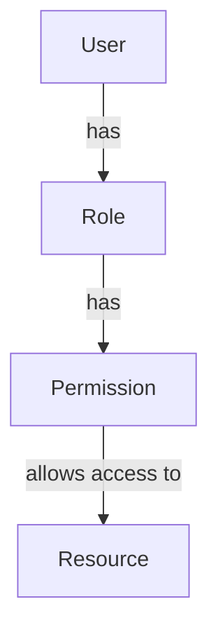
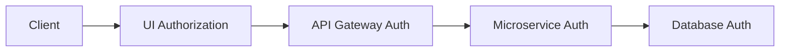
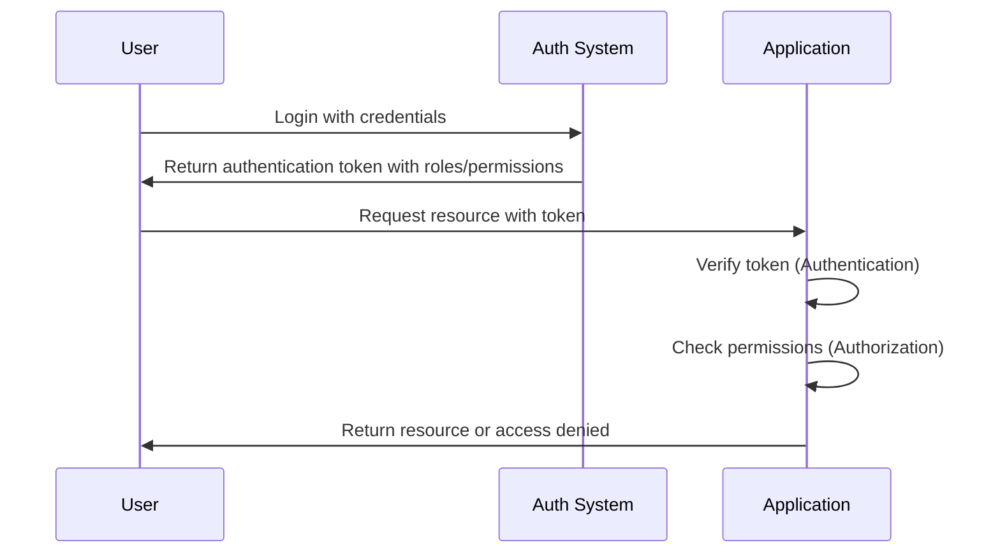

# Authorization

## Introduction

Authorization is a fundamental security concept that determines what a user can **do** within a system once they've been identified. While authentication confirms "who you are," authorization defines "what you're allowed to do."

Think of it like entering a concert venue:
- **Authentication**: The ticket checker verifies your ticket is valid (confirming your identity)
- **Authorization**: The ticket type determines where you can go - general admission, VIP section, backstage, etc.

In this guide, we'll explore authorization concepts, implementation strategies, and best practices to help you build secure applications.

## What is Authorization?

Authorization is the process of determining whether a user, service, or application has permission to access a resource or perform an action. It's implemented through various mechanisms including:

- Role-based access control
- Attribute-based access control  
- Permission systems
- Access control lists

Let's break down the key concepts and see how to implement them in your applications.

## Core Authorization Concepts

### 1. Resources and Actions

Authorization revolves around protecting **resources** and controlling **actions**:

- **Resources**: What you're protecting (data, files, API endpoints, UI components)
- **Actions**: What can be done to resources (read, write, delete, update)

### 2. Common Authorization Models

#### Role-Based Access Control (RBAC)

In RBAC, permissions are assigned to roles, and users are assigned to one or more roles.



**Example**: In a blog application:
- Admin role: Can create, read, update, and delete any post
- Editor role: Can create, read, and update posts
- Reader role: Can only read posts

#### Attribute-Based Access Control (ABAC)

ABAC makes access decisions based on attributes of:
- The user (department, security clearance)
- The resource (classification, owner)
- The action (read, write)
- The environment (time, location)

This provides more fine-grained control than RBAC.

#### Permission-Based Systems

Direct mapping between users and permissions without necessarily using roles as intermediaries.

#### Access Control Lists (ACLs)

ACLs specify which users or system processes have access to objects, and what operations are allowed.

## Implementation Examples

Let's look at practical examples of implementing authorization in different contexts:

### Example 1: Express.js Role-Based Authorization

```javascript
// Middleware for checking role-based authorization
function requireRole(role) {
  return (req, res, next) => {
    // Assuming user and roles are attached during authentication
    if (!req.user) {
      return res.status(401).json({ message: "Unauthorized" });
    }
    
    if (!req.user.roles.includes(role)) {
      return res.status(403).json({ message: "Forbidden: Insufficient permissions" });
    }
    
    next();
  };
}

// Using the middleware in routes
app.get('/admin/dashboard', requireRole('admin'), (req, res) => {
  res.send('Admin Dashboard');
});

app.get('/posts', requireRole('user'), (req, res) => {
  res.send('User content');
});
```

### Example 2: Permission-Based Authorization with React

```jsx
// A simple authorization component
function AuthorizedComponent({ permissions, requiredPermission, children }) {
  const hasPermission = permissions.includes(requiredPermission);
  
  if (!hasPermission) {
    return null; // Or return an "Access Denied" component
  }
  
  return children;
}

// Usage in a component
function Dashboard({ user }) {
  return (
    <div>
      <h1>Dashboard</h1>
      
      {/* Only render if user has 'view_reports' permission */}
      <AuthorizedComponent 
        permissions={user.permissions} 
        requiredPermission="view_reports"
      >
        <ReportsSection />
      </AuthorizedComponent>
      
      {/* Only render if user has 'manage_users' permission */}
      <AuthorizedComponent 
        permissions={user.permissions} 
        requiredPermission="manage_users"
      >
        <UserManagement />
      </AuthorizedComponent>
    </div>
  );
}
```

### Example 3: JWT-Based Authorization

JSON Web Tokens (JWTs) can contain authorization information in their payload:

```javascript
// Creating a JWT with role information
const jwt = require('jsonwebtoken');

function generateToken(user) {
  const payload = {
    id: user.id,
    email: user.email,
    roles: user.roles,
    permissions: user.permissions
  };
  
  return jwt.sign(payload, process.env.JWT_SECRET, { expiresIn: '1h' });
}

// Verifying and using the JWT for authorization
function authorizeAdmin(req, res, next) {
  const token = req.headers.authorization?.split(' ')[1];
  
  if (!token) {
    return res.status(401).json({ message: 'Authentication required' });
  }
  
  try {
    const decoded = jwt.verify(token, process.env.JWT_SECRET);
    
    // Check if user has admin role
    if (!decoded.roles.includes('admin')) {
      return res.status(403).json({ message: 'Insufficient permissions' });
    }
    
    req.user = decoded;
    next();
  } catch (error) {
    return res.status(401).json({ message: 'Invalid token' });
  }
}
```

## Best Practices for Authorization

### 1. Principle of Least Privilege

Only grant the minimum access necessary for users to perform their jobs. This limits the potential damage from compromised accounts.

### 2. Defense in Depth

Implement authorization checks at multiple levels:
- Frontend (UI rendering)
- API gateway
- Service level
- Database level



### 3. Regularly Audit and Review

- Periodically review user permissions
- Use logging to track authorization decisions
- Implement alerts for suspicious access patterns

### 4. Centralize Authorization Logic

Avoid scattered authorization checks throughout your code. Use a centralized authorization service or library.

### 5. Fail Securely

Default to denying access when authorization checks fail or encounter errors.

```javascript
function checkAccess(user, resource) {
  try {
    // Complex authorization logic here
    return authorizationService.hasAccess(user, resource);
  } catch (error) {
    console.error("Authorization check failed:", error);
    return false; // Fail securely by denying access
  }
}
```

## Common Authorization Pitfalls

### Direct Object References

Exposing internal resource identifiers can lead to insecure direct object reference vulnerabilities.

**Vulnerable code:**
```javascript
app.get('/api/documents/:id', (req, res) => {
  // No authorization check!
  database.getDocument(req.params.id)
    .then(doc => res.json(doc));
});
```

**Fixed code:**
```javascript
app.get('/api/documents/:id', (req, res) => {
  const documentId = req.params.id;
  const userId = req.user.id;
  
  // Check if user has access to this document
  database.checkAccess(userId, documentId)
    .then(hasAccess => {
      if (!hasAccess) {
        return res.status(403).json({ error: 'Access denied' });
      }
      
      return database.getDocument(documentId);
    })
    .then(doc => res.json(doc))
    .catch(err => res.status(500).json({ error: err.message }));
});
```

### Missing Authorization Checks

Forgetting to implement authorization checks on all protected resources.

### Relying Solely on Frontend Authorization

Frontend authorization is easily bypassed by crafting direct requests to your API.

## Integrating Authentication and Authorization

Authentication and authorization work together to create a secure system:



## Summary

Authorization is a critical security concept that determines what authenticated users can access or do within your system. Key takeaways include:

- Authorization is different from authentication - it's about permissions, not identity
- Common models include RBAC, ABAC, and permission-based systems
- Implement authorization at multiple levels for defense in depth
- Follow the principle of least privilege
- Centralize authorization logic when possible
- Always implement server-side authorization checks, regardless of client-side validation

By implementing proper authorization in your applications, you create a secure environment where users can only access the resources and perform the actions appropriate for their roles and permissions.

## Exercise: Building a Simple Authorization System

Try implementing a simple role-based authorization system for a Todo application where:
1. Admins can view, create, update, and delete any todo
2. Users can view all todos but only update or delete their own
3. Guests can only view todos

## Additional Resources

- [OWASP Authorization Cheat Sheet](https://cheatsheetseries.owasp.org/cheatsheets/Authorization_Cheat_Sheet.html)
- [NIST Guide to Authorization](https://csrc.nist.gov/publications/detail/sp/800-162/final)
- Libraries and frameworks:
  - [Casbin](https://casbin.org/) - An authorization library supporting various access control models
  - [CASL](https://casl.js.org/) - JavaScript ability management library
  - [Spring Security](https://spring.io/projects/spring-security) - Comprehensive security for Java applications