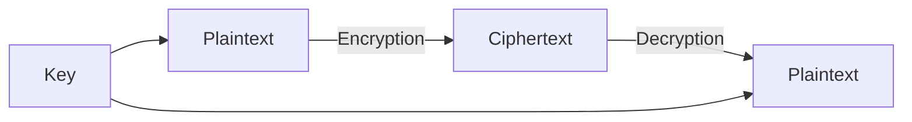
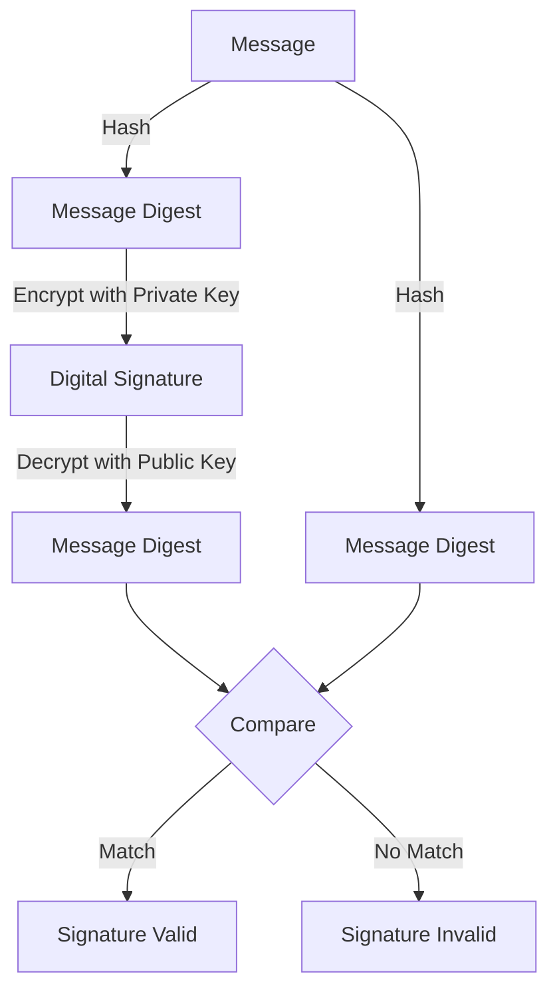

# Cryptography Basics

## Introduction

Cryptography is the science of securing information by transforming it into a format that is unreadable to unauthorized parties. In today's digital world, cryptography plays a crucial role in protecting sensitive data, ensuring privacy, and establishing secure communication channels. 

Whether you're building a login system, storing passwords, or transmitting sensitive information over the internet, understanding cryptography basics is essential for any programmer.

## What is Cryptography?

At its core, cryptography is about **converting plaintext (readable data) into ciphertext (scrambled data)** and back again. This process involves:

- **Encryption**: Converting plaintext to ciphertext
- **Decryption**: Converting ciphertext back to plaintext
- **Keys**: Secret values used in the encryption/decryption processes



## Key Cryptographic Concepts

### Symmetric Encryption

In symmetric encryption, the **same key** is used for both encryption and decryption. It's like having a single key that locks and unlocks your data.

**Example**: AES (Advanced Encryption Standard)

```javascript
// Example of AES encryption in Node.js
const crypto = require('crypto');

// The data to encrypt
const plaintext = 'This is a secret message';

// The encryption key (must be 32 bytes for AES-256)
const key = crypto.randomBytes(32);

// The initialization vector (must be 16 bytes for AES)
const iv = crypto.randomBytes(16);

// Create the cipher
const cipher = crypto.createCipheriv('aes-256-cbc', key, iv);

// Encrypt the data
let ciphertext = cipher.update(plaintext, 'utf8', 'hex');
ciphertext += cipher.final('hex');

console.log('Original text:', plaintext);
console.log('Encrypted text:', ciphertext);

// Now let's decrypt it
const decipher = crypto.createDecipheriv('aes-256-cbc', key, iv);
let decrypted = decipher.update(ciphertext, 'hex', 'utf8');
decrypted += decipher.final('utf8');

console.log('Decrypted text:', decrypted);
```

**Output**:
```
Original text: This is a secret message
Encrypted text: 7a8f839e9a49647d52b81f72d33c5b312a881c6a99e3c38fa9b9d3c7ba62501f
Decrypted text: This is a secret message
```

**Advantages**:
- Fast and efficient for large amounts of data
- Relatively simple to implement

**Disadvantages**:
- Key distribution problem: How do you securely share the key?

### Asymmetric Encryption (Public-Key Cryptography)

Asymmetric encryption uses **two different keys**:
- A **public key** for encryption
- A **private key** for decryption

Anyone can encrypt a message using your public key, but only you can decrypt it with your private key.


**Example**: RSA (Rivest–Shamir–Adleman)

```javascript
// Example of RSA encryption in Node.js
const crypto = require('crypto');

// Generate RSA key pair
const { publicKey, privateKey } = crypto.generateKeyPairSync('rsa', {
  modulusLength: 2048,
  publicKeyEncoding: {
    type: 'spki',
    format: 'pem'
  },
  privateKeyEncoding: {
    type: 'pkcs8',
    format: 'pem'
  }
});

// The data to encrypt
const plaintext = 'This is a secret message';

// Encrypt with public key
const encryptedData = crypto.publicEncrypt(
  publicKey,
  Buffer.from(plaintext)
);

console.log('Original text:', plaintext);
console.log('Encrypted data:', encryptedData.toString('base64'));

// Decrypt with private key
const decryptedData = crypto.privateDecrypt(
  privateKey,
  encryptedData
);

console.log('Decrypted text:', decryptedData.toString());
```

**Output**:
```
Original text: This is a secret message
Encrypted data: KF9d5JxrCnBDEuMsx6... (long base64 string)
Decrypted text: This is a secret message
```

**Advantages**:
- Solves the key distribution problem
- Enables secure communication without prior key exchange

**Disadvantages**:
- Much slower than symmetric encryption
- Not practical for encrypting large amounts of data

### Cryptographic Hashing

Hashing is a one-way function that converts data of any size into a fixed-size string. Unlike encryption, hashing is **not reversible** - you cannot convert a hash back to the original data.

Properties of a good hash function:
- **Deterministic**: Same input always produces the same output
- **Quick**: Computation is fast
- **Irreversible**: Cannot derive the original input from the hash
- **Unique**: Different inputs should produce different outputs (avoid collisions)

**Example**: SHA-256 (Secure Hash Algorithm)

```javascript
const crypto = require('crypto');

function hashPassword(password) {
  return crypto.createHash('sha256').update(password).digest('hex');
}

const password = 'mySecurePassword123';
const hashedPassword = hashPassword(password);

console.log('Original password:', password);
console.log('Hashed password:', hashedPassword);

// Verifying a password
function verifyPassword(inputPassword, storedHash) {
  const inputHash = hashPassword(inputPassword);
  return inputHash === storedHash;
}

console.log('Password correct:', verifyPassword('mySecurePassword123', hashedPassword));
console.log('Password incorrect:', verifyPassword('wrongPassword', hashedPassword));
```

**Output**:
```
Original password: mySecurePassword123
Hashed password: 8e95c0b33393c517c4c5be14f29dd9ce2159b132b3190cd697beb278894f766b
Password correct: true
Password incorrect: false
```

### Password Hashing (Salting)

Simple hashing isn't enough for passwords. We need to add "salt" - random data that makes each hash unique even for identical passwords.

```javascript
const crypto = require('crypto');

function hashPasswordWithSalt(password) {
  // Generate a random salt
  const salt = crypto.randomBytes(16).toString('hex');
  
  // Hash password with salt
  const hash = crypto.pbkdf2Sync(password, salt, 1000, 64, 'sha512').toString('hex');
  
  // Return both salt and hash
  return { salt, hash };
}

function verifyPasswordWithSalt(password, salt, storedHash) {
  const hash = crypto.pbkdf2Sync(password, salt, 1000, 64, 'sha512').toString('hex');
  return hash === storedHash;
}

// Example usage
const password = 'mySecurePassword123';
const { salt, hash } = hashPasswordWithSalt(password);

console.log('Salt:', salt);
console.log('Hashed password:', hash);

// Verify password
console.log('Password correct:', verifyPasswordWithSalt(password, salt, hash));
console.log('Password incorrect:', verifyPasswordWithSalt('wrongPassword', salt, hash));
```

**Output**:
```
Salt: 3a1c02dc4b9c2e8b7a5fd9e982d3c8a1
Hashed password: 68d7573226b3b2c43b74c92... (long hex string)
Password correct: true
Password incorrect: false
```

### Digital Signatures

Digital signatures combine hashing and asymmetric encryption to provide:
- **Authentication**: Verification of who sent a message
- **Non-repudiation**: Sender cannot deny sending the message
- **Integrity**: Detect if the message was altered



**Example**: Digital Signature with RSA

```javascript
const crypto = require('crypto');

// Generate RSA key pair
const { publicKey, privateKey } = crypto.generateKeyPairSync('rsa', {
  modulusLength: 2048,
  publicKeyEncoding: {
    type: 'spki',
    format: 'pem'
  },
  privateKeyEncoding: {
    type: 'pkcs8',
    format: 'pem'
  }
});

// Original message
const message = 'This message needs to be authenticated';

// Sign the message
function signMessage(message, privateKey) {
  const signer = crypto.createSign('SHA256');
  signer.update(message);
  return signer.sign(privateKey, 'base64');
}

// Verify the signature
function verifySignature(message, signature, publicKey) {
  const verifier = crypto.createVerify('SHA256');
  verifier.update(message);
  return verifier.verify(publicKey, signature, 'base64');
}

// Create signature
const signature = signMessage(message, privateKey);
console.log('Message:', message);
console.log('Signature:', signature);

// Verify authentic message
console.log('Authentic message verified:', verifySignature(message, signature, publicKey));

// Verify tampered message
console.log('Tampered message verified:', verifySignature('Tampered message', signature, publicKey));
```

**Output**:
```
Message: This message needs to be authenticated
Signature: j8KKt2zC3YmQP... (long base64 string)
Authentic message verified: true
Tampered message verified: false
```

## Real-World Applications

### 1. Secure Communication (HTTPS)

When you visit a website with HTTPS, your browser:
1. Gets the server's public key
2. Uses asymmetric encryption to securely exchange a symmetric key
3. Uses this symmetric key for faster encryption of all subsequent data

This hybrid approach combines the security of asymmetric encryption with the speed of symmetric encryption.

### 2. Secure Password Storage

Never store plaintext passwords! Instead, websites should:
1. Generate a unique salt for each user
2. Hash the password with the salt using a strong algorithm (bcrypt, Argon2)
3. Store the salt and hash, not the original password
4. When a user logs in, hash their provided password with the stored salt and compare

```javascript
// Using the bcrypt library (you would need to install it)
const bcrypt = require('bcrypt');

async function hashPassword(password) {
  // The salt rounds determine the complexity
  const saltRounds = 10;
  return await bcrypt.hash(password, saltRounds);
}

async function verifyPassword(password, hash) {
  return await bcrypt.compare(password, hash);
}

// Usage
async function example() {
  const password = 'userPassword123';
  
  // When a user registers
  const hashedPassword = await hashPassword(password);
  console.log('Stored hash:', hashedPassword);
  
  // When a user logs in
  const loginAttempt1 = await verifyPassword(password, hashedPassword);
  const loginAttempt2 = await verifyPassword('wrongPassword', hashedPassword);
  
  console.log('Correct password:', loginAttempt1); // true
  console.log('Wrong password:', loginAttempt2);   // false
}

example();
```

### 3. Digital Certificates and Public Key Infrastructure (PKI)

Digital certificates solve the trust problem in public key cryptography:
- A trusted Certificate Authority (CA) issues certificates
- These certificates verify the identity of entities and their public keys
- Your browser comes pre-installed with trusted CA certificates
- This creates a "chain of trust" for validating website identities

## Common Cryptographic Algorithms

### Symmetric Encryption
- **AES (Advanced Encryption Standard)**: The current standard, with key sizes of 128, 192, or 256 bits
- **ChaCha20**: A newer algorithm, often paired with Poly1305 for authentication

### Asymmetric Encryption
- **RSA**: The most widely used, based on the difficulty of factoring large primes
- **ECC (Elliptic Curve Cryptography)**: Offers similar security with smaller keys
- **Ed25519**: A modern elliptic curve algorithm for digital signatures

### Hashing Functions
- **SHA-2 Family**: Including SHA-256, widely used and considered secure
- **SHA-3**: The newest member of the Secure Hash Algorithm family
- **BLAKE2**: A faster alternative to SHA-3

### Password Hashing
- **Bcrypt**: Designed specifically for password hashing, includes salt
- **Argon2**: Winner of the Password Hashing Competition, resistant to various attacks
- **PBKDF2**: Widely supported key derivation function

## Best Practices

1. **Don't roll your own crypto**: Use established libraries and algorithms
2. **Keep keys secure**: Never hardcode keys in your application
3. **Use appropriate key lengths**: Follow current recommendations (e.g., 256-bit for AES)
4. **Implement proper key management**: Rotate keys regularly
5. **Stay updated**: Cryptographic algorithms can become insecure over time
6. **Use authenticated encryption**: Ensures both confidentiality and integrity
7. **Apply the principle of least privilege**: Limit what can be accessed with a given key

## Summary

Cryptography provides the foundation for security in the digital world. We've covered:
- Symmetric and asymmetric encryption
- Cryptographic hashing
- Password security with salting
- Digital signatures
- Real-world applications

Understanding these concepts is essential for building secure applications that protect user data and maintain privacy.

## Exercises

1. Implement a simple file encryption tool using AES.
2. Create a password hashing system using bcrypt or Argon2.
3. Build a digital signature verification system for message authentication.
4. Compare the performance of different hashing algorithms on large datasets.
5. Research quantum cryptography and how it might affect current encryption methods.

## Additional Resources

- [NIST Cryptographic Standards](https://www.nist.gov/cryptography)
- [Crypto101](https://www.crypto101.io/) - A free introductory course on cryptography
- [The Cryptopals Crypto Challenges](https://cryptopals.com/) - Practical exercises
- [MDN Web Crypto API](https://developer.mozilla.org/en-US/docs/Web/API/Web_Crypto_API) - For web developers
- [Node.js Crypto Documentation](https://nodejs.org/api/crypto.html) - For Node.js developers