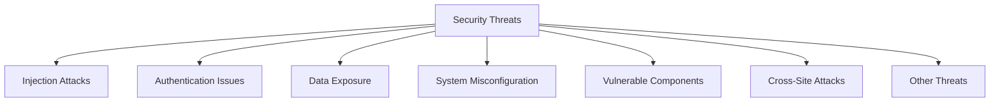

# Security Threats

## Introduction

In today's interconnected digital world, security threats pose significant risks to software applications, systems, and user data. As a programmer, understanding these threats is the first step toward building secure applications. This guide introduces common security threats that beginners should be aware of, explaining how they work and providing practical ways to defend against them.

## What Are Security Threats?

Security threats are potential dangers that could exploit vulnerabilities in your code or systems to cause harm. These threats can come from various sources and target different aspects of your application.



## Common Security Threats

### 1. Injection Attacks

Injection attacks occur when untrusted data is sent to an interpreter as part of a command or query, tricking it into executing unintended commands or accessing unauthorized data.

#### SQL Injection Example

A SQL injection attack targets databases by inserting malicious SQL code into input fields.

**Vulnerable Code:**

```javascript
// Vulnerable code - Never do this!
function getUserData(username) {
  const query = `SELECT * FROM users WHERE username = '${username}'`;
  return database.execute(query);
}

// If username input is: admin' OR '1'='1
// The resulting query becomes:
// SELECT * FROM users WHERE username = 'admin' OR '1'='1'
// This returns ALL users!
```

**Secure Code:**

```javascript
// Secure code using parameterized queries
function getUserData(username) {
  const query = `SELECT * FROM users WHERE username = ?`;
  return database.execute(query, [username]);
}
```

### 2. Broken Authentication

Authentication vulnerabilities allow attackers to impersonate legitimate users by stealing or bypassing the authentication mechanisms.

**Common Issues:**
- Weak password policies
- Poorly implemented session management
- Missing multi-factor authentication

**Example of Secure Session Management:**

```javascript
// Setting a secure cookie
app.use(session({
  secret: 'a-strong-secret-key',
  name: 'sessionId',
  cookie: {
    httpOnly: true,         // Prevents JavaScript access
    secure: true,           // Only sent over HTTPS
    sameSite: 'strict',     // Prevents CSRF attacks
    maxAge: 3600000         // 1 hour expiration
  },
  resave: false,
  saveUninitialized: false
}));
```

### 3. Sensitive Data Exposure

This occurs when applications don't adequately protect sensitive information such as passwords, credit card numbers, or personal information.

**Bad Practice:**

```javascript
// NEVER store passwords like this
const user = {
  username: "johndoe",
  password: "password123"  // Stored in plaintext 😱
};
```

**Good Practice:**

```javascript
// Proper password hashing with bcrypt
const bcrypt = require('bcrypt');

async function storePassword(plainPassword) {
  const saltRounds = 12;
  const hashedPassword = await bcrypt.hash(plainPassword, saltRounds);
  
  // Store hashedPassword in database, not the plain password
  return hashedPassword;
}

async function verifyPassword(plainPassword, storedHash) {
  return await bcrypt.compare(plainPassword, storedHash);
}
```

### 4. Cross-Site Scripting (XSS)

XSS attacks involve injecting malicious scripts into websites that are then executed in users' browsers.

**Vulnerable Code:**

```javascript
// Dangerous - directly inserting user input into HTML
function showComment(userComment) {
  document.getElementById('comments').innerHTML += userComment;
}

// If userComment contains: <script>stealCookies()</script>
// This script will run in the browser of anyone viewing the page
```

**Safer Approach:**

```javascript
// Sanitize user input before displaying
function showComment(userComment) {
  const sanitizedComment = DOMPurify.sanitize(userComment);
  document.getElementById('comments').innerHTML += sanitizedComment;
}
```

### 5. Cross-Site Request Forgery (CSRF)

CSRF tricks users into performing unwanted actions on a site where they're authenticated.

**Protection Example:**

```javascript
// Using CSRF tokens in a form
const csrfToken = generateCSRFToken();

// In your HTML form
function renderForm() {
  return `
    <form action="/transfer" method="POST">
      <input type="hidden" name="csrf_token" value="${csrfToken}" />
      <input type="text" name="amount" placeholder="Amount" />
      <input type="text" name="recipient" placeholder="Recipient" />
      <button type="submit">Transfer</button>
    </form>
  `;
}

// On the server
function handleTransfer(req, res) {
  if (!validateCSRFToken(req.body.csrf_token)) {
    return res.status(403).send('Invalid CSRF token');
  }
  
  // Process the transfer if token is valid
  // ...
}
```

### 6. Security Misconfiguration

Security misconfiguration happens when security settings are implemented incorrectly or left at default unsafe values.

**Common Misconfigurations:**
- Default accounts and passwords left unchanged
- Unnecessary services running on servers
- Error handling that reveals sensitive information
- Missing security headers

**Adding Security Headers Example:**

```javascript
// Express.js security headers
const helmet = require('helmet');
app.use(helmet());

// This automatically adds headers like:
// X-XSS-Protection: 1; mode=block
// X-Frame-Options: SAMEORIGIN
// Content-Security-Policy: default-src 'self'
// And many more
```

### 7. Using Components with Known Vulnerabilities

Using outdated or vulnerable libraries, frameworks, or other software components creates easy entry points for attackers.

**Best Practices:**

```bash
# Checking for vulnerable dependencies in Node.js
npm audit

# Output example:
# found 3 vulnerabilities (1 low, 1 moderate, 1 high)
#   run `npm audit fix` to fix them
```

```javascript
// Keep your package.json updated and set version constraints appropriately
{
  "dependencies": {
    "express": "^4.18.2",
    "mongoose": "~6.9.1"
  }
}
```

## Real-World Security Incident Example

In 2017, Equifax experienced a massive data breach affecting 147 million people. The cause? A vulnerability in Apache Struts that had a patch available for months, but hadn't been applied. This incident demonstrates how failure to update components with known vulnerabilities can lead to catastrophic security breaches.

## Defensive Programming Practices

### Input Validation

Always validate user input on both client and server sides.

```javascript
// Client-side validation (helpful but not sufficient alone)
function validateForm() {
  const email = document.getElementById('email').value;
  const emailRegex = /^[^\s@]+@[^\s@]+\.[^\s@]+$/;
  
  if (!emailRegex.test(email)) {
    document.getElementById('emailError').textContent = 'Please enter a valid email address';
    return false;
  }
  
  return true;
}

// Server-side validation (essential)
function validateEmail(email) {
  const emailRegex = /^[^\s@]+@[^\s@]+\.[^\s@]+$/;
  return emailRegex.test(email);
}

// Using a validation library like Joi
const schema = Joi.object({
  username: Joi.string().alphanum().min(3).max(30).required(),
  password: Joi.string().pattern(new RegExp('^[a-zA-Z0-9]{8,30}$')).required(),
  email: Joi.string().email().required()
});

const { error, value } = schema.validate({ username, password, email });
```

### Principle of Least Privilege

Give users and components only the access rights they need to perform their functions.

```javascript
// Example: Database user with limited permissions
const dbConfig = {
  username: 'app_readonly_user',
  password: 'secure_password',
  host: 'database.example.com',
  privileges: ['SELECT'] // Read-only access, cannot modify data
};
```

## Security Testing

Regular security testing helps identify vulnerabilities before attackers can exploit them.

### Types of Security Testing:

1. **Static Application Security Testing (SAST)** - Analyzes source code for security issues

```bash
# Using ESLint with security plugins for JavaScript
npm install eslint eslint-plugin-security

# In your .eslintrc file
{
  "plugins": ["security"],
  "extends": ["plugin:security/recommended"]
}
```

2. **Dynamic Application Security Testing (DAST)** - Tests running applications for vulnerabilities

3. **Penetration Testing** - Simulated attacks to find exploitable vulnerabilities

## Summary

Security threats are constantly evolving, and as a programmer, staying informed and vigilant is crucial. This guide introduced the most common security threats you'll encounter:

- Injection attacks
- Authentication issues
- Sensitive data exposure
- Cross-site scripting (XSS)
- Cross-site request forgery (CSRF)
- Security misconfigurations
- Vulnerable components

Remember that security is not a one-time task but an ongoing process. Regularly updating your knowledge, testing your applications, and following security best practices will help protect your code and your users.

## Exercises

1. Review a piece of code you've written and identify potential security vulnerabilities.
2. Write a function that securely stores and validates user passwords.
3. Create a simple login form with proper CSRF protection.
4. Set up a static code analysis tool for a project and fix any security issues it identifies.

## Additional Resources

- [OWASP Top Ten](https://owasp.org/www-project-top-ten/) - A standard awareness document for developers about the most critical security risks
- [Mozilla Web Security](https://developer.mozilla.org/en-US/docs/Web/Security) - Comprehensive web security documentation
- [NodeJS Security Best Practices](https://nodejs.org/en/docs/guides/security/) - Official Node.js security guidelines
- [NIST Cybersecurity Framework](https://www.nist.gov/cyberframework) - Guidelines for improving critical infrastructure cybersecurity