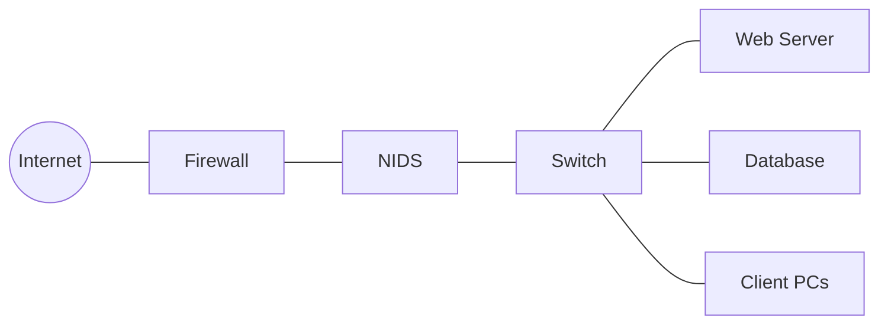

# Intrusion Detection

## Introduction

Intrusion Detection is a critical component of modern cybersecurity that helps identify unauthorized access attempts and potential security breaches. Think of it as a security camera or alarm system for your digital assets. Just as physical security systems detect break-ins, intrusion detection systems (IDS) monitor your networks and systems for suspicious activities that might indicate a security incident in progress.

As programming beginners venturing into cybersecurity, understanding intrusion detection provides you with essential knowledge to protect applications and systems you develop in the future.

## What is Intrusion Detection?

Intrusion detection is the process of monitoring networks, systems, and data for unauthorized access or activities that violate security policies. The main goal is to identify potential security incidents, record information about them, and report these findings.

### Key Components of Intrusion Detection

1. **Data Collection**: Gathering information from various sources like network traffic, system logs, and application activities
2. **Analysis**: Examining the collected data to identify suspicious patterns
3. **Detection**: Identifying potential intrusions based on known patterns or anomalies
4. **Alerting**: Notifying administrators about detected threats
5. **Response**: Taking predefined actions to address the detected intrusions

## Types of Intrusion Detection Systems

### Network-based IDS (NIDS)

A Network-based IDS monitors network traffic for suspicious activities. It examines data packets traveling through the network and compares them against a database of known attack signatures or analyzes them for unusual behavior.



### Host-based IDS (HIDS)

A Host-based IDS runs on individual systems and monitors internal activities. It looks for suspicious changes to system files, processes, and registry settings.

### Detection Methods

#### 1. Signature-based Detection

This method compares observed activities against a database of known attack patterns (signatures).

```javascript
// Simple example of signature-based detection logic
function checkForSignature(packet) {
  const knownSignatures = [
    "DELETE FROM users", // SQL injection attempt
    "<script>alert('XSS')</script>", // Cross-site scripting
    "../../../../etc/passwd" // Directory traversal
  ];
  
  for (let signature of knownSignatures) {
    if (packet.content.includes(signature)) {
      return {
        detected: true,
        signatureType: signature,
        threatLevel: "high"
      };
    }
  }
  
  return { detected: false };
}

// Example usage
const packetData = {
  source: "192.168.1.105",
  destination: "192.168.1.10",
  content: "GET /login.php?username=admin&password='; DELETE FROM users; --"
};

const result = checkForSignature(packetData);
console.log(result);
```

**Output:**
```
{
  detected: true,
  signatureType: "DELETE FROM users",
  threatLevel: "high"
}
```

#### 2. Anomaly-based Detection

This approach establishes a baseline of normal behavior and flags activities that deviate significantly from this norm.

```python
# Simple example of anomaly-based detection
def analyze_login_patterns(login_data, threshold=3):
    """
    Detects anomalies in login patterns
    
    Args:
        login_data: Dictionary with user login information
        threshold: Number of standard deviations to consider anomalous
    
    Returns:
        List of anomalous users
    """
    import statistics
    
    # Calculate average logins per user
    login_counts = [data["count"] for user, data in login_data.items()]
    avg_logins = statistics.mean(login_counts)
    std_dev = statistics.stdev(login_counts)
    
    # Detect anomalies
    anomalies = []
    for user, data in login_data.items():
        if data["count"] > avg_logins + (threshold * std_dev):
            anomalies.append({
                "user": user,
                "login_count": data["count"],
                "avg_time": data["avg_time"],
                "reason": "Excessive login attempts"
            })
        elif data["odd_hours"] > 3:
            anomalies.append({
                "user": user,
                "login_count": data["count"],
                "odd_hours": data["odd_hours"],
                "reason": "Unusual login times"
            })
    
    return anomalies

# Example usage
user_data = {
    "alice": {"count": 12, "avg_time": "09:15", "odd_hours": 0},
    "bob": {"count": 8, "avg_time": "10:30", "odd_hours": 1},
    "charlie": {"count": 45, "avg_time": "14:20", "odd_hours": 0},
    "dave": {"count": 10, "avg_time": "02:45", "odd_hours": 5}
}

anomalous_users = analyze_login_patterns(user_data)
for user in anomalous_users:
    print(f"Alert: {user['reason']} detected for {user['user']}")
```

**Output:**
```
Alert: Excessive login attempts detected for charlie
Alert: Unusual login times detected for dave
```

## Implementing a Basic Intrusion Detection System

Let's build a simple rule-based intrusion detection system in JavaScript that monitors login attempts:

```javascript
class SimpleIDS {
  constructor() {
    this.failedLogins = {}; // Track failed login attempts
    this.thresholds = {
      failedLoginAttempts: 5, // Max allowed failed attempts
      loginTimeWindow: 300000, // 5 minutes in milliseconds
      unusualHoursStart: 23, // 11 PM
      unusualHoursEnd: 5 // 5 AM
    };
    this.alerts = [];
  }

  trackLoginAttempt(username, ipAddress, timestamp, successful) {
    // Create record if doesn't exist
    if (!this.failedLogins[ipAddress]) {
      this.failedLogins[ipAddress] = {
        attempts: [],
        blocked: false
      };
    }

    const record = this.failedLogins[ipAddress];
    
    // Clean up old attempts
    const now = timestamp || Date.now();
    record.attempts = record.attempts.filter(attempt => 
      now - attempt.timestamp < this.thresholds.loginTimeWindow
    );

    // Add new attempt if failed
    if (!successful) {
      record.attempts.push({
        username,
        timestamp: now,
        hour: new Date(now).getHours()
      });
    }

    // Check for suspicious activities
    this.detectBruteForce(ipAddress, record);
    this.detectOddHourAttempts(ipAddress, record);
    
    return {
      allowed: !record.blocked,
      alerts: this.getAlerts(ipAddress)
    };
  }

  detectBruteForce(ipAddress, record) {
    if (record.attempts.length >= this.thresholds.failedLoginAttempts) {
      record.blocked = true;
      this.addAlert(ipAddress, 'Possible brute force attack detected', 'high');
    }
  }

  detectOddHourAttempts(ipAddress, record) {
    const oddHourAttempts = record.attempts.filter(attempt => {
      const hour = attempt.hour;
      return hour >= this.thresholds.unusualHoursStart || 
             hour <= this.thresholds.unusualHoursEnd;
    });

    if (oddHourAttempts.length >= 3) {
      this.addAlert(ipAddress, 'Unusual login hour patterns detected', 'medium');
    }
  }

  addAlert(ipAddress, message, severity) {
    this.alerts.push({
      ipAddress,
      message,
      severity,
      timestamp: Date.now()
    });
  }

  getAlerts(ipAddress = null) {
    if (ipAddress) {
      return this.alerts.filter(alert => alert.ipAddress === ipAddress);
    }
    return this.alerts;
  }
}

// Example usage
const ids = new SimpleIDS();

// Simulate login attempts
console.log("Simulating normal login:");
let result = ids.trackLoginAttempt('user1', '192.168.1.100', Date.now(), true);
console.log(result);

console.log("
Simulating failed login attempts (brute force):");
for (let i = 0; i < 6; i++) {
  result = ids.trackLoginAttempt('admin', '192.168.1.101', Date.now(), false);
}
console.log(result);

// Get all alerts
console.log("
All security alerts:");
console.log(ids.getAlerts());
```

**Output:**
```
Simulating normal login:
{ allowed: true, alerts: [] }

Simulating failed login attempts (brute force):
{
  allowed: false,
  alerts: [
    {
      ipAddress: '192.168.1.101',
      message: 'Possible brute force attack detected',
      severity: 'high',
      timestamp: 1616461638426
    }
  ]
}

All security alerts:
[
  {
    ipAddress: '192.168.1.101',
    message: 'Possible brute force attack detected',
    severity: 'high',
    timestamp: 1616461638426
  }
]
```

## Real-world Applications

### 1. Web Application Firewall (WAF)

Modern web applications use intrusion detection concepts to protect against common attacks like SQL injection, cross-site scripting (XSS), and CSRF attacks.

```javascript
// Example of a simple middleware for Express.js that acts as a basic WAF
function simpleWAF(req, res, next) {
  // Check for common SQL injection patterns
  const sqlPatterns = [
    "' OR '1'='1", "-- ", "DROP TABLE", "1=1", "OR 1=1"
  ];
  
  // Check for XSS patterns
  const xssPatterns = [
    "<script>", "javascript:", "onerror=", "onload="
  ];
  
  const requestBody = JSON.stringify(req.body || {});
  const queryString = JSON.stringify(req.query || {});
  const cookies = JSON.stringify(req.cookies || {});
  
  // Combine all request data for checking
  const requestData = requestBody + queryString + cookies;
  
  // Check SQL injection patterns
  for (const pattern of sqlPatterns) {
    if (requestData.toLowerCase().includes(pattern.toLowerCase())) {
      console.log(`[WAF] SQL Injection attempt detected: ${pattern}`);
      return res.status(403).send({ error: "Forbidden" });
    }
  }
  
  // Check XSS patterns
  for (const pattern of xssPatterns) {
    if (requestData.toLowerCase().includes(pattern.toLowerCase())) {
      console.log(`[WAF] XSS attempt detected: ${pattern}`);
      return res.status(403).send({ error: "Forbidden" });
    }
  }
  
  // Request passed security checks
  next();
}

// Usage in Express:
// app.use(simpleWAF);
```

### 2. Network Traffic Monitoring

Organizations use network-based IDS to monitor traffic for unusual patterns or known attack signatures.

```python
# Pseudocode for a network packet analyzer
def analyze_network_packet(packet):
    """Analyzes a network packet for suspicious characteristics"""
    
    suspicious_indicators = []
    
    # Check for unusual ports
    high_risk_ports = [22, 23, 3389, 445, 135, 137, 138, 139]
    if packet.destination_port in high_risk_ports and packet.source_ip.startswith('external_'):
        suspicious_indicators.append(f"Connection attempt to sensitive port {packet.destination_port}")
    
    # Check for unusual protocols
    if packet.protocol not in ['TCP', 'UDP', 'ICMP']:
        suspicious_indicators.append(f"Unusual protocol detected: {packet.protocol}")
    
    # Check payload for malicious content
    if packet.payload:
        if b'\x90' * 10 in packet.payload:  # NOP sled detection (simplified)
            suspicious_indicators.append("Possible NOP sled detected in payload")
        if b'cmd.exe' in packet.payload or b'/bin/sh' in packet.payload:
            suspicious_indicators.append("Shell command detected in payload")
    
    # Generate alert if suspicious indicators found
    if suspicious_indicators:
        generate_alert(packet, suspicious_indicators)
        return True
        
    return False

# Example function call
packet_suspicious = analyze_network_packet({
    'source_ip': 'external_192.168.1.100',
    'destination_ip': '10.0.0.5',
    'source_port': 45123,
    'destination_port': 22,
    'protocol': 'TCP',
    'payload': b'SSH-2.0-OpenSSH\x90\x90\x90\x90\x90\x90\x90\x90\x90\x90\x90cmd.exe /c'
})

print(f"Packet suspicious: {packet_suspicious}")
```

### 3. Endpoint Protection

Endpoint security solutions use host-based intrusion detection to monitor for suspicious processes or file changes.

```javascript
// Simple file integrity monitoring function
class FileIntegrityMonitor {
  constructor() {
    this.fileHashes = new Map(); // Stores file paths and their hashes
  }
  
  // Calculate hash for a file
  calculateHash(filePath) {
    // In a real implementation, this would use crypto libraries to generate a hash
    // This is just a placeholder function
    return "1a2b3c4d5e6f7g8h9i0j";
  }
  
  // Initialize by recording baseline hashes
  initializeBaseline(filePaths) {
    for (const path of filePaths) {
      const hash = this.calculateHash(path);
      this.fileHashes.set(path, hash);
      console.log(`Recorded baseline hash for ${path}: ${hash}`);
    }
  }
  
  // Check if files have been modified
  checkIntegrity() {
    const modifications = [];
    
    for (const [path, originalHash] of this.fileHashes.entries()) {
      const currentHash = this.calculateHash(path);
      
      if (currentHash !== originalHash) {
        modifications.push({
          path,
          originalHash,
          currentHash,
          timestamp: new Date()
        });
      }
    }
    
    return modifications;
  }
}

// Example usage
const monitor = new FileIntegrityMonitor();

// Initialize with critical system files
monitor.initializeBaseline([
  "/etc/passwd",
  "/etc/shadow",
  "/bin/bash",
  "/usr/bin/sudo",
  "C:\\Windows\\System32\\cmd.exe"
]);

// Later, check for modifications
const modifications = monitor.checkIntegrity();
if (modifications.length > 0) {
  console.log("ALERT: File modifications detected!");
  console.log(modifications);
} else {
  console.log("File integrity check passed");
}
```

## Best Practices for Implementing Intrusion Detection

1. **Defense in Depth**: Use multiple layers of security controls
2. **Regular Updates**: Keep your intrusion detection systems updated with the latest threat signatures
3. **Proper Configuration**: Configure your IDS to minimize false positives and false negatives
4. **Log Management**: Maintain comprehensive logs for forensic analysis
5. **Response Plan**: Develop and practice an incident response plan
6. **Monitoring**: Continuously monitor your IDS alerts and logs
7. **Integration**: Integrate your IDS with other security tools for better threat intelligence

## Challenges in Intrusion Detection

1. **False Positives**: Legitimate activities incorrectly identified as intrusions
2. **False Negatives**: Intrusions that go undetected
3. **Performance Impact**: Monitoring can affect system performance
4. **Encryption**: Encrypted traffic can be difficult to inspect
5. **Evolving Threats**: Attackers constantly develop new techniques to evade detection

## Summary

Intrusion detection is a crucial aspect of cybersecurity that helps identify unauthorized access attempts and potential security breaches. We've covered:

- The basic concepts of intrusion detection
- Types of intrusion detection systems (network-based and host-based)
- Detection methods (signature-based and anomaly-based)
- Implementing a basic intrusion detection system
- Real-world applications
- Best practices and challenges

By understanding and implementing intrusion detection mechanisms, you can significantly improve the security posture of your applications and systems.

## Exercises

1. Enhance the `SimpleIDS` class to detect account enumeration (trying multiple usernames from the same IP).
2. Implement a file integrity checker that creates actual file hashes and verifies them periodically.
3. Design a network-based intrusion detection system that can analyze packet headers for unusual patterns.
4. Create a WAF rule that can detect and block common CSRF attacks.
5. Build a log analyzer that can detect login attempts from geographically impossible locations (e.g., logins from different countries within minutes).

## Additional Resources

- OWASP (Open Web Application Security Project)
- NIST Special Publication 800-94: Guide to Intrusion Detection and Prevention Systems
- The Snort IDS/IPS documentation
- "Network Security Bible" by Eric Cole
- "Practical Intrusion Analysis" by Ryan Trost