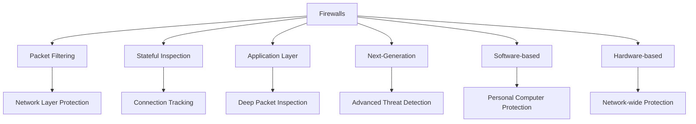
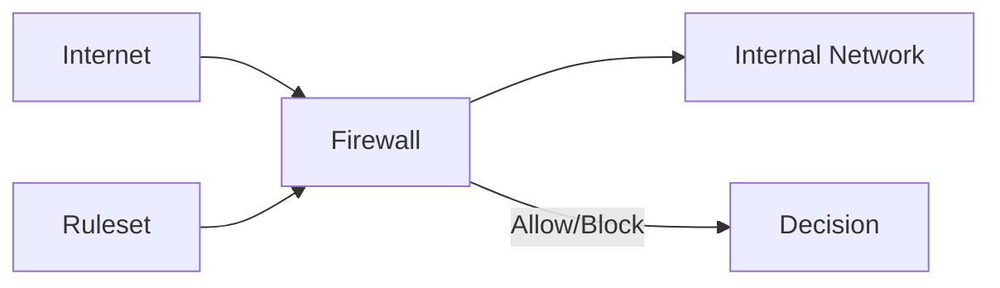
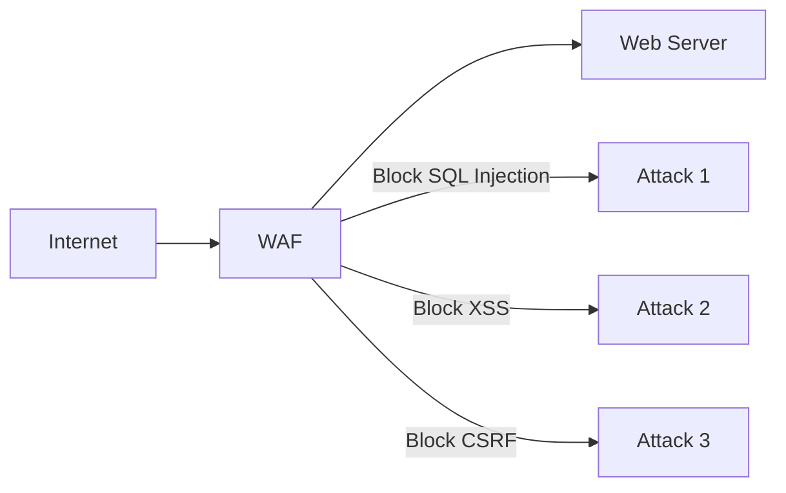
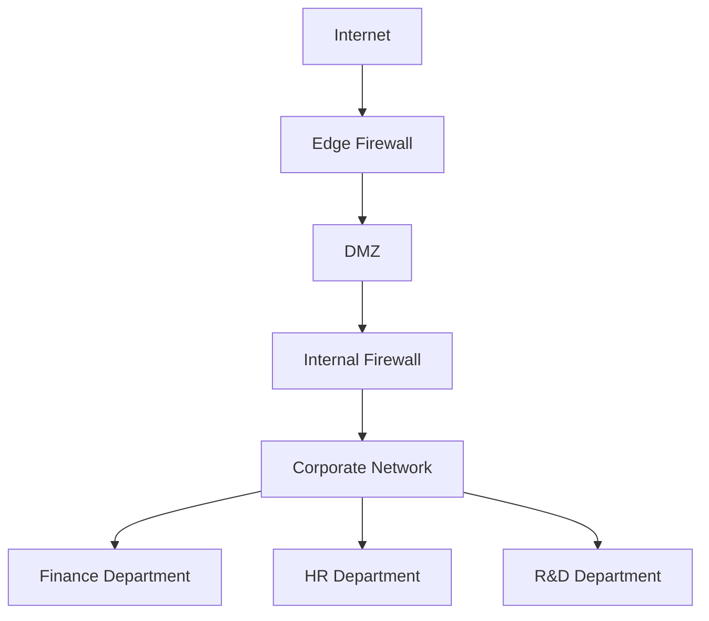

# Firewall Principles

## Introduction

A firewall is one of the most fundamental security components in modern network architecture. Think of a firewall as a security guard standing at the entrance of a building, checking IDs and only allowing authorized people to enter. In the digital realm, firewalls monitor and filter incoming and outgoing network traffic based on predetermined security rules.

This guide will introduce you to firewall principles, explain how they work, and demonstrate their importance in network security, all with practical examples that beginners can understand.

## What is a Firewall?

A firewall is a network security device or software that monitors and filters incoming and outgoing network traffic according to an organization's previously established security policies. At its most basic, a firewall establishes a barrier between a trusted internal network and untrusted external networks, such as the internet.

### Types of Firewalls

1. **Packet Filtering Firewalls**: The most basic type that examines packets in isolation
2. **Stateful Inspection Firewalls**: Track the state of active connections
3. **Application Layer Firewalls**: Operate at the application layer to identify and block suspicious activity
4. **Next-Generation Firewalls (NGFW)**: Combine traditional firewall capabilities with advanced features
5. **Software Firewalls**: Run on individual devices
6. **Hardware Firewalls**: Physical devices that protect entire networks

Let's visualize the relationship between these firewall types:



## How Firewalls Work

Firewalls work by examining packets of data that attempt to enter or leave a network. Each packet is checked against a set of predefined rules. If the packet matches a rule that allows it to pass, it's forwarded to its destination. If it matches a rule that denies passage, or doesn't match any rules, it's blocked.

### Basic Firewall Architecture



## Firewall Rules

Rules are at the heart of firewall functionality. A typical firewall rule includes:

1. **Source and Destination**: IP addresses/ranges
2. **Ports**: Which ports the traffic uses
3. **Protocol**: Usually TCP, UDP, or ICMP
4. **Action**: Allow, deny, or log

Here's a simple example of what firewall rules might look like (in a simplified format):

```
# Allow HTTP traffic to web server
ALLOW TCP SOURCE=any DESTINATION=192.168.1.100 PORT=80

# Allow SSH only from admin network
ALLOW TCP SOURCE=10.0.0.0/24 DESTINATION=any PORT=22

# Block all telnet traffic
DENY TCP SOURCE=any DESTINATION=any PORT=23

# Default rule
DENY all SOURCE=any DESTINATION=any PORT=any
```

## Basic Firewall Implementation in Python

Here's a simple example of how a basic packet-filtering firewall might be implemented in Python. This is for educational purposes only and not for production use:

```python
class SimpleFirewall:
    def __init__(self):
        self.rules = []
        
    def add_rule(self, protocol, source_ip, dest_ip, port, action):
        """Add a rule to the firewall rules list."""
        self.rules.append({
            "protocol": protocol,
            "source_ip": source_ip,
            "dest_ip": dest_ip,
            "port": port,
            "action": action
        })
    
    def check_packet(self, packet):
        """Check if a packet should be allowed through the firewall."""
        for rule in self.rules:
            if (packet["protocol"] == rule["protocol"] and
                (rule["source_ip"] == "any" or packet["source_ip"] == rule["source_ip"]) and
                (rule["dest_ip"] == "any" or packet["dest_ip"] == rule["dest_ip"]) and
                (rule["port"] == "any" or packet["port"] == rule["port"])):
                return rule["action"]
        
        # Default policy: deny if no matching rule
        return "DENY"

# Create a firewall instance
fw = SimpleFirewall()

# Add some rules
fw.add_rule("TCP", "192.168.1.5", "10.0.0.10", 80, "ALLOW")  # Allow HTTP from specific IP
fw.add_rule("UDP", "any", "any", 53, "ALLOW")               # Allow DNS queries
fw.add_rule("TCP", "any", "any", 22, "DENY")                # Block SSH

# Test some packets
test_packets = [
    {"protocol": "TCP", "source_ip": "192.168.1.5", "dest_ip": "10.0.0.10", "port": 80},  # Should be allowed
    {"protocol": "TCP", "source_ip": "192.168.1.6", "dest_ip": "10.0.0.10", "port": 80},  # Should be denied
    {"protocol": "UDP", "source_ip": "8.8.8.8", "dest_ip": "192.168.1.1", "port": 53},    # Should be allowed
    {"protocol": "TCP", "source_ip": "192.168.1.100", "dest_ip": "10.0.0.10", "port": 22}  # Should be denied
]

# Check each packet
for i, packet in enumerate(test_packets):
    result = fw.check_packet(packet)
    print(f"Packet {i+1}: {result}")
```

Expected output:

```
Packet 1: ALLOW
Packet 2: DENY
Packet 3: ALLOW
Packet 4: DENY
```

## Real-World Firewall Examples

### Example 1: Home Network Protection

Most home routers include basic firewall functionality. They typically:

- Allow all outgoing traffic
- Block incoming traffic unless it's in response to a request from inside the network
- Have specific port exceptions for services like gaming or remote access

### Example 2: Web Application Firewall

Web Application Firewalls (WAFs) protect web applications by filtering and monitoring HTTP traffic:



A WAF might block requests containing SQL injection attempts like:

```
https://example.com/products?category=Electronics' OR 1=1--
```

### Example 3: Enterprise Network Segmentation

In enterprise environments, firewalls are used to create security zones:



## Best Practices for Firewall Configuration

1. **Default Deny Policy**: Block all traffic by default and only allow what's necessary
2. **Regular Updates**: Keep firewall software/firmware up to date
3. **Proper Logging**: Configure logging to detect potential security incidents
4. **Rule Audit**: Regularly review and clean up unnecessary rules
5. **Layered Security**: Use firewalls as part of a comprehensive security strategy

## Setting Up a Basic Firewall with `iptables`

Linux systems often use `iptables` for firewall configuration. Here's a basic setup:

```bash
# Flush existing rules
iptables -F

# Set default policies
iptables -P INPUT DROP
iptables -P FORWARD DROP
iptables -P OUTPUT ACCEPT

# Allow established connections
iptables -A INPUT -m conntrack --ctstate ESTABLISHED,RELATED -j ACCEPT

# Allow local loopback
iptables -A INPUT -i lo -j ACCEPT

# Allow SSH (port 22)
iptables -A INPUT -p tcp --dport 22 -j ACCEPT

# Allow HTTP and HTTPS
iptables -A INPUT -p tcp --dport 80 -j ACCEPT
iptables -A INPUT -p tcp --dport 443 -j ACCEPT

# Save the rules (Debian/Ubuntu)
iptables-save > /etc/iptables/rules.v4
```

## Firewall Limitations

While firewalls are essential security tools, they have limitations:

1. They can't protect against:
   - Authorized users with malicious intent
   - Attacks from within the network
   - Encrypted malicious traffic
   - Social engineering attacks

2. Performance considerations:
   - More complex rules can impact network speed
   - Deep packet inspection requires more resources

## Summary

Firewalls are essential components of network security that monitor and control incoming and outgoing network traffic based on predetermined security rules. They act as a barrier between trusted and untrusted networks, helping protect against unauthorized access and cyber threats.

Key points to remember:

- Firewalls can be hardware devices or software applications
- They work by enforcing rules that specify what traffic is allowed or blocked
- Different types of firewalls provide different levels of protection
- Firewalls should be part of a comprehensive security strategy, not the only measure

## Practice Exercises

1. **Research Exercise**: Compare the firewall capabilities of Windows, macOS, and a common Linux distribution.

2. **Configuration Exercise**: Try setting up a basic software firewall on your personal computer and create rules to:
   - Allow web browsing
   - Block a specific website or IP address
   - Allow a specific application to access the network

3. **Conceptual Exercise**: For each of these scenarios, describe what type of firewall would be most appropriate and why:
   - A small business with 10 employees
   - An enterprise with sensitive financial data
   - A personal laptop used in public wifi networks

## Additional Resources

- [NIST Guidelines on Firewall Policy](https://www.nist.gov/)
- [OWASP Web Application Firewall Guide](https://owasp.org/)
- Online courses on network security fundamentals
- Books on network security for beginners