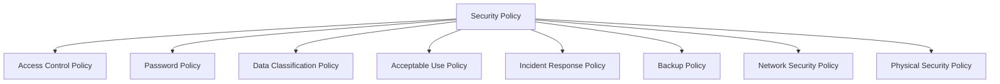

# Security Policies

## Introduction

Security policies are formal documents that outline rules, guidelines, and practices designed to protect an organization's information systems, data, and resources from unauthorized access and threats. For programmers, understanding security policies is crucial as they provide a framework for developing secure applications and systems.

Think of security policies as a set of traffic rules for your digital infrastructure—they define what's allowed, what's forbidden, and the consequences of violations. Just as traffic rules prevent accidents and ensure smooth transportation, security policies prevent breaches and ensure smooth operation of your digital systems.

## Why Security Policies Matter

Security policies are foundational to any robust security program for several key reasons:

1. **Risk Management**: They help identify, assess, and mitigate potential security risks
2. **Compliance**: They ensure adherence to industry regulations and standards
3. **Consistency**: They provide a standardized approach to security across an organization
4. **Awareness**: They educate users about their security responsibilities
5. **Incident Response**: They establish procedures for handling security incidents

## Key Components of Security Policies

A comprehensive security policy typically includes the following components:



Let's explore each of these components in detail:

### Access Control Policy

Access control policies define who can access what resources and under what conditions. They implement the principle of least privilege, which means users should only have access to the resources they need to perform their job.

```javascript
// Example of implementing an access control policy in code
function checkAccess(user, resource) {
  // Get user's roles and permissions
  const userRoles = getUserRoles(user);
  const requiredPermission = getRequiredPermission(resource);
  
  // Check if user has the required permission
  if (userRoles.includes(requiredPermission)) {
    console.log("Access granted");
    return true;
  } else {
    console.log("Access denied: Insufficient permissions");
    return false;
  }
}

// Example usage
const user = "john_doe";
const resource = "customer_database";

// Output: Access denied: Insufficient permissions (if john_doe doesn't have access to customer_database)
checkAccess(user, resource);
```

### Password Policy

Password policies specify requirements for creating and managing passwords. Common requirements include minimum length, complexity, expiration periods, and restrictions on password reuse.

```javascript
// Example of a password validation function based on a password policy
function validatePassword(password) {
  const minLength = 8;
  const requiresUppercase = /[A-Z]/.test(password);
  const requiresLowercase = /[a-z]/.test(password);
  const requiresNumber = /[0-9]/.test(password);
  const requiresSpecialChar = /[!@#$%^&*]/.test(password);
  
  if (password.length < minLength) {
    return "Password must be at least 8 characters long";
  }
  
  if (!requiresUppercase) {
    return "Password must contain at least one uppercase letter";
  }
  
  if (!requiresLowercase) {
    return "Password must contain at least one lowercase letter";
  }
  
  if (!requiresNumber) {
    return "Password must contain at least one number";
  }
  
  if (!requiresSpecialChar) {
    return "Password must contain at least one special character (!@#$%^&*)";
  }
  
  return "Password meets all requirements";
}

// Example usage
console.log(validatePassword("password")); // Output: Password must contain at least one uppercase letter
console.log(validatePassword("Password1!")); // Output: Password meets all requirements
```

### Data Classification Policy

Data classification policies categorize data based on its sensitivity and importance, determining how it should be protected, accessed, and handled.

Common data classification levels include:

1. **Public**: Information that can be freely shared
2. **Internal**: Information restricted to within the organization
3. **Confidential**: Sensitive information with restricted access
4. **Restricted**: Highly sensitive information with strictly controlled access

```javascript
// Example of implementing data classification in code
const DATA_CLASSIFICATIONS = {
  PUBLIC: "public",
  INTERNAL: "internal",
  CONFIDENTIAL: "confidential",
  RESTRICTED: "restricted"
};

function handleData(data, classification) {
  switch (classification) {
    case DATA_CLASSIFICATIONS.PUBLIC:
      // No special handling required
      console.log("Processing public data");
      break;
    case DATA_CLASSIFICATIONS.INTERNAL:
      // Ensure user is authenticated
      console.log("Processing internal data - authentication required");
      break;
    case DATA_CLASSIFICATIONS.CONFIDENTIAL:
      // Ensure user is authenticated and has specific permissions
      console.log("Processing confidential data - strict access controls applied");
      break;
    case DATA_CLASSIFICATIONS.RESTRICTED:
      // Apply highest level of security controls
      console.log("Processing restricted data - maximum security controls applied");
      break;
    default:
      console.log("Unknown data classification");
  }
}

// Example usage
const customerData = { name: "John Doe", email: "john@example.com" };
handleData(customerData, DATA_CLASSIFICATIONS.CONFIDENTIAL);
// Output: Processing confidential data - strict access controls applied
```

### Acceptable Use Policy

An Acceptable Use Policy (AUP) defines how users should use an organization's systems and resources. It outlines prohibited activities and the consequences of policy violations.

Key areas covered by an AUP include:

- Email and internet usage
- Social media guidelines
- Software installation and licensing
- Use of personal devices
- Data handling procedures

### Incident Response Policy

Incident response policies establish procedures for detecting, reporting, and responding to security incidents. They define roles, responsibilities, and steps to be taken when a security breach occurs.

A typical incident response process follows these steps:

1. **Preparation**: Developing the necessary tools and resources
2. **Detection and Analysis**: Identifying and analyzing potential incidents
3. **Containment**: Limiting the damage of the incident
4. **Eradication**: Removing the cause of the incident
5. **Recovery**: Restoring systems to normal operation
6. **Post-Incident Analysis**: Learning from the incident to prevent future occurrences

```javascript
// Example of a simple incident logging system
class IncidentLogger {
  constructor() {
    this.incidents = [];
  }
  
  logIncident(type, severity, description, affectedSystems) {
    const incident = {
      id: this.incidents.length + 1,
      type,
      severity,
      description,
      affectedSystems,
      timestamp: new Date(),
      status: 'open'
    };
    
    this.incidents.push(incident);
    
    // Automatic notification for high severity incidents
    if (severity === 'high' || severity === 'critical') {
      this.notifySecurityTeam(incident);
    }
    
    return incident.id;
  }
  
  notifySecurityTeam(incident) {
    console.log(`URGENT: Security team notified of ${incident.severity} severity incident`);
    console.log(`Type: ${incident.type}`);
    console.log(`Description: ${incident.description}`);
    console.log(`Affected Systems: ${incident.affectedSystems.join(', ')}`);
  }
  
  updateIncidentStatus(id, status) {
    const incident = this.incidents.find(inc => inc.id === id);
    if (incident) {
      incident.status = status;
      return true;
    }
    return false;
  }
}

// Example usage
const logger = new IncidentLogger();
const incidentId = logger.logIncident(
  'data_breach',
  'critical',
  'Unauthorized access to customer database detected',
  ['database_server', 'api_gateway']
);
// Output:
// URGENT: Security team notified of critical severity incident
// Type: data_breach
// Description: Unauthorized access to customer database detected
// Affected Systems: database_server, api_gateway

// Later, after resolving the incident
logger.updateIncidentStatus(incidentId, 'resolved');
```

### Backup Policy

Backup policies define how data should be backed up, how often, and where backups should be stored. They also specify recovery procedures and testing requirements.

Key aspects of a backup policy include:

- Backup frequency and scheduling
- Backup methods (full, incremental, differential)
- Backup storage locations (onsite vs. offsite)
- Retention periods
- Testing and verification procedures

### Network Security Policy

Network security policies focus on protecting the network infrastructure, including firewalls, routers, switches, and wireless networks. They define rules for network access, monitoring, and maintenance.

```javascript
// Example of a firewall rule implementation
const firewallRules = [
  { source: "192.168.1.0/24", destination: "any", port: "any", action: "allow" },
  { source: "any", destination: "192.168.1.10", port: 22, action: "allow" },
  { source: "any", destination: "192.168.1.10", port: "any", action: "deny" },
  { source: "any", destination: "any", port: 80, action: "allow" },
  { source: "any", destination: "any", port: 443, action: "allow" },
  { source: "any", destination: "any", port: "any", action: "deny" } // Default deny rule
];

function checkPacket(sourceIP, destinationIP, port) {
  for (const rule of firewallRules) {
    if (
      (rule.source === "any" || sourceIP.startsWith(rule.source.split('/')[0])) &&
      (rule.destination === "any" || destinationIP === rule.destination) &&
      (rule.port === "any" || port === rule.port)
    ) {
      return rule.action === "allow";
    }
  }
  return false; // Default deny if no rules match
}

// Example usage
console.log(checkPacket("192.168.1.5", "8.8.8.8", 80)); // Output: true (allowed)
console.log(checkPacket("8.8.8.8", "192.168.1.10", 22)); // Output: true (allowed SSH)
console.log(checkPacket("8.8.8.8", "192.168.1.10", 3389)); // Output: false (denied)
```

### Physical Security Policy

Physical security policies address the protection of hardware, facilities, and personnel. They include measures such as access controls, surveillance, and environmental safeguards.

## Implementing Security Policies in Code

When developing applications, you'll often need to implement security policies directly in your code. Here are some common examples:

### Input Validation

Input validation is a critical security practice that helps prevent attacks like SQL injection and cross-site scripting (XSS).

```javascript
// Example of input validation for a registration form
function validateUserInput(username, email, password) {
  const errors = [];
  
  // Username validation
  if (!/^[a-zA-Z0-9_]{3,20}$/.test(username)) {
    errors.push("Username must be 3-20 characters and may only contain letters, numbers, and underscores");
  }
  
  // Email validation
  if (!/^[^\s@]+@[^\s@]+\.[^\s@]+$/.test(email)) {
    errors.push("Please enter a valid email address");
  }
  
  // Password validation
  if (password.length < 8) {
    errors.push("Password must be at least 8 characters");
  }
  
  if (!/[A-Z]/.test(password)) {
    errors.push("Password must contain at least one uppercase letter");
  }
  
  if (!/[a-z]/.test(password)) {
    errors.push("Password must contain at least one lowercase letter");
  }
  
  if (!/[0-9]/.test(password)) {
    errors.push("Password must contain at least one number");
  }
  
  if (!/[!@#$%^&*]/.test(password)) {
    errors.push("Password must contain at least one special character (!@#$%^&*)");
  }
  
  return errors;
}

// Example usage
const validationErrors = validateUserInput("john_doe", "invalid-email", "password123");
console.log(validationErrors);
// Output: [
//   "Please enter a valid email address",
//   "Password must contain at least one uppercase letter",
//   "Password must contain at least one special character (!@#$%^&*)"
// ]
```

### Authentication and Authorization

Implementing proper authentication and authorization is essential for enforcing access control policies.

```javascript
// Example of a simple authentication and authorization system
class SecurityManager {
  constructor() {
    // In a real system, user data would be stored in a database
    this.users = [
      { username: "admin", passwordHash: "hash_of_secure_password", roles: ["admin"] },
      { username: "user1", passwordHash: "hash_of_user1_password", roles: ["user"] }
    ];
    
    this.resources = [
      { name: "dashboard", requiredRoles: ["user", "admin"] },
      { name: "user_management", requiredRoles: ["admin"] },
      { name: "reports", requiredRoles: ["user", "admin"] }
    ];
  }
  
  // Authentication: Verify user identity
  authenticate(username, password) {
    const user = this.users.find(u => u.username === username);
    if (!user) {
      return null; // User not found
    }
    
    // In a real system, you would hash the password and compare hashes
    if (this.hashPassword(password) === user.passwordHash) {
      return {
        username: user.username,
        roles: user.roles
      };
    }
    
    return null; // Invalid password
  }
  
  // Authorization: Check if user has permission to access a resource
  authorize(user, resourceName) {
    if (!user) {
      return false;
    }
    
    const resource = this.resources.find(r => r.name === resourceName);
    if (!resource) {
      return false; // Resource not found
    }
    
    // Check if user has any of the required roles
    return user.roles.some(role => resource.requiredRoles.includes(role));
  }
  
  // Simplified password hashing (NOT for production use)
  hashPassword(password) {
    // In a real system, use a proper hashing algorithm like bcrypt
    return "hash_of_" + password;
  }
}

// Example usage
const securityManager = new SecurityManager();

// Authentication
const user = securityManager.authenticate("user1", "user1_password");
if (user) {
  console.log(`User ${user.username} authenticated successfully`);
  
  // Authorization
  if (securityManager.authorize(user, "dashboard")) {
    console.log("User has access to dashboard");
  } else {
    console.log("User does not have access to dashboard");
  }
  
  if (securityManager.authorize(user, "user_management")) {
    console.log("User has access to user management");
  } else {
    console.log("User does not have access to user management");
  }
} else {
  console.log("Authentication failed");
}

// Output:
// User user1 authenticated successfully
// User has access to dashboard
// User does not have access to user management
```

### Secure Data Handling

Implementing data classification policies in code helps ensure sensitive data is properly protected.

```javascript
// Example of secure data handling based on classification
class DataHandler {
  constructor() {
    this.encryptionKey = "this_would_be_a_secure_key_in_production";
  }
  
  processData(data, classification) {
    switch (classification) {
      case "public":
        // No special handling for public data
        return this.logAccess(data, classification);
        
      case "internal":
        // Ensure data is only accessed internally
        if (!this.isInternalNetwork()) {
          throw new Error("Internal data can only be accessed from internal networks");
        }
        return this.logAccess(data, classification);
        
      case "confidential":
        // Encrypt confidential data during processing
        const encryptedData = this.encrypt(data);
        const result = this.process(encryptedData);
        return this.logAccess(this.decrypt(result), classification);
        
      case "restricted":
        // Apply maximum security controls
        if (!this.isMFAAuthenticated()) {
          throw new Error("Restricted data requires multi-factor authentication");
        }
        const securelyEncryptedData = this.strongEncrypt(data);
        const secureResult = this.secureProcess(securelyEncryptedData);
        return this.logAccess(this.strongDecrypt(secureResult), classification);
        
      default:
        throw new Error("Unknown data classification");
    }
  }
  
  // Simulate checking if request is from internal network
  isInternalNetwork() {
    // In a real implementation, this would check IP ranges or VPN status
    return true;
  }
  
  // Simulate checking if user has completed MFA
  isMFAAuthenticated() {
    // In a real implementation, this would verify MFA status
    return false;
  }
  
  // Simulate basic encryption (NOT for production use)
  encrypt(data) {
    console.log("Encrypting data with standard encryption");
    return `encrypted(${JSON.stringify(data)})`;
  }
  
  // Simulate basic decryption (NOT for production use)
  decrypt(encryptedData) {
    const dataStr = encryptedData.replace(/^encrypted\((.*)\)$/, "$1");
    return JSON.parse(dataStr);
  }
  
  // Simulate stronger encryption for restricted data
  strongEncrypt(data) {
    console.log("Encrypting data with strong encryption");
    return `strongEncrypted(${JSON.stringify(data)})`;
  }
  
  // Simulate stronger decryption for restricted data
  strongDecrypt(encryptedData) {
    const dataStr = encryptedData.replace(/^strongEncrypted\((.*)\)$/, "$1");
    return JSON.parse(dataStr);
  }
  
  // Simulate secure processing
  process(data) {
    return data;
  }
  
  // Simulate extra secure processing
  secureProcess(data) {
    return data;
  }
  
  // Log data access for audit purposes
  logAccess(data, classification) {
    console.log(`Data access: ${classification} classification, ${new Date()}`);
    return data;
  }
}

// Example usage
const dataHandler = new DataHandler();

try {
  // This should work (internal network check passes)
  const internalData = { department: "Engineering", projectCount: 15 };
  dataHandler.processData(internalData, "internal");
  
  // This should fail (MFA check fails)
  const restrictedData = { employeeSalaries: [/* sensitive data */] };
  dataHandler.processData(restrictedData, "restricted");
} catch (error) {
  console.error(`Error: ${error.message}`);
}

// Output:
// Data access: internal classification, [timestamp]
// Encrypting data with strong encryption
// Error: Restricted data requires multi-factor authentication
```

## Best Practices for Security Policies

To create effective security policies, follow these best practices:

1. **Keep it Simple**: Write policies in clear, concise language that everyone can understand
2. **Make it Relevant**: Tailor policies to your organization's specific needs and risks
3. **Review Regularly**: Update policies to address new threats and technologies
4. **Educate Users**: Ensure all users understand the policies and their responsibilities
5. **Test Compliance**: Regularly verify that policies are being followed
6. **Enforce Consistently**: Apply policies uniformly across the organization
7. **Document Exceptions**: Have a process for approving and tracking policy exceptions

## Real-World Example: E-commerce Application

Let's consider how security policies would be implemented in a simple e-commerce application:

```javascript
// Example e-commerce application with security policies
class EcommerceApp {
  constructor() {
    this.securityManager = new SecurityManager();
    this.dataHandler = new DataHandler();
    this.logger = new Logger();
  }
  
  registerUser(username, email, password) {
    // Input validation (Implementing input validation policy)
    const validationErrors = this.validateRegistration(username, email, password);
    if (validationErrors.length > 0) {
      return { success: false, errors: validationErrors };
    }
    
    // Password policy enforcement
    const passwordErrors = this.securityManager.validatePassword(password);
    if (passwordErrors) {
      return { success: false, errors: [passwordErrors] };
    }
    
    // Create user (in a real app, this would save to a database)
    const user = {
      username,
      email,
      passwordHash: this.securityManager.hashPassword(password),
      roles: ["customer"],
      created: new Date()
    };
    
    this.logger.log("security", "User registered", { username, email });
    return { success: true, user: { username, email, roles: user.roles } };
  }
  
  login(username, password) {
    // Authentication
    const user = this.securityManager.authenticate(username, password);
    if (!user) {
      // Audit logging (Implementing audit policy)
      this.logger.log("security", "Failed login attempt", { username });
      return { success: false, error: "Invalid username or password" };
    }
    
    // Generate session token (in a real app, this would be a JWT or similar)
    const sessionToken = this.securityManager.generateSessionToken(user);
    
    // Audit logging
    this.logger.log("security", "User logged in", { username });
    
    return { success: true, user, sessionToken };
  }
  
  checkout(user, cart, paymentInfo) {
    // Authorization (Implementing access control policy)
    if (!this.securityManager.authorize(user, "place_order")) {
      this.logger.log("security", "Unauthorized checkout attempt", { username: user.username });
      return { success: false, error: "Unauthorized" };
    }
    
    // Data classification and handling (Implementing data classification policy)
    const anonymizedPaymentInfo = this.anonymizePaymentData(paymentInfo);
    
    // Process different data according to classification
    try {
      // Process order details (internal data)
      const orderDetails = this.dataHandler.processData(cart, "internal");
      
      // Process payment info (confidential data)
      const paymentResult = this.dataHandler.processData(anonymizedPaymentInfo, "confidential");
      
      // Create order
      const order = {
        user: user.username,
        items: cart.items,
        total: cart.total,
        paymentStatus: paymentResult.status,
        orderDate: new Date()
      };
      
      // Audit logging
      this.logger.log("order", "Order placed", { username: user.username, orderId: order.id });
      
      return { success: true, order };
    } catch (error) {
      // Incident response (Implementing incident response policy)
      this.logger.log("incident", "Checkout error", { username: user.username, error: error.message });
      return { success: false, error: "An error occurred during checkout" };
    }
  }
  
  // Implement payment card industry (PCI) compliance
  anonymizePaymentData(paymentInfo) {
    return {
      ...paymentInfo,
      cardNumber: "****" + paymentInfo.cardNumber.slice(-4),
      cvv: "***"
    };
  }
  
  validateRegistration(username, email, password) {
    const errors = [];
    
    if (!/^[a-zA-Z0-9_]{3,20}$/.test(username)) {
      errors.push("Username must be 3-20 characters and may only contain letters, numbers, and underscores");
    }
    
    if (!/^[^\s@]+@[^\s@]+\.[^\s@]+$/.test(email)) {
      errors.push("Please enter a valid email address");
    }
    
    return errors;
  }
}

class SecurityManager {
  // Methods for authentication, authorization, etc.
  // (similar to previous examples)
  
  validatePassword(password) {
    // Password policy implementation
    // (similar to previous examples)
  }
  
  generateSessionToken(user) {
    // In a real app, this would generate a secure token or JWT
    return `session_token_for_${user.username}_${Date.now()}`;
  }
}

class DataHandler {
  // Methods for secure data handling
  // (similar to previous examples)
}

class Logger {
  log(category, message, data) {
    const logEntry = {
      timestamp: new Date(),
      category,
      message,
      data
    };
    
    console.log(`LOG [${category}]: ${message}`, data);
    
    // In a real app, this would write to a secure log storage
    // and potentially trigger alerts for security events
  }
}

// Example usage
const app = new EcommerceApp();

// User registration
const registrationResult = app.registerUser("customer1", "customer1@example.com", "Secure123!");
console.log("Registration:", registrationResult);

// User login
const loginResult = app.login("customer1", "Secure123!");
console.log("Login:", loginResult);

// Checkout
const checkoutResult = app.checkout(
  loginResult.user,
  { items: [{ id: 1, name: "Product", price: 29.99 }], total: 29.99 },
  { cardNumber: "4111111111111111", expiryDate: "12/25", cvv: "123" }
);
console.log("Checkout:", checkoutResult);
```

## Summary

Security policies are essential for protecting information systems and ensuring the security, integrity, and availability of data. Key points to remember include:

1. Security policies provide a framework for implementing security controls
2. Effective policies address various aspects of security, from passwords to incident response
3. Policies must be clear, relevant, and regularly updated
4. Implementing security policies in code involves practices like input validation, authentication, authorization, and secure data handling
5. Following best practices helps create effective and enforceable security policies

## Additional Resources

To further your understanding of security policies and implementation, consider exploring these resources:

- OWASP (Open Web Application Security Project): A community dedicated to web application security
- NIST (National Institute of Standards and Technology) Special Publication 800-53: Security and Privacy Controls for Federal Information Systems and Organizations
- ISO/IEC 27001: International standard for information security management
- CIS (Center for Internet Security) Controls: Guidelines for implementing and improving cybersecurity

## Exercises

1. **Policy Assessment**: Evaluate an existing application and identify which security policies are being implemented and where improvements could be made.

2. **Policy Development**: Create a simple security policy document for a hypothetical web application, covering at least three different policy areas.

3. **Code Implementation**: Write a function that implements a specific security policy, such as a password policy or access control policy.

4. **Incident Response Simulation**: Outline the steps you would take to respond to a security incident, such as a data breach or unauthorized access.

5. **Secure Coding Challenge**: Review the following code snippet and identify security policy violations:

```javascript
function loginUser(username, password) {
  // Get user from database
  const query = `SELECT * FROM users WHERE username = '${username}' AND password = '${password}'`;
  const user = executeQuery(query);
  
  if (user) {
    // Set session
    setSession(username);
    return true;
  }
  
  return false;
}
```

What security issues can you identify in this code? How would you fix them to comply with good security policies?