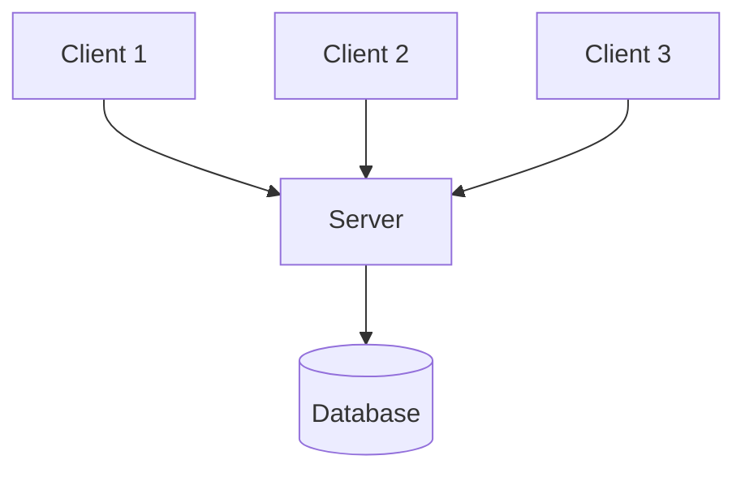
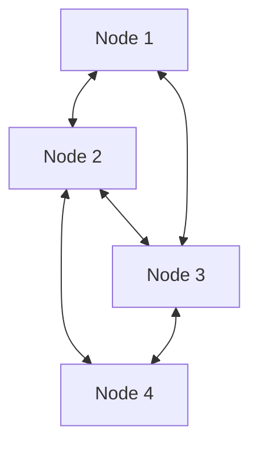
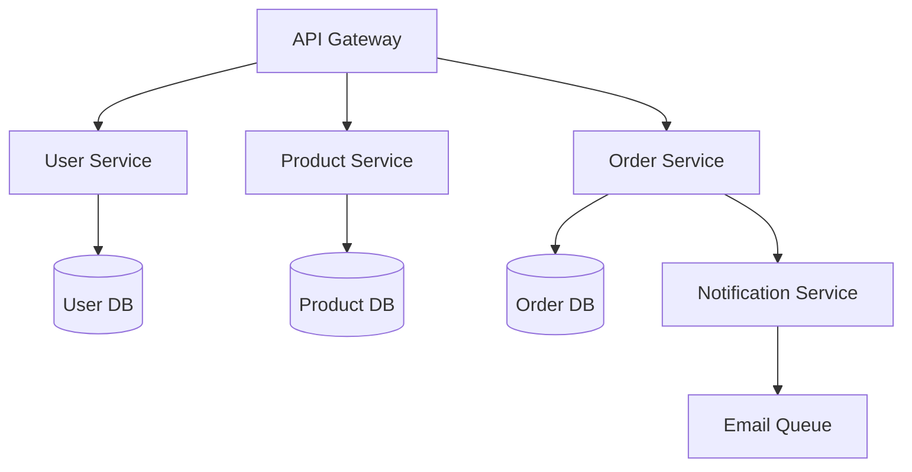
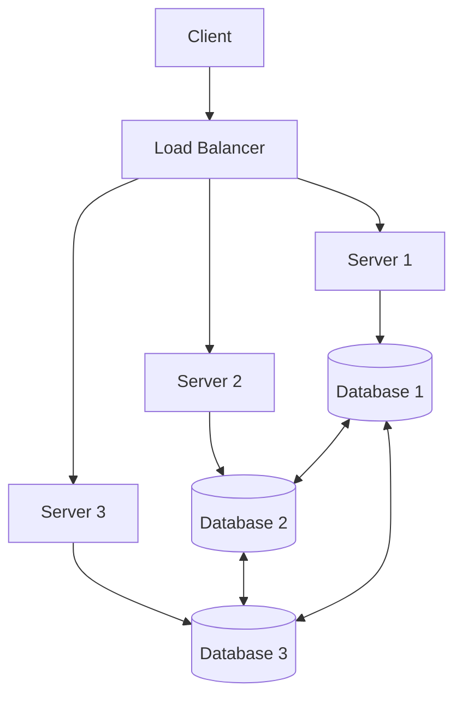

# Distributed System Architecture

## Introduction

A distributed system is a collection of independent computers that appear to users as a single coherent system. The architecture of such systems defines how these components are organized, how they communicate, and how they work together to achieve a common goal.

Distributed systems have become the backbone of modern computing, powering everything from web applications and cloud services to banking systems and social networks. Understanding the architectural patterns of distributed systems is crucial for designing scalable, reliable, and efficient applications.

## Core Architectural Patterns

Let's explore the fundamental architectural patterns used in distributed systems:

### Client-Server Architecture

The client-server model is one of the most common architectural patterns in distributed systems. In this model:

- **Clients**: Request services or resources
- **Servers**: Provide services or resources upon request



#### Example: Web Application

When you access a website:

1. Your browser (client) sends a request to a web server
2. The server processes the request, retrieves data if needed
3. The server sends back a response (HTML, CSS, JavaScript)
4. Your browser renders the page

```javascript
// Client-side code (browser)
fetch('https://api.example.com/data')
  .then(response => response.json())
  .then(data => {
    console.log('Received data from server:', data);
    displayData(data);
  })
  .catch(error => console.error('Error fetching data:', error));

function displayData(data) {
  const container = document.getElementById('data-container');
  container.innerHTML = `<h2>${data.title}</h2><p>${data.content}</p>`;
}
```

```javascript
// Server-side code (Node.js example)
const express = require('express');
const app = express();

app.get('/data', (req, res) => {
  // Retrieve data (perhaps from a database)
  const data = {
    title: 'Hello from the server!',
    content: 'This is data sent from our distributed system.'
  };
  
  // Send response
  res.json(data);
});

app.listen(3000, () => {
  console.log('Server running on port 3000');
});
```

**Advantages**:
- Clear separation of concerns
- Centralized resource management
- Easier to secure and manage

**Disadvantages**:
- Server can become a bottleneck
- Single point of failure
- May not scale well for high traffic

### Peer-to-Peer (P2P) Architecture

In a peer-to-peer architecture, computers (nodes) can act as both clients and servers. Each node can request services from other nodes and provide services to others.



#### Example: File Sharing

BitTorrent is a classic example of P2P architecture:

1. Files are split into small chunks
2. Each peer can download chunks from multiple other peers
3. While downloading, peers also upload their completed chunks to others

```python
# Simplified pseudo-code for a P2P file sharing system
class Peer:
    def __init__(self, peer_id):
        self.peer_id = peer_id
        self.available_chunks = set()
        self.needed_chunks = set()
        self.connected_peers = []
    
    def connect_to_peer(self, peer):
        self.connected_peers.append(peer)
        print(f"Peer {self.peer_id} connected to Peer {peer.peer_id}")
    
    def request_chunk(self, chunk_id):
        for peer in self.connected_peers:
            if chunk_id in peer.available_chunks:
                chunk = peer.share_chunk(chunk_id)
                if chunk:
                    self.available_chunks.add(chunk_id)
                    self.needed_chunks.remove(chunk_id)
                    print(f"Peer {self.peer_id} received chunk {chunk_id} from Peer {peer.peer_id}")
                    return True
        return False
    
    def share_chunk(self, chunk_id):
        if chunk_id in self.available_chunks:
            print(f"Peer {self.peer_id} is sharing chunk {chunk_id}")
            return f"Data for chunk {chunk_id}"
        return None

# Usage example
peer1 = Peer(1)
peer2 = Peer(2)
peer3 = Peer(3)

# Set initial available chunks
peer1.available_chunks = {1, 2}
peer2.available_chunks = {3, 4}
peer3.available_chunks = {5, 6}

# Set needed chunks
peer1.needed_chunks = {3, 5}
peer2.needed_chunks = {1, 6}
peer3.needed_chunks = {2, 4}

# Connect peers
peer1.connect_to_peer(peer2)
peer1.connect_to_peer(peer3)
peer2.connect_to_peer(peer3)

# Exchange chunks
peer1.request_chunk(3)  # Request from peer2
peer2.request_chunk(1)  # Request from peer1
peer3.request_chunk(2)  # Request from peer1

# Output:
# Peer 1 connected to Peer 2
# Peer 1 connected to Peer 3
# Peer 2 connected to Peer 3
# Peer 1 received chunk 3 from Peer 2
# Peer 2 received chunk 1 from Peer 1
# Peer 3 received chunk 2 from Peer 1
```

**Advantages**:
- No central point of failure
- Scales well with more users
- Resources are distributed across the network

**Disadvantages**:
- Complex to implement and manage
- Security challenges
- Nodes joining and leaving can disrupt service

### Microservices Architecture

Microservices architecture breaks down applications into small, independent services that communicate over a network.



#### Example: E-commerce Platform

A typical e-commerce platform might have these services:

- User Service: Handles authentication, user profiles
- Product Service: Manages product catalog, inventory
- Order Service: Processes orders, payments
- Notification Service: Sends emails, notifications

```javascript
// Product Service API (Node.js/Express)
const express = require('express');
const app = express();
app.use(express.json());

const products = [
  { id: 1, name: 'Laptop', price: 999.99, inStock: 10 },
  { id: 2, name: 'Smartphone', price: 699.99, inStock: 15 }
];

app.get('/products', (req, res) => {
  res.json(products);
});

app.get('/products/:id', (req, res) => {
  const product = products.find(p => p.id === parseInt(req.params.id));
  if (!product) return res.status(404).json({ error: 'Product not found' });
  res.json(product);
});

app.put('/products/:id/stock', (req, res) => {
  const product = products.find(p => p.id === parseInt(req.params.id));
  if (!product) return res.status(404).json({ error: 'Product not found' });
  
  const { quantity } = req.body;
  if (product.inStock >= quantity) {
    product.inStock -= quantity;
    res.json({ success: true, newStock: product.inStock });
  } else {
    res.status(400).json({ error: 'Not enough stock available' });
  }
});

app.listen(3001, () => {
  console.log('Product Service running on port 3001');
});
```

```javascript
// Order Service API (Node.js/Express)
const express = require('express');
const axios = require('axios');
const app = express();
app.use(express.json());

const orders = [];
let nextOrderId = 1;

app.post('/orders', async (req, res) => {
  try {
    const { userId, items } = req.body;
    
    // Check product availability from Product Service
    for (const item of items) {
      const productResponse = await axios.get(`http://product-service:3001/products/${item.productId}`);
      const product = productResponse.data;
      
      if (product.inStock < item.quantity) {
        return res.status(400).json({ 
          error: `Not enough stock for product: ${product.name}`
        });
      }
    }
    
    // Update stock for each product
    for (const item of items) {
      await axios.put(`http://product-service:3001/products/${item.productId}/stock`, {
        quantity: item.quantity
      });
    }
    
    // Create new order
    const order = {
      id: nextOrderId++,
      userId,
      items,
      status: 'created',
      createdAt: new Date()
    };
    orders.push(order);
    
    // Notify user (would call Notification Service in a real system)
    await axios.post('http://notification-service:3003/notifications', {
      userId,
      type: 'order_created',
      data: { orderId: order.id }
    });
    
    res.status(201).json(order);
  } catch (error) {
    console.error('Error creating order:', error);
    res.status(500).json({ error: 'Failed to create order' });
  }
});

app.get('/orders/:id', (req, res) => {
  const order = orders.find(o => o.id === parseInt(req.params.id));
  if (!order) return res.status(404).json({ error: 'Order not found' });
  res.json(order);
});

app.listen(3002, () => {
  console.log('Order Service running on port 3002');
});
```

**Advantages**:
- Independent development and deployment
- Technology diversity (different services can use different tech stacks)
- Improved fault isolation
- Better scalability (can scale individual services)

**Disadvantages**:
- Increased complexity in inter-service communication
- Distributed transactions are challenging
- Testing the entire system becomes more complex

## Communication Patterns

For distributed systems to function properly, components need to communicate effectively. Here are the primary communication patterns:

### Synchronous Communication

In synchronous communication, the client waits for the server to respond before continuing.

```javascript
// Synchronous communication example (JavaScript)
async function getUserData(userId) {
  try {
    // Client waits for response before continuing
    const response = await fetch(`https://api.example.com/users/${userId}`);
    const userData = await response.json();
    return userData;
  } catch (error) {
    console.error('Error fetching user data:', error);
    throw error;
  }
}

// Usage
async function displayUserProfile() {
  const userData = await getUserData(123); // Execution pauses here until data is received
  console.log('User data received:', userData);
  // Continue processing after receiving the data
}
```

### Asynchronous Communication

In asynchronous communication, the client continues execution without waiting for a response.

```javascript
// Asynchronous communication using a message queue (Node.js with RabbitMQ)
const amqp = require('amqplib');

// Producer (sends message and continues)
async function processOrder(order) {
  try {
    const connection = await amqp.connect('amqp://localhost');
    const channel = await connection.createChannel();
    const queue = 'order_processing';
    
    await channel.assertQueue(queue, { durable: true });
    channel.sendToQueue(queue, Buffer.from(JSON.stringify(order)), {
      persistent: true
    });
    
    console.log(`Order ${order.id} sent to processing queue`);
    // Continue execution immediately without waiting for processing
    
    setTimeout(() => {
      connection.close();
    }, 500);
  } catch (error) {
    console.error('Error sending order to queue:', error);
  }
}

// Consumer (processes messages when available)
async function startOrderProcessor() {
  try {
    const connection = await amqp.connect('amqp://localhost');
    const channel = await connection.createChannel();
    const queue = 'order_processing';
    
    await channel.assertQueue(queue, { durable: true });
    channel.prefetch(1);
    
    console.log('Order processor waiting for messages');
    
    channel.consume(queue, (msg) => {
      const order = JSON.parse(msg.content.toString());
      console.log(`Processing order ${order.id}`);
      
      // Simulate processing time
      setTimeout(() => {
        console.log(`Order ${order.id} processed successfully`);
        channel.ack(msg);
      }, 2000);
    });
  } catch (error) {
    console.error('Error in order processor:', error);
  }
}
```

## Data Distribution and Replication

Distributed systems often need to store data across multiple nodes to improve availability and performance.

### Replication Strategies



#### Example: Implementing Data Replication

```python
# Simplified example of a distributed data store with replication
class DataNode:
    def __init__(self, node_id):
        self.node_id = node_id
        self.data = {}
        self.peers = []
    
    def add_peer(self, peer):
        if peer not in self.peers:
            self.peers.append(peer)
            print(f"Node {self.node_id} added Node {peer.node_id} as peer")
    
    def store(self, key, value, replicate=True):
        self.data[key] = value
        print(f"Node {self.node_id} stored {key}:{value}")
        
        # Replicate to peers
        if replicate:
            for peer in self.peers:
                peer.store(key, value, replicate=False)
    
    def get(self, key):
        if key in self.data:
            return self.data[key]
        return None
    
    def sync_with_peers(self):
        for peer in self.peers:
            for key, value in peer.data.items():
                if key not in self.data:
                    self.data[key] = value
                    print(f"Node {self.node_id} synced {key}:{value} from Node {peer.node_id}")

# Usage
node1 = DataNode(1)
node2 = DataNode(2)
node3 = DataNode(3)

# Set up replication network
node1.add_peer(node2)
node1.add_peer(node3)
node2.add_peer(node1)
node2.add_peer(node3)
node3.add_peer(node1)
node3.add_peer(node2)

# Store data with replication
node1.store("user_123", {"name": "Alice", "email": "alice@example.com"})

# Retrieve data from any node
print(f"Retrieved from Node 2: {node2.get('user_123')}")
print(f"Retrieved from Node 3: {node3.get('user_123')}")

# Output:
# Node 1 added Node 2 as peer
# Node 1 added Node 3 as peer
# Node 2 added Node 1 as peer
# Node 2 added Node 3 as peer
# Node 3 added Node 1 as peer
# Node 3 added Node 2 as peer
# Node 1 stored user_123:{'name': 'Alice', 'email': 'alice@example.com'}
# Node 2 stored user_123:{'name': 'Alice', 'email': 'alice@example.com'}
# Node 3 stored user_123:{'name': 'Alice', 'email': 'alice@example.com'}
# Retrieved from Node 2: {'name': 'Alice', 'email': 'alice@example.com'}
# Retrieved from Node 3: {'name': 'Alice', 'email': 'alice@example.com'}
```

## Consistency Models

Distributed systems must balance consistency, availability, and partition tolerance (CAP theorem):

- **Strong Consistency**: All nodes see the same data at the same time
- **Eventual Consistency**: All nodes will eventually have the same data
- **Causal Consistency**: Operations that are causally related are seen in the same order by all nodes

## Real-world Architecture Examples

### Example 1: Netflix's Microservices Architecture

Netflix uses a complex microservices architecture with:

- API Gateway for routing requests
- Service Discovery for finding services
- Circuit Breakers for fault tolerance
- Data replication across multiple regions

### Example 2: Google's Distributed File System (GFS)

GFS provides:
- Scalable distributed storage
- Automatic replication
- Fault tolerance
- High throughput for large files

### Example 3: Amazon's Dynamo Database

DynamoDB offers:
- Eventual consistency model
- Seamless scaling
- Automatic partitioning
- Multi-region replication

## Common Challenges in Distributed System Architecture

1. **Network Failures**: Networks can fail or become unreliable
2. **Latency**: Communication between components takes time
3. **Consistency**: Maintaining data consistency across distributed nodes
4. **Security**: Securing communication between components
5. **Monitoring and Debugging**: Tracking system behavior across many components

## Implementing a Simple Distributed System

Let's build a simple distributed counter service with primary-backup replication:

```javascript
// Server implementation using Node.js and Express
const express = require('express');
const axios = require('axios');
const app = express();
app.use(express.json());

// Configuration
const isPrimary = process.env.ROLE === 'primary';
const port = process.env.PORT || 3000;
const backups = process.env.BACKUPS ? process.env.BACKUPS.split(',') : [];

// State
let counter = 0;
let isHealthy = true;

// Routes
app.get('/counter', (req, res) => {
  res.json({ value: counter, node: isPrimary ? 'primary' : 'backup' });
});

app.post('/counter/increment', async (req, res) => {
  if (isPrimary) {
    counter++;
    console.log(`Primary incremented counter to ${counter}`);
    
    // Replicate to backups
    for (const backup of backups) {
      try {
        await axios.post(`${backup}/counter/replicate`, { value: counter });
      } catch (error) {
        console.error(`Failed to replicate to ${backup}:`, error.message);
      }
    }
    
    res.json({ value: counter });
  } else {
    // If not primary, forward to primary
    try {
      const primary = process.env.PRIMARY;
      if (!primary) {
        return res.status(500).json({ error: 'Primary not configured' });
      }
      
      const response = await axios.post(`${primary}/counter/increment`);
      res.json(response.data);
    } catch (error) {
      res.status(500).json({ error: 'Failed to forward to primary' });
    }
  }
});

app.post('/counter/replicate', (req, res) => {
  if (!isPrimary) {
    counter = req.body.value;
    console.log(`Backup updated counter to ${counter}`);
    res.json({ success: true });
  } else {
    res.status(400).json({ error: 'Primary cannot be replicated to' });
  }
});

app.get('/health', (req, res) => {
  if (isHealthy) {
    res.json({ status: 'healthy' });
  } else {
    res.status(503).json({ status: 'unhealthy' });
  }
});

// Start server
app.listen(port, () => {
  console.log(`${isPrimary ? 'Primary' : 'Backup'} node running on port ${port}`);
  if (isPrimary) {
    console.log(`Configured backups: ${backups.join(', ') || 'none'}`);
  }
});
```

To run this system, you would start multiple instances:

```bash
# Start primary node
ROLE=primary PORT=3000 BACKUPS=http://localhost:3001,http://localhost:3002 node server.js

# Start backup nodes
ROLE=backup PORT=3001 PRIMARY=http://localhost:3000 node server.js
ROLE=backup PORT=3002 PRIMARY=http://localhost:3000 node server.js
```

## Summary

Distributed system architecture involves designing systems that span multiple machines while providing a cohesive experience. Key points to remember:

1. Common architectural patterns include client-server, peer-to-peer, and microservices
2. Communication can be synchronous or asynchronous
3. Data distribution and replication improve availability and performance
4. Consistency models balance data correctness with system availability
5. Real-world systems use a combination of these patterns

The field of distributed systems continues to evolve, with new patterns and technologies emerging to address the growing scale and complexity of modern applications.

## Further Learning

To deepen your understanding of distributed system architecture:

- Study the CAP theorem and its implications
- Learn about consensus algorithms (Paxos, Raft)
- Explore container orchestration with Kubernetes
- Practice implementing distributed systems using different patterns

## Exercises

1. Design a simple distributed file storage system that can handle file uploads, downloads, and replication
2. Implement a basic leader election algorithm for a distributed system
3. Create a microservices-based application with at least three services that communicate with each other
4. Design a system that provides eventual consistency for a distributed database
5. Implement a simple distributed cache with time-based expiration

Happy distributed programming!