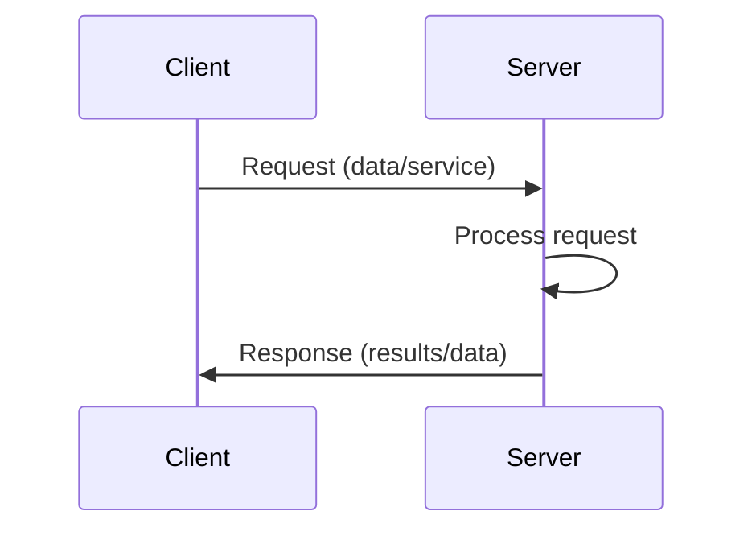
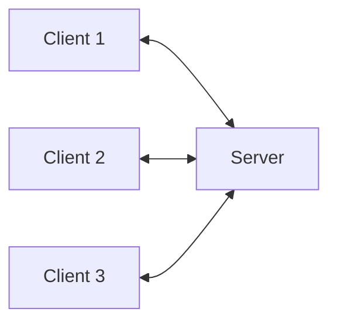
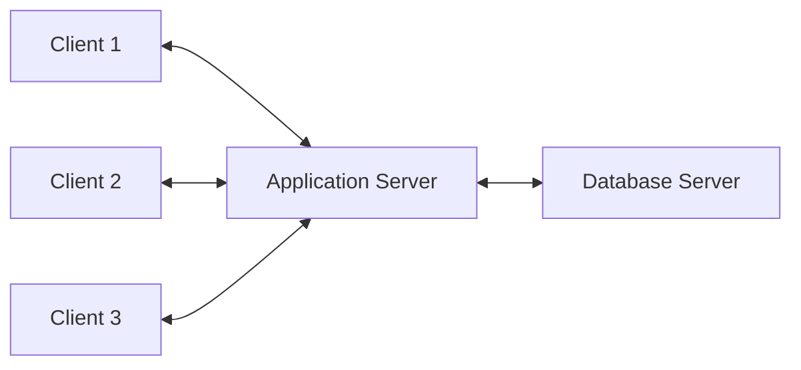
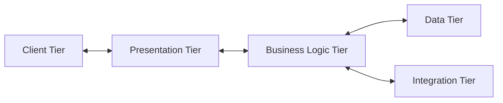
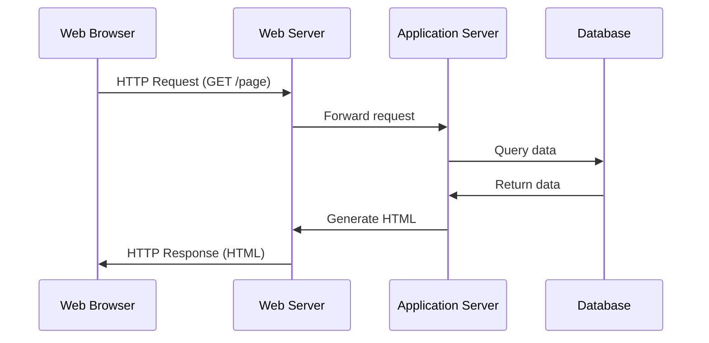
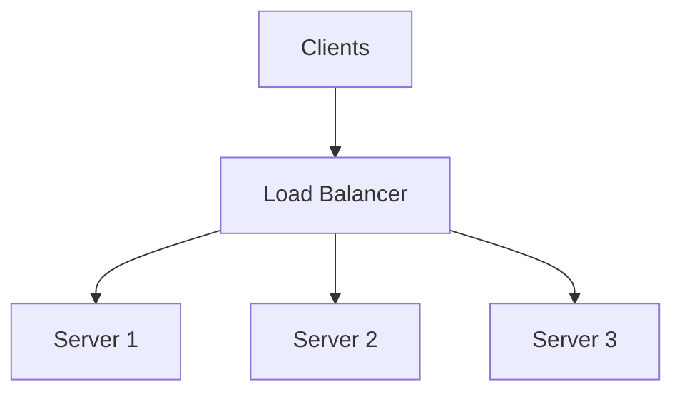

# Client-Server Model

## Introduction

The Client-Server model is one of the most fundamental architectural patterns in distributed systems and forms the backbone of many applications we use daily—from web browsers and email clients to database systems and file sharing services.

In this model, computing workloads are partitioned between **providers** of a resource or service (called **servers**) and **requesters** of the service (called **clients**). This separation of concerns creates a distributed system that allows for efficient resource management, better scalability, and improved maintainability compared to monolithic applications.

## Core Concepts

### What is a Client?

A client is an application or system that requests a service or resource from a server. Clients are typically optimized for user interaction and providing interfaces for users to work with the system. Examples include:

- Web browsers
- Mobile applications
- Desktop software
- IoT devices

### What is a Server?

A server is an application or system that provides services or resources to clients. Servers are optimized for processing requests, managing resources, and providing data. Examples include:

- Web servers
- Database servers
- File servers
- Mail servers
- Application servers

### Basic Communication Flow



The typical interaction follows these steps:

1. The client initiates communication by sending a request to the server
2. The server processes the request
3. The server sends back a response to the client
4. The client processes the response and may make additional requests

## Key Characteristics

### Advantages

- **Centralized Data Management**: Data can be stored and managed in a central location
- **Resource Sharing**: Multiple clients can access the same resources
- **Scalability**: Servers can be scaled independently from clients
- **Security**: Access controls can be implemented at the server level
- **Maintainability**: Components can be updated independently

### Limitations

- **Single Point of Failure**: If the server goes down, all clients are affected
- **Network Dependency**: Requires a stable network connection
- **Potential Bottlenecks**: High client demand can overload servers
- **Complexity**: Implementing robust client-server systems can be challenging

## Implementation Examples

Let's explore some practical implementations of the client-server model.

### Example 1: Simple HTTP Server and Client in Python

#### Server Implementation

```python
from http.server import HTTPServer, BaseHTTPRequestHandler

class SimpleHTTPRequestHandler(BaseHTTPRequestHandler):
    def do_GET(self):
        self.send_response(200)
        self.send_header('Content-type', 'text/html')
        self.end_headers()
        self.wfile.write(b'Hello, Client! This is a response from the server.')

# Start the server on port 8000
httpd = HTTPServer(('localhost', 8000), SimpleHTTPRequestHandler)
print("Server running at http://localhost:8000")
try:
    httpd.serve_forever()
except KeyboardInterrupt:
    print("Server stopped")
    httpd.server_close()
```

#### Client Implementation

```python
import requests

# Send a GET request to the server
response = requests.get('http://localhost:8000')

# Print the response from the server
print(f"Status code: {response.status_code}")
print(f"Response body: {response.text}")
```

#### Output

When running the client after starting the server:
```
Status code: 200
Response body: Hello, Client! This is a response from the server.
```

### Example 2: Socket-based Client-Server in JavaScript (Node.js)

#### Server Implementation

```javascript
const net = require('net');

const server = net.createServer((socket) => {
  console.log('Client connected');
  
  socket.on('data', (data) => {
    console.log(`Received: ${data}`);
    socket.write(`Echo: ${data}`);
  });
  
  socket.on('end', () => {
    console.log('Client disconnected');
  });
});

server.listen(3000, () => {
  console.log('Server listening on port 3000');
});
```

#### Client Implementation

```javascript
const net = require('net');

const client = net.createConnection({ port: 3000 }, () => {
  console.log('Connected to server');
  client.write('Hello from client!');
});

client.on('data', (data) => {
  console.log(data.toString());
  client.end();
});

client.on('end', () => {
  console.log('Disconnected from server');
});
```

#### Output

Server console:
```
Server listening on port 3000
Client connected
Received: Hello from client!
Client disconnected
```

Client console:
```
Connected to server
Echo: Hello from client!
Disconnected from server
```

## Common Client-Server Architectures

### Two-Tier Architecture

The simplest form where clients communicate directly with servers.



### Three-Tier Architecture

Adds an intermediary layer (application server) between clients and data.



### Multi-Tier Architecture

Complex systems with multiple specialized layers.



## Real-World Applications

### Web Applications

The most common implementation of the client-server model. Web browsers (clients) request HTML, CSS, JavaScript, and other resources from web servers, which process the requests and return the appropriate resources.



### Database Systems

Applications (clients) connect to database servers to store, retrieve, and manipulate data.

### File Sharing Services

File clients request and upload files to file servers that manage storage and access controls.

### Email Systems

Email clients connect to mail servers to send and receive messages.

## Advanced Concepts

### Stateless vs. Stateful Servers

- **Stateless servers** don't store client session information between requests (e.g., HTTP)
- **Stateful servers** maintain client session state (e.g., FTP, traditional database connections)

### Load Balancing



Load balancers distribute client requests across multiple servers to:
- Prevent server overload
- Increase availability
- Improve performance

### Caching

Temporary storage of frequently accessed data to reduce server load and improve response times.

## Implementation Considerations

### Security

- **Authentication**: Verifying client identity
- **Authorization**: Controlling access to resources
- **Encryption**: Protecting data in transit (e.g., TLS/SSL)
- **Input validation**: Preventing injection attacks

### Error Handling

Robust error handling is crucial in distributed systems:

```python
try:
    # Connect to server
    connection = connect_to_server(address, port)
    # Send request
    response = connection.send_request(request_data)
    # Process response
    process_response(response)
except ConnectionError:
    print("Failed to connect to server")
except TimeoutError:
    print("Server took too long to respond")
except Exception as e:
    print(f"An error occurred: {e}")
finally:
    # Ensure connection is closed
    if 'connection' in locals():
        connection.close()
```

### Network Reliability

Consider implementation strategies for handling network failures:
- Retry mechanisms
- Circuit breakers
- Fallback options

## Summary

The client-server model is a fundamental architectural pattern in distributed systems that separates application functions between service providers (servers) and service requesters (clients). This architecture offers numerous benefits including centralized resource management, scalability, and separation of concerns.

While implementing client-server systems, developers must consider factors like security, error handling, network reliability, and the specific requirements of their application to create robust distributed systems.

## Exercises

1. Implement a simple chat application using the client-server model where multiple clients can connect to a server and exchange messages.

2. Modify the HTTP server example to include different endpoints that return different types of data (text, JSON, HTML).

3. Design a file-sharing system using the client-server model. Consider authentication, authorization, and how to handle large file transfers.

4. Implement a three-tier architecture for a simple inventory management system with a front-end client, application server, and database server.

## Additional Resources

- Books:
  - "Distributed Systems: Principles and Paradigms" by Andrew S. Tanenbaum
  - "Building Microservices" by Sam Newman

- Online Documentation:
  - [MDN Web Docs on Client-Server Overview](https://developer.mozilla.org/en-US/docs/Learn/Server-side/First_steps/Client-Server_overview)
  - [OWASP Security Guidelines for Client-Server Applications](https://owasp.org/www-project-web-security-testing-guide/)

- Courses:
  - MIT OpenCourseWare: Distributed Computer Systems Engineering
  - Stanford Online: Distributed Systems