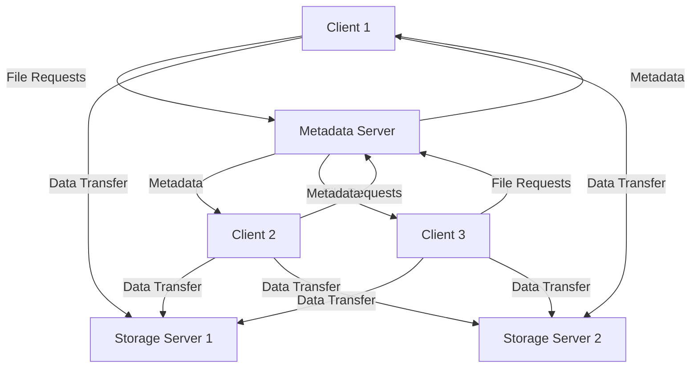
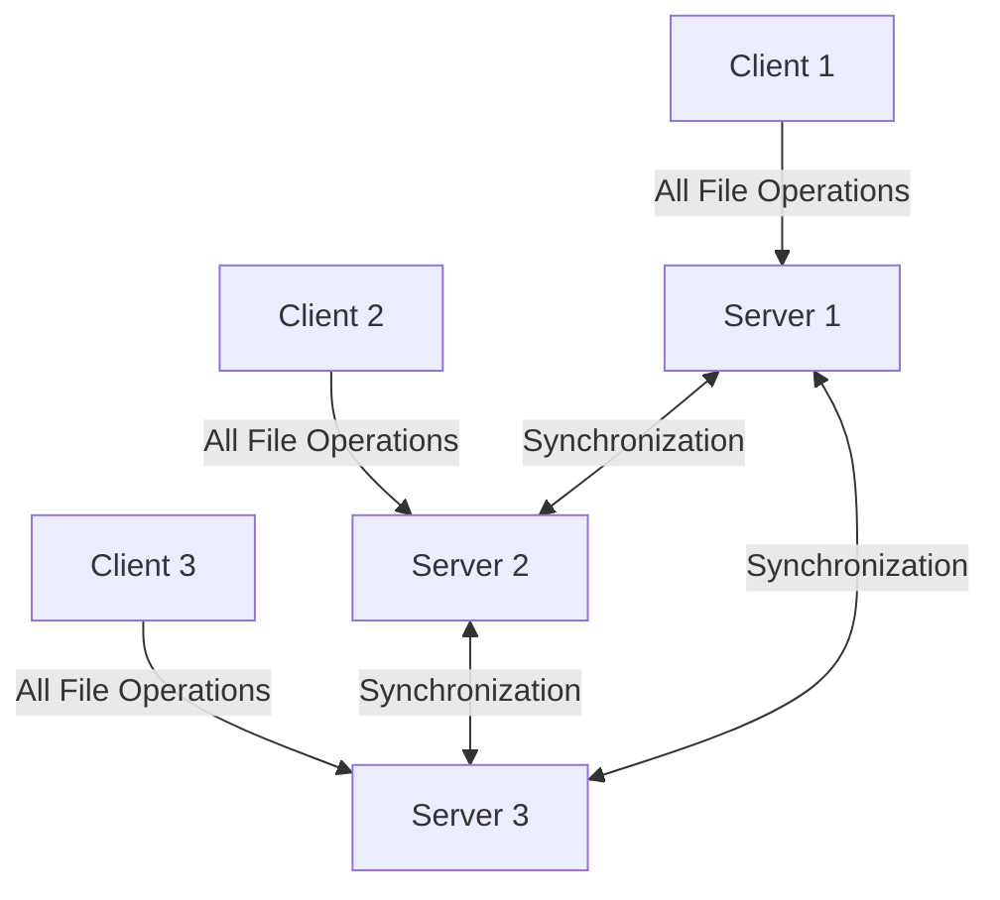
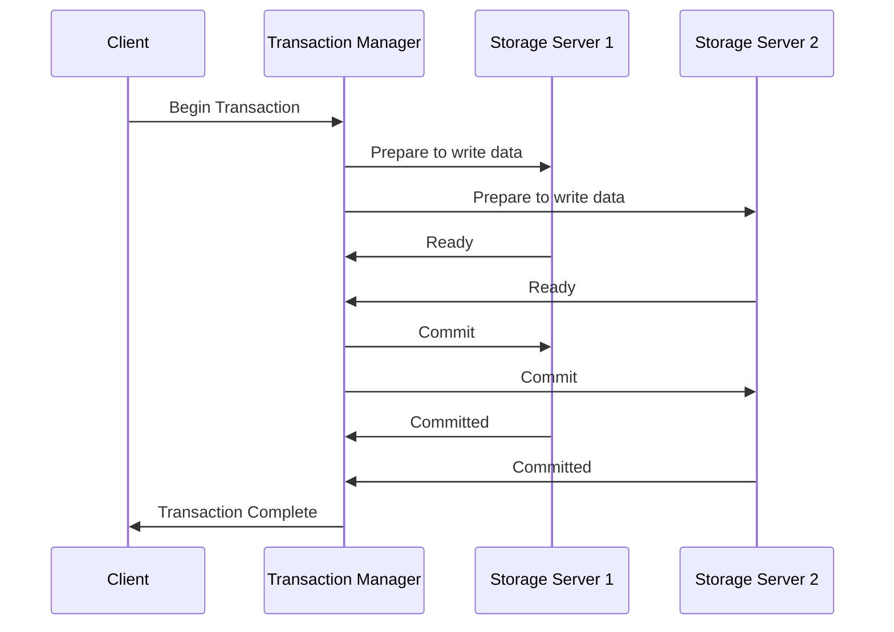

# Distributed File Systems

## Introduction

A distributed file system (DFS) is a file system that spans multiple physical servers, allowing clients to access and store files as if they were on their local disk. Unlike traditional file systems that exist on a single machine, distributed file systems spread data across multiple networked computers while presenting a unified view to users.

Think of it like a library with books spread across multiple buildings, but with a single catalog that lets you find any book regardless of its physical location. You don't need to know which building holds the book you want - the catalog system handles that for you.

## Why Distributed File Systems?

Distributed file systems solve several key challenges in modern computing:

- **Scalability**: Traditional file systems are constrained by the storage capacity of a single machine. DFSs can scale by adding more servers.
- **Availability**: If one server fails, the system can still function by accessing files on other servers.
- **Performance**: Multiple servers can handle file operations in parallel, increasing throughput.
- **Collaboration**: Multiple users can access the same files simultaneously from different locations.

## Core Components of Distributed File Systems

Every distributed file system typically includes these key components:

### 1. Clients

Applications or users that access files through the file system interface.

### 2. Storage Servers

Machines that physically store the file data. These might be dedicated file servers, commodity hardware, or cloud storage.

### 3. Metadata Servers

Servers that maintain information about:
- File names and locations
- Directory structure
- Access permissions
- File attributes (size, creation date, etc.)

### 4. Network Infrastructure

The communication channels connecting clients to servers and servers to each other.

## Architecture Patterns

Let's look at the common architectural patterns for distributed file systems:

### Centralized Architecture



In this architecture:
1. Clients contact a central metadata server to locate files
2. The metadata server tells clients which storage servers hold the data
3. Clients then communicate directly with storage servers to read/write data

**Examples**: Google File System (GFS), Hadoop Distributed File System (HDFS)

### Decentralized Architecture



In this architecture:
1. No central metadata server exists
2. Each server stores both data and metadata
3. Servers coordinate among themselves to maintain consistency
4. Clients can connect to any server in the system

**Examples**: Ceph, GlusterFS

## Key Challenges in Distributed File Systems

### 1. Consistency

When multiple copies of a file exist, keeping them synchronized is challenging. Different DFSs handle consistency in various ways:

- **Strong consistency**: All readers see the most recent write immediately
- **Eventual consistency**: After all updates stop, all readers will eventually see the same value
- **Session consistency**: A client's reads reflect all previous writes during its session

Let's examine a consistency problem:

```javascript
// Client A writes to file.txt on Server 1
writeFile("file.txt", "Hello World");

// Client B reads file.txt from Server 2
// What will Client B see?
const content = readFile("file.txt");
console.log(content); // This depends on the consistency model!
```

### 2. Fault Tolerance

How does the system handle server failures? Common strategies include:

- **Replication**: Maintaining multiple copies of each file
- **Erasure coding**: Splitting files into chunks with redundancy information
- **Heartbeat monitoring**: Detecting server failures quickly

### 3. Scalability

As the system grows, new challenges emerge:

- **Metadata bottlenecks**: Can the system track billions of files?
- **Network limitations**: How to minimize cross-datacenter traffic?
- **Adding/removing servers**: Can the system rebalance data efficiently?

## Common Distributed File Systems

### Hadoop Distributed File System (HDFS)

HDFS is designed for batch processing of large datasets, prioritizing throughput over low-latency access.

Key characteristics:
- **Block-based storage**: Files are split into large blocks (typically 128MB)
- **Write-once, read-many**: Optimized for write-once workflows
- **Single NameNode**: Central metadata server
- **Multiple DataNodes**: Store actual file blocks
- **Block replication**: Each block is replicated across multiple DataNodes

```javascript
// Example: Using HDFS from JavaScript (via WebHDFS REST API)
const fs = require('fs');
const axios = require('axios');

// Upload a file to HDFS
async function uploadToHDFS(localFilePath, hdfsPath) {
  const fileContent = fs.readFileSync(localFilePath);
  
  // Step 1: Get a redirection to a DataNode
  const redirectUrl = await axios.put(
    `http://namenode:50070/webhdfs/v1${hdfsPath}?op=CREATE&overwrite=true`,
    null,
    { maxRedirects: 0 }
  ).catch(err => err.response.headers.location);
  
  // Step 2: Upload data to the DataNode
  await axios.put(redirectUrl, fileContent);
  
  console.log(`File uploaded to HDFS at ${hdfsPath}`);
}

uploadToHDFS('/local/path/to/file.txt', '/user/hadoop/file.txt');
```

### Network File System (NFS)

NFS is one of the oldest distributed file systems, developed by Sun Microsystems in the 1980s and still widely used today.

Key characteristics:
- **Transparency**: Remote files appear as local files to clients
- **Stateless protocol**: Servers don't need to track client state (in NFSv3)
- **POSIX semantics**: Behaves like a traditional Unix file system

```bash
# Example: Mounting an NFS share in Linux
$ sudo mkdir -p /mnt/nfs_share
$ sudo mount -t nfs nfs-server:/shared /mnt/nfs_share

# Now we can use the remote files as if they were local
$ ls -la /mnt/nfs_share
$ cp /mnt/nfs_share/document.txt ./local_copy.txt
```

### Ceph File System

Ceph is a modern, highly scalable distributed file system that aims to eliminate single points of failure.

Key characteristics:
- **CRUSH algorithm**: Intelligent data placement without central lookup
- **Self-managing**: Automatically handles rebalancing and recovery
- **Multiple interfaces**: File, block, and object storage in one system

## Implementing a Simple Distributed File System

Let's create a very simplified distributed file system using Node.js to understand the core concepts:

```javascript
// server.js - A simplified metadata server
const express = require('express');
const app = express();
app.use(express.json());

// In-memory "database" of files and their locations
const fileRegistry = {
  'document.txt': {
    size: 1024,
    blocks: [
      { id: 'block1', server: 'storage1:3000' },
      { id: 'block2', server: 'storage2:3000' }
    ]
  },
  'image.jpg': {
    size: 2048,
    blocks: [
      { id: 'block3', server: 'storage1:3000' },
      { id: 'block4', server: 'storage3:3000' }
    ]
  }
};

// Get metadata for a file
app.get('/metadata/:filename', (req, res) => {
  const filename = req.params.filename;
  if (fileRegistry[filename]) {
    res.json(fileRegistry[filename]);
  } else {
    res.status(404).json({ error: 'File not found' });
  }
});

app.listen(3000, () => {
  console.log('Metadata server running on port 3000');
});
```

```javascript
// client.js - A simplified DFS client
const axios = require('axios');

async function readFile(filename) {
  try {
    // Step 1: Get metadata from the metadata server
    const metadataResponse = await axios.get(`http://metadata-server:3000/metadata/${filename}`);
    const fileMetadata = metadataResponse.data;
    
    // Step 2: Prepare a buffer for the complete file
    let fileContent = Buffer.alloc(fileMetadata.size);
    let position = 0;
    
    // Step 3: Fetch each block from the appropriate storage server
    for (const block of fileMetadata.blocks) {
      const blockResponse = await axios.get(`http://${block.server}/blocks/${block.id}`);
      const blockData = Buffer.from(blockResponse.data);
      
      // Copy this block's data into our file buffer
      blockData.copy(fileContent, position);
      position += blockData.length;
    }
    
    return fileContent;
  } catch (error) {
    console.error('Error reading file:', error.message);
    throw error;
  }
}

// Example usage
async function main() {
  const content = await readFile('document.txt');
  console.log('File content:', content.toString());
}

main();
```

This is a highly simplified example, but it illustrates the separation of metadata and data operations that's common in distributed file systems.

## Real-World Applications

### 1. Cloud Storage Systems

Services like Google Drive, Dropbox, and OneDrive are built on distributed file systems that:
- Store petabytes of data across thousands of servers
- Provide high availability (99.9%+ uptime)
- Synchronize files across multiple devices
- Support collaboration with shared access

### 2. Big Data Processing

Frameworks like Hadoop and Spark rely on distributed file systems (typically HDFS) to:
- Store and process datasets too large for a single machine
- Provide data locality (move computation to the data)
- Support parallel processing across hundreds of nodes

### 3. High-Performance Computing

Scientific computing clusters use distributed file systems like Lustre to:
- Share research data between compute nodes
- Provide extremely high throughput for simulation data
- Support parallel I/O from thousands of processes

## Advanced Topics

### Distributed Transactions

Ensuring atomic operations across multiple servers is challenging. Protocols like Two-Phase Commit (2PC) help maintain consistency:



### Caching Strategies

Distributed file systems often employ complex caching to improve performance:
- **Client-side caching**: Keeping recently accessed data in memory
- **Cooperative caching**: Sharing cached data between clients
- **Cache coherence protocols**: Ensuring caches don't contain stale data

## Summary

Distributed file systems solve the challenges of storing and accessing data across multiple machines. They provide:

- **Scalability** to handle growing data needs
- **Reliability** through replication and fault tolerance
- **Transparency** by presenting a unified view of distributed storage
- **Performance** through parallel operations and caching

The field continues to evolve with new systems addressing emerging challenges like global distribution, exabyte-scale storage, and specialized workloads.

## Exercises

1. Compare and contrast two different distributed file systems (e.g., HDFS vs. Ceph).
2. Design a simple distributed file system that prioritizes consistency over availability.
3. Implement a basic client that can read and write files to a networked storage server.
4. Analyze how adding more metadata servers would affect the scalability of a DFS.

## Further Reading

- "Designing Data-Intensive Applications" by Martin Kleppmann
- The Google File System paper (Ghemawat, Gobioff, Leung)
- HDFS Architecture Guide
- Ceph Documentation