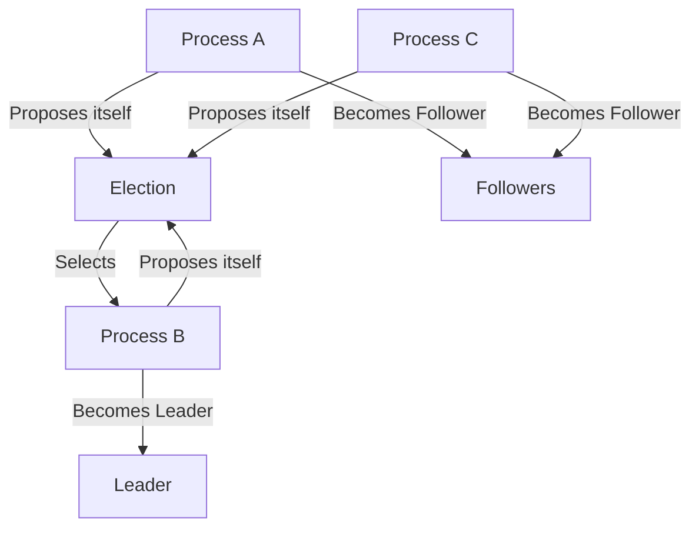
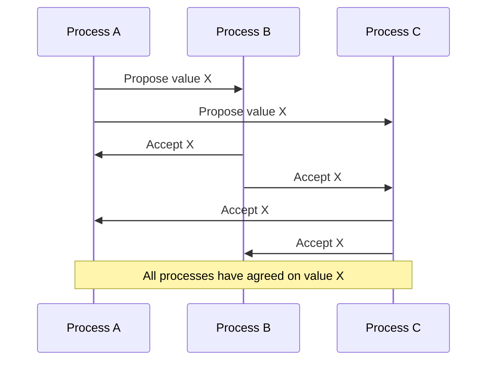

# Distributed Coordination

## Introduction

In a distributed system, multiple components work together across different machines to achieve a common goal. But how do these components know what others are doing? How do they make collective decisions? How do they avoid conflicts when accessing shared resources? The answer lies in **distributed coordination**.

Distributed coordination refers to the mechanisms that allow multiple processes in a distributed system to work together harmoniously. It's like the conductor of an orchestra, ensuring that all musicians play in sync despite being separate entities.

## Why Coordination is Challenging in Distributed Systems

Before diving into coordination mechanisms, let's understand why coordination in distributed systems is particularly challenging:

1. **No shared clock**: Different machines have different clocks that may drift apart over time.
2. **Communication delays**: Messages between processes take time and might arrive out of order.
3. **Partial failures**: Some components might fail while others continue to operate.
4. **Network partitions**: Network issues might temporarily disconnect parts of the system.

These challenges make seemingly simple tasks like "do this action at exactly the same time" or "agree on who goes first" surprisingly difficult to achieve.

## Key Coordination Problems

### 1. Leader Election

In many distributed algorithms, one process needs to take a leadership role. Leader election algorithms help determine which process should be the leader.



A simple example of leader election in Python using a basic ring algorithm:

```python
class Process:
    def __init__(self, process_id, next_process=None):
        self.process_id = process_id
        self.next_process = next_process
        self.leader_id = None
        
    def start_election(self):
        # Send our ID around the ring
        self.send_election_message([self.process_id])
        
    def send_election_message(self, ids):
        print(f"Process {self.process_id} forwarding ids: {ids}")
        # Add our ID if not already in the list
        if self.process_id not in ids:
            ids.append(self.process_id)
        
        # Forward to next process
        if self.next_process:
            self.next_process.receive_election_message(ids)
        
    def receive_election_message(self, ids):
        # If our ID is in the list, we've completed a full circuit
        if self.process_id == ids[0]:
            # Election complete, choose the max ID as leader
            leader_id = max(ids)
            print(f"Election complete! Leader is Process {leader_id}")
            self.leader_id = leader_id
            self.announce_leader(leader_id)
        else:
            # Continue passing the message
            self.send_election_message(ids)
    
    def announce_leader(self, leader_id):
        print(f"Process {self.process_id} acknowledges Process {leader_id} as leader")
        if self.next_process and self.next_process.process_id != ids[0]:
            self.next_process.announce_leader(leader_id)
```

To use this code:

```python
# Create a ring of processes
p1 = Process(1)
p2 = Process(2)
p3 = Process(3)
p4 = Process(4)

p1.next_process = p2
p2.next_process = p3
p3.next_process = p4
p4.next_process = p1

# Start an election
p2.start_election()
```

Output:
```
Process 2 forwarding ids: [2]
Process 3 forwarding ids: [2, 3]
Process 4 forwarding ids: [2, 3, 4]
Process 1 forwarding ids: [2, 3, 4, 1]
Process 2 forwarding ids: [2, 3, 4, 1]
Election complete! Leader is Process 4
Process 2 acknowledges Process 4 as leader
Process 3 acknowledges Process 4 as leader
Process 4 acknowledges Process 4 as leader
Process 1 acknowledges Process 4 as leader
```

In real-world applications, leader election is used in:
- Database replication systems to select a primary node
- Distributed task schedulers to determine which node assigns tasks
- Microservice architectures to elect a coordinator for certain operations

### 2. Mutual Exclusion

Mutual exclusion ensures that only one process can access a shared resource at a time. This prevents conflicts and data corruption.

A basic distributed mutual exclusion algorithm using a central coordinator:

```python
class CentralCoordinator:
    def __init__(self):
        self.resource_locked = False
        self.waiting_queue = []
        
    def request_access(self, process_id):
        if not self.resource_locked:
            self.resource_locked = True
            return True
        else:
            self.waiting_queue.append(process_id)
            return False
            
    def release_access(self, process_id):
        if self.resource_locked:
            self.resource_locked = False
            if self.waiting_queue:
                next_process = self.waiting_queue.pop(0)
                print(f"Granting access to Process {next_process}")
                self.resource_locked = True
                return next_process
        return None

class Process:
    def __init__(self, process_id, coordinator):
        self.process_id = process_id
        self.coordinator = coordinator
        
    def access_resource(self):
        print(f"Process {self.process_id} requesting resource access")
        granted = self.coordinator.request_access(self.process_id)
        
        if granted:
            print(f"Process {self.process_id} accessed the resource")
            self.use_resource()
            self.release_resource()
        else:
            print(f"Process {self.process_id} waiting for resource")
    
    def use_resource(self):
        print(f"Process {self.process_id} using the resource...")
        
    def release_resource(self):
        print(f"Process {self.process_id} releasing the resource")
        self.coordinator.release_access(self.process_id)
```

Example usage:

```python
coordinator = CentralCoordinator()

p1 = Process(1, coordinator)
p2 = Process(2, coordinator)
p3 = Process(3, coordinator)

p1.access_resource()
p2.access_resource()  # Will wait
p3.access_resource()  # Will wait
```

Output:
```
Process 1 requesting resource access
Process 1 accessed the resource
Process 1 using the resource...
Process 1 releasing the resource
Process 2 requesting resource access
Process 2 accessed the resource
Process 2 using the resource...
Process 2 releasing the resource
Granting access to Process 3
Process 3 requesting resource access
Process 3 accessed the resource
Process 3 using the resource...
Process 3 releasing the resource
```

In real systems, distributed mutual exclusion is used for:
- Distributed file systems to coordinate file access
- Distributed databases to manage transactions
- Microservices to protect critical sections of code

### 3. Consensus

Consensus is the process of agreeing on a single value among multiple processes. It's crucial for maintaining consistency in distributed systems.



Here's a simplified implementation of a basic consensus algorithm:

```python
class ConsensusNode:
    def __init__(self, node_id, nodes=None):
        self.node_id = node_id
        self.nodes = nodes if nodes else []
        self.proposed_value = None
        self.accepted_values = {}
        self.final_value = None
        
    def propose_value(self, value):
        print(f"Node {self.node_id} proposing value: {value}")
        self.proposed_value = value
        self.accepted_values[self.node_id] = value
        
        # Send proposal to all other nodes
        for node in self.nodes:
            if node.node_id != self.node_id:
                node.receive_proposal(self.node_id, value)
                
    def receive_proposal(self, proposer_id, value):
        print(f"Node {self.node_id} received proposal from Node {proposer_id}: {value}")
        # In a real system, we might apply rules to decide whether to accept
        # For simplicity, we'll just accept every proposal
        self.accepted_values[proposer_id] = value
        
        # Send acknowledgment
        for node in self.nodes:
            if node.node_id == proposer_id:
                node.receive_acknowledgment(self.node_id, value)
                
    def receive_acknowledgment(self, sender_id, value):
        print(f"Node {self.node_id} received acknowledgment from Node {sender_id} for value: {value}")
        
        # Check if we have a majority
        if len(self.accepted_values) > len(self.nodes) / 2:
            # In a real system, we would use a more sophisticated decision rule
            # Here we'll just use the first proposed value that got majority acceptance
            if not self.final_value:
                self.final_value = value
                print(f"Node {self.node_id} decided on final value: {value}")
                
                # Inform all nodes about the decision
                for node in self.nodes:
                    if node.node_id != self.node_id:
                        node.receive_decision(value)
                        
    def receive_decision(self, value):
        print(f"Node {self.node_id} was informed of the final decision: {value}")
        self.final_value = value
```

Example usage:

```python
# Create nodes
nodes = [ConsensusNode(i) for i in range(1, 4)]

# Set up the network
for node in nodes:
    node.nodes = nodes

# Node 1 proposes a value
nodes[0].propose_value(42)
```

Output:
```
Node 1 proposing value: 42
Node 2 received proposal from Node 1: 42
Node 3 received proposal from Node 1: 42
Node 1 received acknowledgment from Node 2 for value: 42
Node 1 received acknowledgment from Node 3 for value: 42
Node 1 decided on final value: 42
Node 2 was informed of the final decision: 42
Node 3 was informed of the final decision: 42
```

Real-world applications of consensus include:
- Distributed databases ensuring all replicas have the same data
- Blockchain networks agreeing on the next block
- Distributed configuration systems ensuring all nodes have the same settings

## Real-World Coordination Systems

### ZooKeeper

Apache ZooKeeper is one of the most widely used coordination services for distributed systems. It provides primitives for many coordination tasks like leader election, distributed locks, and configuration management.

Here's a simple example of using ZooKeeper in Java for leader election:

```java
import org.apache.zookeeper.*;
import org.apache.zookeeper.data.Stat;
import java.util.Collections;
import java.util.List;

public class ZKLeaderElection implements Watcher {
    private static final String ELECTION_NAMESPACE = "/election";
    private String zNodeName;
    private ZooKeeper zooKeeper;
    private final String connectionString;
    
    public ZKLeaderElection(String connectionString) {
        this.connectionString = connectionString;
    }
    
    public void connectToZookeeper() throws Exception {
        this.zooKeeper = new ZooKeeper(connectionString, 3000, this);
    }
    
    public void volunteerForLeadership() throws Exception {
        String znodePrefix = ELECTION_NAMESPACE + "/c_";
        zNodeName = zooKeeper.create(znodePrefix, new byte[]{}, 
                                  ZooDefs.Ids.OPEN_ACL_UNSAFE, 
                                  CreateMode.EPHEMERAL_SEQUENTIAL);
        System.out.println("znode name: " + zNodeName);
        electLeader();
    }
    
    private void electLeader() throws Exception {
        List<String> children = zooKeeper.getChildren(ELECTION_NAMESPACE, false);
        Collections.sort(children);
        String smallestChild = children.get(0);
        String ourZnodeName = zNodeName.replace(ELECTION_NAMESPACE + "/", "");
        
        if (ourZnodeName.equals(smallestChild)) {
            System.out.println("I am the leader");
            // Do leader tasks
        } else {
            System.out.println("I am not the leader");
            // Do follower tasks and watch the leader
            String predecessorZnodeName = "";
            for (String child : children) {
                if (child.equals(ourZnodeName)) {
                    break;
                }
                predecessorZnodeName = child;
            }
            
            // Watch predecessor
            Stat stat = zooKeeper.exists(ELECTION_NAMESPACE + "/" + predecessorZnodeName, 
                                      this);
            if (stat == null) {
                electLeader();
            }
        }
    }
    
    @Override
    public void process(WatchedEvent event) {
        // React to ZooKeeper events
        if (event.getType() == Event.EventType.NodeDeleted) {
            try {
                electLeader();
            } catch (Exception e) {
                e.printStackTrace();
            }
        }
    }
}
```

### etcd

etcd is a distributed key-value store that provides reliable distributed coordination. It's widely used in Kubernetes for storing cluster state.

Example using etcd for distributed locking in Go:

```go
package main

import (
    "context"
    "fmt"
    "log"
    "time"

    "go.etcd.io/etcd/client/v3"
    "go.etcd.io/etcd/client/v3/concurrency"
)

func main() {
    // Create an etcd client
    cli, err := clientv3.New(clientv3.Config{
        Endpoints:   []string{"localhost:2379"},
        DialTimeout: 5 * time.Second,
    })
    if err != nil {
        log.Fatal(err)
    }
    defer cli.Close()

    // Create a session
    session, err := concurrency.NewSession(cli)
    if err != nil {
        log.Fatal(err)
    }
    defer session.Close()

    // Create a mutex using the session
    mutex := concurrency.NewMutex(session, "/my-lock/")

    // Acquire the lock (block until acquired)
    if err := mutex.Lock(context.Background()); err != nil {
        log.Fatal(err)
    }
    fmt.Println("Acquired lock")

    // Simulate work
    time.Sleep(5 * time.Second)

    // Release the lock
    if err := mutex.Unlock(context.Background()); err != nil {
        log.Fatal(err)
    }
    fmt.Println("Released lock")
}
```

## Time and Ordering in Distributed Systems

One of the fundamental challenges in coordination is dealing with time and event ordering. Since there's no global clock, we need alternative mechanisms to establish order.

### Logical Clocks

Logical clocks, such as Lamport timestamps, help establish a "happened-before" relationship between events without relying on physical time.

```python
class Process:
    def __init__(self, process_id):
        self.process_id = process_id
        self.logical_clock = 0
        
    def event(self, description):
        self.logical_clock += 1
        print(f"Process {self.process_id}, Time {self.logical_clock}: {description}")
        return self.logical_clock
        
    def send(self, message, receiver):
        self.logical_clock += 1
        timestamp = self.logical_clock
        print(f"Process {self.process_id}, Time {timestamp}: Sending '{message}'")
        receiver.receive(message, timestamp, self)
        
    def receive(self, message, sender_timestamp, sender):
        self.logical_clock = max(self.logical_clock, sender_timestamp) + 1
        print(f"Process {self.process_id}, Time {self.logical_clock}: Received '{message}' from Process {sender.process_id}")
```

Example usage:

```python
p1 = Process(1)
p2 = Process(2)

p1.event("Local event")
p1.send("Hello", p2)
p2.event("Local event")
p2.send("Response", p1)
```

Output:
```
Process 1, Time 1: Local event
Process 1, Time 2: Sending 'Hello'
Process 2, Time 3: Received 'Hello' from Process 1
Process 2, Time 4: Local event
Process 2, Time 5: Sending 'Response'
Process 1, Time 6: Received 'Response' from Process 2
```

### Vector Clocks

Vector clocks extend logical clocks to provide a more detailed ordering of events, capturing causality between processes.

```python
class VectorClockProcess:
    def __init__(self, process_id, num_processes):
        self.process_id = process_id
        self.vector_clock = [0] * num_processes
        
    def event(self, description):
        self.vector_clock[self.process_id - 1] += 1
        print(f"Process {self.process_id}, VC {self.vector_clock}: {description}")
        
    def send(self, message, receiver):
        self.vector_clock[self.process_id - 1] += 1
        print(f"Process {self.process_id}, VC {self.vector_clock}: Sending '{message}'")
        receiver.receive(message, self.vector_clock.copy(), self)
        
    def receive(self, message, sender_vc, sender):
        # Update vector clock
        for i in range(len(self.vector_clock)):
            self.vector_clock[i] = max(self.vector_clock[i], sender_vc[i])
        self.vector_clock[self.process_id - 1] += 1
        
        print(f"Process {self.process_id}, VC {self.vector_clock}: Received '{message}' from Process {sender.process_id}")
```

Example usage:

```python
p1 = VectorClockProcess(1, 2)
p2 = VectorClockProcess(2, 2)

p1.event("A")
p1.send("Hello", p2)
p2.event("B")
p2.send("Response", p1)
p1.event("C")
```

Output:
```
Process 1, VC [1, 0]: A
Process 1, VC [2, 0]: Sending 'Hello'
Process 2, VC [2, 1]: Received 'Hello' from Process 1
Process 2, VC [2, 2]: B
Process 2, VC [2, 3]: Sending 'Response'
Process 1, VC [3, 3]: Received 'Response' from Process 2
Process 1, VC [4, 3]: C
```

## Fault Tolerance in Coordination

Coordination mechanisms must handle failures gracefully. Here are some techniques:

### Heartbeats

Processes periodically send "I'm alive" messages to detect failures.

```python
import threading
import time

class HeartbeatMonitor:
    def __init__(self, timeout=5):
        self.processes = {}
        self.timeout = timeout
        self.lock = threading.Lock()
        threading.Thread(target=self.check_heartbeats, daemon=True).start()
        
    def register_process(self, process_id):
        with self.lock:
            self.processes[process_id] = time.time()
        
    def receive_heartbeat(self, process_id):
        with self.lock:
            self.processes[process_id] = time.time()
        
    def check_heartbeats(self):
        while True:
            time.sleep(1)
            current_time = time.time()
            with self.lock:
                for process_id, last_heartbeat in list(self.processes.items()):
                    if current_time - last_heartbeat > self.timeout:
                        print(f"Process {process_id} appears to have failed!")
                        del self.processes[process_id]
                        
class Process:
    def __init__(self, process_id, monitor):
        self.process_id = process_id
        self.monitor = monitor
        self.running = True
        self.monitor.register_process(self.process_id)
        threading.Thread(target=self.send_heartbeats, daemon=True).start()
        
    def send_heartbeats(self):
        while self.running:
            self.monitor.receive_heartbeat(self.process_id)
            time.sleep(1)
            
    def stop(self):
        self.running = False
```

Example usage:

```python
monitor = HeartbeatMonitor(timeout=3)
p1 = Process(1, monitor)
p2 = Process(2, monitor)

# Let them run for a bit
time.sleep(5)

# Simulate failure of process 2
p2.stop()

# Wait to see the failure detection
time.sleep(5)
```

Output:
```
Process 2 appears to have failed!
```

## Summary

Distributed coordination is a fundamental aspect of building reliable distributed systems. We've explored:

1. **Leader Election**: Determining which process takes on a leadership role
2. **Mutual Exclusion**: Ensuring only one process accesses a resource at a time
3. **Consensus**: Getting all processes to agree on a single value
4. **Time and Ordering**: Using logical and vector clocks to establish causality
5. **Fault Tolerance**: Handling failures gracefully with heartbeats and other mechanisms

Real-world systems like ZooKeeper and etcd provide battle-tested coordination services that implement these concepts.

## Further Learning

To deepen your understanding of distributed coordination:

1. Study the Paxos and Raft consensus algorithms
2. Explore the CAP theorem and its implications for coordination
3. Learn about eventual consistency and strong consistency models
4. Experiment with ZooKeeper or etcd in a small distributed application

## Exercises

1. Implement a simple distributed application that uses leader election
2. Create a distributed counter that maintains consistency across multiple processes
3. Build a simple distributed lock using a coordination service
4. Implement vector clocks and demonstrate how they capture causality
5. Design a fault-tolerant service that continues to operate when some of its processes fail