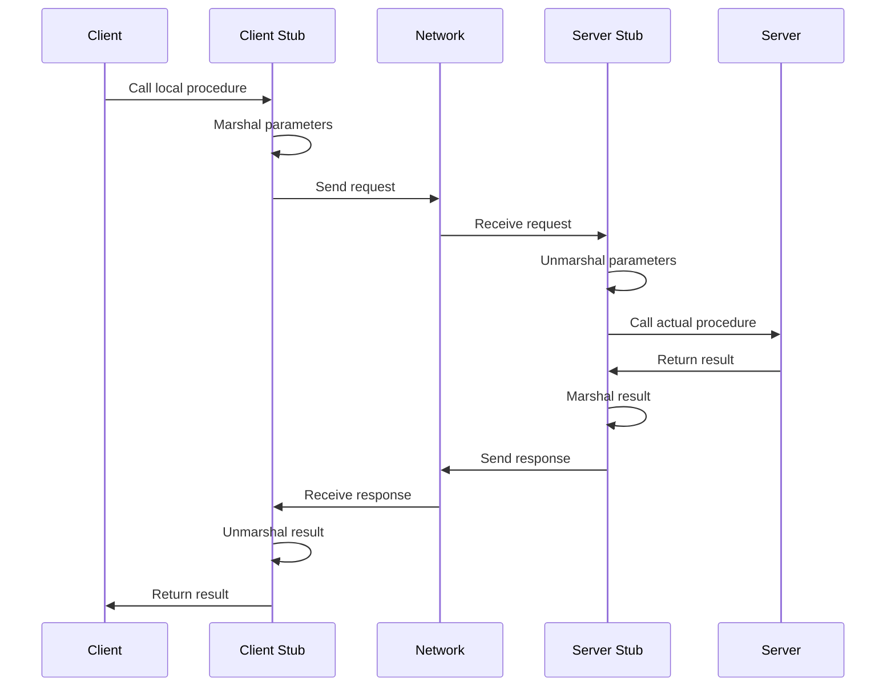

# Remote Procedure Calls (RPC)

## Introduction

Remote Procedure Call (RPC) is a powerful protocol that allows a program to execute a procedure (or function) located on another computer, making it seem as if the procedure is running locally. This concept is fundamental to distributed systems, where applications are spread across multiple machines on a network.

In simpler terms, RPC is like calling a function that lives on a different computer. It abstracts away the complexity of network communication, making distributed systems easier to build and maintain.

## Why Use Remote Procedure Calls?

Before diving into the details, let's understand why RPCs are valuable:

1. **Abstraction**: RPC hides network communication details, allowing developers to write distributed applications as if they were local.
2. **Code Organization**: It enables logical separation of services across different machines.
3. **Resource Sharing**: It allows access to resources (CPU, memory, storage) on other machines.
4. **Scalability**: Applications can be distributed across multiple machines to handle larger workloads.

## How RPCs Work

At a high level, RPC works through the following steps:



Let's break down these components:

1. **Client**: The application that initiates the procedure call.
2. **Client Stub**: Generated code that looks like the actual procedure but handles network communication.
3. **Server**: The application that hosts the actual procedure implementation.
4. **Server Stub**: Receives the request, unpacks parameters, and calls the actual procedure.
5. **Marshalling**: The process of converting function parameters into a format suitable for transmission.
6. **Unmarshalling**: The reverse process of converting transmitted data back into function parameters.

## Key Concepts in RPC

### 1. Interface Definition Language (IDL)

Many RPC systems use an Interface Definition Language to define the interfaces between client and server. This allows for:

- Clear contract definition between client and server
- Automated generation of client and server stubs
- Language-independent service definitions

Here's a simple example of an IDL definition (using a generic syntax):

```
service Calculator {
  function add(int a, int b) returns (int);
  function subtract(int a, int b) returns (int);
  function multiply(int a, int b) returns (int);
  function divide(int a, int b) returns (int);
}
```

### 2. Marshalling and Serialization

When a client calls a remote procedure, the parameters need to be packaged and sent over the network. This process is called marshalling or serialization.

Common serialization formats include:

- JSON
- XML
- Protocol Buffers
- Binary formats

### 3. Binding and Discovery

For a client to call a remote procedure, it needs to know:

- Which server hosts the procedure
- How to connect to that server
- The format for the request

This information is determined during a process called binding. Modern RPC systems often include service discovery mechanisms to locate available services dynamically.

## Implementing a Simple RPC System

Let's implement a basic RPC system in Python to understand the concepts better. We'll create a simple calculator service.

### Server Implementation

```python
# server.py
import socket
import json

# The actual functions that will be called
def add(a, b):
    return a + b

def subtract(a, b):
    return a - b

def multiply(a, b):
    return a * b

def divide(a, b):
    if b == 0:
        return "Error: Division by zero"
    return a / b

# Map function names to actual functions
FUNCTIONS = {
    "add": add,
    "subtract": subtract,
    "multiply": multiply,
    "divide": divide
}

# Create a server socket
server_socket = socket.socket(socket.AF_INET, socket.SOCK_STREAM)
server_socket.bind(('localhost', 8000))
server_socket.listen(5)
print("RPC Server started on port 8000")

while True:
    # Accept connections
    client, address = server_socket.accept()
    print(f"Connection from {address}")
    
    # Receive data
    data = client.recv(1024).decode('utf-8')
    if not data:
        continue
    
    # Parse the RPC request
    try:
        rpc_data = json.loads(data)
        function_name = rpc_data.get('function')
        params = rpc_data.get('params', [])
        
        # Call the function
        if function_name in FUNCTIONS:
            result = FUNCTIONS[function_name](*params)
            # Send back the result
            response = json.dumps({"result": result})
        else:
            response = json.dumps({"error": "Unknown function"})
            
        client.send(response.encode('utf-8'))
    except Exception as e:
        error_response = json.dumps({"error": str(e)})
        client.send(error_response.encode('utf-8'))
    
    # Close the connection
    client.close()
```

### Client Implementation

```python
# client.py
import socket
import json

# Client stub for the calculator service
class CalculatorStub:
    def __init__(self, host='localhost', port=8000):
        self.host = host
        self.port = port
    
    def _call_remote(self, function_name, params):
        # Create socket
        client_socket = socket.socket(socket.AF_INET, socket.SOCK_STREAM)
        
        try:
            # Connect to the server
            client_socket.connect((self.host, self.port))
            
            # Create RPC request
            request = json.dumps({
                "function": function_name,
                "params": params
            })
            
            # Send request
            client_socket.send(request.encode('utf-8'))
            
            # Receive response
            response = client_socket.recv(1024).decode('utf-8')
            response_data = json.loads(response)
            
            # Check for errors
            if "error" in response_data:
                return f"Error: {response_data['error']}"
            
            return response_data["result"]
        
        finally:
            client_socket.close()
    
    # Client stub methods that match the server
    def add(self, a, b):
        return self._call_remote("add", [a, b])
    
    def subtract(self, a, b):
        return self._call_remote("subtract", [a, b])
    
    def multiply(self, a, b):
        return self._call_remote("multiply", [a, b])
    
    def divide(self, a, b):
        return self._call_remote("divide", [a, b])

# Usage example
if __name__ == "__main__":
    calculator = CalculatorStub()
    
    print(f"10 + 5 = {calculator.add(10, 5)}")
    print(f"10 - 5 = {calculator.subtract(10, 5)}")
    print(f"10 * 5 = {calculator.multiply(10, 5)}")
    print(f"10 / 5 = {calculator.divide(10, 5)}")
    print(f"10 / 0 = {calculator.divide(10, 0)}")
```

### Running the Example

1. First, start the server in one terminal:
   ```
   python server.py
   ```

2. Then, run the client in another terminal:
   ```
   python client.py
   ```

3. Example output:
   ```
   10 + 5 = 15
   10 - 5 = 5
   10 * 5 = 50
   10 / 5 = 2.0
   10 / 0 = Error: Division by zero
   ```

## Popular RPC Frameworks

Several mature RPC frameworks are widely used in industry:

### 1. gRPC

Developed by Google, gRPC uses Protocol Buffers for efficient serialization and HTTP/2 for transport.

**Example .proto file:**
```protobuf
syntax = "proto3";

service Calculator {
  rpc Add (CalculatorRequest) returns (CalculatorResponse);
  rpc Subtract (CalculatorRequest) returns (CalculatorResponse);
}

message CalculatorRequest {
  int32 a = 1;
  int32 b = 2;
}

message CalculatorResponse {
  int32 result = 1;
}
```

### 2. Apache Thrift

Originally developed at Facebook, Thrift provides cross-language services development.

### 3. JSON-RPC

A lightweight RPC protocol using JSON for encoding.

**Example JSON-RPC request:**
```json
{
  "jsonrpc": "2.0",
  "method": "add",
  "params": [10, 5],
  "id": 1
}
```

**Example JSON-RPC response:**
```json
{
  "jsonrpc": "2.0",
  "result": 15,
  "id": 1
}
```

## Challenges and Considerations

While RPC systems simplify distributed programming, they come with challenges:

### 1. Network Reliability

Unlike local procedure calls, remote calls can fail due to network issues. Applications need to handle:

- Timeouts
- Retries
- Partial failures

### 2. Latency

Remote calls take significantly longer than local calls. Design considerations include:

- Minimizing the number of calls
- Batching requests
- Asynchronous calls when possible

### 3. Parameter Passing

How to handle complex data structures, pointers, and references across machines.

### 4. Security

Remote calls may need:

- Authentication
- Authorization
- Encryption

## Real-World Applications

RPCs are used extensively in modern distributed systems:

1. **Microservices Architecture**: Services communicate using RPCs for well-defined interfaces.
2. **Cloud Computing**: Many cloud services expose RPC interfaces.
3. **Distributed Databases**: Internal components communicate via RPC mechanisms.
4. **Service Meshes**: Modern service meshes often build on RPC frameworks.

## Summary

Remote Procedure Calls provide a powerful abstraction for building distributed systems by making remote function calls appear local. They simplify the development of distributed applications by hiding the complexity of network communication.

Key takeaways:

- RPCs enable calling procedures on remote machines as if they were local
- The process involves stubs, marshalling, and network transmission
- Modern RPC systems provide IDLs, code generation, and service discovery
- Challenges include handling network failures, latency, and security
- Popular implementations include gRPC, Thrift, and JSON-RPC

## Exercises

1. Extend the simple Python RPC example to include error handling and timeouts.
2. Install gRPC and implement the calculator service using Protocol Buffers.
3. Create an RPC service that returns complex data structures like lists or nested objects.
4. Implement a simple service discovery mechanism for your RPC system.
5. Compare the performance of different serialization methods (JSON, Protocol Buffers, etc.).

## Further Reading

- "Distributed Systems: Principles and Paradigms" by Andrew S. Tanenbaum
- gRPC Documentation: [https://grpc.io/docs/](https://grpc.io/docs/)
- "Designing Data-Intensive Applications" by Martin Kleppmann (Chapter 4)
- Apache Thrift Documentation
- JSON-RPC 2.0 Specification