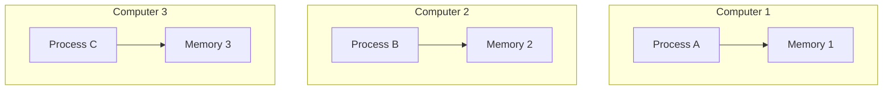
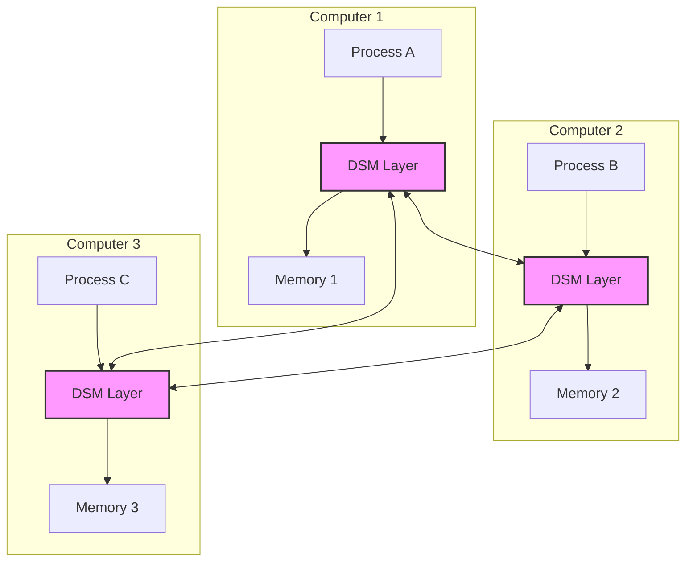

# Distributed Shared Memory

## Introduction

Distributed Shared Memory (DSM) is a memory architecture that creates an abstraction of shared memory across physically distributed systems. In traditional computing, processes running on the same machine can easily share memory. However, in distributed systems where computations run across multiple machines connected by a network, sharing memory becomes challenging. DSM solves this problem by providing a virtual shared address space that spans multiple computers.

Think of DSM as creating the **illusion** of a single, unified memory space even though the actual memory is physically distributed across different machines. This allows programmers to use the familiar shared-memory programming model even in distributed environments.

## Understanding Distributed Shared Memory

### The Basic Concept

In a traditional single computer system, multiple processes can access the same memory:

```
Process A  Process B  Process C
     │         │         │
     ▼         ▼         ▼
┌─────────────────────────┐
│      Shared Memory      │
└─────────────────────────┘
```

But in distributed systems, we have physically separate memory spaces:



DSM creates a layer of abstraction that makes these separate memory spaces appear as one:



### How DSM Works

DSM systems typically operate through these core mechanisms:

1. **Memory Mapping**: Creating a virtual address space that maps to physical memory across machines.
2. **Access Detection**: Monitoring memory accesses to detect when distributed data needs to be updated.
3. **Consistency Maintenance**: Ensuring that all nodes see a consistent view of the shared memory.
4. **Data Transfer**: Moving or replicating data between machines when needed.

## Implementation Approaches

### Page-Based DSM

In page-based DSM, memory is divided into fixed-size pages (similar to virtual memory in operating systems). When a process accesses a page that's not available locally, a "page fault" occurs, and the system fetches the required page from another machine.

```javascript
// Conceptual example (not actual code)
function accessSharedMemory(address) {
  const page = getPageFromAddress(address);
  
  if (!isPageLocallyAvailable(page)) {
    // Page fault! Need to fetch from remote machine
    requestPageFromRemote(page);
    waitForPageArrival(page);
  }
  
  // Now we can access the data
  return readMemory(address);
}
```

### Object-Based DSM

Object-based DSM systems manage memory at the granularity of programming language objects rather than fixed-size pages. This approach often aligns better with how applications actually use memory.

```java
// Example of object-based DSM in a Java-like language
@Distributed
class SharedCounter {
  private int value = 0;
  
  public synchronized void increment() {
    value++;
  }
  
  public int getValue() {
    return value;
  }
}

// Usage across multiple machines
SharedCounter counter = DSM.get("globalCounter");
counter.increment(); // This might happen on any machine in the cluster
```

## Consistency Models

One of the most challenging aspects of DSM is maintaining consistency—ensuring that all processes have the same view of shared memory. Several consistency models exist:

### Strict Consistency

Every read operation returns the most recently written value. This is the most intuitive model but extremely expensive to implement in distributed systems.

### Sequential Consistency

All processes see the same sequence of memory operations, but not necessarily in real-time order. It preserves the program order of operations from each process.

```
Process 1: Write(x, 1) -> Write(y, 2)
Process 2: Read(y) -> Read(x)

Possible sequentially consistent interleaving:
Write(x, 1) -> Write(y, 2) -> Read(y) returns 2 -> Read(x) returns 1
```

### Causal Consistency

Less strict than sequential consistency; it only preserves the order of causally related operations.

### Weak Consistency

Synchronization operations are strictly ordered, but data operations are not. This allows for better performance at the cost of a more complex programming model.

## Practical DSM Example: Distributed Matrix Multiplication

Let's implement a simple matrix multiplication using a DSM system. We'll partition the matrices across multiple machines.

```python
# Conceptual example of matrix multiplication with DSM
def matrix_multiply_dsm(A, B, result_matrix):
    # Assume matrices A and B are already distributed
    rows_A = A.shape[0]
    cols_B = B.shape[1]
    
    # Each node computes a portion of the result matrix
    node_id = get_current_node_id()
    rows_per_node = rows_A // total_nodes
    start_row = node_id * rows_per_node
    end_row = start_row + rows_per_node if node_id < total_nodes - 1 else rows_A
    
    for i in range(start_row, end_row):
        for j in range(cols_B):
            result_matrix[i][j] = 0
            for k in range(A.shape[1]):
                # This might cause remote memory access if B[k][j] is on another node
                result_matrix[i][j] += A[i][k] * B[k][j]
    
    # Synchronize to ensure all nodes complete their work
    dsm_barrier()
```

When running this code, each machine computes a portion of the result matrix. The DSM system handles the complexity of accessing matrix elements that might be stored on remote machines.

## Advantages of DSM

1. **Simplified Programming Model**: Developers can use the familiar shared memory paradigm.
2. **Transparency**: The distribution of memory is hidden from application code.
3. **Resource Sharing**: Memory resources across multiple machines can be pooled together.
4. **Scalability**: Additional machines can be added to increase memory capacity.

## Challenges and Limitations

1. **Network Latency**: Accessing remote memory is significantly slower than local memory.
2. **Consistency Overhead**: Maintaining memory consistency across nodes requires complex protocols.
3. **Fault Tolerance**: Handling node failures requires careful design.
4. **Limited Scalability**: DSM systems often struggle to scale beyond a few dozen nodes.

## Real-World Applications

### Scientific Computing

Large-scale simulations and computations can be distributed across multiple machines while maintaining a simple programming model.

```python
# Example: Distributed physics simulation
# Each node handles a region of the simulation space
def simulate_region(region_id, shared_simulation_state):
    while not simulation_complete:
        # Update local region based on its current state
        update_local_region(region_id)
        
        # Update boundary conditions based on neighboring regions
        # (these might be on other machines, handled by DSM)
        update_boundaries(region_id, shared_simulation_state)
        
        # Wait for all regions to complete this step
        dsm_barrier()
```

### In-Memory Databases

Distributed in-memory databases can use DSM to provide a unified view of data spread across multiple machines.

```java
// Conceptual example of a DSM-based distributed database operation
Transaction tx = database.beginTransaction();
try {
    // These records might be on different machines, but DSM hides this complexity
    Customer customer = database.get(Customer.class, customerId);
    Order newOrder = new Order(customer, items);
    database.save(newOrder);
    
    // Update inventory (potentially on different machines)
    for (Item item : items) {
        Inventory inv = database.get(Inventory.class, item.getId());
        inv.decreaseStock(item.getQuantity());
        database.update(inv);
    }
    
    tx.commit();
} catch (Exception e) {
    tx.rollback();
    throw e;
}
```

### Parallel Computing Frameworks

Modern frameworks often incorporate DSM concepts even if they don't explicitly call it that.

## Implementing a Simple DSM System

Let's build a very basic DSM system using sockets for communication. This is a simplified example to demonstrate the concepts:

```python
# Simplified DSM implementation (conceptual)
class SimpleDSM:
    def __init__(self, node_id, node_addresses):
        self.node_id = node_id
        self.node_addresses = node_addresses
        self.local_memory = {}
        self.page_owners = {}  # Track which node owns which page
        
        # Start server to listen for page requests
        self.start_server()
    
    def read(self, address):
        page_id = address // PAGE_SIZE
        
        if page_id in self.local_memory:
            # We have the page locally
            return self.local_memory[page_id][address % PAGE_SIZE]
        else:
            # Need to fetch the page from remote node
            owner_node = self.find_page_owner(page_id)
            page_data = self.request_page_from_node(owner_node, page_id)
            self.local_memory[page_id] = page_data
            return page_data[address % PAGE_SIZE]
    
    def write(self, address, value):
        page_id = address // PAGE_SIZE
        
        if page_id not in self.local_memory:
            # Fetch page first if we don't have it
            self.read(address)
        
        # Update local copy
        self.local_memory[page_id][address % PAGE_SIZE] = value
        
        # Invalidate this page on other nodes (simplistic approach)
        self.broadcast_invalidation(page_id)
        
        # Mark ourselves as the owner
        self.page_owners[page_id] = self.node_id
        
    def find_page_owner(self, page_id):
        if page_id in self.page_owners:
            return self.page_owners[page_id]
        else:
            # Ask other nodes who owns this page
            # (simplified - in reality would need a more robust protocol)
            return self.broadcast_owner_query(page_id)
    
    # Other methods for server functionality, broadcasting, etc.
    # would be implemented here
```

This example shows a simplified page-based DSM implementation. In practice, DSM systems are much more complex, with sophisticated protocols for consistency, fault tolerance, and performance optimization.

## Summary

Distributed Shared Memory provides a powerful abstraction that bridges the gap between the simplicity of shared-memory programming and the scalability of distributed systems. By creating the illusion of a single address space across multiple machines, DSM systems allow developers to focus on their application logic rather than the complexities of distributed communication.

While DSM systems face significant challenges in terms of performance and scalability, they remain valuable in specific domains like scientific computing, in-memory databases, and parallel computing frameworks.

## Exercises

1. Implement a simple counter that can be incremented from multiple machines using the DSM concept.
2. Compare the performance of a DSM-based matrix multiplication with one that uses explicit message passing.
3. Design a consistency protocol that would be suitable for a collaborative text editor using DSM.
4. Analyze how network latency affects the performance of different DSM implementation approaches.
5. Extend the simple DSM implementation provided above to include basic fault tolerance.

## Further Reading

- "Distributed Shared Memory: Concepts and Systems" by Jelica Protić, Milo Tomasević, and Veljko Milutinović
- "Memory Consistency and Event Ordering in Scalable Shared-Memory Multiprocessors" by Leslie Lamport
- Research papers on specific DSM systems like IVY, TreadMarks, and Munin
- Modern distributed computing frameworks like Apache Spark and Ray, which incorporate DSM-like concepts