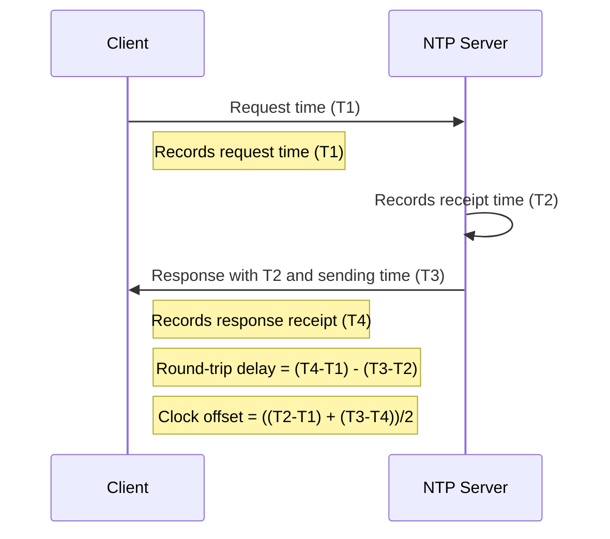
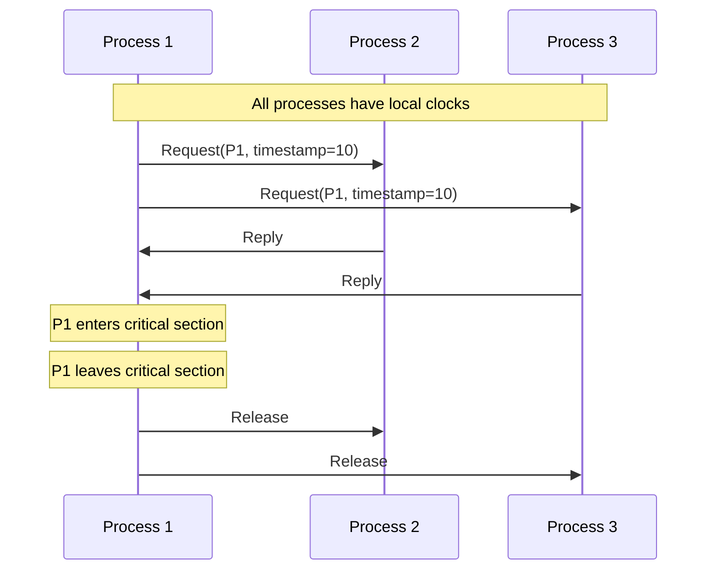
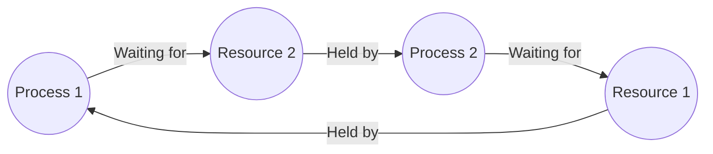
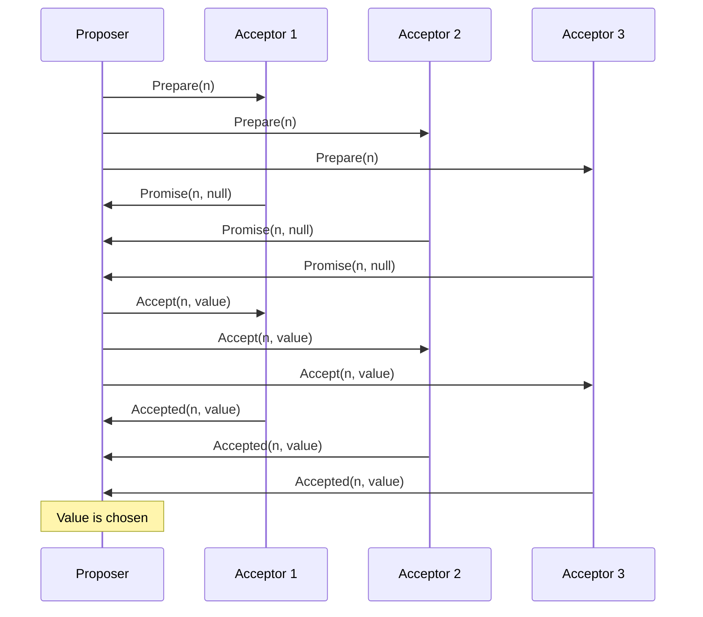

# Distributed Synchronization

In distributed systems, multiple computers work together to solve problems. But how do they coordinate? How do they agree on what happens when? This is where **distributed synchronization** comes into play.

## Introduction

Imagine you're organizing a video call with friends across different time zones. Everyone needs to show up at the "same time," but what does that mean when everyone's clock shows a different time? Distributed systems face similar challenges but at a much larger scale and with more severe consequences for mistakes.

Distributed synchronization addresses the fundamental problem of coordinating actions and establishing agreement on time and order of events across physically separated computers that may experience:

- Different clock speeds
- Network delays
- Message losses
- Partial failures

In this guide, we'll explore how distributed systems tackle these synchronization challenges.

## Physical Clocks vs. Logical Clocks

### Physical Clocks

Physical clocks measure the passage of time as we experience it. In distributed systems, we have two types:

1. **Local clocks**: Each machine has its own physical clock
2. **Global clocks**: An agreed-upon reference time (like UTC)

#### The Clock Drift Problem

A critical issue with physical clocks is **clock drift** - the tendency of hardware clocks to run at slightly different rates.

```javascript
// Example of how clock drift affects two servers
const server1 = {
  startTime: 1000000, // milliseconds since epoch
  clockDrift: 1.0001   // multiplier (clock runs slightly fast)
};

const server2 = {
  startTime: 1000000, // same start time
  clockDrift: 0.9998  // multiplier (clock runs slightly slow)
};

function getTimeAfterHours(server, hours) {
  const millisInHour = 3600 * 1000;
  const elapsedMs = hours * millisInHour;
  return server.startTime + (elapsedMs * server.clockDrift);
}

// After 24 hours
console.log("Server 1 time:", getTimeAfterHours(server1, 24));
console.log("Server 2 time:", getTimeAfterHours(server2, 24));
console.log("Time difference:", 
  getTimeAfterHours(server1, 24) - getTimeAfterHours(server2, 24), "ms");

/* Output:
Server 1 time: 1086422.4
Server 2 time: 1085942.4
Time difference: 480 ms
*/
```

As shown above, after just 24 hours, our servers have drifted almost half a second apart! Over longer periods, this difference grows and can cause serious synchronization issues.

#### Clock Synchronization Algorithms

To combat clock drift, we use clock synchronization algorithms. The most common is **Network Time Protocol (NTP)**, which works by:

1. Contacting time servers
2. Calculating network delays
3. Gradually adjusting the local clock



### Logical Clocks

Instead of trying to perfectly synchronize physical time, we can use **logical clocks** that focus on the correct ordering of events. Two important logical clock approaches are:

#### Lamport Clocks

Developed by Leslie Lamport, these simple counters establish a partial ordering of events.

```java
public class Process {
    private int lamportClock = 0;
    
    public void executeEvent() {
        // Increment own logical clock for internal events
        lamportClock++;
        System.out.println("Event executed at logical time: " + lamportClock);
    }
    
    public void sendMessage(Process receiver, String message) {
        // Increment own logical clock before sending
        lamportClock++;
        
        // Send message along with current clock value
        int sentAtTime = lamportClock;
        System.out.println("Message sent at logical time: " + sentAtTime);
        receiver.receiveMessage(message, sentAtTime);
    }
    
    public void receiveMessage(String message, int messageClock) {
        // Update own logical clock to be greater than both:
        // 1. Own current logical clock
        // 2. Timestamp in the received message
        lamportClock = Math.max(lamportClock, messageClock) + 1;
        
        System.out.println("Message received at logical time: " + lamportClock);
        System.out.println("Message content: " + message);
    }
}

// Example usage:
// Process p1 = new Process();
// Process p2 = new Process();
// p1.executeEvent();
// p1.sendMessage(p2, "Hello");
// p2.executeEvent();

/* Output:
Event executed at logical time: 1
Message sent at logical time: 2
Message received at logical time: 3
Message content: Hello
Event executed at logical time: 4
*/
```

The key insight of Lamport clocks is that if event A causes event B (directly or indirectly), then A's logical timestamp will be less than B's. However, the reverse isn't necessarily true - just because A's timestamp is less than B's doesn't mean A caused B.

#### Vector Clocks

Vector clocks extend Lamport clocks to capture causal relationships more completely.

```python
class Process:
    def __init__(self, id, num_processes):
        # Initialize vector clock with zeros
        self.vector_clock = [0] * num_processes
        self.id = id
    
    def execute_event(self):
        # Increment own position in the vector
        self.vector_clock[self.id] += 1
        print(f"Process {self.id} - Event at vector time: {self.vector_clock}")
    
    def send_message(self, receiver, message):
        # Increment own position in the vector
        self.vector_clock[self.id] += 1
        
        # Send current vector clock with the message
        sent_at_time = self.vector_clock.copy()
        print(f"Process {self.id} - Message sent at vector time: {sent_at_time}")
        
        # In a real system, we'd send the message over the network
        receiver.receive_message(message, sent_at_time)
    
    def receive_message(self, message, msg_vector_clock):
        # Update vector clock to maximum of each element
        for i in range(len(self.vector_clock)):
            self.vector_clock[i] = max(self.vector_clock[i], msg_vector_clock[i])
        
        # Increment own position
        self.vector_clock[self.id] += 1
        
        print(f"Process {self.id} - Message received at vector time: {self.vector_clock}")
        print(f"Process {self.id} - Message content: {message}")

# Example usage:
# p0 = Process(0, 3)
# p1 = Process(1, 3)
# p2 = Process(2, 3)
# p0.execute_event()         # [1,0,0]
# p0.send_message(p1, "Hi")  # [2,0,0]
# p1.receive_message(...)    # [2,1,0]
```

With vector clocks, we can determine if two events are causally related or concurrent by comparing their vector timestamps.

## Distributed Mutual Exclusion

Sometimes processes need exclusive access to a shared resource. In distributed systems, we need special algorithms to handle this without a central coordinator.

### The Ricart-Agrawala Algorithm

This algorithm provides distributed mutual exclusion:



The algorithm works as follows:

1. To enter the critical section, a process sends a timestamped request to all other processes
2. Upon receiving a request, a process sends a reply if:
   - It's not interested in the critical section, or
   - Its own request has a higher timestamp (lower priority)
3. Otherwise, it queues the reply
4. A process enters the critical section when it has received replies from all other processes
5. Upon exiting, it sends replies to all queued requests

```java
public class RicartAgrawala {
    private int processId;
    private int logicalClock = 0;
    private int numProcesses;
    private boolean requestingCS = false;
    private int requestTimestamp = 0;
    private int replyCount = 0;
    private List<Request> deferredReplies = new ArrayList<>();
    
    // Constructor and other methods...
    
    public void requestCriticalSection() {
        requestingCS = true;
        logicalClock++;
        requestTimestamp = logicalClock;
        replyCount = 0;
        
        // Send request to all other processes
        for (int i = 0; i < numProcesses; i++) {
            if (i != processId) {
                sendRequest(i, processId, requestTimestamp);
            }
        }
        
        // Wait until we have all replies
        while (replyCount < numProcesses - 1) {
            // In a real implementation, this would be event-driven
            checkForMessages();
        }
        
        // Now we can enter the critical section
        System.out.println("Process " + processId + " enters critical section");
    }
    
    public void receiveRequest(int fromProcess, int timestamp) {
        // Update logical clock
        logicalClock = Math.max(logicalClock, timestamp) + 1;
        
        if (requestingCS && (
            // Our request has higher priority (lower timestamp)
            requestTimestamp < timestamp ||
            // Same timestamp, break tie with process ID
            (requestTimestamp == timestamp && processId < fromProcess)
        )) {
            // Defer reply
            deferredReplies.add(new Request(fromProcess, timestamp));
        } else {
            // Send reply immediately
            sendReply(fromProcess);
        }
    }
    
    // Other methods for reply handling, exiting CS, etc.
}
```

### Distributed Deadlock Detection

Deadlocks can occur in distributed systems when processes are waiting for resources held by other processes in a circular chain.



Detecting deadlocks in distributed systems often involves constructing a global wait-for graph and checking for cycles. Algorithms include:

1. **Centralized algorithm**: All wait-for information is sent to a central coordinator
2. **Distributed edge-chasing**: Special probe messages follow the edges of the wait-for graph

## Consensus Algorithms

In distributed systems, processes often need to agree on a single value or decision, despite potential failures. This is known as the **consensus problem**.

### Paxos Algorithm

Paxos is a family of protocols for solving consensus in a network of unreliable processors.



### Raft Algorithm

Raft is designed to be more understandable than Paxos while providing the same guarantees. It separates key mechanisms of consensus:

- Leader election
- Log replication
- Safety

```javascript
class RaftNode {
  constructor(id, nodes) {
    this.id = id;
    this.nodes = nodes;
    this.currentTerm = 0;
    this.votedFor = null;
    this.log = [];
    
    // State: follower, candidate, or leader
    this.state = 'follower';
    
    // Leader state
    this.nextIndex = {};
    this.matchIndex = {};
    
    // Timing
    this.electionTimeout = this.randomTimeout(150, 300);
    this.lastHeartbeat = Date.now();
    
    setInterval(() => this.tick(), 10);
  }
  
  tick() {
    if (this.state === 'follower' || this.state === 'candidate') {
      if (Date.now() - this.lastHeartbeat > this.electionTimeout) {
        this.startElection();
      }
    } else if (this.state === 'leader') {
      this.sendHeartbeats();
    }
  }
  
  startElection() {
    this.state = 'candidate';
    this.currentTerm++;
    this.votedFor = this.id;
    this.votes = { [this.id]: true };
    
    console.log(`Node ${this.id} starting election for term ${this.currentTerm}`);
    
    // Request votes from other nodes
    for (const node of this.nodes) {
      if (node !== this.id) {
        this.requestVote(node);
      }
    }
    
    // Reset election timeout
    this.lastHeartbeat = Date.now();
    this.electionTimeout = this.randomTimeout(150, 300);
  }
  
  // Other methods would implement the complete Raft algorithm
  // including vote handling, log replication, etc.
  
  randomTimeout(min, max) {
    return Math.floor(Math.random() * (max - min)) + min;
  }
}
```

## Real-World Applications

Distributed synchronization is not just theory - it's used in many systems you interact with daily:

### Distributed Databases

When you update your profile on a social media platform, that change needs to propagate to data centers worldwide. Distributed databases like Apache Cassandra use vector clocks and consistency protocols to ensure your data remains correct across replicas.

### Microservices Coordination

Modern applications often consist of dozens or hundreds of microservices that need to coordinate their actions. Synchronization protocols help ensure these services maintain correct behavior:

```typescript
// Example: Distributed transaction across microservices
class OrderService {
  async createOrder(userId: string, items: Item[]): Promise<Order> {
    // Start a distributed transaction
    const txnId = await this.transactionCoordinator.begin();
    
    try {
      // Check inventory availability
      const inventoryResponse = await this.inventoryService.reserveItems(
        items, 
        txnId
      );
      
      if (!inventoryResponse.success) {
        throw new Error("Items not available");
      }
      
      // Process payment
      const paymentResponse = await this.paymentService.processPayment(
        userId, 
        this.calculateTotal(items), 
        txnId
      );
      
      if (!paymentResponse.success) {
        throw new Error("Payment failed");
      }
      
      // Create order record
      const order = await this.orderRepository.createOrder({
        userId,
        items,
        status: 'confirmed',
        transactionId: txnId
      });
      
      // Commit the transaction
      await this.transactionCoordinator.commit(txnId);
      
      return order;
    } catch (error) {
      // Something went wrong, abort transaction
      await this.transactionCoordinator.abort(txnId);
      throw error;
    }
  }
}
```

### Distributed Locking Services

When multiple services need coordination, systems like Apache ZooKeeper provide distributed locking and synchronization primitives:

```java
public void performCriticalOperation() throws Exception {
    String lockPath = "/service/critical_section";
    InterProcessMutex lock = new InterProcessMutex(zkClient, lockPath);
    
    try {
        // Attempt to acquire the lock, waiting up to 10 seconds
        if (lock.acquire(10, TimeUnit.SECONDS)) {
            try {
                // We have the lock, do the critical operation
                System.out.println("Lock acquired, performing operation");
                // ... critical code here ...
            } finally {
                // Always release the lock
                lock.release();
                System.out.println("Lock released");
            }
        } else {
            System.out.println("Could not acquire lock within timeout");
        }
    } catch (Exception e) {
        System.err.println("Error with distributed lock: " + e.getMessage());
        throw e;
    }
}
```

## Common Challenges

Despite decades of research, distributed synchronization still presents challenges:

1. **Network partitions**: When the network splits, systems must choose between consistency and availability (the CAP theorem)
2. **Byzantine faults**: When nodes can behave maliciously or arbitrarily
3. **Performance vs. consistency tradeoffs**: Stronger synchronization typically means slower systems
4. **Scalability limitations**: Some algorithms don't scale well to thousands of nodes

## Summary

Distributed synchronization is fundamental to building reliable distributed systems. We've covered:

- The importance of time and ordering in distributed systems
- Physical clock synchronization and its limitations
- Logical clocks (Lamport and Vector)
- Mutual exclusion algorithms
- Consensus algorithms like Paxos and Raft
- Real-world applications and challenges

Remember that perfect synchronization is impossible in distributed systems due to the constraints of physics and the inherent asynchrony of networks. Instead, we use various techniques to establish "good enough" synchronization for our specific application needs.

## Exercises

1. Implement a simple Lamport clock in your preferred programming language.
2. Modify the implementation to use vector clocks instead.
3. Simulate clock drift between three processes and implement a simple synchronization algorithm.
4. Implement a basic distributed mutex using a centralized coordinator.
5. Research and explain how a real-world system (like Cassandra, Kubernetes, or ZooKeeper) handles distributed synchronization.

## Additional Resources

- [Distributed Systems for Fun and Profit](http://book.mixu.net/distsys/) - A free online book
- [Designing Data-Intensive Applications](https://dataintensive.net/) by Martin Kleppmann
- [The Paper Trail](https://www.the-paper-trail.org/) - A blog with excellent distributed systems posts
- [Distributed Systems lecture series](https://www.youtube.com/playlist?list=PL700757A5D4B3F368) by Martin Kleppmann