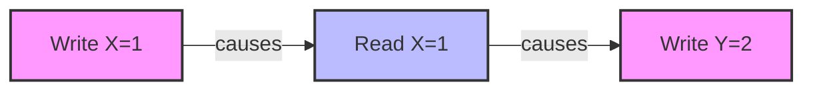
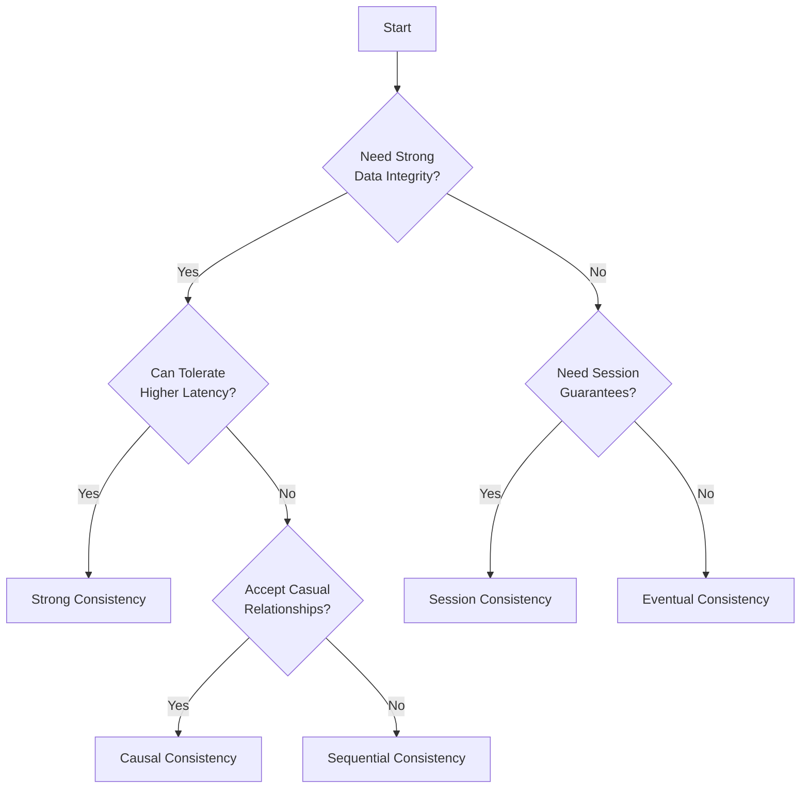
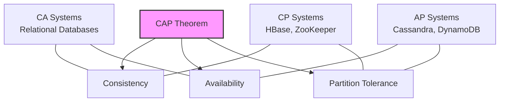

# Consistency Models in Distributed Systems

## Introduction

When working with distributed systems, one of the most challenging aspects is maintaining data consistency across multiple nodes. Unlike a single-machine system where data updates are straightforward, distributed systems must coordinate changes across different servers, potentially in different geographic locations, each with their own local copy of the data.

Consistency models define the contract between the distributed system and its users regarding how and when updates to data become visible. Understanding these models is crucial for designing robust distributed applications that behave correctly under various conditions.

## What are Consistency Models?

A consistency model is a set of rules that determine how the system behaves when reading and writing data across distributed nodes. These models range from strong consistency (which feels like working with a single machine) to various forms of weak consistency (which offer better performance but with more complex guarantees).

Let's explore the main consistency models used in modern distributed systems:

## Strong Consistency

Strong consistency provides a simple programming model: all reads reflect the most recent write, and all nodes see the same data at the same time.

### How Strong Consistency Works

1. When a write operation completes, all subsequent read operations will return the updated value
2. All nodes in the system see operations in the same order (linearizability)
3. The system appears as if there is only one copy of the data

### Code Example: Using a Strongly Consistent Key-Value Store

```python
# Pseudocode for interacting with a strongly consistent distributed store
store = StrongConsistentStore()

# Write a value
store.put("user_123", {"name": "Alice", "status": "active"})

# Any subsequent read, even on different nodes, will see this value
user = store.get("user_123")  
print(user)  # Output: {"name": "Alice", "status": "active"}
```

### Real-world Applications

Strong consistency is used in:

- Banking systems where accurate account balances are critical
- Reservation systems where avoiding double-booking is essential
- Database systems like Google Cloud Spanner, CockroachDB

### Trade-offs

While strong consistency provides the simplest programming model, it comes with disadvantages:

- Higher latency for operations
- Reduced availability during network partitions
- Lower throughput compared to weaker consistency models

## Eventual Consistency

Eventual consistency guarantees that, given no new updates, all nodes will eventually return the most recent value. However, different nodes might see different values temporarily.

### How Eventual Consistency Works

1. Updates are propagated asynchronously to all replicas
2. For a period of time, different nodes may return different values
3. Eventually (when propagation completes), all nodes will return the same value

### Code Example: Working with Eventually Consistent Systems

```python
# Pseudocode for an eventually consistent system scenario
store = EventuallyConsistentStore()

# Write to node A
storeA.put("product_inventory", 100)

# Reading from node B immediately might return stale data
inventory = storeB.get("product_inventory")
print(inventory)  # Output might be: 95 (previous value)

# After propagation delay
time.sleep(propagation_delay)
inventory = storeB.get("product_inventory")
print(inventory)  # Output: 100 (updated value)
```

### Real-world Applications

Eventual consistency is used in:

- Amazon DynamoDB (with configurable consistency)
- Cassandra (when not using quorum reads/writes)
- DNS (Domain Name System)

### Trade-offs

- Higher availability and performance
- Lower latency for operations
- May require application logic to handle inconsistencies
- Not suitable for all use cases (e.g., financial transactions)

## Causal Consistency

Causal consistency ensures that operations that are causally related are seen in the same order by all nodes. Operations with no causal relationship may be seen in different orders.

### How Causal Consistency Works

1. If operation A happens before operation B (causal relationship), all nodes observe A before B
2. If operations A and B are concurrent (no causal relationship), nodes may observe them in different orders

### Understanding Causality



### Code Example: Causal Consistency

```python
# Pseudocode demonstrating causal consistency
store = CausalConsistentStore()

# Node A: Alice updates her profile
store.put("profile_alice", {"status": "on vacation"}, context=None)

# Node A: Bob reads Alice's profile, gets a context
bob_context = store.get_context()
profile = store.get("profile_alice", context=bob_context)
print(profile)  # Output: {"status": "on vacation"}

# Node B: Bob comments on Alice's status using his context
store.put("comments_alice", "Have fun!", context=bob_context)

# The system ensures anyone who sees Bob's comment will also see Alice's updated status
```

### Real-world Applications

- Social media platforms where comments must appear after the posts they refer to
- Collaboration tools like Google Docs
- Distributed version control systems

## Session Consistency

Session consistency ensures a client always sees its own updates and guarantees that read operations reflect all previous writes within that client's session.

### How Session Consistency Works

1. Within a single client session, read operations reflect all previous writes
2. Different client sessions may see different values temporarily
3. Combines benefits of strong consistency (for a single session) with eventual consistency (between sessions)

### Code Example: Session Consistency

```javascript
// JavaScript example of session consistency in a web application

const session = createConsistentSession()

// User updates their profile
await session.update('user/profile', { name: 'Alex', theme: 'dark' })

// User will always see their own updates in the same session
const profile = await session.read('user/profile')
console.log(profile)  // Always outputs: { name: 'Alex', theme: 'dark' }

// Another user's session might see old data temporarily
const otherSession = createConsistentSession()
const otherView = await otherSession.read('user/profile')
console.log(otherView)  // Might output older data until propagation completes
```

### Real-world Applications

- Web applications with user sessions
- Mobile apps that sync with a central server
- E-commerce shopping carts

## Sequential Consistency

Sequential consistency guarantees that all operations appear to execute in some sequential order, and operations from each individual process appear in the order they were issued.

### How Sequential Consistency Works

1. All operations appear in some sequential order
2. The operations of each process appear in the order specified by the program

### Code Example: Sequential Consistency

```java
// Java pseudocode for a sequentially consistent distributed counter

// Thread 1
counter.increment();  // Operation A
counter.increment();  // Operation B

// Thread 2
counter.decrement();  // Operation C

// Possible valid sequential orders:
// A, B, C
// A, C, B
// C, A, B
// But never B, A, C (operations from the same thread must preserve order)
```

## Choosing the Right Consistency Model

The choice of consistency model involves balancing:

1. **Performance:** Weaker models generally offer better performance
2. **Availability:** Stronger models may reduce availability during network partitions
3. **Programming complexity:** Stronger models are easier to reason about
4. **Application requirements:** Some applications require stronger guarantees than others

### Decision Framework



## Real-world Implementation Examples

### Redis Cluster

Redis offers different consistency guarantees depending on configuration:

```bash
# Configure Redis for stronger consistency with synchronous replication
redis-cli> CONFIG SET min-replicas-to-write 2
redis-cli> CONFIG SET min-replicas-max-lag 10
```

### Cassandra Consistency Levels

Cassandra allows configuring consistency levels per operation:

```java
// Java example with Cassandra driver
// Strong consistency with QUORUM
PreparedStatement statement = session.prepare(
    "UPDATE users SET status = ? WHERE user_id = ?"
);

session.execute(
    statement.bind("active", userId)
        .setConsistencyLevel(ConsistencyLevel.QUORUM)
);

// Eventual consistency for less critical reads
ResultSet results = session.execute(
    "SELECT * FROM product_catalog WHERE category = 'electronics'",
    ConsistencyLevel.ONE
);
```

## Implementation Techniques

### Quorum-based Systems

Quorum systems achieve consistency by requiring operations to be acknowledged by a certain number of nodes:

```python
# Pseudocode for quorum-based writes and reads
def write(data, key):
    # Write to at least W out of N nodes
    successful_writes = 0
    for node in all_nodes:
        if node.write(key, data):
            successful_writes += 1
    
    return successful_writes >= W  # W is the write quorum

def read(key):
    # Read from at least R out of N nodes
    values = []
    successful_reads = 0
    
    for node in all_nodes:
        value = node.read(key)
        if value is not None:
            values.append(value)
            successful_reads += 1
    
    if successful_reads >= R:  # R is the read quorum
        # Return the most recent value (based on version/timestamp)
        return get_most_recent(values)
    else:
        raise ConsistencyError("Failed to achieve read quorum")
```

With W + R > N, this provides strong consistency guarantees.

### Vector Clocks

Vector clocks help track causality between events in distributed systems:

```javascript
// JavaScript pseudocode for vector clocks
class VectorClock {
    constructor(nodeId, nodes) {
        this.clock = {};
        nodes.forEach(node => {
            this.clock[node] = 0;
        });
        this.nodeId = nodeId;
    }
    
    increment() {
        this.clock[this.nodeId]++;
        return this.clone();
    }
    
    merge(otherClock) {
        const result = this.clone();
        Object.keys(otherClock.clock).forEach(node => {
            result.clock[node] = Math.max(result.clock[node], otherClock.clock[node]);
        });
        return result;
    }
    
    // Check if this clock happened before another
    happenedBefore(otherClock) {
        let lessThanInOne = false;
        
        for (const node in this.clock) {
            if (this.clock[node] > otherClock.clock[node]) {
                return false;
            }
            if (this.clock[node] < otherClock.clock[node]) {
                lessThanInOne = true;
            }
        }
        
        return lessThanInOne;
    }
    
    clone() {
        const newClock = new VectorClock(this.nodeId, Object.keys(this.clock));
        newClock.clock = {...this.clock};
        return newClock;
    }
}
```

## Consistency Models in Practice: CAP Theorem

The CAP theorem states that a distributed system cannot simultaneously provide more than two of these guarantees:

- **Consistency:** All nodes see the same data at the same time
- **Availability:** Every request receives a response
- **Partition tolerance:** The system continues to operate despite network partitions



Since network partitions are unavoidable in distributed systems, we must choose between consistency and availability during partition events.

## Summary

Consistency models define the contract between distributed systems and their users regarding data visibility and operation ordering. The key points to remember:

1. **Strong consistency** provides a simpler programming model but with higher latency and reduced availability
2. **Eventual consistency** offers better performance and availability but requires handling temporary inconsistencies
3. **Causal consistency** preserves cause-effect relationships while allowing concurrent operations to be observed differently
4. **Session consistency** provides strong guarantees within a client session
5. **Sequential consistency** ensures all nodes see operations in the same order

Choosing the right consistency model depends on your application requirements, performance needs, and tolerance for complexity.

## Exercises

1. Implement a simple distributed counter using different consistency models and compare their behavior under network partitions.
2. Design a distributed shopping cart system. Which consistency model would you choose and why?
3. Create a simulation that demonstrates the CAP theorem trade-offs between different consistency models.
4. Analyze an existing application and identify which consistency model it uses. Could it benefit from a different model?

## Additional Resources

- "Designing Data-Intensive Applications" by Martin Kleppmann
- The Amazon Dynamo paper: "Dynamo: Amazon's Highly Available Key-value Store"
- "Consistency Models in Distributed Systems: A Survey" (academic paper)
- GitHub repositories with example implementations of different consistency models