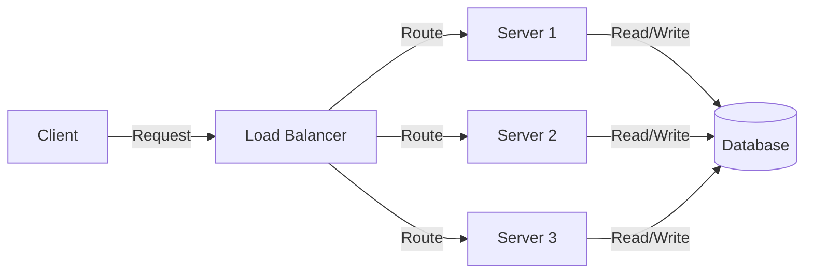
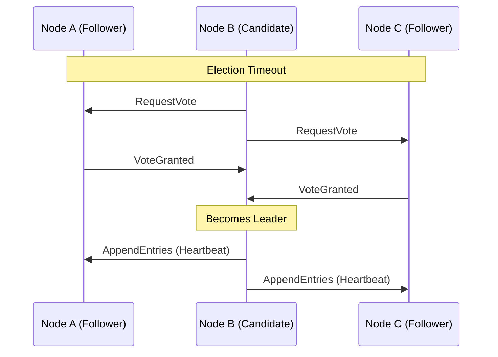
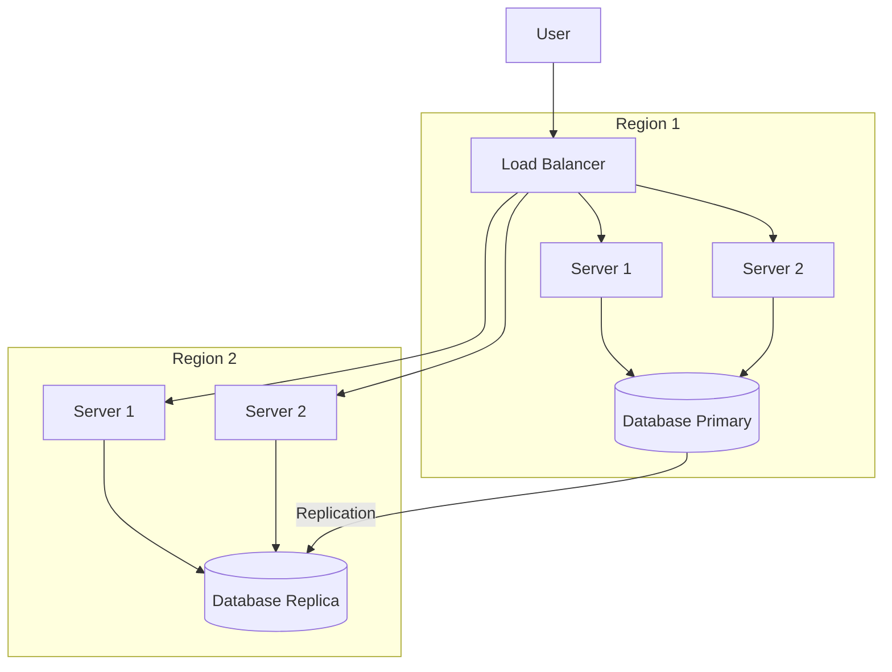

# Fault Tolerance in Distributed Systems

## Introduction

In a perfect world, computer systems would run flawlessly forever. Unfortunately, reality has other plans. Hardware fails, networks become congested, software bugs emerge, and unexpected events occur. When working with distributed systems—where applications run across multiple computers connected by a network—these challenges become even more significant.

**Fault tolerance** refers to a system's ability to continue functioning correctly even when components fail. In distributed systems, fault tolerance is not just a nice-to-have feature; it's essential. Without it, a single server failure could bring down an entire application used by thousands or millions of people.

This guide will explore the fundamental concepts of fault tolerance, common techniques to achieve it, and how to implement these ideas in real distributed systems.

## Understanding Failures in Distributed Systems

Before discussing solutions, let's understand the problem: what kinds of failures can occur in distributed systems?

### Types of Failures

1. **Node Failures**: Individual machines (nodes) can crash or become unresponsive.
2. **Network Failures**: Network connections between nodes can become slow, unreliable, or completely disconnected.
3. **Data Corruption**: Data can become corrupted during storage or transmission.
4. **Software Bugs**: Applications can have bugs that cause unexpected behavior or crashes.
5. **Byzantine Failures**: Some components might behave erratically or even maliciously.

### Failure Models

When designing fault-tolerant systems, engineers typically consider different failure models:

- **Crash-Stop**: A node either works correctly or stops completely.
- **Crash-Recovery**: A node can crash but might restart later.
- **Byzantine**: A node might behave arbitrarily or maliciously.

## Core Concepts in Fault Tolerance

### Redundancy

The most fundamental approach to fault tolerance is redundancy—having backup resources available to take over when primary resources fail.



#### Types of Redundancy:

1. **Hardware Redundancy**: Duplicate hardware components (servers, routers, power supplies).
2. **Software Redundancy**: Multiple instances of services or different implementations of the same service.
3. **Information Redundancy**: Data is replicated across multiple storage locations.
4. **Time Redundancy**: Operations can be retried if they fail.

### Replication

Replication is a specific form of redundancy where data or services are duplicated across multiple nodes.

#### Replication Strategies:

1. **Active Replication**: Multiple replicas process all requests simultaneously.
2. **Passive Replication**: A primary replica processes requests and updates backups.

Here's a simple example of setting up replication in a Node.js application using PM2 process manager:

```javascript
// ecosystem.config.js
module.exports = {
  apps: [{
    name: "my-service",
    script: "server.js",
    instances: 3,
    exec_mode: "cluster",
    watch: true,
    max_memory_restart: "300M",
    env: {
      NODE_ENV: "production"
    }
  }]
};
```

Running this configuration:

```bash
pm2 start ecosystem.config.js
```

This launches three instances of your service, providing redundancy if one crashes.

### Consensus Algorithms

When multiple nodes need to agree on data or actions, consensus algorithms come into play.

Popular consensus algorithms include:

1. **Paxos**: A family of protocols for solving consensus in a network of unreliable processors.
2. **Raft**: Designed to be more understandable than Paxos while providing the same guarantees.
3. **ZAB (Zookeeper Atomic Broadcast)**: Used in Apache ZooKeeper.

Here's a visualization of the Raft leader election process:



### Failure Detection

To recover from failures, systems must first detect them. Common approaches include:

1. **Heartbeats**: Nodes periodically send "I'm alive" messages.
2. **Ping/Echo**: Nodes respond to explicit health checks.
3. **Gossiping**: Nodes exchange information about the health of other nodes.

## Fault Tolerance Techniques

### Checkpointing and Recovery

Checkpointing involves periodically saving the state of a system, allowing it to recover from that point after a failure.

```javascript
// Simple checkpointing example
class StatefulService {
  constructor() {
    this.state = { counter: 0, items: [] };
    this.startCheckpointing();
  }

  startCheckpointing() {
    setInterval(() => this.saveCheckpoint(), 60000); // Every minute
  }

  saveCheckpoint() {
    const checkpointData = JSON.stringify(this.state);
    fs.writeFileSync('checkpoint.json', checkpointData);
    console.log('Checkpoint saved');
  }

  recoverFromCheckpoint() {
    try {
      const data = fs.readFileSync('checkpoint.json', 'utf8');
      this.state = JSON.parse(data);
      console.log('Recovered from checkpoint');
    } catch (error) {
      console.error('Failed to recover from checkpoint:', error);
    }
  }
}
```

### Timeouts and Retries

Implementing timeouts and automatic retries helps handle transient failures:

```javascript
async function fetchWithRetry(url, maxRetries = 3) {
  let lastError;
  
  for (let attempt = 1; attempt <= maxRetries; attempt++) {
    try {
      const controller = new AbortController();
      const timeoutId = setTimeout(() => controller.abort(), 5000); // 5 second timeout
      
      const response = await fetch(url, { signal: controller.signal });
      clearTimeout(timeoutId);
      
      if (!response.ok) {
        throw new Error(`HTTP error! Status: ${response.status}`);
      }
      
      return await response.json();
    } catch (error) {
      console.warn(`Attempt ${attempt} failed: ${error.message}`);
      lastError = error;
      
      if (attempt < maxRetries) {
        // Exponential backoff
        const delay = Math.pow(2, attempt) * 100;
        await new Promise(resolve => setTimeout(resolve, delay));
      }
    }
  }
  
  throw new Error(`Failed after ${maxRetries} attempts: ${lastError.message}`);
}
```

### Circuit Breakers

The circuit breaker pattern prevents cascading failures by temporarily blocking operations that are likely to fail:

```javascript
class CircuitBreaker {
  constructor(serviceFunction, options = {}) {
    this.serviceFunction = serviceFunction;
    this.failureThreshold = options.failureThreshold || 5;
    this.resetTimeout = options.resetTimeout || 30000; // 30 seconds
    this.state = 'CLOSED'; // CLOSED, OPEN, HALF-OPEN
    this.failureCount = 0;
    this.lastFailureTime = null;
  }

  async call(...args) {
    if (this.state === 'OPEN') {
      if (Date.now() - this.lastFailureTime > this.resetTimeout) {
        this.state = 'HALF-OPEN';
      } else {
        throw new Error('Circuit is OPEN - service unavailable');
      }
    }

    try {
      const result = await this.serviceFunction(...args);
      this.onSuccess();
      return result;
    } catch (error) {
      this.onFailure();
      throw error;
    }
  }

  onSuccess() {
    this.failureCount = 0;
    this.state = 'CLOSED';
  }

  onFailure() {
    this.failureCount++;
    this.lastFailureTime = Date.now();
    
    if (this.state === 'HALF-OPEN' || this.failureCount >= this.failureThreshold) {
      this.state = 'OPEN';
    }
  }
}

// Usage
const riskyServiceCall = new CircuitBreaker(
  async (id) => {
    const response = await fetch(`https://api.example.com/data/${id}`);
    return response.json();
  }
);

// Using the circuit breaker
try {
  const data = await riskyServiceCall.call(123);
  console.log('Received data:', data);
} catch (error) {
  console.error('Service call failed:', error.message);
}
```

### Bulkheads

The bulkhead pattern isolates components so failures in one don't affect others, similar to the watertight compartments in ships:

```javascript
class BulkheadedService {
  constructor(poolSizes = {}) {
    this.pools = {
      database: this.createSemaphore(poolSizes.database || 10),
      externalApi: this.createSemaphore(poolSizes.externalApi || 5),
      computation: this.createSemaphore(poolSizes.computation || 20)
    };
  }

  createSemaphore(size) {
    return {
      maxConcurrent: size,
      currentConcurrent: 0,
      queue: []
    };
  }

  async acquirePermit(poolName) {
    const pool = this.pools[poolName];
    
    if (pool.currentConcurrent < pool.maxConcurrent) {
      pool.currentConcurrent++;
      return true;
    } else {
      return new Promise(resolve => {
        pool.queue.push(resolve);
      });
    }
  }

  releasePermit(poolName) {
    const pool = this.pools[poolName];
    
    if (pool.queue.length > 0) {
      const waiter = pool.queue.shift();
      waiter(true);
    } else {
      pool.currentConcurrent--;
    }
  }

  async executeWithBulkhead(poolName, operation) {
    await this.acquirePermit(poolName);
    
    try {
      return await operation();
    } finally {
      this.releasePermit(poolName);
    }
  }
}

// Usage
const service = new BulkheadedService();

async function makeApiCall() {
  return service.executeWithBulkhead('externalApi', async () => {
    // Make external API call
    const response = await fetch('https://api.example.com/data');
    return response.json();
  });
}
```

## Implementing Fault Tolerance Across Layers

### Database Layer

Databases are critical components in distributed systems. Here are techniques to make them fault-tolerant:

1. **Replication**: Keep multiple copies of data.
   
   ```sql
   -- MySQL Primary-Replica setup (on primary)
   CREATE USER 'replica_user'@'replica_host' IDENTIFIED BY 'password';
   GRANT REPLICATION SLAVE ON *.* TO 'replica_user'@'replica_host';
   ```

2. **Sharding**: Distribute data across multiple nodes.

3. **Multi-Region Deployments**: Deploy databases across different geographic regions.

### Application Layer

At the application layer, consider:

1. **Stateless Design**: Services that don't maintain state are easier to restart.

2. **Idempotent Operations**: Operations that can be repeated without side effects.

   ```javascript
   // Idempotent operation example
   async function createUserIdempotent(userData) {
     const userId = generateIdFromUserData(userData);
     
     // Check if user already exists
     const existingUser = await db.users.findOne({ id: userId });
     if (existingUser) {
       return { user: existingUser, created: false };
     }
     
     // Create the user with predetermined ID
     const newUser = await db.users.insertOne({
       ...userData,
       id: userId,
       createdAt: new Date()
     });
     
     return { user: newUser, created: true };
   }
   ```

3. **Graceful Degradation**: Provide reduced functionality rather than failing completely.

### Infrastructure Layer

Infrastructure-level fault tolerance includes:

1. **Load Balancing**: Distribute traffic across multiple servers.

2. **Autoscaling**: Automatically adjust resources based on demand.

3. **Multi-Zone/Multi-Region Deployments**: Deploy across different data centers or cloud regions.



## Real-World Examples

### Netflix Chaos Engineering

Netflix pioneered chaos engineering with their "Chaos Monkey" tool, which deliberately introduces failures in their production environment. This approach helps them identify weaknesses before they become actual problems.

### Amazon's Cell-Based Architecture

Amazon's services are organized into small, independent cells. If one cell fails, it doesn't affect others, containing the blast radius of failures.

### Implementation Example: Fault-Tolerant Microservice

Let's build a simple fault-tolerant microservice using Node.js and Express:

```javascript
const express = require('express');
const axios = require('axios');
const { Pool } = require('pg');
const Redis = require('ioredis');

// Create a circuit breaker for external API calls
class CircuitBreaker {
  // ... (implementation from earlier)
}

// Initialize our service
const app = express();
app.use(express.json());

// Database connection with connection pooling
const dbPool = new Pool({
  host: process.env.DB_HOST,
  user: process.env.DB_USER,
  password: process.env.DB_PASSWORD,
  database: process.env.DB_NAME,
  max: 20, // Maximum connections
  idleTimeoutMillis: 30000
});

// Redis for caching
const redisClient = new Redis({
  host: process.env.REDIS_HOST,
  maxRetriesPerRequest: 3,
  retryStrategy(times) {
    const delay = Math.min(times * 50, 2000);
    return delay;
  }
});

// Circuit breaker for external weather API
const weatherApiClient = new CircuitBreaker(
  async (city) => {
    const response = await axios.get(`https://weather-api.example.com/data/${city}`);
    return response.data;
  },
  { failureThreshold: 3, resetTimeout: 10000 }
);

// Health check endpoint
app.get('/health', (req, res) => {
  res.status(200).json({ status: 'ok' });
});

// Get weather data with fallbacks and caching
app.get('/weather/:city', async (req, res) => {
  const { city } = req.params;
  
  try {
    // Try to get from cache first
    const cachedData = await redisClient.get(`weather:${city}`);
    if (cachedData) {
      return res.json(JSON.parse(cachedData));
    }
    
    // If not in cache, try to get fresh data
    const weatherData = await weatherApiClient.call(city);
    
    // Store in cache for 15 minutes
    await redisClient.set(
      `weather:${city}`, 
      JSON.stringify(weatherData), 
      'EX', 
      900
    );
    
    return res.json(weatherData);
  } catch (error) {
    console.error(`Failed to get weather for ${city}:`, error.message);
    
    try {
      // Try to get stale data from database as fallback
      const result = await dbPool.query(
        'SELECT data FROM weather_history WHERE city = $1 ORDER BY timestamp DESC LIMIT 1',
        [city]
      );
      
      if (result.rows.length > 0) {
        return res.json({
          ...result.rows[0].data,
          note: 'Data may be outdated due to service issues'
        });
      }
      
      // If no fallback data, return error
      throw new Error('No weather data available');
    } catch (dbError) {
      res.status(503).json({
        error: 'Weather service temporarily unavailable',
        message: 'Please try again later'
      });
    }
  }
});

// Listen on multiple ports for redundancy
const ports = [3000, 3001, 3002];
ports.forEach(port => {
  app.listen(port, () => {
    console.log(`Service running on port ${port}`);
  });
});

// Graceful shutdown
process.on('SIGTERM', async () => {
  console.log('Shutting down gracefully...');
  
  // Give existing connections 10 seconds to complete
  const shutdown = async () => {
    await dbPool.end();
    await redisClient.quit();
    process.exit(0);
  };
  
  setTimeout(shutdown, 10000).unref();
});
```

This example demonstrates several fault tolerance techniques:
- Circuit breaker for external API calls
- Caching with Redis to reduce external dependencies
- Database connection pooling
- Graceful degradation with fallback data
- Multiple listening ports
- Graceful shutdown handling

## Common Challenges and Solutions

### Eventual Consistency

In distributed systems, achieving immediate consistency across all nodes is challenging. Eventual consistency acknowledges that data might be temporarily inconsistent but will converge to a consistent state.

### Data Reconciliation

When conflicts arise between replicas, systems need mechanisms to resolve them:

1. **Last-Write-Wins**: The most recent update takes precedence.
2. **Vector Clocks**: Track causal relationships between updates.
3. **Conflict-Free Replicated Data Types (CRDTs)**: Data structures designed to resolve conflicts automatically.

### Testing Fault Tolerance

How do you test something designed to handle unpredictable failures?

1. **Chaos Engineering**: Deliberately introduce failures to test recovery.
2. **Fault Injection**: Add specific failures during testing.
3. **Simulation Testing**: Use tools that simulate various network conditions and failure scenarios.

## Summary

Fault tolerance is a critical aspect of distributed systems that enables them to continue functioning despite failures. The key concepts we've covered include:

1. **Understanding failure types and models**
2. **Core concepts: redundancy, replication, and consensus**
3. **Techniques: checkpointing, retries, circuit breakers, and bulkheads**
4. **Layer-specific strategies for databases, applications, and infrastructure**
5. **Real-world examples and implementation patterns**

Remember that fault tolerance is not about eliminating failures—that's impossible. Instead, it's about anticipating failures, containing their impact, and recovering gracefully when they occur.

## Additional Resources

### Books
- "Designing Data-Intensive Applications" by Martin Kleppmann
- "Release It!" by Michael T. Nygard
- "Building Microservices" by Sam Newman

### Online Courses
- MIT 6.824: Distributed Systems
- Coursera: Cloud Computing Specialization

### Exercises

1. **Basic Circuit Breaker**: Implement a simple circuit breaker for a web API client.
2. **Retry Mechanism**: Create a function that retries operations with exponential backoff.
3. **Failover System**: Design a system that automatically switches to a backup when the primary fails.
4. **Chaos Testing**: Add a "chaos monkey" to your application that randomly terminates processes.
5. **Idempotent API**: Convert a non-idempotent API endpoint to be idempotent.