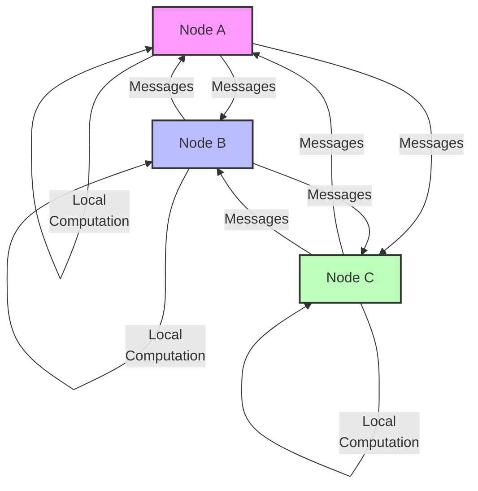
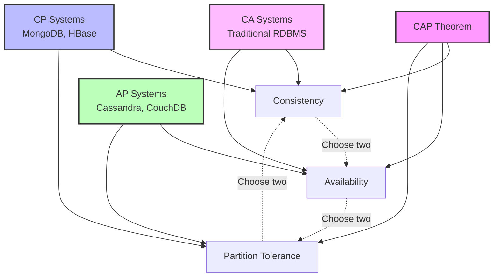

# Distributed Algorithms

## Introduction

Distributed algorithms are a set of rules and protocols that allow multiple processes, running on different nodes in a distributed system, to work together to solve a common problem. Unlike traditional algorithms that run on a single processor, distributed algorithms operate in environments where:

- Computation is distributed across multiple machines
- Communication between machines occurs through message passing
- No single machine has complete information about the system state
- Machines may operate at different speeds
- Components may fail independently

As distributed systems continue to grow in importance across cloud computing, big data processing, and decentralized applications, understanding how distributed algorithms work becomes crucial for building reliable and scalable applications.

## Key Properties of Distributed Algorithms

### 1. Fault Tolerance

Distributed algorithms must continue to function correctly even when some components fail.

### 2. Scalability

The algorithm should remain efficient as the system size increases.

### 3. Decentralization

There should be no single point of failure or control.

### 4. Concurrency

Multiple processes need to execute simultaneously without conflicts.

### 5. Message Passing

Processes communicate by sending messages to each other rather than sharing memory.

## Types of Distributed Algorithms

Let's explore some fundamental types of distributed algorithms that form the building blocks of distributed systems.

### Consensus Algorithms

Consensus algorithms allow distributed processes to agree on a single value, even in the presence of failures.

#### Example: Simple Majority Voting

```javascript
class Node {
  constructor(id, nodes) {
    this.id = id;
    this.nodes = nodes;      // List of all nodes in the network
    this.value = null;       // Local value
    this.proposals = {};     // Received proposals
    this.decided = false;    // Whether a decision has been made
  }

  // Propose a value
  propose(value) {
    this.value = value;
    // Send proposal to all nodes
    for (const nodeId of this.nodes) {
      this.sendMessage(nodeId, { type: 'PROPOSE', from: this.id, value });
    }
  }

  // Receive a message from another node
  receiveMessage(message) {
    if (message.type === 'PROPOSE') {
      this.proposals[message.from] = message.value;
      
      // Check if we have enough proposals to make a decision
      if (Object.keys(this.proposals).length > this.nodes.length / 2) {
        // Count occurrences of each proposed value
        const counts = {};
        for (const nodeId in this.proposals) {
          const val = this.proposals[nodeId];
          counts[val] = (counts[val] || 0) + 1;
        }
        
        // Find the value with the most votes
        let maxCount = 0;
        let majorityValue = null;
        for (const value in counts) {
          if (counts[value] > maxCount) {
            maxCount = counts[value];
            majorityValue = value;
          }
        }
        
        // If majority reached, decide on that value
        if (maxCount > this.nodes.length / 2) {
          this.decided = true;
          this.value = majorityValue;
          console.log(`Node ${this.id} decided on value: ${majorityValue}`);
        }
      }
    }
  }

  sendMessage(nodeId, message) {
    // In a real implementation, this would send a message over the network
    console.log(`Node ${this.id} sending to Node ${nodeId}: ${JSON.stringify(message)}`);
    // The receiving node would call receiveMessage
  }
}
```

**Input:**
```javascript
// Setup a network with 5 nodes
const nodeIds = [1, 2, 3, 4, 5];
const nodes = nodeIds.map(id => new Node(id, nodeIds));

// Nodes propose different values
nodes[0].propose("A");
nodes[1].propose("B");
nodes[2].propose("A");
nodes[3].propose("A");
nodes[4].propose("B");

// Simulate message delivery (in a real system, this happens over the network)
// Each node receives all proposals
for (const sender of nodes) {
  for (const receiver of nodes) {
    if (sender.id !== receiver.id) {
      receiver.receiveMessage({ 
        type: 'PROPOSE', 
        from: sender.id, 
        value: sender.value 
      });
    }
  }
}
```

**Output:**
```
Node 1 sending to Node 2: {"type":"PROPOSE","from":1,"value":"A"}
Node 1 sending to Node 3: {"type":"PROPOSE","from":1,"value":"A"}
...
Node 1 decided on value: A
Node 2 decided on value: A
Node 3 decided on value: A
Node 4 decided on value: A
Node 5 decided on value: A
```

This simple majority voting algorithm illustrates the basic principle of consensus, though real-world consensus algorithms like Paxos and Raft are more complex to handle scenarios like network partitions and node failures.

### Leader Election Algorithms

Leader election algorithms choose a single coordinator among multiple processes.

#### The Bully Algorithm

```python
class Node:
    def __init__(self, id, nodes):
        self.id = id
        self.nodes = nodes  # List of all node IDs in the system
        self.is_leader = False
        self.election_in_progress = False
        
    def start_election(self):
        print(f"Node {self.id} starting election")
        self.election_in_progress = True
        
        # Find nodes with higher IDs
        higher_nodes = [n for n in self.nodes if n > self.id]
        
        if not higher_nodes:
            # This is the node with the highest ID
            self.become_leader()
            return
        
        # Send election messages to all nodes with higher IDs
        for node_id in higher_nodes:
            self.send_election_message(node_id)
            
    def receive_election_message(self, from_id):
        print(f"Node {self.id} received election message from {from_id}")
        # Reply to the sender
        self.send_reply(from_id)
        
        # Start a new election (only if not already in one)
        if not self.election_in_progress:
            self.start_election()
            
    def receive_reply(self, from_id):
        print(f"Node {self.id} received reply from {from_id}")
        # If I get a reply, I'm not the leader
        self.election_in_progress = False
        
    def receive_coordinator_message(self, from_id):
        print(f"Node {self.id} received coordinator message from {from_id}")
        self.is_leader = False
        self.election_in_progress = False
        print(f"Node {self.id} acknowledges Node {from_id} as leader")
        
    def become_leader(self):
        print(f"Node {self.id} becomes the leader")
        self.is_leader = True
        self.election_in_progress = False
        
        # Announce leadership to all other nodes
        for node_id in self.nodes:
            if node_id != self.id:
                self.send_coordinator_message(node_id)
    
    # These methods would send actual network messages in a real implementation
    def send_election_message(self, to_id):
        print(f"Node {self.id} sending election message to Node {to_id}")
    
    def send_reply(self, to_id):
        print(f"Node {self.id} sending reply to Node {to_id}")
    
    def send_coordinator_message(self, to_id):
        print(f"Node {self.id} sending coordinator message to Node {to_id}")
```

**Example Execution:**

```python
# Create nodes with IDs 1, 5, 9
all_ids = [1, 5, 9]
nodes = {id: Node(id, all_ids) for id in all_ids}

# Let's say node 5 detects the leader (node 9) has failed
# Node 5 starts an election
nodes[5].start_election()

# Simulation of message passing
# Node 9 receives election message and replies
nodes[9].receive_election_message(5)
nodes[5].receive_reply(9)

# Since node 9 has highest ID, it becomes leader
nodes[9].become_leader()

# Node 1 and 5 receive coordinator messages
nodes[1].receive_coordinator_message(9)
nodes[5].receive_coordinator_message(9)
```

**Output:**
```
Node 5 starting election
Node 5 sending election message to Node 9
Node 9 received election message from 5
Node 9 sending reply to Node 5
Node 9 starting election
Node 5 received reply from 9
Node 9 becomes the leader
Node 9 sending coordinator message to Node 1
Node 9 sending coordinator message to Node 5
Node 1 received coordinator message from 9
Node 1 acknowledges Node 9 as leader
Node 5 received coordinator message from 9
Node 5 acknowledges Node 9 as leader
```

### Time Synchronization

Clock synchronization is crucial in distributed systems where events must be ordered correctly.

#### Simplified Network Time Protocol (NTP)

```java
class ClockSync {
    private long localClock;
    private String nodeId;
    
    public ClockSync(String nodeId, long initialTime) {
        this.nodeId = nodeId;
        this.localClock = initialTime;
    }
    
    // Get current local time
    public long getTime() {
        return localClock;
    }
    
    // Update local time
    private void updateTime(long newTime) {
        System.out.println(nodeId + ": Adjusting clock from " + localClock + " to " + newTime);
        localClock = newTime;
    }
    
    // Simulate time passing
    public void tick(long amount) {
        localClock += amount;
    }
    
    // Request time from server
    public void synchronizeWithServer(ClockSync server) {
        // T1: Client request time
        long t1 = this.getTime();
        
        // T2: Server receives request
        long t2 = server.getTime();
        
        // Server processes request (simulated delay)
        server.tick(5);
        
        // T3: Server sends response
        long t3 = server.getTime();
        
        // Client processes response (simulated delay)
        this.tick(5);
        
        // T4: Client receives response
        long t4 = this.getTime();
        
        // Calculate round trip delay
        long roundTripDelay = (t4 - t1) - (t3 - t2);
        
        // Calculate offset
        long offset = ((t2 - t1) + (t3 - t4)) / 2;
        
        System.out.println(nodeId + ": Round trip delay: " + roundTripDelay);
        System.out.println(nodeId + ": Clock offset: " + offset);
        
        // Adjust local clock
        this.updateTime(this.getTime() + offset);
    }
}
```

**Example Usage:**

```java
public static void main(String[] args) {
    // Create a time server with time 1000
    ClockSync timeServer = new ClockSync("Server", 1000);
    
    // Create a client with time 900 (100 units behind)
    ClockSync client = new ClockSync("Client", 900);
    
    System.out.println("Before synchronization:");
    System.out.println("Server time: " + timeServer.getTime());
    System.out.println("Client time: " + client.getTime());
    
    // Client synchronizes with server
    client.synchronizeWithServer(timeServer);
    
    System.out.println("
After synchronization:");
    System.out.println("Server time: " + timeServer.getTime());
    System.out.println("Client time: " + client.getTime());
}
```

**Output:**
```
Before synchronization:
Server time: 1000
Client time: 900
Client: Round trip delay: 10
Client: Clock offset: 95
Client: Adjusting clock from 910 to 1005

After synchronization:
Server time: 1005
Client time: 1005
```

## Distributed Mutual Exclusion

In distributed systems, ensuring only one process can access a shared resource at a time requires special algorithms.

### Token Ring Algorithm

```python
class Node:
    def __init__(self, id, total_nodes):
        self.id = id
        self.total_nodes = total_nodes
        self.has_token = False
        self.wants_access = False
        self.is_in_critical_section = False
        
    def request_critical_section(self):
        print(f"Node {self.id} wants to enter critical section")
        self.wants_access = True
        
        if self.has_token:
            self.enter_critical_section()
        
    def enter_critical_section(self):
        if not self.wants_access:
            return
            
        print(f"Node {self.id} entering critical section")
        self.is_in_critical_section = True
        self.wants_access = False
        
        # Simulate doing work in critical section
        print(f"Node {self.id} working in critical section")
        
        # Exit critical section
        self.exit_critical_section()
        
    def exit_critical_section(self):
        print(f"Node {self.id} exiting critical section")
        self.is_in_critical_section = False
        
        # Pass token to next node
        next_node = (self.id + 1) % self.total_nodes
        print(f"Node {self.id} passing token to Node {next_node}")
        self.has_token = False
        return next_node
    
    def receive_token(self):
        print(f"Node {self.id} received the token")
        self.has_token = True
        
        if self.wants_access:
            self.enter_critical_section()
```

**Example Execution:**

```python
# Create 4 nodes
nodes = [Node(i, 4) for i in range(4)]

# Give the token to node 0
nodes[0].has_token = True
print("Initial state: Node 0 has the token")

# Nodes 1 and 3 want to enter critical section
nodes[1].request_critical_section()
nodes[3].request_critical_section()

# Simulate token passing around the ring
current_token_holder = 0

for _ in range(8):  # Simulate 8 token passes
    if nodes[current_token_holder].has_token:
        next_node = nodes[current_token_holder].exit_critical_section()
        current_token_holder = next_node
        nodes[current_token_holder].receive_token()
```

**Output:**
```
Initial state: Node 0 has the token
Node 1 wants to enter critical section
Node 3 wants to enter critical section
Node 0 exiting critical section
Node 0 passing token to Node 1
Node 1 received the token
Node 1 entering critical section
Node 1 working in critical section
Node 1 exiting critical section
Node 1 passing token to Node 2
Node 2 received the token
Node 2 exiting critical section
Node 2 passing token to Node 3
Node 3 received the token
Node 3 entering critical section
Node 3 working in critical section
Node 3 exiting critical section
Node 3 passing token to Node 0
Node 0 received the token
Node 0 exiting critical section
...
```

## Visual Representation

Here's a visual diagram showing how distributed algorithms operate in a distributed system:



## Practical Applications

Distributed algorithms power many systems we use daily:

### 1. Distributed Databases

Systems like Cassandra and MongoDB use distributed consensus algorithms to maintain data consistency across multiple nodes.

```javascript
// Simplified example of a distributed key-value store
class DistributedKVStore {
  constructor(nodeId, nodes) {
    this.nodeId = nodeId;
    this.nodes = nodes;
    this.data = {};
    this.versionNumbers = {};
  }
  
  // Set a value with vector clock versioning
  set(key, value) {
    // Update version number
    this.versionNumbers[key] = this.versionNumbers[key] || {};
    this.versionNumbers[key][this.nodeId] = 
      (this.versionNumbers[key][this.nodeId] || 0) + 1;
    
    // Store data with version
    this.data[key] = {
      value: value,
      version: {...this.versionNumbers[key]}
    };
    
    // Replicate to other nodes
    for (const node of this.nodes) {
      if (node !== this.nodeId) {
        this.sendReplication(node, key, value, this.versionNumbers[key]);
      }
    }
    
    return true;
  }
  
  // Receive replication message
  receiveReplication(key, value, incomingVersion) {
    // Initialize if this is a new key
    if (!this.data[key]) {
      this.data[key] = { value: null, version: {} };
      this.versionNumbers[key] = {};
    }
    
    // Compare versions
    const currentVersion = this.versionNumbers[key] || {};
    
    // Check if the incoming version is newer
    let isNewer = false;
    let isConflict = false;
    
    for (const nodeId in incomingVersion) {
      if (!currentVersion[nodeId] || 
          incomingVersion[nodeId] > currentVersion[nodeId]) {
        isNewer = true;
      }
    }
    
    for (const nodeId in currentVersion) {
      if (!incomingVersion[nodeId] || 
          currentVersion[nodeId] > incomingVersion[nodeId]) {
        if (isNewer) {
          isConflict = true;
        }
      }
    }
    
    // Update data if the incoming version is newer
    if (isNewer) {
      if (isConflict) {
        console.log(`Node ${this.nodeId}: Conflict detected for key ${key}, resolving...`);
        // In a real system, we would apply conflict resolution strategies
        // For simplicity, we'll just take the incoming version
      }
      
      this.data[key] = {
        value: value,
        version: {...incomingVersion}
      };
      
      // Update our version numbers
      this.versionNumbers[key] = {...incomingVersion};
      
      console.log(`Node ${this.nodeId}: Updated key ${key} to value ${value}`);
    }
  }
  
  // Get value for a key
  get(key) {
    if (this.data[key]) {
      return this.data[key].value;
    }
    return null;
  }
  
  // Send replication message to another node
  sendReplication(nodeId, key, value, version) {
    console.log(`Node ${this.nodeId} sending replication of key ${key} to Node ${nodeId}`);
    // In a real system, this would send over the network
  }
}
```

### 2. Blockchain Networks

Blockchain technologies like Bitcoin and Ethereum use distributed consensus to agree on the state of a ledger.

### 3. Content Delivery Networks (CDNs)

CDNs use distributed caching and routing algorithms to efficiently deliver content to users.

### 4. Distributed File Systems

Systems like HDFS (Hadoop Distributed File System) use distributed algorithms for file replication and access.

## Challenges in Distributed Algorithms

### 1. Partial Failures

Unlike centralized systems where components either work entirely or fail entirely, distributed systems can experience partial failures where some components work while others fail.

### 2. Message Delays and Losses

Network communication is unreliable, and messages can be delayed, lost, or delivered out of order.

### 3. Clock Drift

Physical clocks on different machines drift at different rates, making time synchronization challenging.

### 4. Network Partitions

Network failures can isolate groups of nodes from each other, creating "split-brain" scenarios.

## CAP Theorem

The CAP theorem states that a distributed system cannot simultaneously provide all three of these guarantees:

- **Consistency**: All nodes see the same data at the same time
- **Availability**: Every request receives a response (success or failure)
- **Partition Tolerance**: The system continues to operate despite network partitions

In practice, when a network partition occurs, you must choose between consistency and availability.



## Summary

Distributed algorithms solve complex coordination problems in distributed systems, enabling reliable and scalable applications. Key types include:

1. **Consensus algorithms** - Allow nodes to agree on values
2. **Leader election** - Select a coordinator
3. **Time synchronization** - Coordinate clocks across nodes
4. **Mutual exclusion** - Control access to shared resources

Understanding these algorithms is crucial for building modern distributed applications. They address fundamental challenges like partial failures, message delays, and network partitions, allowing systems to maintain reliability and consistency in unpredictable environments.

## Additional Resources

### Books:
- "Distributed Algorithms" by Nancy Lynch
- "Designing Data-Intensive Applications" by Martin Kleppmann

### Online Tutorials:
- MIT's Distributed Systems Course
- Coursera's Cloud Computing Specialization

## Exercises

1. Implement a simplified version of the Raft consensus algorithm with leader election and log replication.
2. Design a distributed counter that maintains consistency across multiple nodes.
3. Implement a distributed mutual exclusion algorithm and test it under different network conditions.
4. Create a simulation of clock synchronization between several nodes with random clock drift.
5. Design a conflict resolution strategy for a distributed key-value store when two nodes update the same key simultaneously.