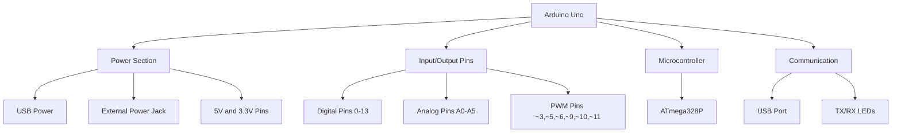

# Arduino Introduction

## What is Arduino?

Arduino is an open-source electronics platform based on easy-to-use hardware and software. It's designed for artists, designers, hobbyists, and anyone interested in creating interactive objects or environments.

At its core, Arduino consists of:

1. A physical programmable circuit board (often referred to as a microcontroller)
2. A piece of software, or IDE (Integrated Development Environment) that runs on your computer
3. A programming language and compiler

The combination of these elements allows you to create projects that can sense and control the physical world.

## Why Arduino?

Arduino has become immensely popular among beginners and professionals for several reasons:

- **Beginner-friendly**: You don't need extensive electronics or programming knowledge to get started
- **Affordable**: Arduino boards are relatively inexpensive compared to other microcontroller platforms
- **Cross-platform**: The Arduino IDE runs on Windows, macOS, and Linux
- **Open-source**: Both the hardware designs and software are open-source, allowing for extensive customization
- **Extensive community**: A large community provides support, tutorials, and project ideas
- **Versatile**: Can be used for a wide range of projects, from simple LED blinking to complex robotics

## Arduino Hardware

### Arduino Boards

There are several types of Arduino boards, each designed for different purposes. The most common for beginners is the Arduino Uno.

Here's a comparison of popular Arduino boards:

| Board | Microcontroller | Digital I/O Pins | Analog Input Pins | Clock Speed | USB Interface |
|-------|----------------|-----------------|------------------|------------|--------------|
| Uno | ATmega328P | 14 (6 PWM) | 6 | 16 MHz | Regular |
| Nano | ATmega328P | 14 (6 PWM) | 8 | 16 MHz | Mini-B |
| Mega | ATmega2560 | 54 (15 PWM) | 16 | 16 MHz | Regular |
| Leonardo | ATmega32U4 | 20 (7 PWM) | 12 | 16 MHz | Micro |

### Anatomy of an Arduino Uno

Let's take a closer look at the Arduino Uno board:



Key components:

- **Power**: USB connection or external power supply (7-12V)
- **Digital I/O Pins**: Can be set as input or output with `pinMode()`
- **Analog Input Pins**: Read analog values (0-1023, representing 0-5V)
- **Microcontroller**: The brain of the Arduino (ATmega328P for the Uno)
- **Reset Button**: Restarts the program
- **USB Port**: For programming and communication with the computer
- **Power LED**: Indicates power
- **TX/RX LEDs**: Blink during serial communication

## Arduino Software

The Arduino IDE (Integrated Development Environment) is the software used to write, compile, and upload code to the Arduino board.

### Installing the Arduino IDE

1. Go to the [Arduino website](https://www.arduino.cc/en/software)
2. Download the version for your operating system
3. Install following the on-screen instructions
4. Connect your Arduino board via USB

### Understanding the IDE

The Arduino IDE consists of:

- **Editor**: Where you write your code
- **Message Area**: Shows errors and other information
- **Text Console**: Displays detailed output messages
- **Toolbar**: Contains buttons for common functions
- **Menu Bar**: Access to all IDE functions

### Arduino Programming Language

Arduino programs are written in a simplified version of C++. Each program (called a "sketch") has two main functions:

- `setup()`: Runs once when the Arduino starts
- `loop()`: Runs repeatedly after `setup()` completes

## Your First Arduino Project: Blinking an LED

Let's create a simple project that blinks the built-in LED on pin 13.

### What You'll Need

- Arduino Uno board
- USB cable
- Arduino IDE installed on your computer

### The Code

```cpp
// Pin definition
const int ledPin = 13;  // Built-in LED on most Arduino boards

// setup function runs once when the board starts
void setup() {
  // Initialize the LED pin as an output
  pinMode(ledPin, OUTPUT);
}

// loop function runs repeatedly after setup() completes
void loop() {
  digitalWrite(ledPin, HIGH);  // Turn the LED on
  delay(1000);                 // Wait for 1 second (1000 milliseconds)
  digitalWrite(ledPin, LOW);   // Turn the LED off
  delay(1000);                 // Wait for 1 second
}
```

### Step-by-Step Explanation

1. We define a constant `ledPin` with the value 13, which corresponds to the built-in LED.
2. In the `setup()` function, we initialize the pin as an output using `pinMode()`.
3. In the `loop()` function:
   - We turn the LED on with `digitalWrite(ledPin, HIGH)`
   - We wait for 1 second with `delay(1000)`
   - We turn the LED off with `digitalWrite(ledPin, LOW)`
   - We wait for another second
   - The loop repeats indefinitely

### Uploading the Code

1. Connect your Arduino to your computer using the USB cable
2. Select the correct board from Tools > Board
3. Select the correct port from Tools > Port
4. Click the Upload button (right arrow icon)

Once uploaded, you should see the LED on your Arduino board blinking on and off every second.

## Basic Arduino Functions

Here are some fundamental Arduino functions you'll use frequently:

### Digital I/O

```cpp
pinMode(pin, mode);          // Set a pin as INPUT or OUTPUT
digitalWrite(pin, value);    // Write HIGH or LOW to a digital pin
int value = digitalRead(pin); // Read HIGH or LOW from a digital pin
```

### Analog I/O

```cpp
int value = analogRead(pin);       // Read an analog value (0-1023)
analogWrite(pin, value);           // Write an analog value (0-255) to a PWM pin
```

### Time

```cpp
delay(ms);                  // Pause program for milliseconds
delayMicroseconds(us);      // Pause program for microseconds
unsigned long time = millis(); // Get milliseconds since program started
```

### Serial Communication

```cpp
Serial.begin(speed);        // Initialize serial communication
Serial.print(data);         // Send data to serial port
Serial.println(data);       // Send data followed by newline
int data = Serial.read();   // Read incoming serial data
```

## Project Example: Temperature Monitor

Let's create a slightly more advanced project that reads temperature from a sensor and displays it on the Serial Monitor.

### What You'll Need

- Arduino Uno
- TMP36 temperature sensor (or similar)
- Breadboard
- Jumper wires
- Arduino IDE

### Circuit Diagram

Connect the TMP36 sensor:
- Left pin to 5V
- Middle pin to Analog pin A0
- Right pin to GND

### The Code

```cpp
// Pin definition
const int tempSensorPin = A0;  // Analog pin for temperature sensor

void setup() {
  // Initialize serial communication at 9600 bits per second
  Serial.begin(9600);
}

void loop() {
  // Read the analog value from the sensor
  int sensorValue = analogRead(tempSensorPin);
  
  // Convert the analog reading to voltage
  float voltage = sensorValue * (5.0 / 1023.0);
  
  // Convert voltage to temperature in Celsius (for TMP36)
  float temperatureC = (voltage - 0.5) * 100;
  
  // Convert to Fahrenheit
  float temperatureF = (temperatureC * 9.0 / 5.0) + 32.0;
  
  // Print the results
  Serial.print("Sensor Value: ");
  Serial.print(sensorValue);
  Serial.print(", Voltage: ");
  Serial.print(voltage);
  Serial.print("V, Temperature: ");
  Serial.print(temperatureC);
  Serial.print("°C, ");
  Serial.print(temperatureF);
  Serial.println("°F");
  
  // Wait a second between readings
  delay(1000);
}
```

### Expected Output

When you open the Serial Monitor (Tools > Serial Monitor), you should see output similar to:

```
Sensor Value: 245, Voltage: 1.20V, Temperature: 19.75°C, 67.55°F
Sensor Value: 247, Voltage: 1.21V, Temperature: 20.06°C, 68.11°F
Sensor Value: 246, Voltage: 1.20V, Temperature: 19.94°C, 67.89°F
```

## Common Arduino Components

As you explore Arduino, you'll work with various components:

### Input Devices
- **Buttons and switches**: Detect user interaction
- **Sensors**: Measure physical quantities like light, temperature, distance
- **Potentiometers**: Variable resistors for analog input

### Output Devices
- **LEDs**: Simple light output
- **Displays**: LCD, OLED, or 7-segment displays
- **Motors**: Servo, DC, or stepper motors
- **Speakers/buzzers**: Sound output

### Communication Modules
- **Bluetooth**: Wireless communication
- **WiFi**: Internet connectivity
- **RFID/NFC**: Contactless identification

## Arduino Libraries

Libraries extend Arduino's capabilities by providing pre-written code for specific tasks or components.

### Using Libraries

1. In the Arduino IDE, go to Sketch > Include Library > Manage Libraries
2. Search for the desired library
3. Click Install
4. Include the library in your sketch with `#include <LibraryName.h>`

### Popular Libraries

- **Servo.h**: Control servo motors
- **LiquidCrystal.h**: Interface with LCD displays
- **DHT.h**: Read from DHT temperature/humidity sensors
- **SPI.h**: Communication with SPI devices
- **Wire.h**: I2C communication protocol

## Best Practices

### Code Organization
- Use meaningful variable and function names
- Add comments to explain your code
- Break complex tasks into smaller functions

### Circuit Design
- Always include current-limiting resistors with LEDs
- Use a breadboard for prototyping before soldering
- Double-check connections before powering on

### Power Management
- Arduino Uno can supply a maximum of 40mA per I/O pin
- Use external power supplies for power-hungry components
- Consider power-saving techniques for battery-operated projects

## Common Issues and Solutions

| Problem | Possible Causes | Solutions |
|---------|----------------|-----------|
| Cannot upload sketch | Wrong board/port selected | Select correct board and port in IDE |
| | Board not connected properly | Check USB connection |
| Code compiles but behaves unexpectedly | Logic errors | Debug with Serial.print() statements |
| | Component wiring issues | Double-check your circuit |
| Arduino not powering on | Power supply issues | Try different USB port or external power |
| Serial Monitor shows garbage characters | Wrong baud rate | Set Serial Monitor to match Serial.begin() rate |

## Summary

Arduino provides an accessible platform for anyone interested in electronics and programming. This introduction covered:

- What Arduino is and why it's popular
- Arduino hardware components and board types
- The Arduino IDE and programming basics
- Creating simple projects: LED blinking and temperature sensing
- Common components, libraries, and best practices

With these fundamentals, you're ready to start exploring the exciting world of Arduino projects!

## Next Steps

To continue your Arduino journey:

1. **Experiment** with different sensors and outputs
2. **Learn** more about electronics principles (Ohm's law, etc.)
3. **Explore** the Arduino community for project ideas
4. **Challenge yourself** with increasingly complex projects

## Exercises

1. Modify the blinking LED program to create different patterns
2. Add a button to your circuit to control when the LED turns on
3. Create a traffic light simulator with three LEDs
4. Build a distance meter using an ultrasonic sensor
5. Design a simple weather station that measures temperature and humidity