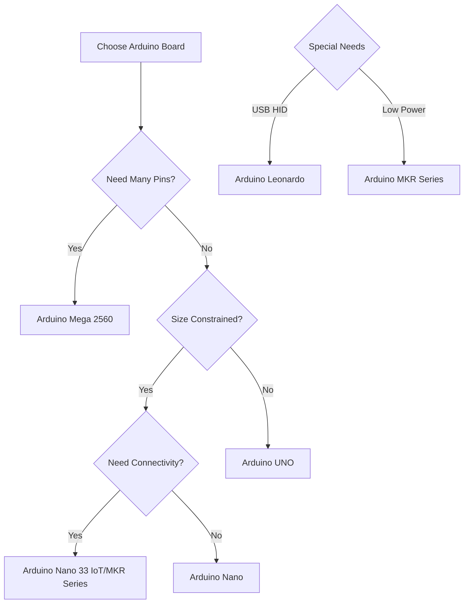

# Arduino Board Types

## Introduction

Arduino boards are versatile microcontroller platforms that have revolutionized the world of electronics and programming for hobbyists, students, and professionals alike. These open-source hardware devices allow you to create interactive projects by reading inputs (like sensors or button presses) and controlling outputs (like motors, LEDs, or displays).

In this guide, we'll explore the various Arduino board types available, their specifications, and which board might be best suited for your specific project needs. Whether you're building a simple LED blinker or a complex IoT device, understanding the differences between Arduino boards is essential for success.

## Arduino Board Family

Arduino offers a diverse range of boards with different capabilities, sizes, and features. Let's explore the most popular options:

### Arduino UNO

The Arduino UNO is the most widely used and documented board in the Arduino family, making it perfect for beginners.

**Key Specifications:**
- **Microcontroller**: ATmega328P
- **Operating Voltage**: 5V
- **Digital I/O Pins**: 14 (of which 6 provide PWM output)
- **Analog Input Pins**: 6
- **Flash Memory**: 32 KB (0.5 KB used for bootloader)
- **SRAM**: 2 KB
- **EEPROM**: 1 KB
- **Clock Speed**: 16 MHz

**Best For**: Beginners, education, prototyping, and most basic projects.

**Sample Code (Blink LED):**

```cpp
void setup() {
  // Initialize digital pin LED_BUILTIN as an output
  pinMode(LED_BUILTIN, OUTPUT);
}

void loop() {
  digitalWrite(LED_BUILTIN, HIGH);   // Turn the LED on
  delay(1000);                       // Wait for a second
  digitalWrite(LED_BUILTIN, LOW);    // Turn the LED off
  delay(1000);                       // Wait for a second
}
```

### Arduino Nano

The Arduino Nano is a compact, breadboard-friendly version of the UNO with similar capabilities but in a smaller form factor.

**Key Specifications:**
- **Microcontroller**: ATmega328P
- **Operating Voltage**: 5V
- **Digital I/O Pins**: 14 (of which 6 provide PWM output)
- **Analog Input Pins**: 8
- **Flash Memory**: 32 KB (2 KB used for bootloader)
- **SRAM**: 2 KB
- **EEPROM**: 1 KB
- **Clock Speed**: 16 MHz
- **Dimensions**: 45 x 18 mm

**Best For**: Space-constrained projects, permanent installations, and wearable electronics.

### Arduino Mega 2560

When your project needs more pins and memory, the Arduino Mega 2560 is an excellent choice.

**Key Specifications:**
- **Microcontroller**: ATmega2560
- **Operating Voltage**: 5V
- **Digital I/O Pins**: 54 (of which 15 provide PWM output)
- **Analog Input Pins**: 16
- **Flash Memory**: 256 KB (8 KB used for bootloader)
- **SRAM**: 8 KB
- **EEPROM**: 4 KB
- **Clock Speed**: 16 MHz

**Best For**: Complex projects requiring many I/O pins, multiple serial communications, and more memory.

**Example Use Case**: Home automation system with multiple sensors, displays, and actuators.

### Arduino Leonardo

The Arduino Leonardo differs from other boards as it uses the ATmega32U4 microcontroller with built-in USB communication.

**Key Specifications:**
- **Microcontroller**: ATmega32U4
- **Operating Voltage**: 5V
- **Digital I/O Pins**: 20 (of which 7 provide PWM output)
- **Analog Input Pins**: 12
- **Flash Memory**: 32 KB (4 KB used for bootloader)
- **SRAM**: 2.5 KB
- **EEPROM**: 1 KB
- **Clock Speed**: 16 MHz

**Best For**: Projects requiring USB peripherals like keyboards or mice.

**Sample Code (USB Keyboard):**

```cpp
#include <Keyboard.h>

const int buttonPin = 4;  // Input pin for button
int previousButtonState = HIGH;  // Previous state of the button

void setup() {
  // Initialize the button pin as input with pull-up resistor
  pinMode(buttonPin, INPUT_PULLUP);
  // Initialize Keyboard library
  Keyboard.begin();
}

void loop() {
  // Read the current button state
  int buttonState = digitalRead(buttonPin);
  
  // If the button state has changed and is now pressed
  if ((buttonState != previousButtonState) && (buttonState == LOW)) {
    Keyboard.println("Hello from Arduino!");
  }
  
  // Save the current button state for next comparison
  previousButtonState = buttonState;
}
```

### Arduino MKR Series

The MKR series targets IoT applications with low power consumption and connectivity options.

**Key Specifications (MKR WiFi 1010):**
- **Microcontroller**: SAMD21 Cortex-M0+ 32bit low power ARM
- **Operating Voltage**: 3.3V
- **Digital I/O Pins**: 8
- **Analog Input Pins**: 7 (ADC 8/10/12 bit)
- **Flash Memory**: 256 KB
- **SRAM**: 32 KB
- **Connectivity**: WiFi
- **Clock Speed**: 48 MHz

**Best For**: IoT projects, battery-powered applications, and wireless connectivity.

### Arduino Nano 33 IoT

A powerful, compact board with built-in WiFi, Bluetooth, and various sensors.

**Key Specifications:**
- **Microcontroller**: SAMD21 Cortex-M0+ 32bit low power ARM
- **Operating Voltage**: 3.3V
- **Digital I/O Pins**: 14
- **Analog Input Pins**: 8 (ADC 12 bit)
- **Flash Memory**: 256 KB
- **SRAM**: 32 KB
- **Connectivity**: WiFi, Bluetooth
- **Dimensions**: 45 x 18 mm

**Best For**: IoT projects, machine learning applications, and sensor-based projects.

## Comparing Arduino Boards

Here's a comparison to help you choose the right board for your needs:



## Practical Examples

### 1. Weather Station with Arduino UNO

An Arduino UNO is perfect for a basic weather station project that reads temperature, humidity, and pressure:

```cpp
#include <DHT.h>
#include <Wire.h>
#include <Adafruit_BMP085.h>
#include <LiquidCrystal_I2C.h>

#define DHTPIN 2        // DHT11 data pin
#define DHTTYPE DHT11   // DHT sensor type

DHT dht(DHTPIN, DHTTYPE);
Adafruit_BMP085 bmp;
LiquidCrystal_I2C lcd(0x27, 16, 2);  // Set LCD address to 0x27, 16 chars, 2 lines

void setup() {
  Serial.begin(9600);
  dht.begin();
  bmp.begin();
  lcd.init();
  lcd.backlight();
  
  lcd.setCursor(0, 0);
  lcd.print("Weather Station");
  delay(2000);
}

void loop() {
  // Read humidity and temperature from DHT sensor
  float humidity = dht.readHumidity();
  float tempC = dht.readTemperature();
  
  // Read pressure from BMP sensor
  float pressure = bmp.readPressure() / 100.0F; // Convert Pa to hPa
  
  // Display on LCD
  lcd.clear();
  lcd.setCursor(0, 0);
  lcd.print("Temp: ");
  lcd.print(tempC);
  lcd.print(" C");
  
  lcd.setCursor(0, 1);
  lcd.print("Hum: ");
  lcd.print(humidity);
  lcd.print("% ");
  lcd.print(pressure);
  lcd.print("hPa");
  
  // Send to serial monitor
  Serial.print("Temperature: ");
  Serial.print(tempC);
  Serial.println(" °C");
  
  Serial.print("Humidity: ");
  Serial.print(humidity);
  Serial.println(" %");
  
  Serial.print("Pressure: ");
  Serial.print(pressure);
  Serial.println(" hPa");
  
  delay(5000); // Wait 5 seconds between readings
}
```

### 2. IoT Plant Monitor with Arduino MKR WiFi 1010

This example demonstrates using an Arduino MKR WiFi 1010 to monitor soil moisture and upload data to the cloud:

```cpp
#include <WiFiNINA.h>
#include <ThingSpeak.h>

// WiFi credentials
char ssid[] = "YourNetworkName";
char pass[] = "YourNetworkPassword";

// ThingSpeak settings
unsigned long channelID = 1234567;
const char* apiKey = "YOURTHINGSPEAKAPIKEY";

// Pin definitions
const int soilMoisturePin = A0;
const int waterPumpPin = 2;

WiFiClient client;
int status = WL_IDLE_STATUS;

void setup() {
  Serial.begin(9600);
  pinMode(waterPumpPin, OUTPUT);
  digitalWrite(waterPumpPin, LOW);
  
  // Connect to WiFi
  while (status != WL_CONNECTED) {
    Serial.print("Attempting to connect to network: ");
    Serial.println(ssid);
    status = WiFi.begin(ssid, pass);
    delay(10000);
  }
  
  Serial.println("Connected to WiFi");
  ThingSpeak.begin(client);
}

void loop() {
  // Read soil moisture level (higher value = drier soil)
  int moistureLevel = analogRead(soilMoisturePin);
  
  // Convert to percentage (this requires calibration for your specific sensor)
  int moisturePercent = map(moistureLevel, 0, 1023, 100, 0);
  
  Serial.print("Soil Moisture: ");
  Serial.print(moisturePercent);
  Serial.println("%");
  
  // Water the plant if soil is too dry
  if (moisturePercent < 30) {
    Serial.println("Soil too dry - watering plant!");
    digitalWrite(waterPumpPin, HIGH);
    delay(3000);
    digitalWrite(waterPumpPin, LOW);
  }
  
  // Upload data to ThingSpeak
  ThingSpeak.setField(1, moisturePercent);
  int httpCode = ThingSpeak.writeFields(channelID, apiKey);
  
  if (httpCode == 200) {
    Serial.println("Data sent to ThingSpeak successfully");
  } else {
    Serial.print("Problem uploading to ThingSpeak. HTTP error code: ");
    Serial.println(httpCode);
  }
  
  // Wait 15 minutes before next reading
  delay(900000);
}
```

## Choosing the Right Arduino Board

When selecting an Arduino board for your project, consider these factors:

1. **Number of I/O pins needed**: Count how many sensors, buttons, LEDs, and other components you'll connect
2. **Memory requirements**: More complex code requires more flash memory
3. **Size constraints**: Some projects require smaller boards
4. **Power consumption**: Battery-powered projects benefit from low-power boards
5. **Special features needed**: WiFi, Bluetooth, USB functionality, etc.
6. **Budget**: Prices vary significantly between models

## Common Arduino Shields and Add-ons

Arduino's functionality can be extended with shields (add-on boards):

- **Ethernet Shield**: Adds internet connectivity to your Arduino
- **Motor Shield**: Simplifies controlling DC motors, stepper motors, and servos
- **LCD Shield**: Makes it easy to add a display to your project
- **Sensor Shields**: Add multiple sensors easily
- **Relay Shields**: Control high-voltage devices

## Summary

Arduino offers a diverse ecosystem of boards to suit virtually any electronic project. For beginners, the UNO remains the ideal starting point due to its extensive documentation and community support. As your projects grow in complexity, you might migrate to more specialized boards like the Mega 2560 for pin-intensive projects or the MKR series for IoT applications.

Remember that most Arduino code is compatible across different board types with minimal adjustments, allowing you to start simple and scale up as needed.

## Exercises

1. **Board Selection Exercise**: For each of the following project ideas, identify which Arduino board would be most suitable and explain why:
   - A simple LED cube with 27 LEDs (3x3x3)
   - A weather station that uploads data to the internet
   - A wearable fitness tracker
   - A home automation system controlling 20+ devices

2. **Comparative Analysis**: Create a table comparing the specifications of three Arduino boards of your choice.

3. **Hands-on Project**: If you have an Arduino UNO, try implementing the basic weather station example and modify it to include additional features.

## Additional Resources

- [Official Arduino Website](https://www.arduino.cc/en/hardware)
- [Arduino Forum](https://forum.arduino.cc/)
- [Arduino Project Hub](https://create.arduino.cc/projecthub)
- Books:
  - "Getting Started with Arduino" by Massimo Banzi
  - "Arduino Cookbook" by Michael Margolis
  - "Exploring Arduino" by Jeremy Blum

Happy building with Arduino!