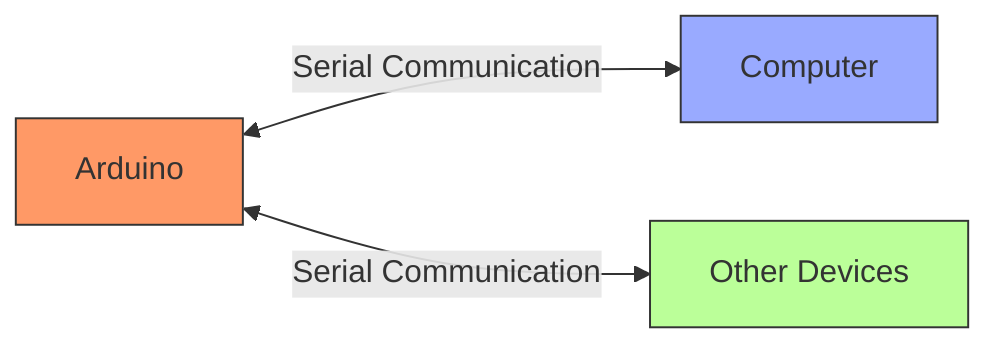

# Arduino Serial Communication

## Introduction

Serial communication is one of the most fundamental ways for your Arduino to communicate with other devices. It allows your Arduino to send and receive data from your computer, other microcontrollers, sensors, and various electronic devices. Mastering Serial communication is an essential skill for any Arduino enthusiast, as it enables debugging, data visualization, and creating more complex projects that interact with the outside world.

In this tutorial, we'll explore how Serial communication works on Arduino, how to set it up, and how to use it effectively in your projects.

## What is Serial Communication?

Serial communication is a method of transmitting data one bit at a time, sequentially, over a communication channel or bus. On Arduino boards, this primarily happens through the UART (Universal Asynchronous Receiver/Transmitter) interface, which is connected to your computer via USB.



When we talk about "Serial communication" in Arduino, we're usually referring to:

1. Communication between Arduino and computer (via USB)
2. Communication between Arduino and other devices using TX/RX pins
3. Software Serial communication on other digital pins

## Setting Up Serial Communication

### Basic Serial Setup

To begin using Serial communication, you need to initialize it in your `setup()` function using `Serial.begin()`. The parameter passed to this function is the baud rate - the speed at which data is transmitted.

```cpp
void setup() {
  Serial.begin(9600); // Initialize serial communication at 9600 bits per second
}

void loop() {
  // Your code here
}
```

Common baud rates include:
- 9600 (standard for most applications)
- 115200 (faster, good for data-intensive applications)
- 4800, 19200, 38400, 57600 (other options for specific needs)

Both the sender and receiver must use the same baud rate to communicate correctly.

## Sending Data from Arduino

### Sending Text

The Arduino provides several methods to send data through Serial:

```cpp
void setup() {
  Serial.begin(9600);
}

void loop() {
  // Sending a single string
  Serial.print("Hello, World!");
  
  // Adding a new line
  Serial.println("Hello, World with newline!");
  
  // Sending numbers
  Serial.print(42);
  Serial.println(3.14159);
  
  delay(1000); // Wait for a second before sending again
}
```

Output in Serial Monitor:
```
Hello, World!Hello, World with newline!
423.14159
```

Notice how `Serial.print()` doesn't add a new line, while `Serial.println()` does.

### Formatting Numbers

You can format numbers in different ways:

```cpp
void setup() {
  Serial.begin(9600);
}

void loop() {
  int x = 42;
  
  // Decimal (default)
  Serial.print("Decimal: ");
  Serial.println(x);
  
  // Hexadecimal
  Serial.print("Hexadecimal: ");
  Serial.println(x, HEX);
  
  // Binary
  Serial.print("Binary: ");
  Serial.println(x, BIN);
  
  // With fixed number of decimal places
  float pi = 3.14159;
  Serial.print("Pi with 2 decimal places: ");
  Serial.println(pi, 2);
  
  delay(2000);
}
```

Output:
```
Decimal: 42
Hexadecimal: 2A
Binary: 101010
Pi with 2 decimal places: 3.14
```

## Receiving Data on Arduino

### Reading Incoming Data

You can receive data sent to the Arduino using various methods:

```cpp
void setup() {
  Serial.begin(9600);
}

void loop() {
  // Check if data is available to read
  if (Serial.available() > 0) {
    // Read the incoming byte
    char incomingByte = Serial.read();
    
    // Echo the incoming byte back
    Serial.print("I received: ");
    Serial.println(incomingByte);
  }
}
```

### Reading a Complete Line

Reading one byte at a time can be cumbersome. For reading complete commands:

```cpp
void setup() {
  Serial.begin(9600);
  Serial.println("Enter a command:");
}

void loop() {
  // Check if a complete line is available
  if (Serial.available() > 0) {
    String command = Serial.readStringUntil('
');
    
    // Remove any whitespace
    command.trim();
    
    // Process the command
    Serial.print("Processing command: ");
    Serial.println(command);
    
    // Example command processing
    if (command == "LED ON") {
      Serial.println("Turning LED on!");
      // Code to turn LED on would go here
    } 
    else if (command == "LED OFF") {
      Serial.println("Turning LED off!");
      // Code to turn LED off would go here
    }
    else {
      Serial.println("Unknown command!");
    }
    
    Serial.println("Enter a command:");
  }
}
```

## Serial Communication Best Practices

1. **Avoid Blocking Code**: Long `delay()` calls can cause you to miss incoming serial data.
2. **Buffer Management**: Be aware that the serial buffer is limited (64 bytes on most Arduinos).
3. **Error Checking**: Include checksums or validation when reliability is important.
4. **Line Endings**: Be mindful of different line endings (CR, LF, CRLF) between systems.
5. **Data Rate**: Higher baud rates transmit faster but may have more errors over long distances.

## Practical Example: Serial-Controlled RGB LED

This example demonstrates how to control an RGB LED via serial commands:

```cpp
// Define pins for RGB LED
const int redPin = 9;
const int greenPin = 10;
const int bluePin = 11;

void setup() {
  // Initialize serial
  Serial.begin(9600);
  
  // Set LED pins as outputs
  pinMode(redPin, OUTPUT);
  pinMode(greenPin, OUTPUT);
  pinMode(bluePin, OUTPUT);
  
  // Turn off all LEDs initially
  digitalWrite(redPin, LOW);
  digitalWrite(greenPin, LOW);
  digitalWrite(bluePin, LOW);
  
  // Print instructions
  Serial.println("RGB LED Controller");
  Serial.println("Commands:");
  Serial.println("  R: Red");
  Serial.println("  G: Green");
  Serial.println("  B: Blue");
  Serial.println("  C: Cyan");
  Serial.println("  M: Magenta");
  Serial.println("  Y: Yellow");
  Serial.println("  W: White");
  Serial.println("  O: Off");
}

void loop() {
  // Check if data is available
  if (Serial.available() > 0) {
    // Read the incoming byte
    char command = Serial.read();
    
    // Convert to uppercase for case-insensitivity
    command = toupper(command);
    
    // Process the command
    switch (command) {
      case 'R':
        setColor(255, 0, 0); // Red
        Serial.println("Color set to Red");
        break;
      case 'G':
        setColor(0, 255, 0); // Green
        Serial.println("Color set to Green");
        break;
      case 'B':
        setColor(0, 0, 255); // Blue
        Serial.println("Color set to Blue");
        break;
      case 'C':
        setColor(0, 255, 255); // Cyan
        Serial.println("Color set to Cyan");
        break;
      case 'M':
        setColor(255, 0, 255); // Magenta
        Serial.println("Color set to Magenta");
        break;
      case 'Y':
        setColor(255, 255, 0); // Yellow
        Serial.println("Color set to Yellow");
        break;
      case 'W':
        setColor(255, 255, 255); // White
        Serial.println("Color set to White");
        break;
      case 'O':
        setColor(0, 0, 0); // Off
        Serial.println("LED turned off");
        break;
      default:
        // Ignore whitespace and unrecognized commands
        if (command != '
' && command != '\r' && command != ' ') {
          Serial.println("Unknown command");
        }
    }
  }
}

// Function to set the RGB LED color
void setColor(int red, int green, int blue) {
  analogWrite(redPin, red);
  analogWrite(greenPin, green);
  analogWrite(bluePin, blue);
}
```

This example allows you to type a single letter in the Serial Monitor to change the RGB LED color.

## Advanced: Using Software Serial

The Hardware Serial port (pins 0 and 1) is limited and often needed for USB communication. For additional serial ports, you can use the SoftwareSerial library:

```cpp
#include <SoftwareSerial.h>

// Create a software serial port on pins 2 (RX) and 3 (TX)
SoftwareSerial mySerial(2, 3);

void setup() {
  // Start the hardware serial port
  Serial.begin(9600);
  
  // Start the software serial port
  mySerial.begin(9600);
  
  Serial.println("Communication on two serial ports initialized!");
}

void loop() {
  // Forward data from hardware serial to software serial
  if (Serial.available()) {
    char c = Serial.read();
    mySerial.write(c);
  }
  
  // Forward data from software serial to hardware serial
  if (mySerial.available()) {
    char c = mySerial.read();
    Serial.write(c);
  }
}
```

This creates a "serial bridge" between your computer and another device connected to pins 2 and 3.

## Practical Application: Serial Data Logger

This example reads a sensor value and logs it to the serial port with a timestamp:

```cpp
unsigned long startTime;

void setup() {
  Serial.begin(9600);
  startTime = millis();
  
  // Print CSV header
  Serial.println("Time(s),SensorValue");
}

void loop() {
  // Read the sensor (analog pin A0)
  int sensorValue = analogRead(A0);
  
  // Calculate time in seconds since start
  float timeSeconds = (millis() - startTime) / 1000.0;
  
  // Print data in CSV format
  Serial.print(timeSeconds, 2);  // 2 decimal places
  Serial.print(",");
  Serial.println(sensorValue);
  
  delay(1000);  // Log once per second
}
```

Output:
```
Time(s),SensorValue
0.00,512
1.00,513
2.00,510
3.00,515
```

This data can be captured in the Serial Monitor or using a serial terminal program, then saved to a file for analysis or graphing in a spreadsheet program.

## Summary

Serial communication is a powerful tool in your Arduino toolkit. It allows you to:

- Debug your sketches by printing values and status messages
- Control your Arduino remotely from a computer
- Exchange data with other devices
- Build data logging applications
- Create user interfaces for your projects

The skills you've learned in this tutorial will serve as a foundation for more advanced communication methods and enable you to create more sophisticated Arduino projects.

## Exercises for Practice

1. **LED Control**: Create a sketch that allows you to control multiple LEDs via serial commands.
2. **Serial Calculator**: Build a simple calculator that takes two numbers and an operator via serial input and returns the result.
3. **Data Visualization**: Read an analog sensor and output formatted data that can be graphed in a serial plotter.
4. **Morse Code Translator**: Create a program that translates text received over serial into Morse code, blinking an LED accordingly.
5. **Two-Arduino Communication**: Connect two Arduinos using their TX/RX pins and create a simple communication protocol between them.

## Additional Resources

- Arduino Serial Reference: [Arduino Serial Documentation](https://www.arduino.cc/reference/en/language/functions/communication/serial/)
- SoftwareSerial Library: [Arduino SoftwareSerial Documentation](https://www.arduino.cc/en/Reference/SoftwareSerial)
- Serial Communication Protocols: [Understanding UART, SPI, I2C](https://learn.sparkfun.com/tutorials/serial-communication)