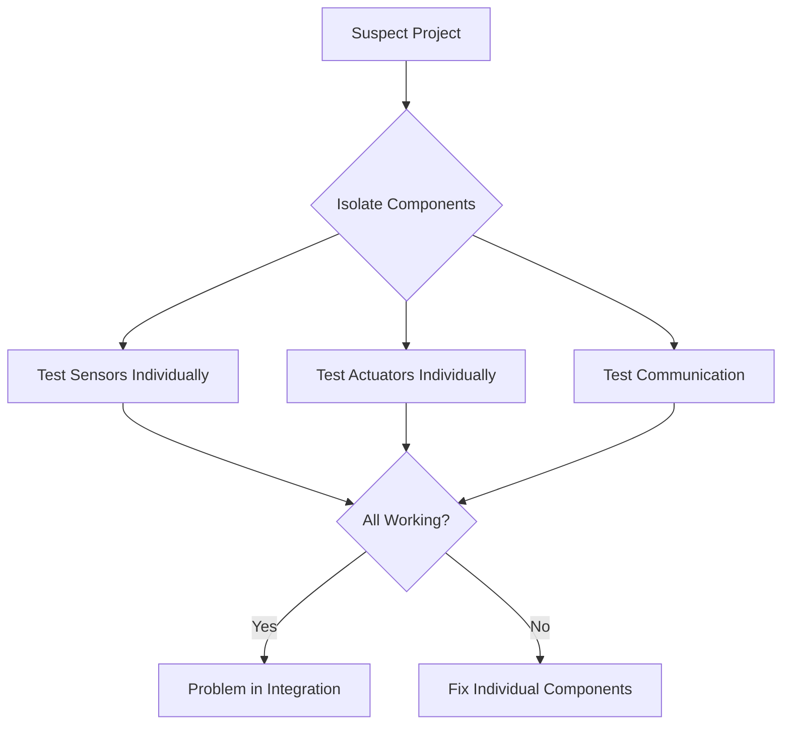
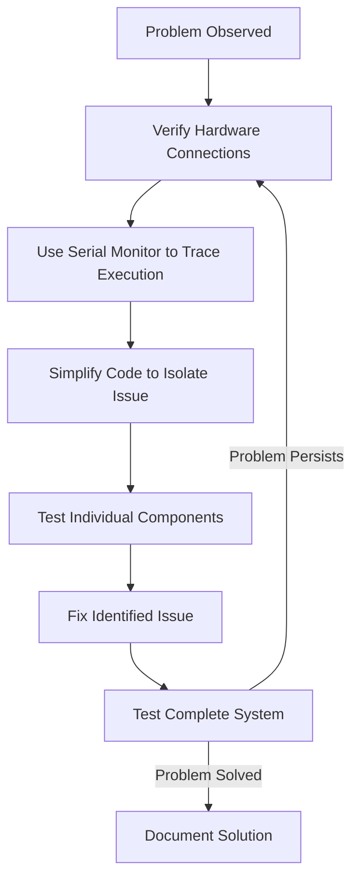

# Arduino Debugging

## Introduction

Debugging is an essential skill for any Arduino developer. When your project doesn't work as expected, having a structured approach to identify and fix problems can save hours of frustration. This guide will introduce you to common debugging techniques for Arduino projects, from basic serial monitoring to advanced debugging tools.

## Why Debugging Matters

Even experienced programmers rarely write perfect code on the first try. Debugging is a natural part of the development process. With Arduino projects, debugging becomes especially important because:

1. You're dealing with both hardware and software issues
2. Limited feedback mechanisms make errors harder to identify
3. Small mistakes can cause unpredictable behaviors

## Basic Debugging Techniques

### Serial Monitor: Your Best Friend

The Serial Monitor is the most fundamental debugging tool for Arduino. It allows you to send data from your Arduino to your computer, making the invisible visible.

```arduino
void setup() {
  Serial.begin(9600);  // Initialize serial communication at 9600 bits per second
  Serial.println("Arduino is starting up...");
  
  pinMode(LED_BUILTIN, OUTPUT);
}

void loop() {
  Serial.println("LED turning ON");
  digitalWrite(LED_BUILTIN, HIGH);
  delay(1000);
  
  Serial.println("LED turning OFF");
  digitalWrite(LED_BUILTIN, LOW);
  delay(1000);
}
```

When you run this code and open the Serial Monitor (Ctrl+Shift+M or Tools > Serial Monitor), you'll see:

```
Arduino is starting up...
LED turning ON
LED turning OFF
LED turning ON
LED turning OFF
...
```

#### Tips for Effective Serial Monitoring:

- Always include `Serial.begin(9600)` in the `setup()` function
- Use descriptive messages that help identify where in the code you are
- Print variable values to understand program state: `Serial.print("Temperature: "); Serial.println(temperature);`
- Remember that excessive serial printing can slow down your program

### Strategic Print Statements

Strategic print statements help trace program flow and identify where things go wrong:

```arduino
void setup() {
  Serial.begin(9600);
  Serial.println("Setup started");
  
  if (initializeSensor()) {
    Serial.println("Sensor initialized successfully");
  } else {
    Serial.println("ERROR: Sensor initialization failed");
  }
  
  Serial.println("Setup completed");
}

bool initializeSensor() {
  // Sensor initialization code
  // ...
  return false; // Simulating failure for demonstration
}
```

### Using LEDs as Debug Indicators

When serial monitor isn't practical (like in deployed projects), LEDs can provide visual feedback:

```arduino
#define ERROR_LED 7
#define STATUS_LED 8

void setup() {
  pinMode(ERROR_LED, OUTPUT);
  pinMode(STATUS_LED, OUTPUT);
  
  // Indicate we're in setup
  digitalWrite(STATUS_LED, HIGH);
  
  if (!initializeSensor()) {
    // Error condition - flash error LED
    indicateError();
  }
  
  // Setup complete
  digitalWrite(STATUS_LED, LOW);
}

void loop() {
  // Normal operation
  digitalWrite(STATUS_LED, HIGH);
  delay(100);
  digitalWrite(STATUS_LED, LOW);
  delay(900);
}

void indicateError() {
  // Flash error LED rapidly
  for (int i = 0; i < 10; i++) {
    digitalWrite(ERROR_LED, HIGH);
    delay(100);
    digitalWrite(ERROR_LED, LOW);
    delay(100);
  }
}
```

## Intermediate Debugging Techniques

### Isolating Components

Complex projects involve multiple components that can interact in unexpected ways. Isolating components helps identify the source of problems:



### Creating Test Modes

Adding a dedicated test mode to your code can help verify functionality:

```arduino
const int buttonPin = 2;
bool testMode = false;

void setup() {
  Serial.begin(9600);
  pinMode(buttonPin, INPUT_PULLUP);
  
  // Check if button is held during startup to enter test mode
  if (digitalRead(buttonPin) == LOW) {
    testMode = true;
    Serial.println("*** TEST MODE ACTIVE ***");
    runDiagnostics();
  } else {
    Serial.println("Normal operation mode");
  }
}

void loop() {
  if (testMode) {
    // Run simplified test routines instead of normal code
    testRoutine();
  } else {
    // Normal operation code
    normalOperation();
  }
}

void runDiagnostics() {
  Serial.println("Running diagnostics...");
  // Test each component
  testSensors();
  testOutputs();
  // Report results
  Serial.println("Diagnostics complete");
}
```

### Timing and Performance Debugging

Sometimes bugs appear because operations take longer than expected. Measuring execution time can reveal these issues:

```arduino
unsigned long startTime;

void setup() {
  Serial.begin(9600);
}

void loop() {
  startTime = millis();
  
  // Function suspected of being slow
  readSensorData();
  
  unsigned long duration = millis() - startTime;
  Serial.print("Sensor reading took: ");
  Serial.print(duration);
  Serial.println(" ms");
  
  delay(1000);
}

void readSensorData() {
  // Simulate slow sensor reading
  delay(50);
}
```

## Advanced Debugging Techniques

### Hardware Debugging Tools

For complex projects, dedicated hardware debugging tools can be invaluable:

1. **Logic Analyzers**: Record digital signals to visualize communication protocols
2. **Oscilloscopes**: Visualize analog signals and detect timing issues
3. **Multimeters**: Measure voltage, current, and resistance to debug hardware issues

### External Libraries for Debugging

Several libraries can enhance your debugging capabilities:

#### ArduinoTrace

ArduinoTrace makes it easy to track program flow:

```arduino
#include <ArduinoTrace.h>

void setup() {
  Serial.begin(9600);
  TRACE();  // Prints file and line
  
  int x = 42;
  DUMP(x);  // Prints "x = 42"
}

void loop() {
  TRACE();
  delay(1000);
}
```

#### RemoteDebug

For projects with network connectivity, RemoteDebug allows remote debugging via telnet:

```arduino
#include <RemoteDebug.h>
RemoteDebug Debug;

void setup() {
  // Network setup code...
  
  Debug.begin("ArduinoDevice");
  Debug.setResetCmdEnabled(true);
  
  Debug.println("Setup completed");
}

void loop() {
  Debug.handle();  // Process debug commands
  
  if (Debug.isActive(Debug.INFO)) {
    Debug.printf("System uptime: %lu seconds
", millis()/1000);
  }
  
  delay(1000);
}
```

### Watchdog Timer

The Watchdog Timer can automatically reset your Arduino if it gets stuck:

```arduino
#include <avr/wdt.h>

void setup() {
  Serial.begin(9600);
  Serial.println("System starting...");
  
  // Enable watchdog with 2-second timeout
  wdt_enable(WDTO_2S);
  
  Serial.println("Watchdog enabled");
}

void loop() {
  Serial.println("Loop running...");
  
  // Simulate normal operation
  delay(1000);
  
  // Reset watchdog timer
  wdt_reset();
  
  // Comment out the line above and the Arduino
  // will reset after approximately 2 seconds
}
```

## Common Arduino Bugs and Solutions

### Hardware Issues

| Issue | Symptoms | Solution |
|-------|----------|----------|
| Loose Connections | Intermittent behavior | Check wiring with continuity tester |
| Power Issues | Random resets, erratic behavior | Use appropriate power supply, add capacitors |
| Pin Conflicts | Multiple components interfering | Review pin assignments, check datasheets |
| Damaged Components | No response or incorrect readings | Test components individually, replace if needed |

### Software Issues

| Issue | Symptoms | Solution |
|-------|----------|----------|
| Memory Overflow | Crashes, random behavior | Check available memory, optimize code |
| Timing Problems | Race conditions, missed events | Use millis() instead of delay() |
| Type Mismatches | Unexpected values, overflows | Check variable types and ranges |
| Logic Errors | Wrong behavior despite correct syntax | Use Serial output to trace program flow |

## Debugging Methodology

Follow this structured approach when debugging Arduino projects:



## Practical Example: Debugging a Temperature Sensor

Let's walk through debugging a temperature sensor that's giving incorrect readings:

```arduino
#include <DHT.h>

#define DHTPIN 2
#define DHTTYPE DHT22

DHT dht(DHTPIN, DHTTYPE);

void setup() {
  Serial.begin(9600);
  Serial.println("DHT22 Temperature and Humidity Sensor Test");
  dht.begin();
}

void loop() {
  // Add delay to prevent flooding the serial monitor
  delay(2000);
  
  // Debug Step 1: Check if sensor is responding
  float humidity = dht.readHumidity();
  float temperature = dht.readTemperature();
  
  // Debug Step 2: Check for valid readings
  if (isnan(humidity) || isnan(temperature)) {
    Serial.println("ERROR: Failed to read from DHT sensor!");
    
    // Debug Step 3: Check hardware connectivity
    Serial.println("Checking if sensor is connected...");
    // Additional hardware checks could be added here
    
    return;
  }
  
  // Debug Step 4: Validate reading is within expected range
  if (temperature < -40 || temperature > 80) {
    Serial.print("WARNING: Suspicious temperature reading: ");
    Serial.print(temperature);
    Serial.println("°C - might be sensor error");
  } else {
    Serial.print("Temperature: ");
    Serial.print(temperature);
    Serial.println("°C");
  }
  
  Serial.print("Humidity: ");
  Serial.print(humidity);
  Serial.println("%");
  
  Serial.println("------------------------------");
}
```

When running this code, you might encounter issues like:

1. "Failed to read from DHT sensor" - Check wiring, power supply, and pull-up resistor
2. Suspicious readings - Check for electrical interference or damaged sensor
3. Fluctuating readings - Add capacitor between sensor power pins

## Memory Debugging

Arduino boards have limited memory, and running out of memory can cause mysterious crashes:

```arduino
void setup() {
  Serial.begin(9600);
  
  // Debug memory usage
  Serial.print("Free memory: ");
  Serial.print(freeMemory());
  Serial.println(" bytes");
}

// Memory checking function
int freeMemory() {
  extern int __heap_start, *__brkval;
  int v;
  return (int) &v - (__brkval == 0 ? (int) &__heap_start : (int) __brkval);
}

void loop() {
  // Your code here
}
```

## Summary

Debugging is both an art and a science. With Arduino projects, effective debugging requires:

1. **Visibility** - Use tools like Serial Monitor to see what's happening
2. **Isolation** - Test components individually to pinpoint issues
3. **Methodical approach** - Start with simple tests and progressively add complexity
4. **Documentation** - Record what you learn to help with future debugging

As you gain experience, you'll develop intuition about where to look first when problems arise. Remember that debugging is not wasted time—it's a valuable learning opportunity that will make you a better developer.

## Exercises

1. Create a simple circuit with an LED and button, then deliberately introduce a common bug (like forgetting a pull-up resistor). Use debugging techniques to identify and fix the issue.

2. Write a program that uses multiple sensors, then implement a test mode that verifies each sensor individually and reports its status.

3. Practice using the Serial Monitor to debug a loop that counts from 1 to 10 but has a logical error that causes it to skip certain numbers.

4. Implement a watchdog timer in an existing project and test its ability to recover from a deadlock situation.

## Additional Resources

- [Arduino Troubleshooting Guide](https://www.arduino.cc/en/Guide/Troubleshooting)
- [Arduino Forum](https://forum.arduino.cc/) - An excellent place to get help with specific issues
- Books:
  - "Debugging: The 9 Indispensable Rules for Finding Even the Most Elusive Software and Hardware Problems" by David J. Agans
  - "Make: Arduino Bots and Gadgets" by Tero Karvinen, which includes excellent troubleshooting sections