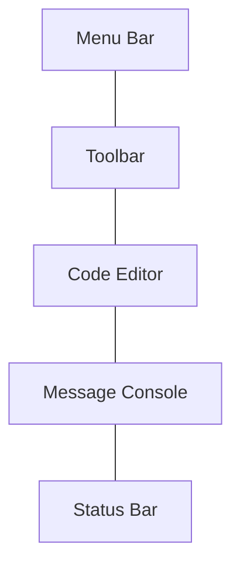

# Arduino IDE Setup

## Introduction

The Arduino Integrated Development Environment (IDE) is the software you'll use to write, compile, and upload code to your Arduino boards. It's a crucial first step in your Arduino journey, providing all the tools you need to bring your hardware projects to life through programming. This guide will walk you through downloading, installing, and setting up the Arduino IDE on your computer, regardless of your operating system.

## What is the Arduino IDE?

The Arduino IDE is a cross-platform application designed specifically for writing code for Arduino boards. It includes:

- A code editor with syntax highlighting
- A compiler that converts your code into instructions the Arduino can understand
- A uploader that sends your compiled code to the Arduino board
- A serial monitor for communicating with your Arduino
- Libraries that extend Arduino's capabilities
- Examples to help you learn

## System Requirements

Before downloading the IDE, ensure your computer meets these minimum requirements:

| Operating System | Minimum Requirements |
|------------------|----------------------|
| Windows          | Windows 7 or newer, 1GB RAM, 500MB disk space |
| macOS            | OS X 10.10 or newer, 1GB RAM, 500MB disk space |
| Linux            | Most modern distributions, 1GB RAM, 500MB disk space |

## Installation Guide

### Step 1: Download the Arduino IDE

1. Visit the official Arduino website at [https://www.arduino.cc/en/software](https://www.arduino.cc/en/software)
2. Choose the appropriate version for your operating system:
   - Windows: .exe installer or .zip for portable use
   - macOS: .dmg installer
   - Linux: AppImage, .tar.xz file, or via package manager

### Step 2: Install the IDE

#### Windows Installation

1. Run the downloaded .exe file
2. Accept the license agreement
3. Choose components to install (default selections are recommended)
4. Select installation directory
5. Wait for the installation to complete
6. Install device drivers when prompted

#### macOS Installation

1. Open the downloaded .dmg file
2. Drag the Arduino application to your Applications folder
3. When first launching, you might need to right-click and select "Open" to bypass security warnings

#### Linux Installation

For Debian/Ubuntu-based distributions:

```bash
sudo apt update
sudo apt install arduino
```

For AppImage:

```bash
chmod +x arduino-ide_*.AppImage
./arduino-ide_*.AppImage
```

### Step 3: Launch the IDE

Once installed, open the Arduino IDE. You should see an interface similar to this:



The interface includes:
- **Menu Bar**: Contains all the commands and options
- **Toolbar**: Quick access to verify, upload, new, open, and save buttons
- **Code Editor**: Where you write your Arduino code
- **Message Console**: Shows output messages, errors, and warnings
- **Status Bar**: Displays information about your board and serial port

## Initial Configuration

### Step 4: Configure Board and Port

Before you can upload code to your Arduino, you need to tell the IDE which board you're using and what port it's connected to:

1. Connect your Arduino board to your computer using a USB cable
2. In the IDE, go to **Tools > Board** and select your Arduino model
3. Go to **Tools > Port** and select the port your Arduino is connected to
   - On Windows, this typically appears as COM3, COM4, etc.
   - On macOS, it appears as /dev/cu.usbmodem* or similar
   - On Linux, it appears as /dev/ttyACM0 or similar

### Step 5: Install Board Packages

If you're using non-standard Arduino boards (like ESP8266, ESP32, or Arduino Nano Every):

1. Go to **File > Preferences**
2. In the "Additional Boards Manager URLs" field, add the URL for your board
3. Click OK
4. Go to **Tools > Board > Boards Manager**
5. Search for your board type and click Install

### Step 6: Test Your Setup

Let's upload a simple sketch to verify everything is working:

1. Go to **File > Examples > 01.Basics > Blink**
2. Click the **Upload** button (right arrow icon in the toolbar)
3. Wait for the compilation and upload to complete
4. If successful, you should see the LED on your Arduino blinking

Here's the code you've just uploaded:

```cpp
void setup() {
  // Initialize digital pin LED_BUILTIN as an output
  pinMode(LED_BUILTIN, OUTPUT);
}

void loop() {
  digitalWrite(LED_BUILTIN, HIGH);   // Turn the LED on
  delay(1000);                       // Wait for a second
  digitalWrite(LED_BUILTIN, LOW);    // Turn the LED off
  delay(1000);                       // Wait for a second
}
```

## Advanced Configuration

### Changing the Theme

If you prefer a different look:

1. Go to **File > Preferences**
2. Under "Interface theme," select your preferred theme
3. Restart the IDE for changes to take effect

### Adjusting Font Size

For better readability:

1. Go to **File > Preferences**
2. Change "Editor font size" to your preferred size
3. Click OK

### Setting Up Auto-Format

To keep your code neat:

1. Go to **Edit > Auto Format** or press Ctrl+T (Cmd+T on macOS)

## Troubleshooting Common Issues

### Cannot Find the Port

If your Arduino's port doesn't appear:

1. Check the USB connection
2. Install drivers if needed (especially for clone boards)
3. On Windows, check Device Manager for unknown devices
4. On macOS, check if you need to approve the device in System Preferences

### Upload Errors

If you encounter errors when uploading:

1. Ensure the correct board is selected
2. Verify the correct port is selected
3. Check if another program is using the serial port
4. Try pressing the reset button on the Arduino right before uploading

## Real-World Example: Creating Your First Project

Let's create a simple temperature reading project using an LM35 temperature sensor:

1. Wire your Arduino:
   - Connect LM35 VCC to Arduino 5V
   - Connect LM35 GND to Arduino GND
   - Connect LM35 Output to Arduino A0

2. In the Arduino IDE, create a new sketch with the following code:

```cpp
// Temperature Sensor Example
const int sensorPin = A0;

void setup() {
  Serial.begin(9600); // Initialize serial communication
}

void loop() {
  // Read the analog value from the sensor
  int sensorValue = analogRead(sensorPin);
  
  // Convert the analog reading to voltage
  float voltage = sensorValue * (5.0 / 1023.0);
  
  // Convert the voltage to temperature (Celsius)
  float temperatureC = voltage * 100.0;
  
  // Print the temperature
  Serial.print("Temperature: ");
  Serial.print(temperatureC);
  Serial.println(" °C");
  
  delay(1000); // Wait a second between readings
}
```

3. Upload the sketch to your Arduino
4. Open the Serial Monitor (**Tools > Serial Monitor**) to see the temperature readings

## Summary

Setting up the Arduino IDE is your first step toward creating amazing hardware projects. You've learned how to:

- Download and install the IDE on different operating systems
- Configure the IDE for your specific Arduino board
- Upload your first sketch to test your setup
- Customize the IDE to suit your preferences
- Troubleshoot common issues
- Create a simple project to monitor temperature

With the Arduino IDE properly set up, you're now ready to explore the exciting world of Arduino programming and electronics!

## Additional Resources

- Read the official [Arduino IDE 2 documentation](https://docs.arduino.cc/software/ide-v2)
- Explore the built-in examples in **File > Examples**
- Join the [Arduino Forum](https://forum.arduino.cc/) for community support

## Exercises for Practice

1. Try modifying the Blink sketch to change the blinking pattern
2. Install a new library through **Sketch > Include Library > Manage Libraries**
3. Connect an LED to pin 13 and create a sketch that makes it blink at different speeds
4. Upload the Serial Monitor example and practice sending commands to your Arduino
5. Explore the Preferences menu and customize at least three settings to your liking