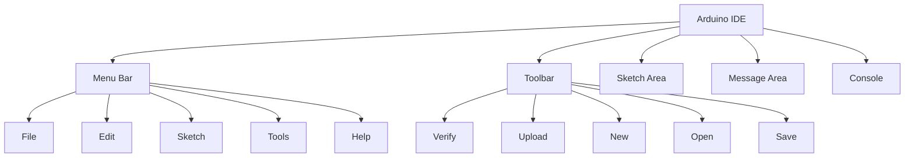

# Arduino First Sketch

## Introduction

Welcome to the exciting world of Arduino programming! In this tutorial, you'll learn how to create and upload your very first Arduino sketch. An Arduino sketch is simply a program that tells your Arduino board what to do. The Arduino programming language is based on C/C++, but don't worry if you're not familiar with these languages yet—we'll walk through everything step by step.

By the end of this tutorial, you'll have successfully created, compiled, and uploaded a simple program that makes an LED blink—the "Hello World" of hardware programming. This foundational skill will serve as the building block for all your future Arduino projects.

## What You'll Need

- An Arduino board (Uno R3 recommended for beginners)
- USB cable (A to B for most Arduino boards)
- Arduino IDE (Integrated Development Environment)
- A computer with Windows, macOS, or Linux

## Setting Up the Arduino IDE

Before we write our first sketch, make sure you have the Arduino IDE installed on your computer. You can download it from the [official Arduino website](https://www.arduino.cc/en/software).

After installation, open the Arduino IDE. You should see an interface that looks something like this:



## Understanding the Arduino Program Structure

Every Arduino sketch consists of at least two main functions:

1. `setup()`: Runs once when the Arduino starts or resets
2. `loop()`: Runs continuously after `setup()` completes

Here's the basic structure:

```cpp
void setup() {
  // Initialization code goes here
  // Runs once when Arduino powers on or resets
}

void loop() {
  // Main code goes here
  // Runs repeatedly
}
```

## Your First Sketch: Blinking an LED

Let's create a simple sketch that blinks the built-in LED on your Arduino board. This LED is typically connected to digital pin 13.

### Step 1: Connect Your Arduino Board

Connect your Arduino board to your computer using the USB cable. The Arduino IDE should automatically detect your board.

### Step 2: Select Your Board and Port

From the Tools menu, select:
1. Board → (your Arduino model, e.g., "Arduino Uno")
2. Port → (the port where your Arduino is connected, e.g., COM3 on Windows or /dev/cu.usbmodem on Mac)

### Step 3: Write the Sketch

Now, let's write our first sketch. You can either type it directly into the IDE or copy and paste the following code:

```cpp
// Arduino First Sketch - Blink
// This sketch blinks the built-in LED

void setup() {
  // Initialize digital pin LED_BUILTIN as an output
  pinMode(LED_BUILTIN, OUTPUT);
}

void loop() {
  digitalWrite(LED_BUILTIN, HIGH);   // Turn the LED on
  delay(1000);                       // Wait for 1 second (1000 milliseconds)
  digitalWrite(LED_BUILTIN, LOW);    // Turn the LED off
  delay(1000);                       // Wait for 1 second
}
```

### Step 4: Understand the Code

Let's break down the sketch:

- `pinMode(LED_BUILTIN, OUTPUT);` - This configures the built-in LED pin as an output. `LED_BUILTIN` is a constant that refers to the built-in LED pin (usually pin 13).
- `digitalWrite(LED_BUILTIN, HIGH);` - This sets the pin to HIGH voltage (5V), turning the LED on.
- `delay(1000);` - This pauses the program for 1000 milliseconds (1 second).
- `digitalWrite(LED_BUILTIN, LOW);` - This sets the pin to LOW voltage (0V), turning the LED off.
- The `loop()` function repeats endlessly, causing the LED to blink on and off.

### Step 5: Compile and Upload the Sketch

1. Click the ✓ (Verify) button to compile your code.
2. After successful compilation, click the → (Upload) button to send the code to your Arduino.
3. You should see "Done uploading" in the message area when complete.

### Step 6: Watch Your Arduino Come to Life!

If everything went well, you should now see the LED on your Arduino board blinking—on for one second, off for one second, repeatedly. Congratulations! You've just programmed your first Arduino sketch.

## Common Issues and Troubleshooting

### Issue: Upload Failed

If you see an error message when trying to upload:
- Make sure your Arduino is properly connected
- Check that you've selected the correct board and port
- Ensure no other program is using the serial port

### Issue: LED Not Blinking

- Double-check your code for any typos
- Verify that your Arduino board is receiving power (the power LED should be on)
- Try pressing the reset button on your Arduino

## Modifying the Sketch

Now that you have the basic blink sketch working, let's try modifying it:

```cpp
void setup() {
  pinMode(LED_BUILTIN, OUTPUT);
}

void loop() {
  // Fast blinking pattern
  for (int i = 0; i < 3; i++) {
    digitalWrite(LED_BUILTIN, HIGH);
    delay(200);
    digitalWrite(LED_BUILTIN, LOW);
    delay(200);
  }
  
  // Pause between patterns
  delay(1000);
  
  // Slow blinking pattern
  for (int i = 0; i < 3; i++) {
    digitalWrite(LED_BUILTIN, HIGH);
    delay(800);
    digitalWrite(LED_BUILTIN, LOW);
    delay(800);
  }
  
  // Pause between patterns
  delay(1000);
}
```

This modified sketch creates a pattern of three fast blinks, followed by a pause, then three slow blinks, and another pause before repeating.

## Real-World Applications

The blinking LED sketch may seem simple, but it demonstrates fundamental concepts used in real-world applications:

1. **Status Indicators**: Electronic devices use blinking lights to indicate status (e.g., charging, error, power on).
2. **Traffic Control Systems**: Traffic lights follow programmed timing sequences similar to our LED blinking.
3. **Warning Systems**: Emergency vehicles, construction barriers, and warning beacons use programmed flashing patterns.
4. **Interactive Art Installations**: Many art installations use programmed light sequences.

## Advanced Concepts

Now that you understand the basics, here are some advanced concepts you can explore:

### Using Variables to Control Timing

```cpp
// Using variables for timing
int onTime = 1000;  // Time LED stays on (milliseconds)
int offTime = 500;  // Time LED stays off (milliseconds)

void setup() {
  pinMode(LED_BUILTIN, OUTPUT);
}

void loop() {
  digitalWrite(LED_BUILTIN, HIGH);
  delay(onTime);
  digitalWrite(LED_BUILTIN, LOW);
  delay(offTime);
}
```

By using variables, you can easily adjust the blinking pattern by changing just the variable values.

### Adding Multiple LEDs

If you connect additional LEDs to your Arduino (with appropriate resistors), you can create more complex light sequences:

```cpp
// Multiple LED example
void setup() {
  pinMode(12, OUTPUT);  // Red LED
  pinMode(11, OUTPUT);  // Yellow LED
  pinMode(10, OUTPUT);  // Green LED
}

void loop() {
  // Red light
  digitalWrite(12, HIGH);
  digitalWrite(11, LOW);
  digitalWrite(10, LOW);
  delay(1000);
  
  // Yellow light
  digitalWrite(12, LOW);
  digitalWrite(11, HIGH);
  digitalWrite(10, LOW);
  delay(1000);
  
  // Green light
  digitalWrite(12, LOW);
  digitalWrite(11, LOW);
  digitalWrite(10, HIGH);
  delay(1000);
}
```

This code simulates a traffic light sequence with red, yellow, and green LEDs.

## Summary

Congratulations! You've successfully created, uploaded, and modified your first Arduino sketch. You've learned:

- How to set up the Arduino IDE
- The basic structure of an Arduino program (`setup()` and `loop()`)
- How to control digital pins and the built-in LED
- How to use timing functions (`delay()`)
- How to modify your sketch to create different blinking patterns

This may seem like a small step, but it's the foundation for all Arduino projects. The concepts you've learned—digital output, timing, and program flow—will be used in virtually every Arduino project you build.

## Exercises to Try

1. **Speed Control**: Modify the sketch to make the LED blink progressively faster, then slower.
2. **Morse Code**: Program the LED to blink out your name in Morse code.
3. **Button Control**: Add a button to your Arduino and make it change the blinking pattern when pressed (hint: look up `digitalRead()` in the Arduino reference).
4. **Fade Effect**: Instead of just on/off, try to make the LED gradually fade in and out (hint: look up `analogWrite()` and PWM pins).

## Next Steps

Now that you've mastered your first Arduino sketch, you're ready to explore more complex projects. Consider looking into:

- Reading analog sensors
- Controlling servo motors
- Connecting displays (LCD or LED matrices)
- Communication between devices
- Using external libraries for advanced functionality

Remember, every complex Arduino project is built from these same basic building blocks. Keep experimenting, and most importantly, have fun!