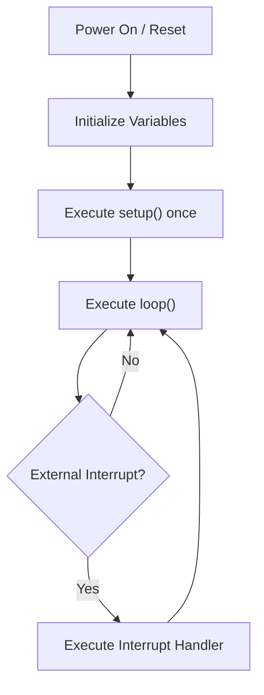

# Arduino Syntax

## Introduction

Arduino syntax forms the foundation of programming Arduino microcontrollers. It's based on C/C++ but includes special functions and libraries that make working with hardware much easier. Understanding the basic syntax rules is essential for creating any Arduino project, from blinking an LED to building complex robots.

This guide covers the fundamental syntax elements you'll use in almost every Arduino sketch.

## Basic Structure of an Arduino Sketch

Every Arduino program (called a "sketch") follows the same basic structure with two required functions:

```cpp
void setup() {
  // Runs once when the Arduino powers on or resets
  // Used for initialization tasks
}

void loop() {
  // Runs continuously after setup() completes
  // Main program goes here
}
```

The `setup()` function executes once when your Arduino starts, while the `loop()` function runs repeatedly afterward. This structure forms the backbone of all Arduino programs.

## Comments

Comments help you document your code. Arduino supports two types of comments:

```cpp
// This is a single-line comment

/* This is a multi-line comment
   that can span several lines
   to explain complex code */
```

Use comments to explain your thinking, making your code easier to understand when you revisit it later.

## Variables and Data Types

### Variable Declaration

Arduino follows C/C++ rules for declaring variables:

```cpp
dataType variableName = initialValue;
```

For example:

```cpp
int ledPin = 13;
float temperature = 25.5;
```

### Common Data Types

| Data Type | Description                                       | Example                     |
|-----------|---------------------------------------------------|-----------------------------|
| `int`     | 16-bit integer (-32,768 to 32,767)                | `int count = 0;`            |
| `long`    | 32-bit integer (-2,147,483,648 to 2,147,483,647)  | `long distance = 1000000;`  |
| `float`   | 32-bit floating-point number                      | `float voltage = 5.2;`      |
| `double`  | Same as float on Arduino Uno (unlike regular C++) | `double pi = 3.14159;`      |
| `char`    | Single character                                  | `char letter = 'A';`        |
| `bool`    | Boolean (true/false)                              | `bool isOn = true;`         |
| `String`  | Text string                                       | `String message = "Hello";` |

### Constants

Constants are values that don't change during program execution:

```cpp
const int buttonPin = 2;
#define LED_PIN 13  // Alternative way to define constants
```

The difference is that `#define` is a preprocessor directive without type checking, while `const` is type-safe.

## Operators

### Arithmetic Operators

```cpp
int a = 5 + 3;  // Addition: a = 8
int b = 7 - 2;  // Subtraction: b = 5
int c = 4 * 6;  // Multiplication: c = 24
int d = 9 / 3;  // Division: d = 3
int e = 10 % 3; // Modulo (remainder): e = 1
```

### Comparison Operators

```cpp
x == y  // Equal to
x != y  // Not equal to
x < y   // Less than
x > y   // Greater than
x <= y  // Less than or equal to
x >= y  // Greater than or equal to
```

### Logical Operators

```cpp
(x > 0) && (y > 0)  // AND: true if both conditions are true
(x > 0) || (y > 0)  // OR: true if either condition is true
!(x > 0)            // NOT: inverts the condition
```

## Control Structures

### Conditional Statements

#### if Statement

```cpp
if (condition) {
  // Code executed if condition is true
}
```

Example:

```cpp
if (temperature > 25) {
  digitalWrite(fanPin, HIGH);  // Turn on fan
}
```

#### if-else Statement

```cpp
if (condition) {
  // Code executed if condition is true
} else {
  // Code executed if condition is false
}
```

Example:

```cpp
if (buttonState == HIGH) {
  digitalWrite(ledPin, HIGH);  // Turn LED on
} else {
  digitalWrite(ledPin, LOW);   // Turn LED off
}
```

#### else if Statement

```cpp
if (condition1) {
  // Code executed if condition1 is true
} else if (condition2) {
  // Code executed if condition1 is false and condition2 is true
} else {
  // Code executed if both conditions are false
}
```

Example:

```cpp
if (temperature < 18) {
  digitalWrite(heaterPin, HIGH);     // Turn heater on
} else if (temperature > 25) {
  digitalWrite(coolerPin, HIGH);     // Turn cooler on
} else {
  digitalWrite(heaterPin, LOW);      // Turn heater off
  digitalWrite(coolerPin, LOW);      // Turn cooler off
}
```

### Loops

#### for Loop

```cpp
for (initialization; condition; increment) {
  // Code to repeat
}
```

Example:

```cpp
for (int i = 0; i < 10; i++) {
  digitalWrite(ledPin, HIGH);
  delay(100);
  digitalWrite(ledPin, LOW);
  delay(100);
}  // Blinks LED 10 times
```

#### while Loop

```cpp
while (condition) {
  // Code to repeat as long as condition is true
}
```

Example:

```cpp
while (buttonState == HIGH) {
  digitalWrite(ledPin, HIGH);
  buttonState = digitalRead(buttonPin);
}
```

#### do-while Loop

```cpp
do {
  // Code to execute at least once
} while (condition);
```

Example:

```cpp
do {
  value = analogRead(sensorPin);
  Serial.println(value);
  delay(500);
} while (value < threshold);
```

### Switch Case

```cpp
switch (variable) {
  case value1:
    // Code if variable equals value1
    break;
  case value2:
    // Code if variable equals value2
    break;
  default:
    // Code if variable doesn't match any case
    break;
}
```

Example:

```cpp
switch (sensorValue) {
  case 1:
    digitalWrite(redLed, HIGH);
    break;
  case 2:
    digitalWrite(greenLed, HIGH);
    break;
  default:
    digitalWrite(blueLed, HIGH);
    break;
}
```

## Functions

Functions help organize code into reusable blocks:

```cpp
returnType functionName(parameters) {
  // Function code
  return value;  // Optional return statement
}
```

Example:

```cpp
int calculateAverage(int a, int b) {
  return (a + b) / 2;
}

void setup() {
  Serial.begin(9600);
  int avg = calculateAverage(10, 20);
  Serial.println(avg);  // Prints: 15
}
```

### Functions with No Return Value

```cpp
void blinkLed(int pin, int times) {
  for (int i = 0; i < times; i++) {
    digitalWrite(pin, HIGH);
    delay(100);
    digitalWrite(pin, LOW);
    delay(100);
  }
}
```

## Arduino-Specific Functions

Arduino provides special functions for hardware interaction:

### Digital I/O

```cpp
pinMode(pin, mode);             // Set pin as INPUT, OUTPUT, or INPUT_PULLUP
digitalWrite(pin, value);       // Write HIGH or LOW to a pin
int value = digitalRead(pin);   // Read HIGH or LOW from a pin
```

### Analog I/O

```cpp
int value = analogRead(pin);    // Read analog value (0-1023)
analogWrite(pin, value);        // Write PWM value (0-255)
```

### Time Functions

```cpp
delay(ms);                      // Pause program for milliseconds
delayMicroseconds(us);          // Pause program for microseconds
unsigned long time = millis();  // Get milliseconds since program started
unsigned long time = micros();  // Get microseconds since program started
```

### Serial Communication

```cpp
Serial.begin(baudRate);         // Initialize serial communication
Serial.print(data);             // Send data to serial port
Serial.println(data);           // Send data with newline
int data = Serial.read();       // Read one byte from serial port
```

## Practical Example: Temperature Monitor

Let's build a temperature monitor that displays readings on the serial monitor and activates an LED when temperature exceeds a threshold:

```cpp
// Define pins and variables
const int tempSensorPin = A0;
const int ledPin = 13;
const float tempThreshold = 25.0;

void setup() {
  // Initialize serial communication
  Serial.begin(9600);
  
  // Set the LED pin as output
  pinMode(ledPin, OUTPUT);
  
  // Print header
  Serial.println("Temperature Monitor Started");
  Serial.println("-------------------------");
}

void loop() {
  // Read the analog value from temperature sensor
  int sensorValue = analogRead(tempSensorPin);
  
  // Convert the analog reading to temperature in Celsius
  // For LM35 sensor: 10mV per degree, and 5V reference over 1023 steps
  float temperatureC = (sensorValue * 5.0 * 100.0) / 1023.0;
  
  // Display temperature
  Serial.print("Temperature: ");
  Serial.print(temperatureC);
  Serial.println(" °C");
  
  // Check if temperature exceeds threshold
  if (temperatureC > tempThreshold) {
    digitalWrite(ledPin, HIGH);  // Turn on warning LED
    Serial.println("WARNING: Temperature above threshold!");
  } else {
    digitalWrite(ledPin, LOW);   // Turn off warning LED
  }
  
  // Wait 1 second before next reading
  delay(1000);
}
```

### Example Output:

```
Temperature Monitor Started
-------------------------
Temperature: 22.56 °C
Temperature: 23.10 °C
Temperature: 26.75 °C
WARNING: Temperature above threshold!
Temperature: 27.32 °C
WARNING: Temperature above threshold!
```

## Arduino Program Flow

Here's a flowchart showing how an Arduino program executes:



## Common Syntax Errors and Debugging

| Error                 | Example                                               | Solution                                                     |
|-----------------------|-------------------------------------------------------|--------------------------------------------------------------|
| Missing semicolon     | `int x = 5`                                           | Add semicolon: `int x = 5;`                                  |
| Mismatched braces     | `if (x > 5) { digitalWrite(led, HIGH);`               | Add closing brace: `if (x > 5) { digitalWrite(led, HIGH); }` |
| Using = instead of == | `if (x = 5)`                                          | Use equality operator: `if (x == 5)`                         |
| Undefined variable    | Using `ledpin` when defined as `ledPin`               | Check variable names for typos and case sensitivity          |
| Out of scope variable | Declaring variable in `setup()` but using in `loop()` | Move declaration outside both functions (global scope)       |

## Summary

Arduino syntax follows C/C++ rules with special functions for hardware interaction. The key components include:

- Basic structure: `setup()` and `loop()` functions
- Variables and data types for storing information
- Operators for calculations and comparisons
- Control structures for decision-making and repetition
- Functions for organizing and reusing code
- Arduino-specific functions for hardware control

Mastering these syntax elements allows you to create increasingly complex Arduino projects, from simple LED controls to sophisticated sensor systems and beyond.

## Exercises

1. Write a sketch that blinks an LED connected to pin 13 with different patterns based on a button press.
2. Modify the temperature monitor example to include a second LED that lights up when the temperature is below 18°C.
3. Create a function that takes a pin number and a brightness value (0-255) and gradually fades an LED on that pin to the specified brightness.
4. Write a sketch that reads values from a potentiometer on analog pin A0 and maps those values to control the blink rate of an LED.

## Additional Resources

- [Arduino Language Reference](https://www.arduino.cc/reference/en/) - Official documentation for Arduino language syntax
- [Arduino Programmer's Notebook](https://playground.arduino.cc/Main/ArduinoNotebookTraduccion/) - Useful guide for common programming tasks
- [Arduino Forum](https://forum.arduino.cc/) - Community support for troubleshooting syntax problems