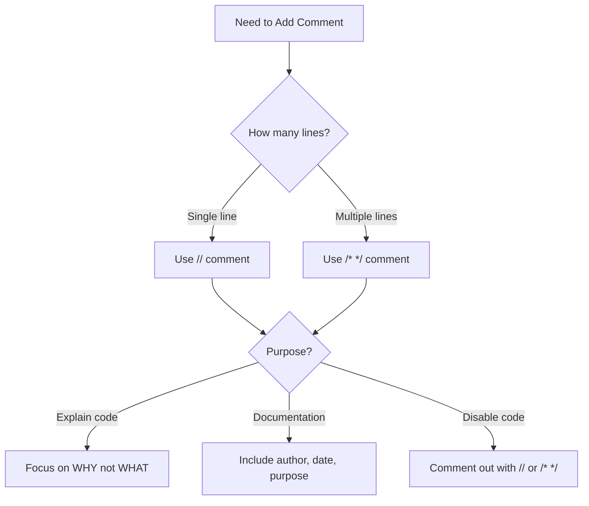

# Arduino Comments

## Introduction

Comments are an essential aspect of programming that allow you to add notes and explanations within your code without affecting how the program runs. In Arduino programming, comments serve multiple important purposes:

- Explaining what different parts of your code do
- Making your code more readable for others (and your future self)
- Temporarily disabling code sections during debugging
- Documenting important information about your project

This guide will explain the different types of comments in Arduino, how to use them effectively, and provide practical examples to help you incorporate good commenting practices in your projects.

## Types of Comments in Arduino

Arduino supports two main types of comments:

1. **Single-line comments**
2. **Multi-line comments**

Let's explore each type in detail.

### Single-Line Comments

Single-line comments begin with `//` and continue until the end of the line. The compiler ignores everything after the `//` on that line.

```cpp
// This is a single-line comment
int ledPin = 13;  // This comment appears after some code
```

### Multi-Line Comments

Multi-line comments begin with `/*` and end with `*/`. The compiler ignores everything between these markers, even if the content spans multiple lines.

```cpp
/* 
This is a multi-line comment.
It can span across several lines.
The compiler will ignore everything between the opening and closing markers.
*/

int buttonPin = 7;  /* This is also a multi-line comment,
                       though it's often used for shorter notes
                       that need more than one line */
```

## When to Use Comments

### Code Documentation

Comments are perfect for explaining what your code does:

```cpp
// This function reads the temperature sensor and returns the value in Celsius
float readTemperature() {
  int sensorValue = analogRead(A0);
  /* Convert the analog reading (0-1023) to voltage (0-5V)
     and then to temperature in Celsius */
  float voltage = sensorValue * (5.0 / 1023.0);
  float temperatureC = (voltage - 0.5) * 100;
  return temperatureC;
}
```

### Project Information

Comments at the beginning of your sketch can provide essential information about the project:

```cpp
/*
  Project: Smart Thermostat
  Created: March 12, 2025
  Author: Your Name
  
  Description: This sketch reads temperature and humidity values
  and controls a relay to turn on/off a heating system.
  
  Hardware:
  - Arduino Uno
  - DHT22 Temperature and Humidity Sensor
  - Relay Module
  - 16x2 LCD Display
*/
```

### Debugging

Comments can be used to temporarily disable code sections during testing:

```cpp
void loop() {
  // Read sensor data
  readSensors();
  
  // Display data on LCD
  updateDisplay();
  
  /* Temporarily disabled for testing
  // Control the relay based on temperature
  controlHeating();
  */
  
  // Wait for a second
  delay(1000);
}
```

## Best Practices for Comments

### 1. Comment on the "Why," Not Just the "What"

Instead of:
```cpp
// Set pin 13 to OUTPUT
pinMode(13, OUTPUT);
```

Better:
```cpp
// Configure the built-in LED pin as output for status indication
pinMode(13, OUTPUT);
```

### 2. Keep Comments Updated

Always update your comments when you modify your code to prevent misleading information.

### 3. Use Clear and Concise Language

Write comments that are easy to understand:

```cpp
// Poor comment: Do stuff with the sensor
// Better comment: Read the soil moisture level from the analog sensor
```

### 4. Don't Over-Comment

Avoid stating the obvious:

```cpp
// Poor practice:
i = i + 1;  // Increment i by 1

// Code that's self-explanatory often doesn't need comments
```

### 5. Use Block Comments for Complex Logic

For complex algorithms or logic, explain the approach:

```cpp
/* PID Control Algorithm
   This implementation uses proportional, integral, and derivative
   control to maintain stable temperature.
   
   Kp = 2.0 (proportional gain)
   Ki = 0.5 (integral gain)
   Kd = 1.0 (derivative gain)
*/
```

## Practical Examples

### Example 1: LED Blink with Comments

```cpp
/*
  Blink Example
  Turns an LED on for one second, then off for one second, repeatedly.
  Most Arduino boards have a built-in LED connected to pin 13.
*/

// Define the LED pin
const int ledPin = 13;

void setup() {
  // Initialize the digital pin as an output
  pinMode(ledPin, OUTPUT);
}

void loop() {
  digitalWrite(ledPin, HIGH);  // Turn the LED on (HIGH is the voltage level)
  delay(1000);                 // Wait for one second
  digitalWrite(ledPin, LOW);   // Turn the LED off by making the voltage LOW
  delay(1000);                 // Wait for one second
}
```

### Example 2: Temperature Sensor with Well-Commented Code

```cpp
/*
  Temperature Monitoring System
  This sketch reads temperature from an LM35 sensor and:
  - Displays the temperature on Serial Monitor
  - Turns on a fan (connected to pin 9) if temperature exceeds 30°C
*/

// Pin definitions
const int sensorPin = A0;  // LM35 temperature sensor connected to analog pin A0
const int fanPin = 9;      // Cooling fan connected to digital pin 9
const int ledPin = 13;     // Status LED connected to built-in LED

// Temperature thresholds (in Celsius)
const float tempThreshold = 30.0;  // Temperature at which fan turns on

// Variables
float currentTemp = 0;  // Stores the current temperature reading

void setup() {
  // Initialize serial communication for debugging and data display
  Serial.begin(9600);
  
  // Configure pins
  pinMode(fanPin, OUTPUT);
  pinMode(ledPin, OUTPUT);
  
  // Initial state - fan off
  digitalWrite(fanPin, LOW);
  
  // Print header to Serial Monitor
  Serial.println("Temperature Monitoring System");
  Serial.println("-----------------------------");
  Serial.println("Temp (C) | Fan Status");
  Serial.println("-----------------------------");
}

void loop() {
  // Read the temperature from the LM35 sensor
  currentTemp = readTemperature();
  
  // Control the fan based on temperature
  if (currentTemp >= tempThreshold) {
    // It's hot, turn on the fan
    digitalWrite(fanPin, HIGH);
    digitalWrite(ledPin, HIGH);  // LED on indicates fan is running
    printStatus(currentTemp, "ON");
  } else {
    // Temperature is acceptable, turn off the fan
    digitalWrite(fanPin, LOW);
    digitalWrite(ledPin, LOW);  // LED off indicates fan is not running
    printStatus(currentTemp, "OFF");
  }
  
  // Wait before taking the next reading
  delay(1000);
}

// Function to read temperature from LM35 sensor
float readTemperature() {
  // Read the analog value from sensor
  int sensorValue = analogRead(sensorPin);
  
  /* Convert the ADC reading to voltage:
     - Arduino's ADC provides a value between 0-1023
     - For 5V reference, each unit represents 5/1023 volts
     - LM35 outputs 10mV per degree Celsius */
  float voltage = sensorValue * (5.0 / 1023.0);
  
  // Convert voltage to temperature (LM35: 10mV per degree)
  float temperature = voltage * 100;
  
  return temperature;
}

// Function to print status to Serial Monitor
void printStatus(float temp, String fanStatus) {
  Serial.print(temp);
  Serial.print(" C    | ");
  Serial.println(fanStatus);
}
```

## Comment Organization with Code Sections

For larger Arduino sketches, you might want to organize your code into sections using comment blocks:

```cpp
//====================
// GLOBAL VARIABLES
//====================

const int sensorPin = A0;
int sensorValue = 0;

//====================
// SETUP FUNCTION
//====================

void setup() {
  Serial.begin(9600);
  pinMode(LED_BUILTIN, OUTPUT);
}

//====================
// MAIN LOOP
//====================

void loop() {
  // Main program code here
}

//====================
// HELPER FUNCTIONS
//====================

// Function descriptions and implementations
```

## Visual Representation

Here's a flowchart showing when to use different types of comments:



## Summary

Comments are a powerful tool in Arduino programming that:

1. Make your code more readable and maintainable
2. Help others (and your future self) understand your intentions
3. Provide essential documentation for your projects
4. Assist in the debugging process

By following the best practices outlined in this guide and examining the practical examples, you'll be able to write more effective comments that enhance your Arduino projects.

## Exercises

To practice using comments in Arduino:

1. Take an existing sketch and improve its comments following the best practices in this guide.
2. Write a well-commented sketch that uses at least one sensor and one output device.
3. Use comments to organize a complex Arduino project into logical sections.
4. Practice commenting out different parts of your code to debug problems.

## Additional Resources

- [Arduino Reference: Comments](https://www.arduino.cc/reference/en/language/structure/further-syntax/comments/)
- [Code Documentation Best Practices](https://www.arduino.cc/en/Guide/HomePage)
- [Clean Code Principles for Arduino](https://www.arduino.cc/en/Tutorial/HomePage)

Remember that good commenting is a skill that develops with practice. The more you write and review code, the better you'll become at writing effective comments that truly add value to your projects.