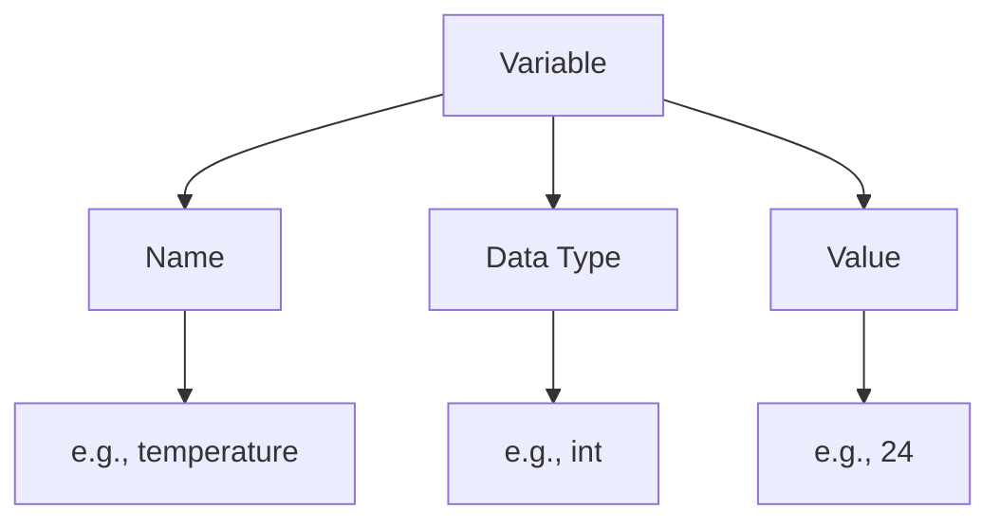

# Arduino Variables

## Introduction

Variables are one of the fundamental building blocks of any programming language, including Arduino. They act as containers that store data values which can be used and manipulated throughout your program. Understanding variables is essential for creating Arduino projects that can respond to inputs, track states, and control outputs effectively.

In this tutorial, we'll explore how variables work in Arduino, the different types available, and how to use them in your sketches.

## What Are Variables?

A variable is a named storage location in a computer's memory that holds a value. The value can be changed during program execution - hence the name "variable". 

Think of variables like labeled boxes where you can store different types of information:



## Declaring Variables in Arduino

Before using a variable in Arduino, you need to declare it. Declaration tells the Arduino what type of data the variable will store and gives it a name.

The basic syntax for declaring a variable is:

```cpp
dataType variableName;
```

For example:

```cpp
int temperature;     // Declares an integer variable named temperature
float voltage;       // Declares a floating-point variable named voltage
boolean isOn;        // Declares a boolean variable named isOn
```

## Data Types in Arduino

Arduino supports several data types. Choosing the right data type is important for memory efficiency and computational accuracy.

### Common Data Types

| Data Type      | Description                  | Size     | Example                             |
|----------------|------------------------------|----------|-------------------------------------|
| `boolean`      | True/false values            | 1 byte   | `true`, `false`                     |
| `byte`         | Unsigned 8-bit number        | 1 byte   | `0` to `255`                        |
| `char`         | Single character             | 1 byte   | `'A'`, `'z'`, `'5'`                 |
| `int`          | Integer values               | 2 bytes  | `-32,768` to `32,767`               |
| `unsigned int` | Unsigned integer             | 2 bytes  | `0` to `65,535`                     |
| `long`         | Extended integer             | 4 bytes  | `-2,147,483,648` to `2,147,483,647` |
| `float`        | Floating-point numbers       | 4 bytes  | `-3.4028235E+38` to `3.4028235E+38` |
| `double`       | Same as float on Arduino UNO | 4 bytes  | Same as float                       |
| `String`       | Text string                  | Variable | `"Hello Arduino"`                   |

### Choosing the Right Data Type

- Use `boolean` for simple true/false states (like switch positions)
- Use `int` for most counting and whole number calculations
- Use `float` when you need decimal precision
- Use `char` for individual characters
- Use `String` for text (though with caution due to memory usage)

## Initializing Variables

You can assign a value to a variable when you declare it:

```cpp
int temperature = 24;             // Declares and initializes temperature to 24
float voltage = 5.0;              // Declares and initializes voltage to 5.0
char sensor = 'A';                // Declares and initializes sensor to 'A'
String message = "Hello Arduino"; // Declares and initializes message
```

Or you can assign a value later in your code:

```cpp
int temperature;     // Declaration
temperature = 24;    // Initialization
```

## Using Variables in Arduino

Once declared, variables can be used in various ways:

### Basic Operations

```cpp
int a = 5;
int b = 10;
int sum = a + b;      // sum equals 15
int difference = b - a;  // difference equals 5
int product = a * b;  // product equals 50
int quotient = b / a; // quotient equals 2
```

### Reading from Sensors

```cpp
int sensorPin = A0;        // Define sensor pin
int sensorValue;           // Declare variable to store sensor reading

void setup() {
  Serial.begin(9600);      // Initialize serial communication
}

void loop() {
  sensorValue = analogRead(sensorPin);  // Read sensor value
  Serial.println(sensorValue);          // Print value to Serial Monitor
  delay(1000);                          // Wait for 1 second
}
```

### Controlling Outputs

```cpp
int ledPin = 13;           // Define LED pin
int blinkInterval = 1000;  // Blink interval in milliseconds

void setup() {
  pinMode(ledPin, OUTPUT); // Set LED pin as output
}

void loop() {
  digitalWrite(ledPin, HIGH);  // Turn LED on
  delay(blinkInterval);        // Wait
  digitalWrite(ledPin, LOW);   // Turn LED off
  delay(blinkInterval);        // Wait
}
```

## Variable Scope

In Arduino, where you declare a variable determines its scope - which parts of your program can access it.

### Global Variables

Variables declared outside of any function can be accessed from anywhere in your program. These are called global variables.

```cpp
int globalVar = 10;  // Global variable

void setup() {
  // globalVar can be used here
}

void loop() {
  // globalVar can be used here too
}
```

### Local Variables

Variables declared inside a function can only be used within that function. These are called local variables.

```cpp
void setup() {
  int localVar = 5;  // Local variable
  // localVar can be used here
}

void loop() {
  // localVar CANNOT be used here
  int anotherLocalVar = 15;  // Another local variable
}
```

## Constants

Sometimes you need variables whose values should never change. These are called constants and are defined using the `const` keyword:

```cpp
const int ledPin = 13;          // This value cannot be changed
const float pi = 3.14159;       // This value cannot be changed
```

## Practical Examples

Let's look at some real-world applications of variables in Arduino projects:

### Example 1: Temperature Monitor

This sketch reads temperature from a sensor and displays it on Serial Monitor:

```cpp
const int tempSensorPin = A0;  // Temperature sensor connected to A0
float tempC;                   // Variable to store temperature in Celsius
float tempF;                   // Variable to store temperature in Fahrenheit
float voltage;                 // Variable to store voltage reading

void setup() {
  Serial.begin(9600);          // Initialize serial communication
}

void loop() {
  // Read the sensor value
  int sensorValue = analogRead(tempSensorPin);
  
  // Convert to voltage
  voltage = sensorValue * (5.0 / 1023.0);
  
  // Convert to Celsius (for LM35 sensor)
  tempC = voltage * 100.0;
  
  // Convert to Fahrenheit
  tempF = (tempC * 9.0 / 5.0) + 32.0;
  
  // Print results
  Serial.print("Temperature: ");
  Serial.print(tempC);
  Serial.print("°C / ");
  Serial.print(tempF);
  Serial.println("°F");
  
  delay(1000);  // Wait for 1 second
}
```

### Example 2: LED Brightness Control

This sketch uses a variable to gradually change LED brightness:

```cpp
const int ledPin = 9;    // LED connected to pin 9 (PWM)
int brightness = 0;      // Variable to store brightness level
int fadeAmount = 5;      // How many points to fade by

void setup() {
  pinMode(ledPin, OUTPUT);  // Set LED pin as output
}

void loop() {
  // Set the brightness
  analogWrite(ledPin, brightness);
  
  // Change the brightness for next time
  brightness = brightness + fadeAmount;
  
  // Reverse fade direction when reaching min/max
  if (brightness <= 0 || brightness >= 255) {
    fadeAmount = -fadeAmount;
  }
  
  delay(30);  // Small delay for visible effect
}
```

### Example 3: Button State Tracking

This sketch uses variables to track and remember button states:

```cpp
const int buttonPin = 2;     // Button connected to pin 2
const int ledPin = 13;       // LED connected to pin 13

int buttonState = 0;         // Current state of the button
int lastButtonState = 0;     // Previous state of the button
int ledState = LOW;          // Current state of the LED
unsigned long lastDebounceTime = 0;  // Last time button was toggled
unsigned long debounceDelay = 50;    // Debounce time in milliseconds

void setup() {
  pinMode(buttonPin, INPUT_PULLUP);  // Set button pin as input with pull-up
  pinMode(ledPin, OUTPUT);           // Set LED pin as output
  digitalWrite(ledPin, ledState);    // Set initial LED state
}

void loop() {
  // Read the button state
  int reading = digitalRead(buttonPin);
  
  // Check if button state changed
  if (reading != lastButtonState) {
    lastDebounceTime = millis();  // Reset debounce timer
  }
  
  // If button state is stable for longer than debounce delay
  if ((millis() - lastDebounceTime) > debounceDelay) {
    // If button state has changed
    if (reading != buttonState) {
      buttonState = reading;
      
      // Toggle LED if button is pressed (LOW with INPUT_PULLUP)
      if (buttonState == LOW) {
        ledState = !ledState;
        digitalWrite(ledPin, ledState);
      }
    }
  }
  
  // Save current reading for next comparison
  lastButtonState = reading;
}
```

## Summary

Variables are essential elements in Arduino programming that allow you to:

- Store and manipulate data
- Track states and conditions
- Process sensor inputs
- Control outputs dynamically

Understanding how to declare, initialize, and use different types of variables will give you the foundation to create more complex and interactive Arduino projects.

## Exercises

1. **Basic Variables**: Create a sketch that declares variables of different types (int, float, boolean) and prints their values to the Serial Monitor.

2. **Temperature Converter**: Write a sketch that lets you input a temperature in Celsius through the Serial Monitor and converts it to Fahrenheit using variables.

3. **Traffic Light Simulator**: Create a program that uses variables to control the timing of a traffic light simulation using three LEDs.

4. **Variable Challenge**: Create a sketch that uses at least five different data types to solve a practical problem of your choice.

## Additional Resources

- [Arduino Reference for Data Types](https://www.arduino.cc/reference/en/#variables)
- [Arduino Variable Scope Tutorial](https://www.arduino.cc/reference/en/language/variables/variable-scope-qualifiers/scope/)
- [Memory Management in Arduino](https://www.arduino.cc/reference/en/language/variables/utilities/sizeof/)