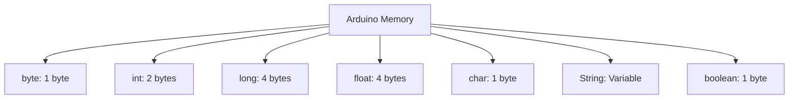

# Arduino Data Types

## Introduction

When you write a program for your Arduino, you need a way to store and manipulate different kinds of information - like numbers, text, or true/false values. This is where **data types** come in. Data types tell the Arduino how to interpret and store the information in its memory.

Understanding data types is fundamental to programming Arduino effectively. Each data type:
- Takes a specific amount of memory space
- Can store a certain range of values
- Has operations that can be performed on it

In this guide, we'll explore all the basic data types available in Arduino programming, how to use them, and when to choose one over another.

## Basic Data Types

Arduino's programming language is based on C++, so it shares many of the same data types. Here are the most common ones you'll use:

### Numeric Data Types

#### Integer Types

Integers are whole numbers without decimal points.

| Type | Size (bytes) | Range | Example |
|------|--------------|-------|---------|
| `byte` | 1 | 0 to 255 | `byte sensorValue = 127;` |
| `int` | 2 | -32,768 to 32,767 | `int temperature = -10;` |
| `unsigned int` | 2 | 0 to 65,535 | `unsigned int distance = 1000;` |
| `long` | 4 | -2,147,483,648 to 2,147,483,647 | `long population = 1000000;` |
| `unsigned long` | 4 | 0 to 4,294,967,295 | `unsigned long time = 3600000;` |

#### Floating Point Types

Floating-point types can represent numbers with decimal points.

| Type | Size (bytes) | Range | Example |
|------|--------------|-------|---------|
| `float` | 4 | -3.4028235E+38 to 3.4028235E+38 | `float voltage = 3.3;` |
| `double` | 4 | Same as float on Arduino UNO | `double pi = 3.14159;` |

> **Note:** On most Arduino boards (UNO, Nano, etc.), `double` is the same as `float`. Only on Arduino Due and some other 32-bit boards does `double` have higher precision.

### Character and String Types

For storing text and characters:

| Type | Description | Example |
|------|-------------|---------|
| `char` | Single character | `char grade = 'A';` |
| `String` | Text string (Arduino object) | `String message = "Hello!";` |

### Boolean Type

For true/false values:

| Type | Values | Example |
|------|--------|---------|
| `boolean` | `true` or `false` | `boolean isOn = true;` |

## Code Examples

Let's look at some practical examples of how to use these data types:

### Example 1: Using Different Numeric Types

```cpp
// Integer types
byte sensorReading = 255;      // 8-bit unsigned (0-255)
int temperature = -5;          // 16-bit signed
unsigned int steps = 10000;    // 16-bit unsigned
long distance = 1000000;       // 32-bit signed
unsigned long runtime = 3600000; // 32-bit unsigned (milliseconds)

// Floating point
float voltage = 3.3;
float pi = 3.14159;

void setup() {
  Serial.begin(9600);
  
  Serial.println("Different numeric data types:");
  Serial.print("Sensor reading (byte): ");
  Serial.println(sensorReading);
  
  Serial.print("Temperature (int): ");
  Serial.println(temperature);
  
  Serial.print("Steps (unsigned int): ");
  Serial.println(steps);
  
  Serial.print("Distance (long): ");
  Serial.println(distance);
  
  Serial.print("Runtime (unsigned long): ");
  Serial.println(runtime);
  
  Serial.print("Voltage (float): ");
  Serial.println(voltage, 2); // 2 decimal places
  
  Serial.print("Pi (float): ");
  Serial.println(pi, 5); // 5 decimal places
}

void loop() {
  // Empty
}
```

**Output:**
```
Different numeric data types:
Sensor reading (byte): 255
Temperature (int): -5
Steps (unsigned int): 10000
Distance (long): 1000000
Runtime (unsigned long): 3600000
Voltage (float): 3.30
Pi (float): 3.14159
```

### Example 2: Characters and Strings

```cpp
char singleLetter = 'A';
char grade = 'B';
String message = "Hello, Arduino!";
String sensors = "Temp: ";

void setup() {
  Serial.begin(9600);
  
  Serial.println("Character and String examples:");
  Serial.print("Letter: ");
  Serial.println(singleLetter);
  
  Serial.print("Grade: ");
  Serial.println(grade);
  
  Serial.print("Message: ");
  Serial.println(message);
  
  // Combining strings
  sensors += String(22.5);
  sensors += "°C";
  Serial.println(sensors);
  
  // Converting between types
  char letters[6];
  message.substring(0, 5).toCharArray(letters, 6);
  Serial.print("First 5 letters: ");
  Serial.println(letters);
}

void loop() {
  // Empty
}
```

**Output:**
```
Character and String examples:
Letter: A
Grade: B
Message: Hello, Arduino!
Temp: 22.5°C
First 5 letters: Hello
```

### Example 3: Boolean Values

```cpp
boolean isOn = true;
boolean motionDetected = false;

void setup() {
  Serial.begin(9600);
  
  Serial.println("Boolean examples:");
  Serial.print("Is on: ");
  Serial.println(isOn);
  
  Serial.print("Motion detected: ");
  Serial.println(motionDetected);
  
  // Boolean logic
  if (isOn && !motionDetected) {
    Serial.println("System is on but no motion detected");
  }
  
  // Converting to integers
  Serial.print("isOn as number: ");
  Serial.println(isOn + 0); // true becomes 1
  
  Serial.print("motionDetected as number: ");
  Serial.println(motionDetected + 0); // false becomes 0
}

void loop() {
  // Empty
}
```

**Output:**
```
Boolean examples:
Is on: 1
Motion detected: 0
System is on but no motion detected
isOn as number: 1
motionDetected as number: 0
```

## Type Conversion

Sometimes you need to convert from one data type to another. Arduino handles this in two ways:

### Implicit Conversion

When Arduino automatically converts one type to another:

```cpp
int x = 10;
float y = x;  // Implicit conversion from int to float (y becomes 10.0)
```

### Explicit Conversion (Casting)

When you explicitly tell Arduino to convert between types:

```cpp
float pi = 3.14159;
int roundedPi = (int)pi;  // Explicit conversion (casting) - roundedPi becomes 3
```

**Example:**

```cpp
void setup() {
  Serial.begin(9600);
  
  Serial.println("Type conversion examples:");
  
  // Implicit conversion
  int count = 50;
  float countFloat = count;
  Serial.print("Integer to float (implicit): ");
  Serial.println(countFloat, 2);
  
  // Explicit conversion (casting)
  float voltage = 4.75;
  int voltageInt = (int)voltage;
  Serial.print("Float to integer (casting): ");
  Serial.println(voltageInt);
  
  // Potential issues with conversion
  int maxInt = 32767;
  byte smallByte = (byte)maxInt;
  Serial.print("Large int to byte (data loss): ");
  Serial.println(smallByte);
}

void loop() {
  // Empty
}
```

**Output:**
```
Type conversion examples:
Integer to float (implicit): 50.00
Float to integer (casting): 4
Large int to byte (data loss): 255
```

## Memory Diagram

Here's a visualization of how different data types take up memory on an Arduino:



## Choosing the Right Data Type

Selecting the appropriate data type is important for your Arduino program's efficiency and reliability:

1. **Memory Considerations**: Arduino UNO has only 2KB of RAM, so use smaller data types when possible
2. **Value Range**: Choose a type that can hold your expected values
3. **Precision Needs**: For decimal calculations, use `float` when precision is important
4. **Speed**: Operations on smaller data types (`byte`, `int`) are generally faster than on larger ones (`long`, `float`)

### Practical Recommendations:

| When you need to store... | Recommended type |
|---------------------------|------------------|
| Small whole numbers (0-255) | `byte` |
| Medium integers that may be negative | `int` |
| Timestamps or large counts | `unsigned long` |
| Sensor readings with decimals | `float` |
| Simple true/false states | `boolean` |
| A single character | `char` |
| Text | `String` |

## Real-World Application: Weather Station

Let's put this knowledge together in a practical example - a simple weather station:

```cpp
// Weather station variables using appropriate data types
byte humidity = 0;          // 0-100%
int temperature = 0;        // -40 to 125°C
float pressure = 0.0;       // Atmospheric pressure with decimal precision
unsigned long lastReading = 0;  // Timestamp of last reading
boolean isRaining = false;  // Rain status
String locationName = "Garden";  // Station location

void setup() {
  Serial.begin(9600);
  Serial.println("Arduino Weather Station");
  Serial.print("Location: ");
  Serial.println(locationName);
}

void loop() {
  // Simulate reading sensors
  humidity = random(30, 90);
  temperature = random(-5, 35);
  pressure = 1000.0 + (random(0, 100) / 10.0);
  isRaining = random(0, 10) > 7;  // 20% chance of rain
  
  // Store current time
  lastReading = millis();
  
  // Display readings
  Serial.print("Time (ms): ");
  Serial.println(lastReading);
  Serial.print("Temperature: ");
  Serial.print(temperature);
  Serial.println("°C");
  Serial.print("Humidity: ");
  Serial.print(humidity);
  Serial.println("%");
  Serial.print("Pressure: ");
  Serial.print(pressure, 1);
  Serial.println(" hPa");
  Serial.print("Raining: ");
  Serial.println(isRaining ? "Yes" : "No");
  Serial.println("---------------------");
  
  delay(5000); // Wait 5 seconds between readings
}
```

This example shows how we use:
- `byte` for humidity (0-100%)
- `int` for temperature (potentially negative)
- `float` for pressure (needs decimal precision)
- `unsigned long` for timestamp (large number)
- `boolean` for rain status (yes/no)
- `String` for location name (text)

## Common Pitfalls and Tips

### 1. Overflow

When you exceed the range of a data type, overflow occurs:

```cpp
byte counter = 255;  // Maximum value for byte
counter++;           // Becomes 0 because of overflow
```

### 2. Floating-Point Precision

Floating-point types have limited precision and can lead to rounding errors:

```cpp
float a = 0.1;
float b = 0.2;
float c = a + b;     // Might not be exactly 0.3 due to floating point errors
```

### 3. String Memory Usage

`String` objects use more memory than character arrays and can cause fragmentation:

```cpp
// More efficient for static text:
char message[] = "Hello";

// More convenient but uses more memory:
String dynamicMsg = "Hello" + String(count);
```

## Summary

Understanding Arduino data types is essential for effective programming:

- **Integer types** (`byte`, `int`, `long`) store whole numbers with different ranges
- **Floating-point types** (`float`) store decimal values
- **Character types** (`char`, `String`) store text
- **Boolean type** stores true/false values

Choosing the right data type helps you:
- Optimize memory usage
- Ensure your program can handle the required range of values
- Avoid unexpected behavior due to overflow or precision errors

## Exercises

1. Create a program that uses all the data types discussed to store different sensor readings.
2. Write code that demonstrates overflow by incrementing a `byte` past 255 and an `int` past 32,767.
3. Compare the memory usage between char arrays and String objects for storing text.
4. Create a temperature converter that shows the differences in precision between `int` and `float`.

## Additional Resources

- [Arduino Reference - Data Types](https://www.arduino.cc/reference/en/#variables)
- [Arduino - Variable Declaration](https://www.arduino.cc/en/Reference/VariableDeclaration)
- [Arduino - Variables Tutorial](https://www.arduino.cc/en/Tutorial/Variables)