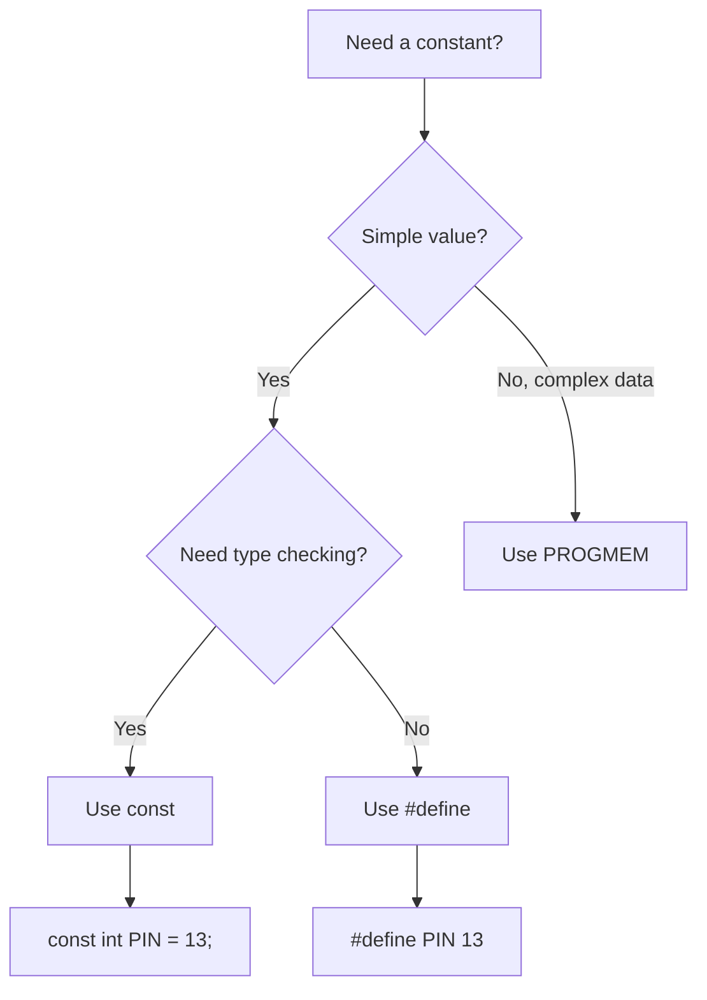

# Arduino Constants

## Introduction

Constants are fixed values that don't change during the execution of your Arduino program. They play a crucial role in making your code more readable, maintainable, and efficient. Unlike variables, which can change their values during program execution, constants remain the same throughout your sketch.

In this tutorial, we'll explore different types of constants in Arduino programming, how to define them, and best practices for using them effectively in your projects.

## Why Use Constants?

Before diving into the details, let's understand why constants are important:

1. **Readability**: Constants with descriptive names make your code easier to understand
2. **Maintainability**: Change a value in one place instead of throughout your code
3. **Memory efficiency**: Constants can be stored in program memory instead of RAM
4. **Error prevention**: Prevent accidental value changes during program execution

## Types of Constants in Arduino

Arduino supports several types of constants:

### 1. Literal Constants

Literal constants are the simplest form - they're values written directly in your code.

```cpp
// Examples of literal constants
1023        // Integer literal
3.14159     // Floating-point literal
'A'         // Character literal
"Hello"     // String literal
```

### 2. Defined Constants (`#define`)

One way to create named constants is using the preprocessor directive `#define`:

```cpp
#define LED_PIN 13
#define DELAY_TIME 1000

void setup() {
  pinMode(LED_PIN, OUTPUT);
}

void loop() {
  digitalWrite(LED_PIN, HIGH);
  delay(DELAY_TIME);
  digitalWrite(LED_PIN, LOW);
  delay(DELAY_TIME);
}
```

**How it works**: The preprocessor replaces all occurrences of `LED_PIN` with `13` and `DELAY_TIME` with `1000` before compilation. This doesn't use any RAM as the substitution happens during the compilation process.

### 3. Constant Variables (`const`)

Another way to define constants is using the `const` keyword:

```cpp
const int LED_PIN = 13;
const int DELAY_TIME = 1000;
const float PI = 3.14159;

void setup() {
  pinMode(LED_PIN, OUTPUT);
}

void loop() {
  digitalWrite(LED_PIN, HIGH);
  delay(DELAY_TIME);
  digitalWrite(LED_PIN, LOW);
  delay(DELAY_TIME);
}
```

**How it works**: `const` variables are true variables with a type, but the compiler prevents them from being modified after initialization.

### 4. Constants in Program Memory (`PROGMEM`)

For larger constants, especially arrays or strings, you can use `PROGMEM` to store them in flash memory instead of RAM:

```cpp
#include <avr/pgmspace.h>

const char MESSAGE[] PROGMEM = "This is a long message stored in program memory";

void setup() {
  Serial.begin(9600);
  
  // Buffer to hold characters read from program memory
  char buffer[50];
  
  // Copy string from program memory to buffer
  strcpy_P(buffer, MESSAGE);
  
  // Print the message
  Serial.println(buffer);
}

void loop() {
  // Empty loop
}
```

## `#define` vs `const`: Which to Choose?

Both `#define` and `const` can create constants, but they have important differences:



### Advantages of `const`:

1. **Type checking**: The compiler knows the data type
2. **Scope control**: Can be limited to specific functions or classes
3. **Debugging**: Appears in the debugger as a variable

### Advantages of `#define`:

1. **No memory usage**: Pure text substitution without memory allocation
2. **Slightly faster**: Directly replaced at compile time
3. **Can define macros**: More powerful for complex substitutions

### Best Practice:

- For most simple constants, use `const` for type safety and debugging
- Use `#define` for creating macros or when absolute optimization is needed
- Use `PROGMEM` for large data structures like arrays, strings, or lookup tables

## Common Built-in Constants

Arduino comes with several predefined constants:

```cpp
// Digital pin states
HIGH       // 1, or 5V on most Arduino boards
LOW        // 0, or 0V on most Arduino boards

// Digital pin modes
INPUT      // Configure pin as input
OUTPUT     // Configure pin as output
INPUT_PULLUP // Configure pin as input with internal pull-up resistor enabled

// Boolean constants
true       // 1 or any non-zero value
false      // 0

// Mathematical constants (requires #include <math.h>)
PI         // 3.14159265358979323846
```

## Practical Examples

### Example 1: LED Blinking with Different Patterns

```cpp
// Define pins
const int LED1 = 9;
const int LED2 = 10;
const int LED3 = 11;

// Define timing constants
const int SHORT_DELAY = 200;
const int MEDIUM_DELAY = 500;
const int LONG_DELAY = 1000;

void setup() {
  pinMode(LED1, OUTPUT);
  pinMode(LED2, OUTPUT);
  pinMode(LED3, OUTPUT);
}

void loop() {
  // Pattern 1: Sequential
  digitalWrite(LED1, HIGH);
  delay(SHORT_DELAY);
  digitalWrite(LED1, LOW);
  
  digitalWrite(LED2, HIGH);
  delay(SHORT_DELAY);
  digitalWrite(LED2, LOW);
  
  digitalWrite(LED3, HIGH);
  delay(SHORT_DELAY);
  digitalWrite(LED3, LOW);
  
  delay(MEDIUM_DELAY);
  
  // Pattern 2: All at once
  digitalWrite(LED1, HIGH);
  digitalWrite(LED2, HIGH);
  digitalWrite(LED3, HIGH);
  delay(LONG_DELAY);
  
  digitalWrite(LED1, LOW);
  digitalWrite(LED2, LOW);
  digitalWrite(LED3, LOW);
  delay(MEDIUM_DELAY);
}
```

### Example 2: Temperature Sensor with Alarm Thresholds

```cpp
#include <OneWire.h>
#include <DallasTemperature.h>

// Pin definitions
const int ONE_WIRE_BUS = 2;
const int ALARM_PIN = 4;

// Temperature thresholds (in Celsius)
const float TEMP_LOW = 18.0;
const float TEMP_HIGH = 27.0;
const float TEMP_CRITICAL = 30.0;

// Sensor setup
OneWire oneWire(ONE_WIRE_BUS);
DallasTemperature sensors(&oneWire);

void setup() {
  Serial.begin(9600);
  pinMode(ALARM_PIN, OUTPUT);
  sensors.begin();
  
  Serial.println("Temperature Monitor");
  Serial.print("Low threshold: ");
  Serial.print(TEMP_LOW);
  Serial.println(" C");
  Serial.print("High threshold: ");
  Serial.print(TEMP_HIGH);
  Serial.println(" C");
  Serial.print("Critical threshold: ");
  Serial.print(TEMP_CRITICAL);
  Serial.println(" C");
}

void loop() {
  sensors.requestTemperatures();
  float tempC = sensors.getTempCByIndex(0);
  
  Serial.print("Current temperature: ");
  Serial.print(tempC);
  Serial.println(" C");
  
  if (tempC >= TEMP_CRITICAL) {
    // Critical temperature - sound continuous alarm
    digitalWrite(ALARM_PIN, HIGH);
    Serial.println("WARNING: Temperature critical!");
  } else if (tempC >= TEMP_HIGH) {
    // High temperature - intermittent alarm
    digitalWrite(ALARM_PIN, HIGH);
    delay(200);
    digitalWrite(ALARM_PIN, LOW);
    Serial.println("CAUTION: Temperature high");
  } else if (tempC < TEMP_LOW) {
    // Low temperature warning
    Serial.println("NOTE: Temperature below minimum");
  } else {
    // Normal range - no alarm
    digitalWrite(ALARM_PIN, LOW);
    Serial.println("Status: Temperature in normal range");
  }
  
  delay(1000);
}
```

## Best Practices for Using Constants

1. **Use ALL_CAPS naming**: By convention, constants are named with uppercase letters and underscores
2. **Be descriptive**: Choose names that clearly describe what the constant represents
3. **Group related constants**: Keep related constants together in your code
4. **Document units**: Add comments to indicate units for numeric constants (milliseconds, centimeters, etc.)
5. **Use constants instead of "magic numbers"**: Replace hard-coded values with named constants
6. **Define constants at the top**: Place constant definitions at the top of your file for easy reference

## Common Mistakes to Avoid

1. **Redefining constants**: Redefining a `#define` constant can lead to unexpected behavior
2. **Using `const` for very large arrays**: Without `PROGMEM`, these still consume RAM
3. **Modifying constants**: Attempting to modify `const` variables will cause compilation errors
4. **Forgetting the type**: Remember that `#define` has no type information
5. **Inconsistent naming**: Mixing naming conventions makes code harder to read

## Summary

Constants are essential elements in Arduino programming that make your code more readable, maintainable, and efficient. We've covered:

- Different types of constants: literal, `#define`, `const`, and `PROGMEM`
- When to use each type of constant
- Built-in Arduino constants
- Practical examples showing constants in action
- Best practices for using constants effectively

By properly using constants in your Arduino sketches, you'll write cleaner code that is easier to understand and maintain.

## Exercises

1. Modify the LED blinking example to create a traffic light simulation using constants for pins and timing.
2. Create a program that uses PROGMEM to store and display a series of messages on an LCD screen.
3. Refactor an existing sketch by replacing all "magic numbers" with appropriately named constants.
4. Experiment with different constant types to compare how they affect your sketch's memory usage.

## Further Resources

- [Arduino Reference - Constants](https://www.arduino.cc/reference/en/language/variables/constants/constants/)
- [PROGMEM Documentation](https://www.arduino.cc/reference/en/language/variables/utilities/progmem/)
- [Memory Usage in Arduino](https://docs.arduino.cc/learn/programming/memory-guide)